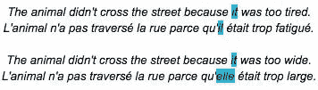
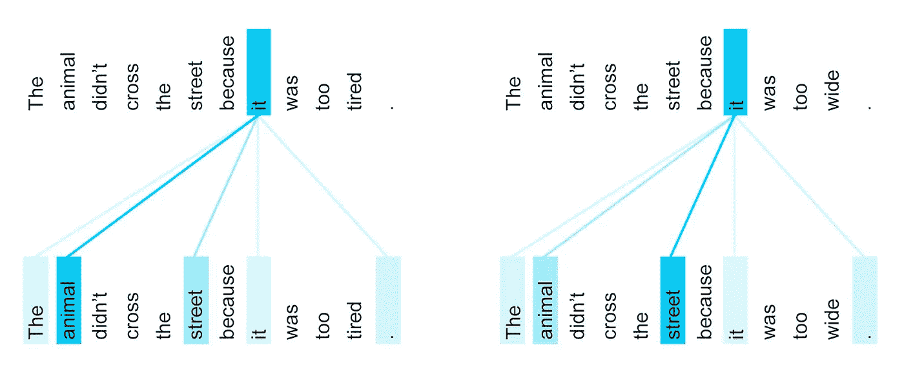
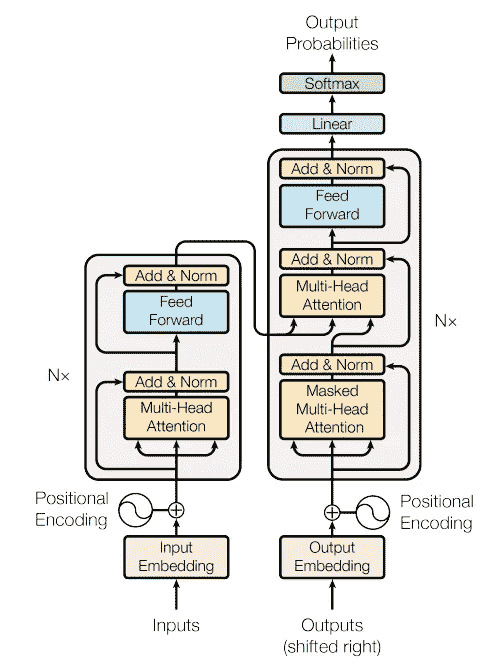

# 自然语言处理的最新进展

> 原文：<https://towardsdatascience.com/recent-advancements-in-nlp-2-2-df2ee75e189?source=collection_archive---------5----------------------->

## 注意了，变形金刚，伯特还有更多。

在之前的一篇[帖子](https://medium.com/swlh/recent-advancements-in-nlp-1-2-192ac7eefe3c)中，我写了 NLP 中最近的两个重要概念——*单词嵌入*和 *RNN* 。在这篇文章中，我将介绍 [*注意*](https://arxiv.org/abs/1409.0473) 和[*变压器*](https://arxiv.org/abs/1706.03762) 的概念，它们已经成为目前 NLP 中大多数最新模型的构建模块。我还将回顾 BERT 在 NLP 中使 [*的强大概念*](https://en.wikipedia.org/wiki/Transfer_learning) 的迁移学习变得更加容易

*像我之前的帖子一样，我将跳过大部分数学内容，更多地关注直觉理解。原因是——使用过多的符号和等式会让包括我在内的许多人感到厌烦。这实际上对概念理解并不重要，我认为概念理解比理解每一个潜在的数学方程重要得多。*

*虽然像 Bi-LSTM 这样的 RNN 变体在各种 NLP 任务上表现相当稳定，但仍然存在以下一些关键挑战:*

1.  ***缺乏并行性会损害性能** — LSTM 需要按顺序处理给定序列中的输入令牌，因为当前步骤的输出取决于前一步骤的输出。没有办法将这种计算并行化，这带来了训练时间长、不能在非常大的数据集上训练等明显的缺点。*
2.  ***学习长期依存关系仍然是一个挑战**—虽然与经典的 rnn 相比，LSTMs 更善于从序列中出现过的内容中记住上下文，但从长句子中更早出现的单词中记住上下文仍然是一个挑战，这就是为什么长句子/序列的性能不如短句子/序列的性能。*
3.  ***运算次数随距离线性增加—** 将两个任意输入或输出位置的信号相关所需的运算次数随位置间的距离线性增加*

*上述挑战是 2017 年及以后大量工作的动力。*注意力*的概念解决了上面的挑战#2，而*变压器*架构解决了挑战# 1 和挑战#3。*

*需要注意的一点是，虽然*注意力*和*转换者*的概念有助于打破 NLP 任务中的既定基准，但这些都是通用技术，可以广泛应用于任何序列到序列任务。例如，*变形金刚*架构也是打败顶级*星际争霸 2*职业玩家的 [*DeepMind*](https://deepmind.com/) 机器人 [*AlphaStar*](https://deepmind.com/blog/article/alphastar-mastering-real-time-strategy-game-starcraft-ii) 的构建模块。*

# *注意力*

*一般来说，*注意力*是深度学习中最有影响力的想法之一。虽然这个概念最初是为机器翻译开发的，但它的使用迅速扩展到了许多其他领域。这是由 *Dzmitry Bahdanau* 等人在[这篇](https://arxiv.org/abs/1409.0473)有影响力的论文中提出的。*

*其背后的核心思想是——当执行某个任务时，例如，将句子从一种语言翻译成另一种语言，比如从英语翻译成法语，输出法语句子中的每个单词将由原始输入英语句子中的所有单词(的相关上下文)以不同程度的关注或重要性来通知，而不是由处理整个英语句子生成的单一/恒定上下文。*

*考虑以下来自 [*谷歌博客*](https://research.googleblog.com/2017/08/transformer-novel-neural-network.html) *的优秀英语到法语的翻译例子。*两个句子中的“它”指的是不同的名词，根据“它”指的是哪个名词，它翻译成法语也不同。*

**

*对人来说，很明显，在第一句话中“它”指的是动物，而在第二句话中是指街道*

*下图描绘了概念上与(自我)*注意力发生的事情。*不是获取整个句子的上下文向量并告知单词“它”的翻译，而是由输入句子中的不同单词告知翻译上下文不同的量，如颜色编码所示(越暗=越重要)*

**

*Source: [*Google Blog*](https://research.googleblog.com/2017/08/transformer-novel-neural-network.html)*

*需要注意的一点是——*注意*模型中的权重不是固定的，像神经网络模型学习的其他参数一样，而是作为输入/隐藏状态的函数来计算的——这就是模型如何知道如何对任何给定句子的输入句子中的相关单词进行适当的强调。*

*如上所述，*注意力*的概念通过在每一步使用更合适的上下文(而不是“恒定”上下文，例如基于 LSTM 的编码器-解码器)解决了长期依赖性的问题，但是计算中的非并行性问题仍然存在，因为计算仍然需要顺序进行。有了*的关注*，如果有什么不同的话，我们让计算比简单的 LSTMs 更复杂，这就是*变压器*架构来拯救的地方。*

# *变压器*

**Transformer* 于 2017 年在[这篇](https://arxiv.org/abs/1706.03762)开创性论文中推出，作者是来自谷歌的 Vaswani 等人。*变压器*的网络架构完全基于*注意力*机制，没有 RNN 或 CNN 单元。以下是该体系结构的一些主要优势:*

*   *语言翻译任务的高质量结果，超越了以前的基准*
*   *更高的并行性，需要的培训时间明显减少*
*   *很好地推广到许多其他任务*

**

*Transformer Model Architecture. Source [Transformer Paper](https://arxiv.org/pdf/1706.03762.pdf)*

*上图是*变压器*的整体架构，乍一看有点吓人。让我们看看架构的高级细节:*

*   ***编码器-解码器架构**:它遵循著名的编码器-解码器范例，编码器将输入转换为有用的表示，解码器使用该表示生成输出。在上图中，编码器模块在左边，解码器模块在右边。*
*   ***自动回归**:在每一步，模型消耗先前生成的输出作为附加输入*
*   *没有 RNNs :没有 RNN 单位，只有一堆关注层。*
*   ***多层**:每个编码器/解码器由 6 层(模型中的超参数)相同的层组成*
*   ***嵌入**:输入/输出嵌入将文本或文字转换成数字。*
*   ***位置编码**:位置编码是对原始序列的顺序进行编码，因为我们不再像在 RNN 那样按顺序处理输入，所以它保证了排序的信息不会丢失。*
*   ***多头注意力**:有多个注意力层并行运行，以增加多样性(类似于计算机视觉中的多个卷积滤波器)。*
*   ***注意层次**:有 3 种注意类型——编码器自我注意、编码器-解码器注意和解码器自我注意。*
*   ***自我关注**:在编码器自我关注的情况下(图中左下方的关注块)，编码器内的一层试图计算出它应该对(编码器的)前一层的输出给予多少关注，也就是说，试图学习输入中的每个单词与输入中的其他单词的关系/上下文。解码器自我关注(图中右下方的关注块)做了同样的事情，但超过了输出。*
*   ***编码器-解码器注意力**:利用编码器-解码器注意力(图中右上角的注意力块)，模型计算出输入中的每个单词与输出中的每个单词的相关程度。*

*有了这些细节，*变压器*取得的成果令人印象深刻，然而，也有一些需要改进的地方:*

*   *它只能处理定长句子。*
*   *需要将较大的句子分解成较小的句子以输入到模型中，这导致“*上下文碎片*”*

***BERT —来自变压器的双向编码器表示***

*首先，一个诚实的坦白——我就是记不住 BERT 的完整形式，不管我读了多少遍，我认为完整形式是从首字母缩略词派生出来的，而不是相反:-)的意思*

*[BERT](https://arxiv.org/abs/1810.04805) 由 Google 的 Jacob 等人提出，是一种基于 *Transformer 的语言表示模型。*我认为 BERT 的主要贡献，除了它新颖的双向培训等，还在于它在 NLP 中推广了预培训/ *迁移学习*的概念*

*在我们继续之前，先简单说一下*迁移学习。*与 NLP 相比，它是深度学习中最优雅的概念之一，在 *ComputerVision* 中更受欢迎。基本思想是——人们可以在一个通用但相关的任务上训练一个(深度的，即有多个层的)模型，只需在特定于任务的数据上微调最后几层就可以实现出色的性能。*

**迁移学习*的基本原理是——深度模型中的早期层学习更多的基本模式，例如，学习检测*计算机视觉*模型中的直线和曲线，而后面的层学习特定于任务的模式，例如学习图片中是否有猫。这种方法的主要好处是——即使在深度学习模型上有适量的数据，你也可以获得很好的性能，这些模型通常非常渴求数据。*

*以下是关于 BERT 的一些重要细节:*

1.  ***双向训练**:通过从两个方向看单词来进行联合训练——从左到右和从右到左以获得更好的上下文，其他语言模型通常通过只从一个方向看上下文来进行训练*
2.  ***预训练**:在巨大的文本尸体(~3B 单词)上进行预训练，因此您只需要微调一个额外的输出层，这是很少的参数(使用您的训练数据)，以便在各种任务上获得非常好的性能，如句子分类、问答系统、命名实体识别等，而不必在模型架构中进行太多特定于任务的更改。*
3.  ***训练目标:**典型地，语言模型以无监督的方式被训练，目标是在给定单词之前的单词的情况下预测该单词。BERT 接受了两项任务的联合训练——在给定单词左右两边的单词的情况下预测一个单词(有一些关于屏蔽的细节以避免泄漏),以及在给定一个句子的情况下预测下一个句子。后者是不标准的，语言模型通常不直接捕捉句子之间的关系，但这样做有助于像*问答*系统这样的应用。*
4.  ***模型尺寸:**BERT 论文的作者试验了各种尺寸的 BERT，最著名的是基本型(110M 参数)和大型型(340M 参数)。他们发现，越大越好，即使有相似的模型架构和小的特定任务训练数据，这在很大程度上是由于在巨大的语料库上进行的预训练。*

*自 2018 年 10 月 BERT 的原始论文以来，已经提出了许多变体和修改。其中最著名的是——脸书·艾的 RoBERTa 和 mBERT，CMU 研究人员的 XLNet 和开放人工智能的 GPT-2。*

*这就结束了我对 NLP 后期一些令人兴奋的事情的总结，很明显，这个领域发生了如此多的事情，而且速度如此之快。如今，人们可以不费吹灰之力做很多事情，这要归功于该领域的巨头们，他们完成了繁重的工作，并使之变得更加容易。*

# *额外资源*

1.  *优秀的[可视化](https://jalammar.github.io/visualizing-neural-machine-translation-mechanics-of-seq2seq-models-with-attention/)的 *RNN* 、*注意*等*
2.  *[从零开始建造](https://github.com/keitakurita/Practical_NLP_in_PyTorch/blob/master/deep_dives/transformer_from_scratch.ipynb)一台变压器*
3.  *优秀的[库](https://github.com/huggingface/transformers)用于使用各种变压器架构*