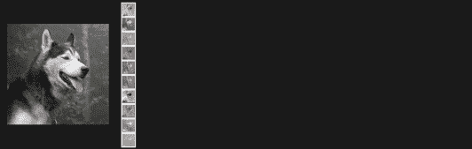
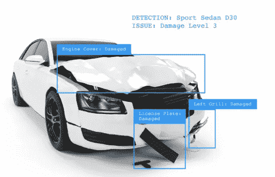
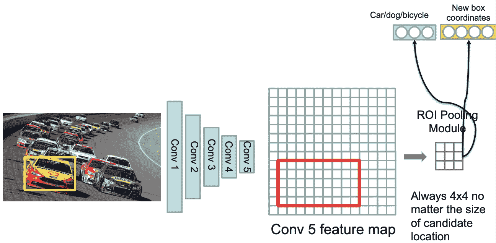
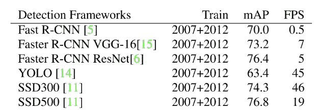
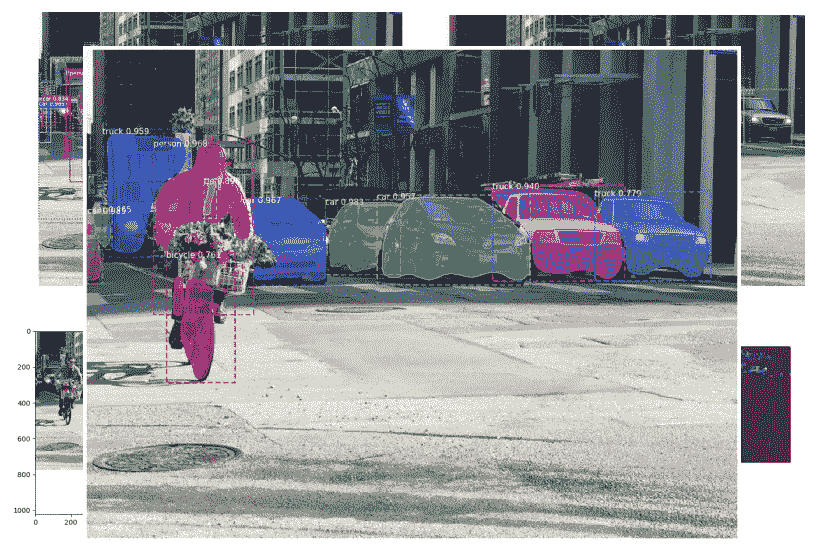
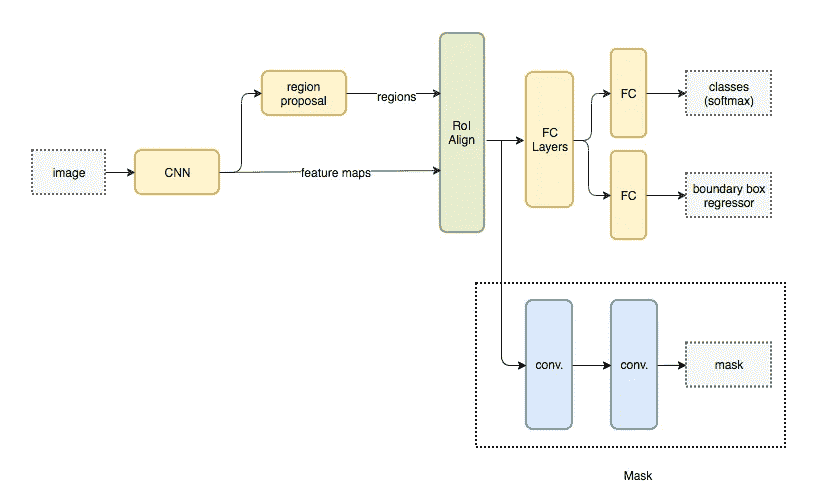
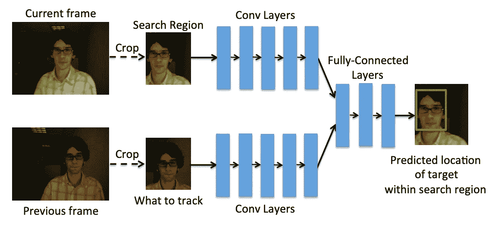
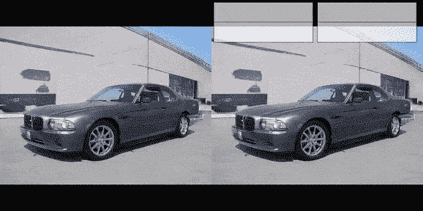
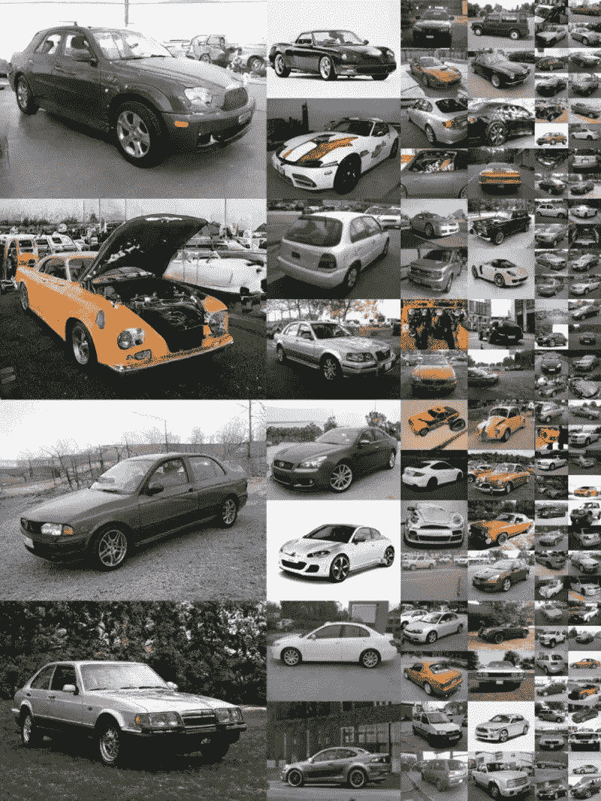

# 现代计算机视觉的最新进展

> 原文：<https://towardsdatascience.com/recent-advances-in-modern-computer-vision-56801edab980?source=collection_archive---------9----------------------->

## 超越物体分类的计算机视觉

在过去的 50 年里，计算机已经学会了计数和分类，但直到现在还看不见东西。今天，截至 2019 年，计算机视觉领域正在迅速发展，拥有巨大的潜力来缓解全球范围内从医疗保健差距到移动限制的一切问题。

近年来，我们已经看到在 AlexNet 或类似的基于 CNN 的架构基础上构建的计算机视觉取得了巨大成功。的确，就学习方式而言，这个过程是模仿人脑的；称为神经元的学习单元网络学习如何将输入信号(如房屋的图片)转换为相应的输出信号，如标签“房屋”。关于这方面的更多细节，请看我之前的博客。

在过去的 2-3 年里，我们已经开始在基于深度学习的视觉任务中取得巨大成就，超越了分类。我在这篇博客中提到了其中几个重要的问题。

# 目标检测

在现有的几种方法中，有两类物体检测技术在现代计算机视觉领域已经流行了 3-4 年

## 两阶段:基于区域提案

美国有线电视新闻网，快速美国有线电视新闻网，快速美国有线电视新闻网[ *吉尔希克等人 CVPR 2014*

*   将整个图像处理到 conv5
*   计算物体的可能位置有些是正确的，大多数是错误的
*   给定单个位置，ROI 汇集模块提取固定长度特征

## 一阶段:YOLO，固态硬盘，视网膜网

目标检测在这里被框定为一个回归问题。单个神经网络用于直接预测类别和边界框锚，而不需要第二阶段的每个提议的分类操作。

*   不要生成对象建议！
*   通过设计考虑输出空间的微小子集；直接将这一小组盒子分类
*   快速推理，适用于实时目标检测

YOLO 的局限性

*   损失函数在小边界框和大边界框中处理错误是一样的。
*   大盒子里的小错误通常是良性的，但小盒子里的小错误对 IOU 的影响要大得多。

## YOLO v3:增量改进

*约瑟夫·雷德蒙，阿里·法尔哈迪- 2018*

*   这是一个完全卷积的网络
*   没有池化图层，跨距为 2 的卷积图层用于对图像进行缩减像素采样。
*   较新的架构改进了剩余跳跃连接和上采样。
*   最佳部分—在三种不同的比例下进行检测，这有助于解决检测小物体的问题。
*   与先前层连接的上采样层有助于保留有助于检测小对象的细粒度特征。

## 单级检测和多级检测之间的选择-

Performance on MS-COCO

*   更快的 R-CNN 速度较慢，但更准确
*   固态硬盘和 YOLO 要快得多，但没有那么准确
*   更大/更深的主干/特征提取器网络工作得更好

要进行完整的比较，请查看此— [*现代卷积物体检测器的速度/精度权衡*](http://zpascal.net/cvpr2017/Huang_SpeedAccuracy_Trade-Offs_for_CVPR_2017_paper.pdf) *，Jonathan Huang 等人。艾尔。，2017 年*

# 图象分割法

将像素分组为有意义的或感觉上相似的区域。Keymakr 等公司为视频和图像的复杂分割提供同类最佳的工具和全套服务解决方案。

Mask R-CNN, Kaming He et. al. 2017 [ICCV 2017 Best Paper Award-Marr Prize]

## 用于实例分割的 Mask-R-CNN

*   MaskRCNN 是对更快的 R-CNN 的修改
*   它为更快的 R-CNN 网络增加了一个单独的屏蔽“头”
*   掩码“头”只是一个小的全卷积网络，它为每个区域建议输出一个 m × m 掩码。
*   RoIAlign 层已被 RoI Pooling 取代。
*   可以与不同的架构，也 ResNet
*   在 Nvidia Tesla M40 GPU 上以每幅图像 195 毫秒的速度运行
*   也可以用于人体姿态估计

Mask R-CNN 不仅提供了他们的模型优于所有先前模型的证据，而且还进行了各种消融实验，以显示 RoIAlign、分段去耦和全卷积掩模头各自单独提高了准确性。检查[纸张](https://arxiv.org/abs/1703.06870)了解详情。

# 深度跟踪

简单地说，在视频的连续帧中定位一个对象称为跟踪。

经典的对象跟踪是通过诸如密集光流的技术实现的:这些算法有助于估计视频帧中每个像素的运动矢量。
稀疏光流:这些算法，如 KLT 特征跟踪器，跟踪图像中几个特征点的位置。
卡尔曼滤波:一种非常流行的信号处理算法，用于根据先验运动信息预测运动物体的位置。
Meanshift 和 Camshift:这些是定位密度函数最大值的算法。它们也用于跟踪。

大多数目标跟踪方法采用“在线”学习。在线方法是昂贵的，必须做出简化的假设来提高效率。由于诸如 Harris 角、HOG 或 SIFT 之类的经典图像特征在不同的自然图像属性变化中都被破坏，例如，Harris 角对于图像的尺度不是不可知的，所以这种经典方法有时会失败。

但最近，已经有作品试图探索使用深度学习功能进行跟踪的就业。
因为效率是关键，所以策略是从大量带标签的离线视频中学习。

D. Held, S. Thrun, and S. Savarese “Learning to Track at 100 FPS with Deep Regression Networks”, ECCV 2016.

它是如何工作的-
两个假设:
1。网络将前一帧与当前帧进行比较，以找到当前帧中的目标对象
。
2。这个网络就像一个本地通用的“目标探测器”，简单地
定位最近的“目标”

MOTS: Multi-Object Tracking and Segmentation — Paul Voigtlaender et. al., CVPR 2019

## 生成对抗网络

仅仅过了 5 年，人工智能的发展令人难以置信。特别是 2019 年出现的 GAN 架构，如 Google 的 [BigGAN](https://arxiv.org/abs/1809.11096v2) 和 NVIDIA 的 [StyleGAN](https://arxiv.org/pdf/1812.04948.pdf) 能够生成与真实图像精确区分的图像，因此 ***眼见为实。***

[*A Style-Based Generator Architecture for Generative Adversarial Networks*](https://arxiv.org/pdf/1812.04948.pdf)*, NVIDIA, 2019*

GAN 由两个连续的网络组成

1.  发电机网络
2.  鉴别器网络

学习-

*   样本噪声矢量 z
*   使用 z，生成器产生样本 x
*   制作一个批次，其中一半样品是真实的，一半是生成的
*   鉴别者需要预测什么是真的，什么是假的

特别是谈到 StyleGAN，它不是专注于创建更真实的图像，而是提高了 GANs 对生成的图像进行精细控制的能力。
不在架构和损失函数上发展。取而代之的是一套技术，可以与任何 GAN 一起使用，让您可以做各种很酷的事情，如混合图像，在多个层次上改变细节，并执行更高级版本的风格转换。
它采用现有技术，如自适应实例标准化、潜在向量映射网络和恒定学习输入。

Samples for [StyleGAN](https://arxiv.org/pdf/1812.04948.pdf)

如果有人说上面的图片都不是真实的，不要怀疑。这些是 StyleGAN 生产的。

## 关键要点

随着对该技术的进一步研究和完善，计算机视觉的未来将会看到它执行更广泛的功能。计算机视觉技术不仅更容易训练，而且能够比现在更好地识别图像。这也可以与其他技术或其他人工智能子集结合使用，以构建更有效的应用程序。例如，图像字幕应用程序可以与自然语言处理和语音识别相结合，使视觉智能具有交互性。计算机视觉还将在人工通用智能(AGI)和超级智能的发展中发挥重要作用，使它们具有与人类视觉系统一样甚至更好的处理信息的能力。

阅读我的新[文章](https://medium.com/@ranjeet_thakur/pruning-deep-neural-network-56cae1ec5505)关于压缩大型深度神经网络而不损害准确性。如果你想了解更多关于计算机视觉模型的知识，请深入到 [Neptune.ai 博客](https://neptune.ai/blog/deploying-computer-vision-models)的主题中