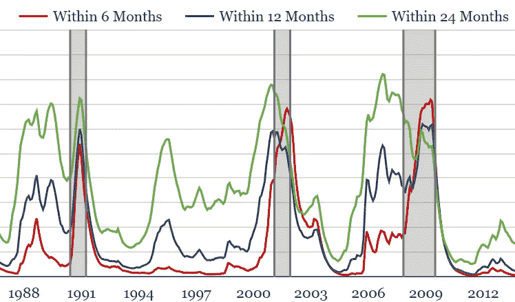
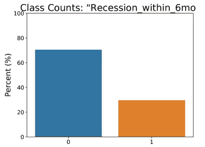
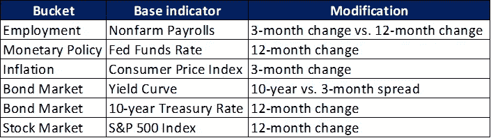
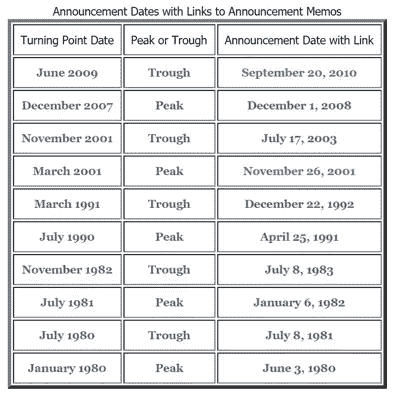
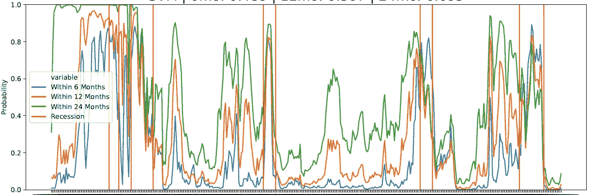
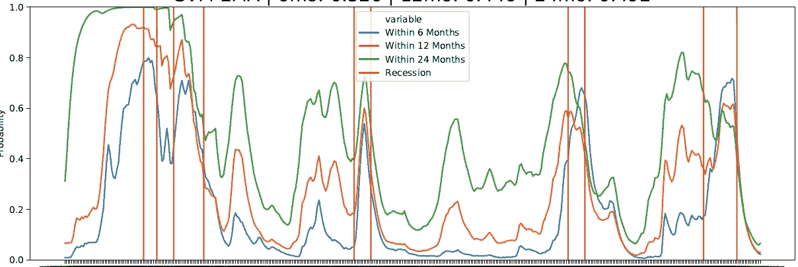
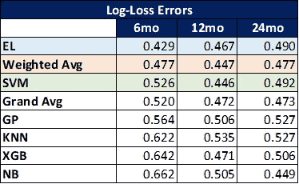
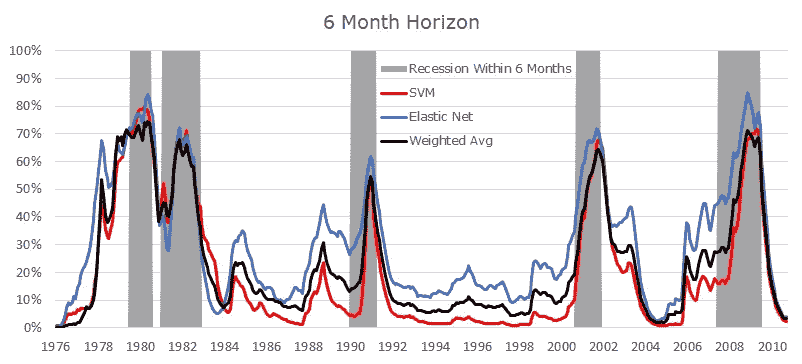
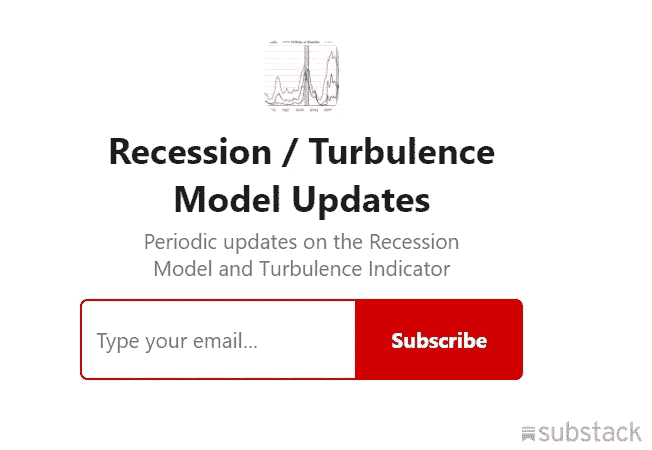

# 使用机器学习的衰退预测

> 原文：<https://towardsdatascience.com/recession-prediction-using-machine-learning-de6eee16ca94?source=collection_archive---------4----------------------->

## “次级贷款被遏制住了”——伯南克(2007 年 3 月)

*   要通过电子邮件接收模型预测的定期更新，[请点击此处](https://terrencezhang.substack.com/subscribe)。
*   衰退预测图目前由[主持在这里](https://terrencez.com/recession-predictor-chart/)。
*   Python 脚本和文档可以在这里找到[。](https://github.com/tzhangwps/Recession-Predictor)

# 内容

*   [简单地说](#36ad)
*   [定义问题](#24bb)
*   [主要假设](#f01f)
*   [别人试过什么？](#7904)
*   [获取数据](#8a51)
*   [功能选择](#a0d4)
*   [设计测试流程](#f593)
*   [测试结果](#1e77)

# 简单地

该项目提出了一种机器学习方法，用于预测美国 6 个月、12 个月和 24 个月的衰退发生率。预测模型使用了一些就业、通胀、利率和市场指标。

# 定义问题

简单来说:

> 人们可以通过在经济和市场数据中寻找线索来预测美国未来衰退的时间吗？

这个问题的几个有趣的属性包括:

*   罕见事件预测:衰退很少发生。
*   **小数据集**:因为我用的是经济数据(更新频率是几个月或者几个季度)，所以我只会有几百个数据点可以处理。
*   **不平衡类样本**:虽然不平衡并没有严重到足以使这个项目成为一个异常检测练习，但是我们仍然必须认识到样本类不平衡，特别是对于误差计算。

This is the most extreme example of class imbalance in the exploratory data set

*   **时间序列:**典型的涉及财务数据的项目。这影响了如何进行交叉验证(不应该进行简单的 K 重验证)。

## 为什么需要解决这个问题？

随着当前牛市的老去，这是一个适时的问题。带着对衰退可能性的良好感觉:

*   政策制定者可以制定对策来降低经济周期下滑的严重程度。
*   **市场参与者**可以通过采取防御性投资策略来省钱。

# 主要假设

有两个主要的理论假设在起作用:

> 1)美国经济衰退表现出标记/早期预警信号。

以单个经济或市场数据序列的形式存在大量衰退“信号”。虽然单独来看，这些信号具有有限的信息价值，但是当它们组合在一起时可能变得更加有用。

> 2)未来的衰退将与历史衰退相似。

这种假设很不可靠，但可以通过选择在经济形势不断变化的情况下仍保持重要性的功能来缓解。例如，关注制造业数据在历史上可能是相关的，但随着世界走向数字化，这种相关性可能会降低。

# 别人试过什么？

*   [**古根海姆合伙公司**有两个衰退相关指标](https://www.guggenheiminvestments.com/perspectives/macroeconomic-research/recession-update-how-severe-will-recession-be):衰退概率模型和衰退仪表板，两者都由经济和市场指标的组合驱动。他们的模型给了我在 3 个不同的时间框架内预测衰退概率的想法。
*   [**纽约联储**预测衰退概率。其局限性在于，它仅提供 12 个月的预测，并且仅依赖于一个变量(10 年期和 3 个月期国债利率之间的利差)。](https://www.newyorkfed.org/research/capital_markets/ycfaq.html)
*   [**荷兰合作银行**有一个衰退概率模型](https://economics.rabobank.com/publications/2019/january/united-states-the-recession-of-2020/)，但也是只基于 1 个变量(10 年期和 1 年期国债利率的利差)，且只覆盖一个时间段(17 个月)。
*   [**富国银行经济学**有几个衰退概率模型](https://www08.wellsfargomedia.com/assets/pdf/commercial/insights/economics/special-reports/recession-update-20190822.pdf)结合了经济和市场数据。然而，他们只将预测限制在 6 个月的范围内。

**模型基准测试/比较**

理想情况下，我会将我的模型性能与上面的每个备选方案进行比较。目前，我不能这样做，原因如下:

*   **古根海姆模型:**模型性能数据不公开发布。
*   **纽约联邦储备银行模型:**经过仔细观察，他们的模型被用来回答问题*“从现在起 X 个月后美国陷入衰退的概率是多少？”*，而我的模型是为了回答问题*“美国在未来 X 个月内陷入衰退的可能性有多大？”*。更多细节，请参见下面的**如何标记类输出**部分。
*   **荷兰合作银行模型:**同样的原因，我不能把我的模型性能与纽约联邦储备银行模型进行比较。此外，Rabobank 模型涵盖了 17 个月的时间段，而我的模型涵盖了 6 个月、12 个月和 24 个月的时间段。
*   **富国银行经济模型**:模型性能数据未公开发布。

# 获取数据

获取数据时，我必须考虑一些事情:

*   **经济数据以不同的频率发布**(每周、每月、每季度等)。).为了对数据点进行时间匹配，我满足于只使用每月采样的数据。*因此，所有预测必须每月进行一次。这意味着我不得不放弃使用 GDP 等有价值的数据序列，因为它每季度发布一次。*
*   **即使只使用月度数据**，不同的数据在一个月内也有不同的发布日期。*为了对此进行控制，所有预测都使用截至每月 7 日的最新可用数据进行。*佛瑞德 API 有一个参数可以设置这个限制。编辑(2021 年 1 月):代码现在从每个月的 8 号开始提取数据，以适应更多的时序边缘情况。
*   **改变数据历史长度**。一些数据是从 1900 年开始发布的，而另一些数据只追溯到几年前。这意味着我必须排除那些没有足够历史记录的潜在有用数据。
*   谈到历史，我需要足够的数据来涵盖尽可能多的衰退。最终，完整的数据集包括了自 1955 年以来的 9 次衰退。
*   经济数据经常被修正。但是弗雷德没有提供原始数字。它只提供了修正后的数据(不管这些修正是在事后进行的)。另一种选择是 [ALFRED](https://alfred.stlouisfed.org) ，它显示特定“年份”日期的可用数字，但 ALFRED 的致命缺陷是它没有时间序列中每个日期的年份。*通过坚持弗雷德最新修订的数据，我做出了一个隐含的假设，即修订是无偏的(即修订同样有可能推动原始数据上升或下降)。*

## 数据源

出于实际原因，我使用了通过 [FRED](https://fred.stlouisfed.org) 和 [Yahoo Finance](https://finance.yahoo.com) 获得的公共领域数据。我没有使用隐藏在付费墙后面的潜在有用的数据，比如美国经济咨询局领先经济指数。

# 特征选择

功能选择的一些项目特定考虑因素:

*   **维度的诅咒。**由于数据集如此之小(只有几百个数据点)，最终模型中不能包含太多特征。否则，模型将无法推广到样本外数据。因此，必须根据每个特性提供的增值来仔细选择特性。
*   **领域知识是关键。**由于基础过程是复杂的时间序列，自动特征选择方法具有过度拟合先前数据的高风险。因此，特征选择必须以对经济基本面的深刻理解为指导。

首先，先睹为快最终的功能列表。注意它有多小:

Note that only 6 features made it to the final list

## 我的特征选择过程的概要

1.  定义执行探索性数据分析的数据集**(1955 年 8 月至 1972 年 1 月)**以确保与交叉验证期间没有交集。
2.  根据经济/理论特征(领域知识)，将潜在特征组织成桶。
3.  仅使用探索性数据集绘制每个单独特征和每个输出类型(未来 6 个月、未来 12 个月、未来 24 个月)之间的成对相关性**(不要提前查看！).**
4.  按顺序从一个要素桶移动到另一个要素桶，以便每个桶在最终数据集中至少有一个要素。对于平局决胜法，选择与已经“接受”到最终数据集中的要素相关性较低的要素。

事情是这样的:

## 首先，选择 1 个就业特征

*   [**平民失业率**](https://fred.stlouisfed.org/series/UNRATE)**——**通常情况下，直到事情开始变糟，企业才会开始裁员。因此，失业通常滞后于衰退。
*   ****—**这是一个更好的起点。由于对更具挑战性的经济环境的预期，企业可能会放缓招聘步伐。**

**我考虑了 **3 个月的非农就业变化(%)，12 个月的非农就业变化(%)，**以及 3 个月变化和 12 个月变化的差异。事实证明，3 个月的变化和 12 个月的变化之间的差异是探索性数据集中的最佳预测器(在 3 个候选人中)，所以我选择它作为我的就业特征。**

## **选择 1 个货币政策特征**

**设定联邦基金利率上限是美联储使用的主要货币工具之一。我考虑了**实际联邦基金利率**，以及**联邦基金利率 12 个月的变化**。联邦基金利率的 12 个月变化是两个候选中最好的，所以我选择它作为我的货币政策特征。**

**一些人认为，美联储可以通过设定联邦基金利率的界限来影响经济活动。**

## ****选择 1 个充气特性****

**通货膨胀与商业周期的关系更加复杂，因为它可能发生在快速扩张时期，也可能发生在收缩时期(滞胀)。但在通货膨胀和其他特征之间可能存在更高阶的效应，因此无论如何都值得包括在内。**

**消费者价格指数(CPI)是一个常用的通货膨胀指标。我考虑了 **3 个月的 CPI 变动(%)，12 个月的 CPI 变动(%)，**以及 3 个月变动和 12 个月变动的**差异。**所有候选人与就业特征和货币政策特征的相关性都很低，因此我选择了**CPI 的 3 个月变化**作为我的通胀特征，因为它与探索性数据集中的输出标签的相关性稍高。**

## ****挑选债券市场特征****

**我很想在这里使用某种类型的信用利差指数(投资级或高收益)，但找不到数据可以追溯到 1955 年的信用利差指数。**

**因此，我开始关注国债利率。国债作为“无风险”资产类别，在全球资产配置框架中扮演着重要角色。国债利率的变化可能表明对经济机会和市场风险的预期发生了变化。**

**我不受 10 年期国债和 3 个月期国债之间利差的影响，因为收益率曲线斜率在提前预测衰退方面有着良好的历史记录。这种现象有几种理论解释。其中一个解释是，如果投资者认为“糟糕的时期”即将到来，他们就会将资金从高风险资产转移到长期美国国债，以锁定更长时间内的“无风险”回报。**

**在选择 10 年期与 3 个月期国债利差作为我的第一个指标后，我考虑了 **3 个月期国债利率(12 个月的变化)、**10 年期与 3 个月期国债利差的 **12 个月的变化、**和 **10 年期国债利率(12 个月的变化)。**我拒绝了前两个候选，因为它们与货币政策特征高度相关(90%)。我决定选择 **10 年期国债利率(12 个月变化)**作为我的第二个债券市场特征，因为它可以衡量长期增长预期。**

## **选择一个股票市场特征**

**股票市场由未来预期的当前贴现驱动，因此被认为是领先指标。我考虑了 S & P 500 指数的 **3 个月变化，S & P 500 指数的**12 个月变化，以及 S & P 500 指数 3 个月变化和 12 个月变化之间的**差异。**后两个候选指标都与产出标签高度相关，但我选择了标准普尔 500 指数&的 **12 个月变化，因为它更容易解释。****

# **设计测试流程**

**在设计测试时，我必须考虑一些事情:**

## **时间序列？那么没有 K 倍交叉验证**

**由于潜在的预测是一个时间序列，因此必须实时进行模型交叉验证和预测(即，仅使用每个时间点的可用数据！).k 倍交叉验证会违反这个原则。**

## **衰退是如何定义的？**

**[美国国家经济研究局(NBER)](https://www.nber.org/cycles.html) 商业周期测定委员会命名商业周期的“高峰”和“低谷”日期。我把 NBER 定义的波峰和波谷之间的几个月视为美国的衰退期。但是这里有一个巨大的问题:**

> **NBER 宣称“高峰”和“低谷”的日期是在事实发生几个月后(有时是几年后)!**

**这意味着不能一次标记一个周期的输出！因此，要部署任何类型的衰退预测器，人们必须在每次正式的 NBER“低谷”公告时(每次衰退结束后的*)重新训练模型。因此，在回溯测试中也必须采用同样的方法！***

**如果按照这种方法，**有 5 个可能的测试运行**(峰谷对)，每个测试都有 NBER 公告日期:**

****

**Link: [https://www.nber.org/cycles.html](https://www.nber.org/cycles.html)**

**对于每个测试，训练集从 1955 年 8 月**开始**，并且随着每个后续测试变得更长。类似地，每个交叉验证集从 1972 年 1 月**开始**，并且随着每个后续测试变得更长。**

## **我如何标记类输出？**

**乍一看，这似乎很容易:衰退= 1，不衰退= 0。这是真的，但是还不够，因为它属于期望的模型范围。为了确定贴标签的过程，人们必须弄清楚要回答的问题。**

**难道是:**

> **从现在起 X 个月后，美国陷入衰退的概率有多大？**

**如果想回答这个问题，就必须预测衰退的开始和结束。在衰退真正结束之前，模型预测的概率应该开始下降。不用说，这是一个非常英勇的任务。**

**另一个问题是:**

> **美国在未来 X 个月内陷入衰退的可能性有多大？**

**这个问题预测了衰退的开始，但只是“预测”了衰退的结束。只有在衰退结束后，模型预测的概率才会开始下降。这个任务不太理想，但它仍然允许市场参与者为市场顶部做准备。**

**因此，所有处于衰退期的月份都将被标记为“1”。此外，X 个月(其中 X = 6 表示 6 个月前的预测值，X = 12 表示 12 个月前的预测值，等等。)也将获得“1”标签。所有其他月份将获得“0”的标签。**

# **试验结果**

**我考虑了几个模型，并在每个模型上运行了前面提到的 5 个测试。如前所述，所有的交叉验证和预测**都是实时进行的(没有作弊！)**，仅使用在每个历史时间点可用的数据。**

## **考虑的模型**

**我考虑了以下 6 个单独的模型:K 近邻、正则化线性回归(弹性网)、朴素贝叶斯、支持向量机、高斯过程和 XGBoost。我通过交叉验证错误的网格搜索来调整超参数。如前所述:**

> **对于每次测试，训练集从 1955 年 8 月**日**开始，并随着每次后续测试而变长。类似地，每个交叉验证集从 1972 年 1 月**开始**，并且随着每个后续测试而变长。**

**此外，我测试了上述 6 个独立模型中的 2 个整体模型:**

*   **一个**大平均**模型，对每个模型的预测进行同等加权**
*   **一个**加权平均**模型，根据每个模型的交叉验证误差对每个模型的预测进行加权**

**我还通过在每个模型的交叉验证预测上训练线性回归模型来测试堆叠集合。**这种方法产生了恶劣的结果。**我直观的解释是，数据集太小，无法训练出强大的堆叠系综。根本没有足够的交叉验证预测可用！**

## **选择误差度量**

**我应该使用哪种误差度量来量化预测误差？因为这是一个分类问题，所以我想到了准确性、预测/召回率和 F1 分数等指标。然而，这些指标都不太适合这个特定的问题，因为预测的输出类别(“0”或“1”)不像**预测的** **出现在每个类别中的概率**那样相关！**

****相反，我使用加权的** [**对数损失**](https://datawookie.netlify.com/blog/2015/12/making-sense-of-logarithmic-loss/) **作为我的误差度量。**它考虑了 class =“1”的预测概率与实际类值(“1”或“0”)之间的距离。Log-loss 为预测概率和实际类输出之间的较大差异分配了指数级更重的惩罚。**

## ****针对阶层失衡进行调整****

****模型训练时:**对于部分模型(弹性网、支持向量机、XGBoost)，有内置参数设置类权重。我设置这些参数，使得两个类对模型训练的损失函数具有相同的影响。**

****在模型交叉验证期间:**使用 [scikit-learn 的对数损失实现](https://scikit-learn.org/stable/modules/generated/sklearn.metrics.log_loss.html)，我可以调整样本类的不平衡(使用“sample_weight”参数)，这样两个类对模型交叉验证的总体对数损失值具有相同的影响。**

****预测平滑****

**原始概率预测往往不稳定，就像这样:**

****

**Predictions before smoothing**

**因此，我对原始概率预测应用了指数平滑法。我选择了加权因子(用于指数平滑器),使得每个预测的半衰期为 3 个周期:**

****

**Predictions after exponential smoothing**

## **最终模型**

**我最终选择了**支持向量机**作为最终部署模型。8 个模型(6 个独立模型和 2 个整体)在 3 个时间范围内的对数损失如下:**

****

**Remember: the smaller the log-loss, the better**

**敏锐的读者可能会注意到，**支持向量机** (SVM)并没有在所有 3 个时间框架内取得最好的成绩。**

> ****为什么我没有选择“表现最佳”的模式？****
> 
> **一个字:讲故事。**

**具体来说，观察 6 个月时间框架内弹性网、加权平均和支持向量机预测的并排比较:**

****

****弹性净值和加权平均模型比 SVM 得分更高(基于加权对数损失),因为它们通常预测更高的衰退概率！**本质上，它们的“假阳性”倾向高于 SVM，而“假阴性”倾向略低于 SVM。**

****这种不对称是不选择“最佳表现”模式的关键。**即使在长期经济增长期间，表明近期衰退概率较高的模型(弹性网、加权平均)也更容易被怀疑为“危言耸听”,并且更难销售。另一方面，一个模型(SVM)表明，在繁荣时期衰退几率接近 0%，但在衰退时期也会飙升至高水平(尽管没有“危言耸听”的模型那么高)，这将更难让人怀疑。**

## **所以我选择了 SVM 模型，不是因为从统计学的角度来看它是“表现最好的”模型，而是因为它讲述了一个更符合人类对经济状况认知的故事！**

## **图表[显示了 SVM 模型的预测，每月更新一次。](https://terrencez.com/recession-predictor-chart/)**

**要通过电子邮件接收模型预测的定期更新，[请点击此处](https://terrencezhang.substack.com/subscribe)。**

****

***特别感谢 Jason Brownlee 关于应用机器学习过程的* [*文章*](https://machinelearningmastery.com/process-for-working-through-machine-learning-problems/) *。***