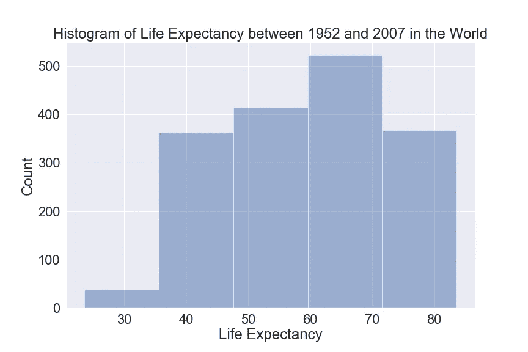

# 数据分布可视化的方法

> 原文：<https://towardsdatascience.com/recipes-for-the-visualizations-of-data-distributions-a1527a0faf77?source=collection_archive---------18----------------------->

## [可视化](https://towardsdatascience.com/data-visualization/home)

直方图、KDE 图、箱形图和小提琴图等


Photo by [Toa Heftiba](https://unsplash.com/@heftiba?utm_source=medium&utm_medium=referral) on [Unsplash](https://unsplash.com?utm_source=medium&utm_medium=referral)

作为一名初露头角的数据科学家，我意识到，在项目启动期间，编写第一段代码总是为了了解数据集中一个或几个变量的分布。可视化变量的分布对于立即掌握有价值的参数非常重要，如频率、峰值、偏斜度、中心、模态以及变量和异常值在数据范围内的表现。

带着分享知识的兴奋，我写了这篇关于单变量(单变量)分布的总结解释的博文，分享我从几篇文章和文档中得出的推论。我将提供绘制分布函数的步骤，而不深入理论，并保持我的帖子简单。

我将首先解释使用 Matplotlib 和 Seaborn 库用 Python 可视化数据分布的函数。可视化背后的代码可以在这个[笔记本](https://github.com/cereniyim/Visualization-of-Data-Distributions/blob/master/life_expectancy_distribution_visualization.ipynb)中找到。

为了便于说明，我使用了 [Gapminder](https://www.gapminder.org/) 寿命预期数据，清理后的版本可以在这个 GitHub [库](https://github.com/resbaz/r-novice-gapminder-files/tree/master/data)中找到。

数据集显示了 142 个国家在 1952 年至 2007 年间的出生时预期寿命、人口和人均 GDP。我将绘制出生时的预期寿命，使用:

1.  柱状图
2.  核密度估计和分布图
3.  箱形图
4.  博兴图
5.  小提琴情节

# 1)直方图

直方图是显示数据分布的最简单方式。下面是制作直方图的方法:

*   创建桶(箱)通过将数据区域划分成相等的大小，数据中子集的数量就是箱的数量。
*   记录落入每个箱中的数据点的计数。
*   在 x 轴上并排想象每个桶。
*   计数值将显示在 y 轴上，显示每个箱子中有多少物品。

你有了一个全新的直方图！

这是最简单、最直观的方法。然而，一个缺点是决定必要的箱的数量。

在这个图中，我确定了 25 个 bin，这在使用 Matplotlib hist 函数中的`bins` 参数后似乎是最佳的。

```
# set the histogram
plt.hist(df.life_expectancy, 
         range=(df.life_expectancy.min(),
                df.life_expectancy.max()+1), 
         bins=25, 
         alpha=0.5) 
# set title and labels
plt.xlabel(“Life Expectancy”) 
plt.ylabel(“Count”) 
plt.title(“Histogram of Life Expectancy between 1952 and 2007 in the World”) 
plt.show()
```


Histogram with 25 bins

不同数量的容器会显著改变数据分布的外观。这是同样的数据分布，有 5 个箱，看起来像一个完全不同的数据集，对吗？



Histogram with 5 bins

如果您不想被箱数确定所困扰，那么让我们跳到核密度估计函数和分布图。

# 2)核密度估计和分布图

[核密度估计](https://en.wikipedia.org/wiki/Kernel_density_estimation) (KDE)图通过平滑直方图将您从决定面元大小的麻烦中解救出来。遵循以下逻辑创建 KDE 图:

*   围绕每个数据点绘制一条[高斯(正态)曲线](https://en.wikipedia.org/wiki/Normal_distribution)。
*   将曲线相加，在每个点创建一个密度。
*   归一化最终曲线，使其下方的面积等于 1，从而得到概率密度函数。以下是这 3 个步骤的直观示例:


[Image Source](https://www.wikizeroo.org/index.php?q=aHR0cDovL3VwbG9hZC53aWtpbWVkaWEub3JnL3dpa2lwZWRpYS9jb21tb25zL3RodW1iLzQvNDEvQ29tcGFyaXNvbl9vZl8xRF9oaXN0b2dyYW1fYW5kX0tERS5wbmcvODAwcHgtQ29tcGFyaXNvbl9vZl8xRF9oaXN0b2dyYW1fYW5kX0tERS5wbmc): Histograms and Kernel Density Estimations

*   你会发现 x 轴上的数据范围和 y 轴上的随机变量的概率密度函数。由[威尔·科尔森](https://medium.com/u/e2f299e30cb9?source=post_page-----a1527a0faf77--------------------------------)在本[篇](/histograms-and-density-plots-in-python-f6bda88f5ac0)中定义的概率密度函数如下:

> 您可能认为密度图上的 y 轴只是不同类别之间的相对比较值。

幸运的是，您不必记住并手动应用所有这些步骤。Seaborn 的 KDE 绘图函数为您完成所有这些步骤，只需将您的数据框或 Numpy 数组的列传递给它即可！

```
# set KDE plot, title and labels
ax = sns.kdeplot(df.life_expectancy, shade=True, color=”b”) 
plt.title(“KDE Plot of Life Expectancy between 1952 and 2007 in the World”) 
plt.ylabel(“Density”)
```


如果你想结合直方图和 KDE 图，Seaborn 有另一个很酷的方法在一个图形中显示直方图和 KDE 图:分布图，它绘制 KDE 图，通过改变函数中的`hist` 参数可以灵活地打开和关闭直方图。

```
# set distribution plot, title and labels
ax = sns.distplot(df.life_expectancy, hist=True, color=”b”)
plt.title(“Distribution Plot of Life Expectancy between 1952 and 2007 in the World”) 
plt.ylabel(“Density”)
```


Distribution plot with histogram and Kernel Density Estimation function

KDE 图也能够显示不同类别之间的分布:

```
# create list of continents 
continents = df[‘continent’].value_counts().index.tolist() # set kde plot for each continent 
for c in continents: 
   subset = df[df[‘continent’] == c]
   sns.kdeplot(subset[“life_expectancy”], label=c, linewidth=2) # set title, x and y labels 
plt.title(“KDE Plot of Life Expectancy Among Continents Between 1952 and 2007”) 
plt.ylabel(“Density”) 
plt.xlabel(“Life Expectancy”)
```


尽管与直方图相比，KDE 图或分布图需要更多的计算和数学，但通过观察连续的线，更容易理解分布的形态、对称性、偏斜度和中心。一个缺点可能是，缺少关于汇总统计的信息。

如果您希望直观地提供分布的汇总统计数据，那么让我们转到箱线图。

# 3)箱线图

箱线图显示了包含五个数字的汇总统计数据的数据分布(最小值、第一个四分位数 Q1、第二个四分位数中值、第三个四分位数 Q3、最大值)。下面是绘制它们的步骤:

*   对数据进行排序，以确定最小值、[四分位数](https://en.wikipedia.org/wiki/Quartile)(第一、第二和第三)和最大值。
*   在第一个四分位数和第三个四分位数之间画一个方框，然后在对应于中间值的方框中画一条垂直线。
*   在盒子外面画一条水平线，把盒子一分为二，把最小值和最大值放在边上。这些线条将成为你的胡须。
*   胡须的末端等于数据的最小值和最大值，如果你看到任何数据，放在一边的小菱形被解释为“异常值”。

手动创建方框图的步骤很简单，但我更喜欢从 Seaborn 方框图功能中获得一些支持。

```
# set the box plot and title 
sns.boxplot(x=”life_expectancy”, data=df, palette=”Set3") plt.title(“Boxplot of Life Expectancy between 1952 and 2007 in the World”)
```


有几种不同的方法来计算胡须的长度，Seaborn box plot 函数默认从第一个和第三个四分位数延伸 1.5 倍的[四分位数间距](https://en.wikipedia.org/wiki/Interquartile_range) (IQR)来确定胡须。因此，任何大于 Q3+(1.5*IQR)或小于 Q1-(1.5*IQR)的数据点都将被视为异常值。您可以通过调整`whis` 参数来改变胡须的计算。

像 KDE 图一样，箱线图也适合可视化类别间的分布:

```
# set the box plot with the ordered continents and title sns.boxplot(x=”continent”, y=”life_expectancy”, data=df,
            palette=”Set3", 
            order=[“Africa”, “Asia”, “Americas”, “Europe”,
                   “Oceania”]) 
plt.title(“Boxplot of Life Expectancy Among Continents Between 1952 and 2007”)
```


盒状图提供了统计数据的故事，一半的数据在那里，通过观察盒状和须状提供了整个范围的数据。另一方面，你不知道盒子外面的数据的故事。这就是为什么一些科学家发表了一篇关于 boxen 图的论文，被称为扩展盒图。

# 4)博兴图

Boxen 图，或字母值图或扩展盒图，可能是数据分布可视化中最少使用的方法，但它们传达了大型数据集的更多信息。

要创建一个博森情节，我们先来了解一下什么是字母值汇总。[字母值汇总](https://mgimond.github.io/ES218/Week08b.html)是关于连续确定一个排序数据的中间值。

首先，确定所有数据的中间值，并创建两个切片。然后，确定这两个切片的中值，并在达到停止标准或不再有数据需要分离时重复这个过程。

确定的第一个中间值是中值。在第二次迭代中确定的中间值称为四分之一，在第三次迭代中确定的中间值称为八分之一。

现在让我们画一个方框图，并在方框图之外可视化字母值摘要，而不是胡须。换句话说，绘制一个具有对应于切片中间值(八分之一、十六分之一等等)的延长盒边的盒图..)

```
# set boxen plot and title 
sns.boxenplot(x=”life_expectancy”, data=df,palette=”Set3") plt.title(“Boxenplot of Life Expectancy Among Continents Between 1952 and 2007”)
```


它们在讲述不同类别的数据故事方面也很有效:

```
# set boxen plot with ordered continents and title sns.boxenplot(x=”continent”, y=”life_expectancy”, data=df,
              palette=”Set3", 
              order=[“Africa”, “Asia”, “Americas”, “Europe”,
                     “Oceania”]) 
plt.title(“Boxenplot of Life Expectancy Among Continents Between 1952 and 2007”)
```


Boxen 图的出现是为了更有效地可视化较大的数据集，它显示了数据在主框之外的分布情况，并更加强调异常值，因为异常值和 IQR 之外的数据在较大的数据集中更为重要。

有两个视角提供了关于数据分布的线索，数据分布的形状和汇总统计。要同时从两个角度解释一个分布，我们先来学煮一些小提琴的剧情。

# 5)小提琴情节

小提琴情节是盒子情节和 KDE 情节的完美结合。他们提供的汇总统计数据内部是箱形图，分布形状的侧面是 KDE 图。

这是我最喜欢的图，因为数据表达了所有的细节。你还记得我们之前绘制的预期寿命分布图和汇总统计数据吗？Seaborn violin 的剧情功能现在将为我们融合它。

瞧啊！

```
# set violin plot and title 
sns.violinplot(x=”life_expectancy”, data=df, palette=”Set3") plt.title(“Violinplot of Life Expectancy between 1952 and 2007 in the World”)
```


你可以通过观察边上的分布来观察 70 左右的数据峰值，通过注意里面细长的方框来观察 50 到 70 之间聚集的一半数据点。

这些漂亮的小提琴可以用来可视化分类数据，如果您愿意，可以通过更改`inner` 参数用点、虚线或线条表示汇总统计数据。


Violin plots with inner set to quartile, point and stick respectively

好处是显而易见的:可视化的形状分布和汇总统计同时进行！

**小提琴剧情加分:**通过设置`scale` 参数进行计数，还可以显示你在每个类别中有多少数据点，从而强调每个类别的重要性。当我改变`scale`的时候，非洲和亚洲扩张了，大洋洲收缩了，结论是大洋洲的数据点较少，而非洲和亚洲的数据点较多。

```
# set the violin plot with different scale, inner parameter and title 
sns.violinplot(x=”continent”, y=”life_expectancy”, data=df,
               palette=”Set3", 
               order=[“Africa”, “Asia”, “Americas”, “Europe”,
                      “Oceania”], 
               inner=None, scale=”count”) 
plt.title(“Violinplot of Life Expectancy Among Continents Between 1952 and 2007”)
```


# 结论

所以，这些关于可视化分布的方法解释了每个图背后的核心思想。有很多选项可以显示单变量或单变量分布。

直方图、KDE 图和分布图很好地解释了数据形态。此外，分布图可以结合直方图和 KDE 图。

箱线图和 boxen 图最适合交流汇总统计数据，boxen 图更适合处理大型数据集，而 violin 图则完全胜任。

他们都是有效的沟通者，并且每个都可以用 Python 中的 Seaborn 库快速构建。您的可视化选择取决于您的项目(数据集)和您想要传递给观众的信息。如果你对这篇文章感到兴奋并想了解更多，你可以查看一下 [Seaborn](https://seaborn.pydata.org/) 和 [Matplotlib](https://matplotlib.org/3.1.0/gallery/statistics/hist.html) 文档。

最后但同样重要的是，这是我对数据科学的第一篇贡献，我希望你喜欢阅读！我感谢您的建设性反馈，并希望在回复中或在 [Twitter](https://twitter.com/cereniyim) 上听到您对这篇博文的看法。