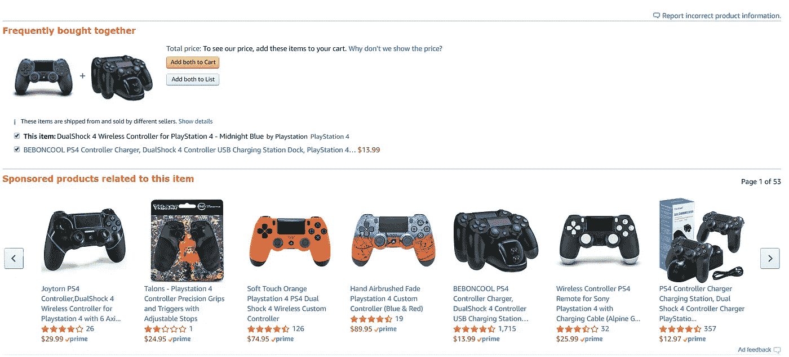
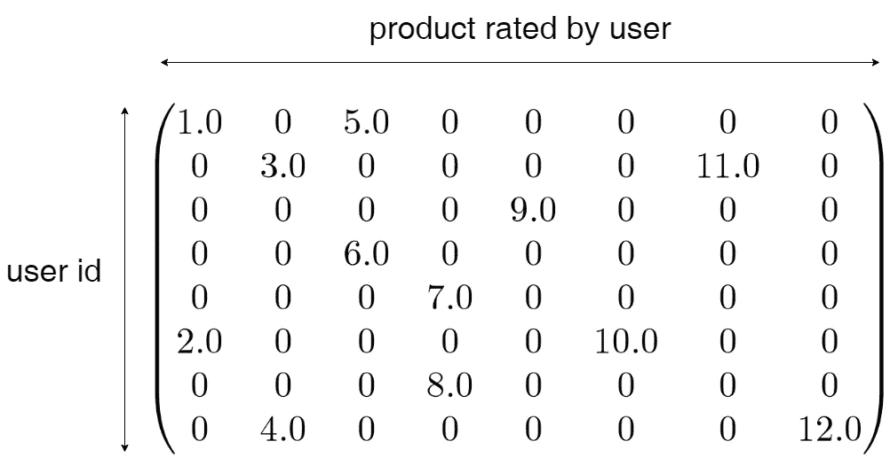
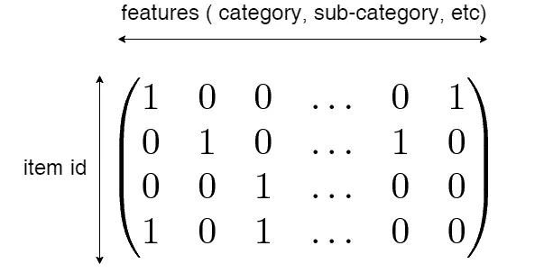
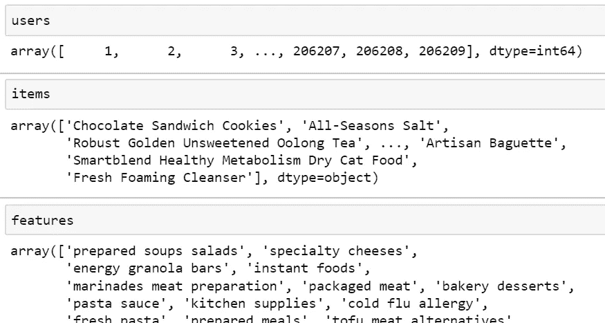
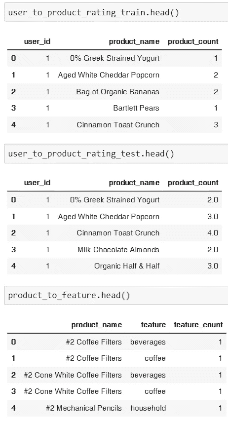
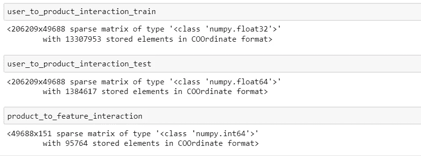

# 推荐系统第 1 部分——使用协同过滤和混合协同——在 Instacart 数据集上使用 LightFM 库的零售内容

> 原文：<https://towardsdatascience.com/recommendation-system-part-1-use-of-collaborative-filtering-and-hybrid-collaborative-content-in-6137ba64ad58?source=collection_archive---------9----------------------->

# 介绍



Recommender systems shown in Amazon

声明:我在正文和代码中交替提到了**项目**和**产品**。他们俩是一样的。

当你打开亚马逊等一些在线市场时，你会发现一些推荐，如经常一起购买，买了这个的客户也买了这个，类似的商品，等等。你会在网站上更容易找到你想要的东西。目前，推荐系统广泛用于在线市场，一些零售商正在使用这项技术来改善用户体验、用户保留率和转化率。

在本教程中，我将向您展示如何使用 Instacart 数据集创建一个模拟真实业务问题的产品推荐，适用于“交互”数据丰富的热启动问题。数据集可以在 Kaggle 上找到。我们还希望提供纯协作过滤方法与混合协作-基于内容的方法之间的比较，以解决我们的热启动问题。

在讨论细节之前，我们需要使用 pip 安装 LightFM 库

`pip install lightfm`

安装完成后，您可以导入所有必要的东西，包括交叉验证术语和指标

importing libraries including standard pandas, numpy, and the lightfm’s model and cross-validation stacks

# 如何为 LightFM 库准备数据

在使用 LightFM 库时，我们需要一个稀疏矩阵，称为用户-项目交互矩阵。对于混合协作内容推荐的情况，我们还可以考虑项目-特征矩阵:

1.  **用户-物品互动矩阵**定义了用户(客户)与物品(产品)之间的互动，这可以显示为客户投票的电影评级。然而，在零售案例中，我们无法从历史数据中获得明确的评级。在这种情况下，我隐含地将**“购买数量”作为评级**考虑在内。如果顾客 A 购买了产品 B 10 次，那么我们可以说顾客 A 给产品 B 的评分是 10。您还可以考虑二进制评分，其中 1 表示客户 A 购买过产品 b，0 表示从未购买过产品 b。用户-项目交互矩阵表示**协同过滤对模型**的贡献。
2.  **物品-特征交互矩阵**定义物品的特征。项目到功能可以表示为产品到它的元数据，例如产品的类别、子类别，甚至任何信息。使用 Instacart 的数据集，我会使用“过道”和“部门”作为产品的特征。如果产品 A 位于通道 B，那么我们可以说通道 B 中产品 A 的矩阵元素为 1，否则为 0。这个矩阵可以向模型添加基于内容的贡献。



**User-item interaction matrix**. User Id represents the customers and product rated represents how many times a specific user id bought the products. The matrix is sparse.



item-feature matrix. Item id represents the products and features refer to the metadata embedded to an item such as category, sub-category, and so on.

# 使用 Instacart 零售数据集构建矩阵

我们将从 Instacart 市场购物篮分析 Kaggle 竞争([https://www . ka ggle . com/c/insta cart-Market-Basket-Analysis/data](https://www.kaggle.com/c/instacart-market-basket-analysis/data))中创建两个矩阵，并形成适用于 LightFM 库的数据集。在此之前，我们需要从 Kaggle 下载所需的数据集，并为我们的推荐系统读取必要的数据集

数据集的显示如下所示:

datasets preview

我们还需要删除`aisles`和`departments`中带有`aisle == missing`或`aisle == other`和`department == missing`或`department == other`的行:

1.  构造一个**用户-项目交互** **矩阵**。我们需要考虑到，LightFM 库只能读取一个稀疏的 coo 矩阵，可以使用`scipy.sparse`中的`coo_matrix`来构造，其中我们需要将`item_id`转换成`integer index`。因此，我构建了**用户-项目交互矩阵**，将`user_id`转换为表示矩阵的行的索引**，将**转换为列**的索引。另外，不要忘记为 user_id 到 index、index 到 user_id、item_id 到 index 和 index 到 item_id 创建字典映射。**
2.  构建一个**项目-特征矩阵**。用户-项目交互矩阵也是同样的情况，通过将**项目/产品**和**功能**映射到**索引中，**我们可以尝试将**项目/产品** **和功能交互**转换成稀疏矩阵。

下面显示了矩阵生成器和一些用于索引等的辅助函数

将所有`users`、`items`和`features`分配到列表中

显示在`users`、`items`和`features`列表的下方



displaying users, items (products), and features (departments and aisles)

LightFM 库不能读取未索引的对象，因此我们需要为`users`、`items`和`features`创建映射到它们相应的索引中。

在生成交互矩阵之前，我将 t **rain、test 和 product_features 数据**准备成它们相应的名称



Showing the table of users with their corresponding purchased products/items. I also regard **count** as the ratings of the products/items or features

将每个表转换成交互矩阵

导致



Sparse matrices representing interactions of users to products/items and products to features. The non-zero elements consist of **product count** as the number of products a user has bought

# 模型选择和交叉验证

在这个问题中，我将通过测量**测试数据集**的 AUC(范围从 0 到 1)来尝试使用 LightFM 库进行交叉验证。我使用了“WARP”损失函数，它通常在 LightFM 库中提供最佳性能选项。通过使用 Instacart 数据集，我将`prior`数据集作为`training dataset`，将`train`数据集作为`testing dataset.`，通过拟合`training dataset`并在`test dataset`上测试，我们可以尝试评估测试数据集的 AUC 分数。

下面我们尝试使用 LightFM 库对**纯协同过滤方法**进行交叉验证

上面的输出是

```
time taken = 118.23 seconds
time taken = 1088.21 seconds
average AUC without adding item-feature interaction = 0.95
```

从上面的结果中，我们知道，使用我的 8 GB RAM 笔记本电脑，培训大约需要 1 分钟，验证需要 10 分钟。翘曲损失功能可以很慢，但性能非常好。AUC = 0.95 很神奇的告诉我们，Instacart 数据集是一个热启动问题，交易数据丰富。

**混合协作——基于内容的**,通过添加**产品/项目和功能交互**,代码如下

上面的输出是

```
time taken = 154.22 seconds
time taken = 1709.78 seconds
average AUC with adding item-feature interaction = 0.80
```

从混合情况下记录的 AUC 来看，AUC 比纯协作情况下的 AUC 差。这是一个具有丰富交易数据的热启动问题，纯协作过滤将提供更好的推荐。

# 请求产品/项目推荐

我们需要通过下面的函数将训练和测试数据集合并成一个

并创建用户到产品的交互矩阵

导致


回来了

```
time taken = 68.50 seconds
```

并且询问推荐的类对象由下式给出

使用最终模型调用建议

为用户 2 和用户 10 打印了一些建议

```
User 2
     Known positives:
                  Organic Turkey Burgers
                  Wild Albacore Tuna No Salt Added
                  Cherry Pomegranate Greek Yogurt
     Recommended:
                  Organic Garlic
                  Organic Baby Spinach
                  Organic Hass AvocadoUser 10
     Known positives:
                  Cantaloupe
                  Parsley, Italian (Flat), New England Grown
                  Seedless Red Grapes
     Recommended:
                  Organic Baby Spinach
                  Organic Strawberries
                  Bag of Organic Bananas
```

# 结论

LightFM library 可以为交易数据提供混合协作和基于内容的推荐系统。然而，对于热启动问题，纯协同过滤提供了更好的性能。

# **Github 上完整的 Jupyter 笔记本**

[https://github . com/danirisdiandita/light FM _ re commendation/blob/master/re commendation _ system _ part _ 01 . ipynb](https://github.com/danirisdiandita/lightfm_recommendation/blob/master/recommendation_system_part_01.ipynb)

# 文献学

[1] LightFM 文档—[https://lyst.github.io/lightfm/docs/home.html](https://lyst.github.io/lightfm/docs/home.html)

[2] Instacart Kaggle 比赛—【https://www.kaggle.com/c/instacart-market-basket-analysis 

[2]推荐系统—学习数据科学的 Python # 3【https://www.youtube.com/watch?v=9gBC9R-msAk 