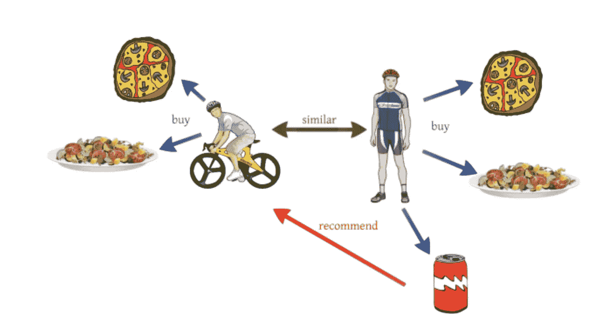
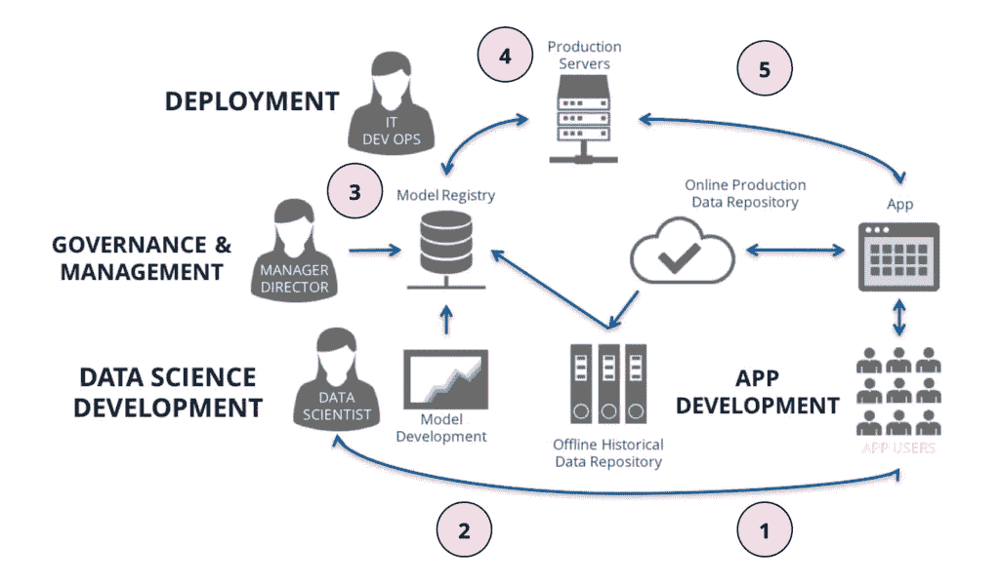
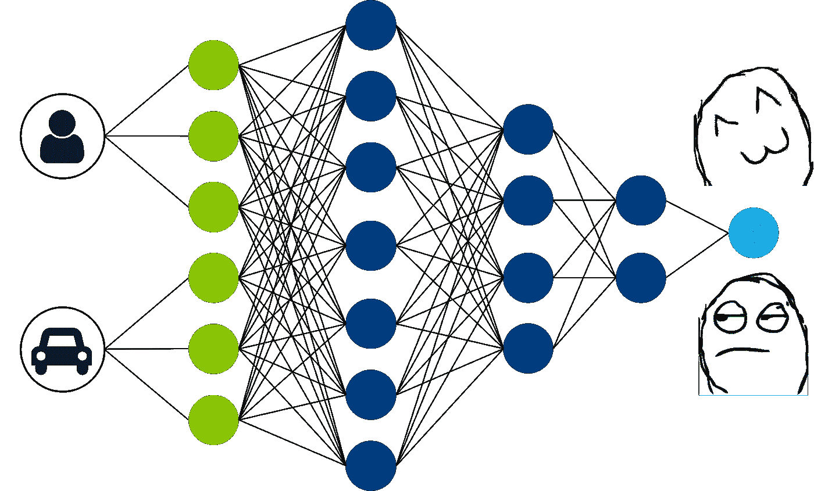

# 推荐系统系列第 1 部分:构建推荐系统的执行指南

> 原文：<https://towardsdatascience.com/recommendation-system-series-part-1-an-executive-guide-to-building-recommendation-system-608f83e2630a?source=collection_archive---------2----------------------->

## RecSys 系列

## 学术界和工业界的推荐系统

***更新:*** *本文是我探索学术界和工业界推荐系统系列文章的一部分。查看完整系列:* [*第一部分*](/recommendation-system-series-part-1-an-executive-guide-to-building-recommendation-system-608f83e2630a) *，* [*第二部分*](/recommendation-system-series-part-2-the-10-categories-of-deep-recommendation-systems-that-189d60287b58) *，* [*第三部分*](/recommendation-system-series-part-3-the-6-research-directions-of-deep-recommendation-systems-that-3a328d264fb7) *，* [*第四部分*](/recsys-series-part-4-the-7-variants-of-matrix-factorization-for-collaborative-filtering-368754e4fab5) *，* [*第五部分*](/recsys-series-part-5-neural-matrix-factorization-for-collaborative-filtering-a0aebfe15883) *和*

# **简介**

推荐系统的建立是为了预测用户可能喜欢什么，尤其是当有很多选择的时候。他们可以明确地向用户提供这些推荐(例如，亚马逊或网飞，经典的例子)，或者他们可能在幕后工作，选择哪些内容浮出水面，而不给用户选择的机会。

不管是哪种方式,“为什么”都很清楚:它们对某些类型的企业至关重要，因为它们可以让用户接触到他们原本可能不会发现的内容，或者让用户保持更长时间的参与。虽然构建一个简单的推荐系统可能非常简单，但真正的挑战是实际构建一个有效的系统，并且企业可以从其输出中看到真正的提升和价值。

可以使用各种技术来构建推荐系统，从简单的(例如，仅基于来自同一用户的其他评级项目)到极其复杂的。复杂的推荐系统利用各种不同的数据源(一个挑战是使用非结构化数据，特别是图像作为输入)和机器学习(包括深度学习)技术。因此，它们非常适合人工智能领域，尤其是无监督学习；随着用户继续消费内容和提供更多数据，这些系统可以被构建来提供越来越好的推荐。

在这篇文章和接下来的文章中，我将介绍推荐系统的创建和训练，因为我目前正在做这个主题的硕士论文。第 1 部分提供了推荐系统的高层次概述，它们是如何构建的，以及它们如何用于改善跨行业的业务。

# **推荐系统的 2 种类型**

有两种主要类型的推荐系统，每种都有不同的子类型。根据目标、受众、平台和您的建议，这些不同的方法可以单独使用，但通常情况下，最好的结果是将它们结合使用:

## **1 —协同过滤**

它主要基于其他人(而不仅仅是被推荐的用户)的输入或动作来做出推荐。

这种类型的推荐系统的变体包括:

*   **通过用户相似性:**这种策略包括通过比较用户的活动来创建用户组，并提供在该组其他成员中受欢迎的推荐。在拥有强大而多样的受众的网站上，为信息匮乏的用户快速提供推荐是很有用的。
*   **通过关联:**这个是上面提到的一个的特定类型，也称为“看了 X 也看了 y 的用户”，实现这种类型的推荐系统就是查看购买序列或购买组，并显示类似的内容。这种策略对于捕捉与自然补充内容相关的推荐以及在用户生活中的某个时刻是有用的。

## **2 —基于内容的**

基于内容的系统根据用户的购买或消费历史提出建议，通常用户采取的行动(输入)越多，系统就越准确。

更具体类型的基于内容的推荐系统包括:

*   **按内容相似度:**作为最基本的基于内容的推荐系统，这种策略包括根据元数据推荐相近的内容。这种方法对于包含大量丰富元数据的目录以及与目录中的产品数量相比流量较低的目录很有意义。
*   **通过潜在因素建模:**比内容相似性方法更进一步，这种策略的关键是通过假设以前的选择是某些品味或爱好的指示来推断个人的内在兴趣。以前的策略基于显式的、手动填充的目录元数据，而这种策略依赖于发现隐含的关系。这是通过使用用户的较大交互(例如，观看的电影、购买的物品等)的历史来完成的。)来学习这些口味。
*   **通过主题建模:**这是潜在因素建模策略的一种变体，通过分析非结构化文本来检测感兴趣的特定主题，而不是考虑用户的更大动作，来推断用户的兴趣。这对于具有丰富但非结构化的文本信息的用例(比如新闻文章)来说尤其有趣。
*   **通过流行内容推广:**这包括根据产品的内在特性突出产品推荐，这些特性可能会引起广泛受众的兴趣:价格、功能、流行度等。该策略还可以考虑内容的新鲜度或年龄，从而能够使用最流行的内容进行推荐。这通常用于新内容占大多数的情况。

# **建立推荐系统的 6 个步骤**

如果您遵循从原始数据到预测的基本步骤，构建一个成功且健壮的推荐系统会相对简单。也就是说，当涉及到推荐系统时，需要考虑一些经常被忽视的细节，为了最有效的过程和最佳的预测，这些细节是值得介绍(或重申)的。

本节将介绍在构建推荐系统的背景下完成数据项目的六个基本步骤。

## **1 —了解业务**

建立推荐系统的第一步是定义项目的目标和参数，这非常简单和关键，但经常被忽视。这肯定会涉及数据团队和业务团队(可能是产品经理、运营团队，甚至是合作伙伴或广告团队，取决于您的产品)之间的讨论和输入。

为了更深入地了解业务需求并在这些团队之间展开讨论，以下是一些需要考虑的特定主题:

*   项目的最终目标是什么？建立推荐系统的目的是直接增加销售额/实现更高的平均购物篮大小/减少浏览时间并使购买更快发生/减少未消费内容的长尾/提高用户参与产品的时间吗？
*   *推荐信真的有必要吗？*这可能是一个显而易见的问题，但由于它们的构建和维护成本高昂，因此值得一问。企业是否可以通过静态内容集(如员工/编辑选择或最受欢迎的内容)来推动发现，从而实现其最终目标？
*   *什么时候会出现推荐？*如果推荐在多个地方都有意义(例如，在第一次访问应用程序或网站时，以及在购买或消费内容后，在主屏幕上)，是否会在两个地方使用相同的系统，或者每个地方的参数和需求不同？
*   *有哪些数据可以作为推荐的依据？*在推荐时，登录用户(在这种情况下可能有更多可用数据)与匿名用户(这可能会使构建推荐系统变得复杂)的比例大约是多少？
*   *是否有必须首先进行的产品变更？*如果团队希望使用更强大的数据来构建推荐系统，是否必须首先进行产品更改，以便更早地识别用户(例如，邀请他们更快地登录)，如果是，从业务角度来看，这些更改是否合理？
*   *是否应该对所有内容或产品一视同仁？*也就是说，除了有机推荐之外，业务团队是否希望(或必须)推广特定的产品或内容？
*   *如何细分口味相近的用户？*换句话说，如果采用基于用户相似性的模型，你将如何决定什么使用户相似？

## **2 —获取数据**

最好的推荐系统使用万亿字节的数据。所以当涉及到为你的推荐系统收集数据时，一般来说，越多越好。如果当你试图为用户做推荐时，用户是未知的，这可能会很困难，例如，他们没有登录，或者更具挑战性的是，他们是全新的。如果你的业务中大多数用户都是未知的，你可能需要依赖外部数据源或与偏好没有明确联系的一般数据，如人口统计、浏览历史等。

当谈到用户偏好时，有两种反馈:显式和隐式。

*   **明确的用户反馈**是任何需要用户努力的事情，比如留下一个评论/评级或者发起一个投诉或者产品退货(通常来自客户关系管理、CRM、数据)。
*   相比之下，**隐式用户反馈**是可以收集的关于用户偏好的信息，而无需他们实际指定那些偏好。例如，过去的购买历史、查看某些优惠、产品或内容所花费的时间、来自社交网络的数据等。

好的推荐系统通常采用这些反馈类型的组合，因为它们各有优缺点。

*   显式反馈可以非常清楚:用户已经如实陈述了他们的偏好、喜欢或不喜欢。但出于同样的原因，它天生就有偏见；用户不知道自己不知道什么(换句话说，他可能喜欢某样东西，但从未尝试过，因此不会将其列为偏好，也不会正常地与该类型的项目或内容进行交互)。
*   相比之下，隐式反馈则相反——它可以揭示用户没有——或者不会——在个人资料中承认的偏好(或者他们的个人资料信息可能已经过时)。另一方面，隐性反馈可能更难理解；仅仅因为一个用户在一个给定的项目上花了时间并不意味着他(她)们喜欢它，所以最好依靠隐含信号的组合来确定偏好。

## **3 —探索、清理和扩充数据**

尤其是在为推荐系统探索和清理数据时，要考虑的一件事是改变用户的口味。根据你的推荐，旧的评论，行动等。，可能不是最相关的推荐依据。考虑只查看更有可能代表用户当前口味的特征，并删除可能不再相关的旧数据，或者添加权重因子，以给予最近的动作比旧动作更大的重要性。

推荐系统的数据集很难处理，因为它们通常是高维的，但同时，许多特征没有任何值也很常见，这使得聚类和离群点检测很困难。

## **4 —预测排名**

考虑到前面步骤中所做的工作，您可能已经构建了一个推荐系统，只需按用户对这些分数进行排名，您就可以推荐产品了。这种策略没有使用机器学习或预测元素，但这完全没问题。对于某些用例，这已经足够了。

但是，如果您确实想构建更复杂的东西，在用户使用推荐的内容之后，有许多子任务可以完成，这些内容可以用来进一步完善系统。有几种方法可以利用混合方法来尝试最高质量的推荐:

*   并排展示来自不同类型系统的建议。
*   并行维护多个算法，其中哪个算法优于另一个算法的决定本身受制于机器学习(例如，多臂 bandit)。
*   使用纯机器学习方法来组合多个推荐系统(逻辑回归或其他加权回归方法)。一个具体的例子是使用不同技术的两个(或更多)推荐的加权平均值。

也有可能不同的模型在产品或网站的不同部分会工作得更好。例如，用户尚未采取行动的主页与用户已经以某种方式点击或消费内容之后的主页。

## **5 —可视化数据**

在推荐系统的环境中，可视化有两个主要目的:

1.  当仍处于探索阶段时，可视化可以帮助揭示关于数据集的事情，或者给出关于模型性能的反馈，否则很难看到。
2.  将推荐系统放置到位后，可视化可以帮助向业务或产品团队传达有用的信息(例如，哪些内容做得很好但没有被发现，用户口味、内容或通常一起消费的产品之间的相似性等)。)以便他们可以根据这些信息做出更改或决策。

可视化这种类型的数据的主要问题是存在的数据量，这使得很难以有意义的方式消除干扰。但同样，良好的可视化将有助于从大量数据中理解意义，否则很难从中获得有意义的见解。

## **6 —迭代和部署模型**

在开发环境或沙盒中工作的推荐系统没有任何好处。这一切都是为了将系统投入生产，这样您就可以开始看到对您在开始时制定的业务目标的影响。

此外，请记住，你拥有的用于推荐系统的数据越多，它就会变得越好。因此，对于这种类型的数据项目来说，评估性能并继续进行微调是至关重要的，比如添加新的数据源，看看它们是否有积极的影响。

事实上，通过定期监控其性能来确保您的推荐系统能够适应和发展是该过程中最重要的部分之一——一个不能随着时间的推移根据品味或新数据进行适当调整的推荐系统可能不会帮助您最终实现您最初的项目目标，即使该系统最初表现良好。建立一个反馈回路来了解用户是否关心推荐将会很有帮助，并为以后的改进和决策提供一个很好的衡量标准。

如果推荐是你业务的核心，那么不断尝试新事物和发展你创建的初始模型将是一项持续的任务；推荐系统不是你可以创建并抛弃的东西。

# **挑战**

创建一个推荐系统是很重要的，这个系统会随着你拥有的数据量而扩展。如果它是为有限的数据集构建的，并且该数据集不断增长，计算成本将呈指数级增长，系统将无法处理如此大量的数据。为了避免以后不得不重新构建您的推荐系统，您必须从一开始就确保它是为扩展预期的数据量而构建的。

也有可能在花费时间、精力和资源建立推荐系统之后(甚至在拥有足够的数据和良好的初步结果之后)，推荐系统只给出非常**明显的推荐**。避免这个陷阱的关键实际上可以追溯到七个步骤中的第一步:了解业务需求。如果没有足够的内容长尾或者不需要这个系统，也许你需要重新考虑是否需要首先建立一个推荐系统。

最后，人们的口味不会随着时间的推移而一成不变，如果一个推荐系统没有考虑这一事实，它可能永远不会像它应该的那样准确。同样，建立一个不会随着时间的推移而变得更好的推荐系统也存在风险。随着用户不断消费内容，更多的数据可用，你的推荐系统应该更多地了解用户，适应他们的口味。一个不够灵活的**推荐系统**很快就会过时，达不到它的目的。

# **未来工作**

基本的推荐系统已经存在了一段时间，尽管它们继续变得更加复杂，并被零售和内容巨头完善。但是接下来呢？如果企业希望开发一个真正前沿的系统，他们应该考虑的最新趋势和发展是什么？

**环境感知**推荐系统代表了一个新兴的实验和研究领域，旨在根据用户在特定时刻的环境提供更加精确的内容。例如，用户是在家还是在路上？使用更大还是更小的屏幕？现在是早上还是晚上？给定关于特定用户的可用数据，上下文感知系统可能能够提供用户在那些场景中更可能采纳的建议。

**深度学习**已经被世界上一些最大、最强大的推荐系统所使用(比如 YouTube 和 Spotify)。但是，随着数据量继续飙升，越来越多的企业发现自己面对庞大的内容语料库，难以扩展，深度学习将成为事实上的方法，不仅适用于推荐系统，也适用于所有学习问题。

解决冷启动问题也是前沿研究人员开始关注的事情，以便可以对数据很少的项目提出建议。这是一个非常重要的领域，对于有大量内容周转的企业来说，这是一个非常重要的研究领域，这样他们就可以成功地推出销售良好的商品(甚至在他们知道该商品的表现之前)。

# **结论**

推荐系统是向用户展示他们可能没有发现的内容的有效方式，这反过来可以推进更大的商业目标，如增加销售、广告收入或用户参与。但是推荐系统的成功有几个关键点。也就是说，推荐系统首先应该是必要的。

构建一个复杂的系统需要有经验的员工和持续的维护，而一个简单的解决方案就可以了，这是对数据团队资源的浪费，这些资源可以用在其他地方以产生更大的影响。挑战在于建立一个实际上会产生商业影响的系统；建立系统本身不应该是最终目标。

推荐系统也应该是敏捷的。也就是说，适应性强，能够像用户一样进化。将推荐系统投入生产并不是这个过程的最后一步；相反，这是一个持续的演变，看看什么有效，什么无效，思考可能有助于做出更好建议的额外数据源，等等。

*现在继续上* [*推荐系统系列第二部*](/recommendation-system-series-part-2-the-10-categories-of-deep-recommendation-systems-that-189d60287b58) *！*

*如果你想关注我在推荐系统、深度学习和数据科学新闻方面的工作，你可以查看我的* [*中的*](https://medium.com/@james_aka_yale) *和*[*GitHub*](https://github.com/khanhnamle1994)*，以及 https://jameskle.com/***的其他项目。你也可以在* [*推特*](https://twitter.com/le_james94) *，* [*直接发邮件给我*](mailto:khanhle.1013@gmail.com) *或者* [*在 LinkedIn*](http://www.linkedin.com/in/khanhnamle94) *上找我。* [*注册我的简讯*](http://eepurl.com/deWjzb) *就在你的收件箱里接收我关于数据科学、机器学习和人工智能的最新想法吧！**