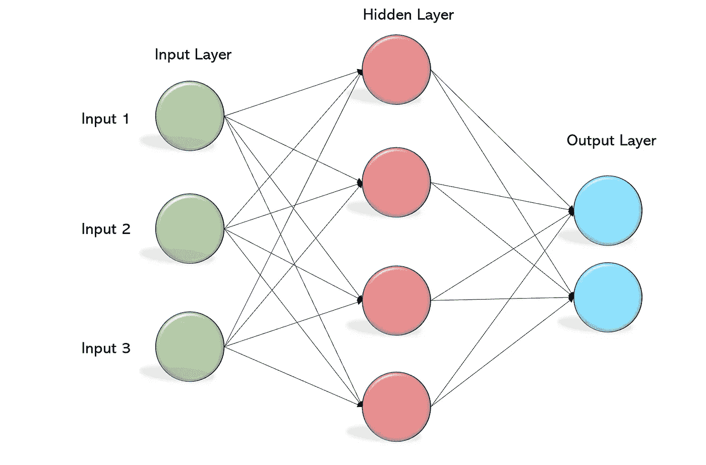
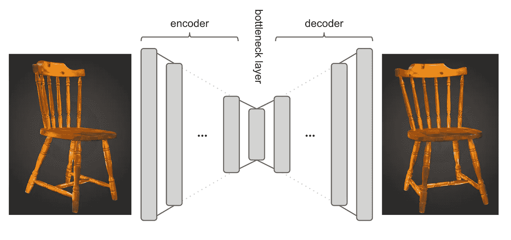
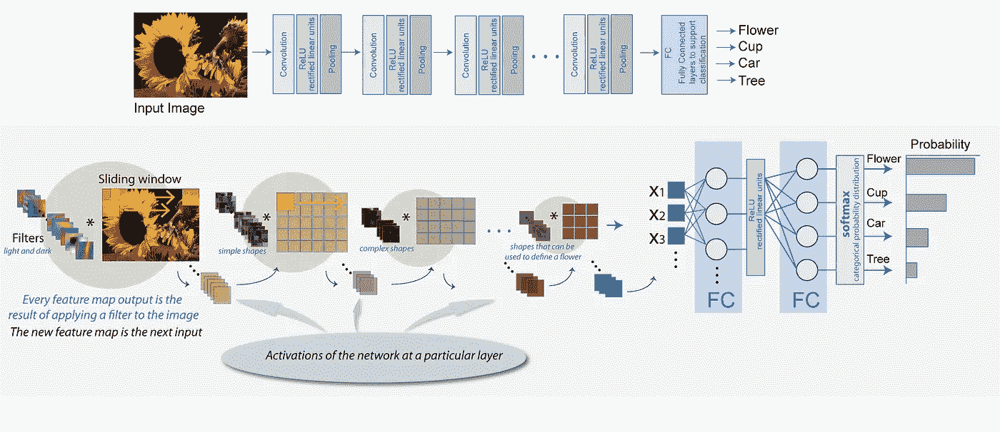
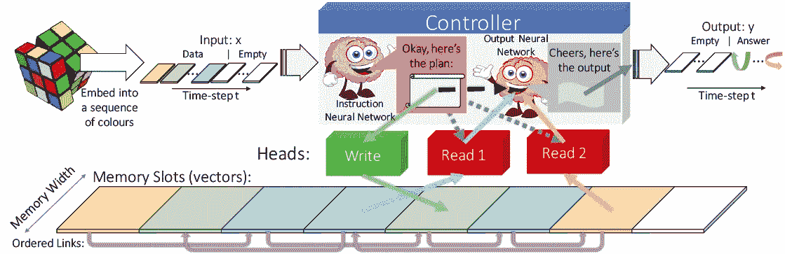
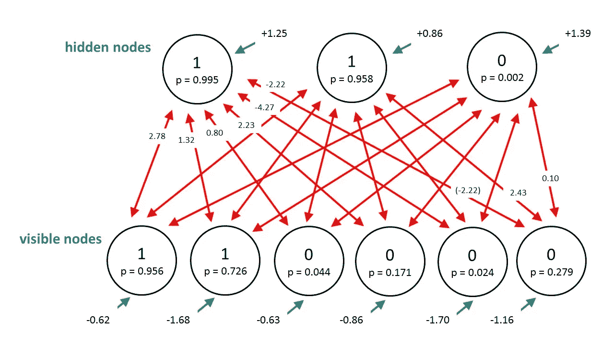
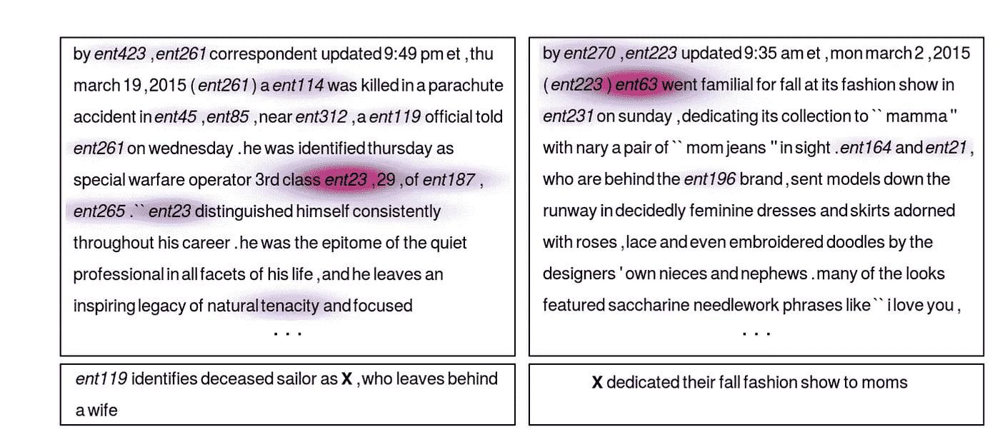
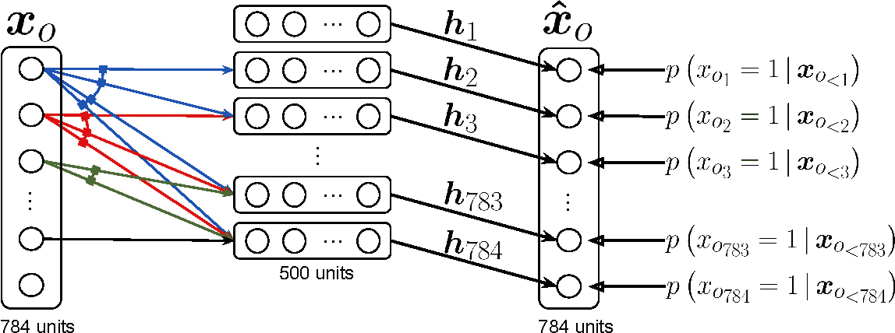
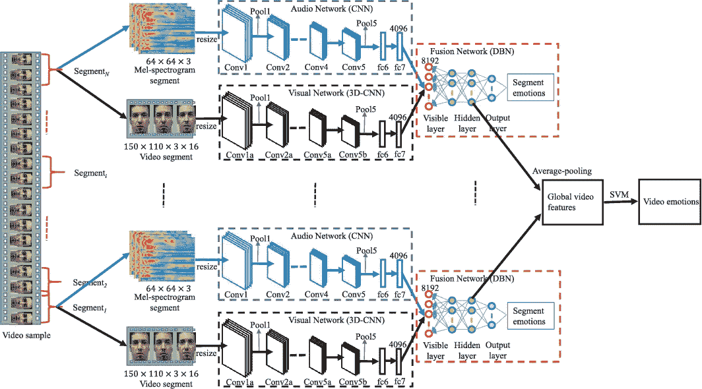

# 推荐系统系列之二:学术研究者应关注的 10 类深度推荐系统

> 原文：<https://towardsdatascience.com/recommendation-system-series-part-2-the-10-categories-of-deep-recommendation-systems-that-189d60287b58?source=collection_archive---------3----------------------->

## RecSys 系列

## 深度推荐系统的类别

***更新:*** *本文是我探索学术界和工业界推荐系统系列文章的一部分。查看完整系列:* [*第一部分*](/recommendation-system-series-part-1-an-executive-guide-to-building-recommendation-system-608f83e2630a) *，* [*第二部分*](/recommendation-system-series-part-2-the-10-categories-of-deep-recommendation-systems-that-189d60287b58) *，* [*第三部分*](/recommendation-system-series-part-3-the-6-research-directions-of-deep-recommendation-systems-that-3a328d264fb7) *，* [*第四部分*](/recsys-series-part-4-the-7-variants-of-matrix-factorization-for-collaborative-filtering-368754e4fab5) *，* [*第五部分*](/recsys-series-part-5-neural-matrix-factorization-for-collaborative-filtering-a0aebfe15883) *和*

# 介绍

近年来，基于深度学习的推荐系统的研究出版物数量呈指数级增长。特别是，国际领先的推荐系统会议 [RecSys](https://recsys.acm.org/) 从 2016 年开始定期组织深度学习研讨会。例如，在几周前在哥本哈根举行的 2019 年会议上，有一个关于深度学习的[整类论文](https://recsys.acm.org/recsys19/session-3/)，它促进研究并鼓励应用这种方法。

在这篇文章和接下来的文章中，我将介绍推荐系统的创建和训练，因为我目前正在做这个主题的硕士论文。在第 1 部分中，我提供了一个关于推荐系统的高级概述，它们是如何构建的，以及它们如何被用来改善各行各业的业务。第 2 部分很好地回顾了正在进行的关于这些模型的优点、缺点和应用场景的研究活动。这里的大部分评论来自张帅等人进行的令人难以置信的[综合调查](https://arxiv.org/abs/1707.07435)。艾尔，所以如果你想知道更多细节，请去看看！

# **为什么深度学习求推荐？**

与传统的基于内容和协作过滤的方法相比，基于深度学习的推荐系统有 4 个关键优势:

*   **深度学习可以用 ReLU、Sigmoid、Tanh 等非线性激活对数据中的非线性交互进行建模…** 这一属性使得捕捉复杂而错综复杂的用户-项目交互模式成为可能。传统的方法如矩阵分解和因式分解机本质上是线性模型。作为许多传统推荐器的基础，这种线性假设过于简单，将极大地限制它们的建模表现力。众所周知，通过改变激活选择和组合，神经网络能够以任意精度逼近任何连续函数。这一特性使得处理复杂的交互模式和精确地反映用户的偏好成为可能。
*   **深度学习可以高效地从输入数据中学习底层的解释因素和有用的表示。**一般来说，在现实世界的应用中，可以获得大量关于物品和用户的描述性信息。利用这些信息提供了一种方法来提高我们对项目和用户的理解，从而产生更好的推荐器。因此，将深度神经网络应用于推荐模型中的表示学习是一种自然的选择。使用深度神经网络来辅助表示学习的优点有两方面:(1)减少了手工特征设计的工作量；以及(2)它使得推荐模型能够包括不同种类的内容信息，例如文本、图像、音频甚至视频。
*   深度学习对于顺序建模任务来说是强大的。在机器翻译、自然语言理解、语音识别等任务中。，rnn 和 CNN 扮演着关键的角色。它们在挖掘数据序列结构方面具有广泛的适用性和灵活性。对序列信号建模是挖掘用户行为和项目演化的时间动态的一个重要课题。例如，下一件商品/购物篮预测和基于会话的推荐就是典型的应用。因此，深度神经网络非常适合这种序列模式挖掘任务。
*   **深度学习具有高度的灵活性。**现在流行的深度学习框架有很多，包括 TensorFlow、Keras、Caffe、MXnet、DeepLearning4j、PyTorch、the ano……这些工具都是模块化开发的，有活跃的社区/专业支持。良好的模块化使得开发和工程更加高效。例如，很容易将不同的神经结构结合起来，形成强大的混合模型，或者用其他模块替换一个模块。因此，我们可以轻松地构建混合和复合推荐模型，以同时捕捉不同的特征和因素。

为了提供该领域的鸟瞰图，我将根据所采用的深度学习技术的类型对现有模型进行分类。

## **1 >基于多层感知器的推荐**

MLP 是一个前馈神经网络，在输入层和输出层之间有多个隐藏层。您可以将 MLP 解释为非线性变换的堆叠图层，了解等级要素制图表达。这是一个简洁而有效的网络，可以将任何可测量的函数近似到任何期望的精度。因此，它是许多高级方法的基础，并被广泛应用于许多领域。

MLP 可以将非线性转换添加到现有的推荐系统方法中，并将其解释为神经扩展。

*   推荐可以被看作是用户偏好和项目特征之间的双向互动。例如，矩阵分解将评级矩阵分解成低维的用户/项目潜在因素。[神经协同过滤](https://arxiv.org/abs/1708.05031)是一个代表性的工作，它构建了一个双神经网络来对用户和物品之间的这种双向交互进行建模。
*   [深度因式分解机](https://arxiv.org/abs/1703.04247)是一个端到端的模型，无缝集成了因式分解机和 MLP。它可以通过深度神经网络对高阶特征交互进行建模，并通过因子分解机器对低阶交互进行建模。

使用 MLP 进行特征表示非常简单且高效，尽管它可能不如自动编码器、CNN 和 RNNs 那样有表现力。

*   [广度和深度学习](https://arxiv.org/abs/1606.07792)是一个很好的模型，可以解决回归和分类问题，最初是为了 Google Play 中的应用推荐而引入的。宽学习组件是单层感知器，其也可以被视为广义线性模型。深度学习组件是一个 MLP。结合这两种学习技术使得推荐器能够捕获记忆和概括。
*   [用于 YouTube 推荐的深度神经网络](https://ai.google/research/pubs/pub45530)将推荐任务分为两个阶段:候选生成和候选排名。候选生成网络从所有视频语料库中检索子集。排名网络基于来自候选的最近邻居的分数生成前 n 名列表。
*   [协同度量学习](https://dl.acm.org/citation.cfm?id=3052639)用欧氏距离代替矩阵分解的点积，是因为点积不满足距离函数的三角不等式。通过最大化用户和他们不喜欢的项目之间的距离和最小化用户和他们喜欢的项目之间的距离来学习用户和项目嵌入。

## **2 >基于自动编码器的建议**

AE 是一种无监督模型，试图在输出层中重建其输入数据。通常，瓶颈层用作输入数据的显著特征表示。它的几乎所有变体(表示 AE、变化 AE、连接 AE 和边缘化 AE)都可以应用于推荐任务。

*AE 可以用来学习瓶颈层的低维特征表示。*

*   [协同深度学习](https://arxiv.org/abs/1409.2944)是一种分层贝叶斯模型，将堆叠去噪自动编码器(SDAE)集成到概率矩阵分解(PMF)中。为了无缝结合深度学习和推荐模型，提出了一个通用贝叶斯深度学习框架，该框架由两个紧密相连的组件组成:感知组件(SDAE)和特定任务组件(PMF)。这使得模型能够平衡边信息和交互历史的影响。
*   [协作深度排名](https://dl.acm.org/citation.cfm?id=2990688)是针对前 n 名推荐在成对框架中专门设计的。论文表明，成对模型更适合于排行榜的生成。
*   [深度协同过滤](https://dl.acm.org/citation.cfm?id=2806527)是一个用协同过滤模型统一深度学习方法的通用框架。该框架使得利用深度特征学习技术来构建混合协作模型变得更加容易。

*AE 可以用来直接在重建层填充用户-物品交互矩阵的空白。*

*   [AutoRec](https://scinapse.io/papers/1720514416) 将用户/项目部分向量作为输入，目的是在输出层重建它们。
*   [协同去噪自动编码器](https://dl.acm.org/citation.cfm?id=2835837)主要用于排序预测。CDAE 的输入是用户部分观察到的隐式反馈，可以看作是反映用户对项目兴趣的偏好向量。本文还提出了一种负采样技术，从负集合(用户没有与之交互的项目)中采样一个小的子集，这在不降低排序质量的情况下大大降低了时间复杂度。
*   [多 VAE 和多 DAE](https://arxiv.org/abs/1802.05814) 提出了一种用于隐式数据推荐的变分自动编码器的变体。本文介绍了一种用于参数估计的原理性贝叶斯推理方法，并显示了比常用的似然函数更好的结果。

## **3 >基于卷积神经网络的推荐**

CNN 基本上是一个具有卷积层和池操作的前馈神经网络。它可以捕捉全局和局部特征，从而大大提高模型的效率和准确性。它在处理非结构化多媒体数据方面非常强大。

*CNN 可以用来从图像中提取特征。*

*   [研究视觉特征对兴趣点推荐的影响，提出一种视觉内容增强的兴趣点推荐系统。该系统通过探索视觉内容和潜在用户/位置因素之间的相互作用，采用基于概率矩阵分解的 CNN 来提取图像特征。](https://dl.acm.org/citation.cfm?id=3052638)
*   [用于图像推荐的混合表示的比较深度学习](https://arxiv.org/abs/1604.01252)提出了用于图像推荐的使用 CNN 的比较深度学习模型。该网络由两个用于图像表示学习的 CNN 和一个用于用户偏好建模的 MLP 组成。
*   [ConTagNet](https://dl.acm.org/citation.cfm?id=2984068) 是一个上下文感知标签推荐系统。图像特征由 CNN 学习。上下文表示由两层全连接前馈神经网络处理。2 个神经网络的输出被连接并被输入到 softmax 函数中，以预测候选标签的概率。

*CNN 可以用来从文本中提取特征。*

*   DeepCoNN 采用 2 个并行 CNN 对评论文本中的用户行为和项目属性进行建模。该模型利用 CNN 对评论文本丰富的语义表示，缓解了稀疏性问题，增强了模型的可解释性。它利用单词嵌入技术将评论文本映射到一个低维语义空间，同时保留了单词序列信息。然后，提取的评论表示连续通过具有不同内核的卷积层、最大池层和全连接层。
*   [卷积神经网络学习资源自动推荐技术](https://ieeexplore.ieee.org/document/7685589)构建 e-learning 资源推荐模型，使用 CNN 从学习资源的文本信息中提取项目特征，如学习材料的介绍和内容。

*CNN 可以用来从音频和视频中提取特征。*

*   [基于深度内容的音乐推荐](https://dl.acm.org/citation.cfm?id=2999907)使用 CNN 从音乐信号中提取特征。卷积内核和池层允许在多个时标上操作。这种基于内容的模型可以缓解音乐推荐的冷启动问题。
*   [用于视频理解的协作深度度量学习](https://dl.acm.org/citation.cfm?id=3219819.3219856)使用基于 CNN 的著名模型 ResNet 提取音频特征。推荐是在协作度量学习框架中执行的，类似于前面提到的 CML。

*CNN 可以应用于香草协同过滤。*

*   [基于外积的神经协同过滤](https://arxiv.org/abs/1808.03912)使用 CNN 来改进神经协同过滤。所谓的 ConvNCF 模型使用外积而不是点积来建模用户-项目交互模式。本文将细胞神经网络应用于外积结果，从而可以捕捉嵌入维度之间的高阶相关性。
*   [通过卷积序列嵌入的个性化 Top-N 顺序推荐](https://dl.acm.org/citation.cfm?id=3159656)使用 CNN 呈现顺序推荐，其中一个层次和一个垂直 CNN 用于建模联合级顺序模式和跳过行为，以进行顺序感知推荐。

*基于图的 CNN 可以处理推荐任务中的交互。*

*   [图卷积矩阵完成](https://arxiv.org/abs/1706.02263)把推荐问题看作是一个带图 CNN 的链接预测任务。这个框架可以很容易地将用户/项目方面的信息(如社交网络和项目关系)集成到推荐模型中。
*   [用于网络规模推荐系统的图形卷积神经网络](https://arxiv.org/abs/1806.01973)使用图形 CNN 在 Pinterest 上进行推荐。该模型利用随机游走和图 CNN 从图结构和项目特征信息中生成项目嵌入，非常适合大规模的 web 推荐系统。

## **4 >基于递归神经网络的推荐**

RNN 适用于对序列数据建模。它有循环和记忆来记住以前的计算。包括 LSTM 和 GRU 的 rnn 的变体被部署来克服消失梯度问题。

*在基于会话的推荐任务中，RNN 可以处理交互的时间动态和用户行为的序列模式。*

*   [GRU4Rec](https://arxiv.org/abs/1511.06939) 是一个基于会话的推荐模型，其中输入是采用 1-of-N 编码的会话的实际状态，其中 N 是项目的数量。如果相应的项目在此会话中处于活动状态，则坐标为 1，否则为 0。输出是每个项目成为会话中下一个项目的可能性。
*   网易中使用深度 R ecurrent 神经网络的个人推荐是一个现实世界电子商务网站的基于会话的推荐模型。它利用基本的 RNNs 根据点击历史来预测用户下一步会买什么。为了最小化计算成本，它只保留有限数量的最新状态，同时将较旧的状态折叠成单个历史状态。这种方法有助于平衡计算成本和预测精度之间的权衡。
*   [递归推荐网络](https://dl.acm.org/citation.cfm?id=3018689)是一个基于递归神经网络的非参数推荐模型。它可以模拟商品的季节性演变和用户偏好随时间的变化。它使用两个 LSTM 网络作为构建模块来模拟动态用户/项目状态。

*用序列模式学习边信息，RNN 也是一个不错的选择。*

*   连续时间的循环协同进化潜在特征过程提出了一个协同进化潜在模型来捕捉用户和项目潜在特征的协同进化本质。用户和项目之间的交互在驱动用户偏好和项目状态的变化中起着重要的作用。为了对历史交互进行建模，作者提出使用 RNNs 来自动学习来自用户和项目特征的漂移、进化和共同进化的影响的表示。
*   [询问 GRU](https://arxiv.org/abs/1609.02116) 提出使用 GRUs 将文本序列编码到潜在因素模型中。这种混合模式解决了热启动和冷启动问题。此外，作者采用了多任务正则化方法来防止过拟合和缓解训练数据的稀疏性。主要任务是评级预测，而辅助任务是项目元数据(例如标签、流派)预测。
*   [面向百万用户的基于嵌入的新闻推荐](https://dl.acm.org/citation.cfm?id=3098108)提出使用 GRUs 对用户浏览历史学习更具表达性的聚合，并使用潜在因素模型推荐新闻文章。与传统的基于单词的方法相比，结果显示了显著的改进。该系统已全面部署到在线生产服务中，每天为超过 1000 万独立用户提供服务。

## **5 >受限玻尔兹曼机基础推荐**

RBM 是一个两层神经网络，由一个可见层和一个隐藏层组成。它可以很容易地堆叠到深层网络中。术语*受限*表示在可见或隐藏层中没有层内通信。

*   [用于协同过滤的受限玻尔兹曼机器](https://dl.acm.org/citation.cfm?id=1273596)是第一个建立在 RBM 上的推荐模型。RBM 的可见单位仅限于二进制值，因此，评级得分以一个热码向量表示，以适应这种限制。每个用户都有一个唯一的 RBM 和一个共享参数，这些参数可以通过对比散度算法来学习。这里的本质是用户通过给出评分来暗示他们的偏好，而不管他们如何给项目评分。
*   [一个基于 RBMs 的非 IID 协同过滤框架](http://proceedings.mlr.press/v28/georgiev13.html)在一个统一的框架中结合了基于用户和基于项目的 RBM-CF。在这种情况下，可见单位由用户和项目隐藏单位共同决定。
*   [项目类别感知的条件限制波尔兹曼](https://dl.acm.org/citation.cfm?id=2959349)基于机器的推荐设计了一种混合 RBM-CF，它结合了项目特征并基于条件 RBM。这里，条件层用二进制项目类型建模，因此用不同的连接权重影响隐藏层和可见层。

## **6 >基于神经注意力模型的推荐**

注意力模型是基于输入序列或输入图像上的软内容寻址来操作的可区分的神经架构。它们受人类视觉注意力的激励，可以从原始输入中过滤掉不含信息的特征，并减少噪声数据的副作用。这种注意机制普遍存在于计算机视觉和自然语言处理领域。

在推荐系统中，我们可以利用注意力机制来过滤掉嘈杂的内容，并选择最具代表性的项目，同时提供良好的可解释性。

*   [注意力协同过滤](https://dl.acm.org/citation.cfm?id=3080797)使用注意力协同过滤模型，在潜在因素模型内有两级注意力机制。该模型包括项目级和组件级注意:其中项目级注意选择最具代表性的项目来表征用户；而组件级从多媒体辅助信息中为每个用户捕获最具信息性的特征。
*   [基于话题关注度的 LSTM 标签推荐](https://www.aclweb.org/anthology/C16-1284/)使用基于关注度的 LSTM 模型进行标签推荐。该模型利用 RNNs 和注意机制来捕捉序列属性，并识别微博帖子中的信息词。
*   [使用基于注意力的卷积神经网络的 Hashtag 推荐](https://dl.acm.org/citation.cfm?id=3061010)对微博中的同一 hashtag 推荐使用基于注意力的 CNN 模型，作为多标签分类问题处理。该模型由一个全局通道和一个局部注意通道组成:其中全局通道具有卷积和最大池层来编码所有的单词；并且本地频道具有给定窗口大小和阈值的关注层来选择信息词。

## **7 >神经自回归** **基础推荐**

神经自回归分布估计(NADE)是建立在自回归模型和前馈神经网络之上的无监督神经网络。它是一个易处理和有效的估计器，用于建模数据分布和密度，可以被认为是一个理想的替代限制玻尔兹曼机器。

根据我的评论，[协作过滤的神经自回归方法](https://arxiv.org/abs/1605.09477)是唯一一篇提出基于 NADE 的协作过滤模型(CF-NADE)的论文，该模型可以模拟用户评级的分布。

## **8 >深度强化学习** B **基于推荐**

强化学习(RL)基于试错范式，由 5 个部分组成(主体、环境、状态、动作和奖励)。深度神经网络和强化学习的结合形成了深度强化学习，它已经在多个领域(如游戏和自动驾驶汽车)实现了人类水平的性能。深度神经网络使代理能够从原始数据中获取知识，并在没有手工特征和领域试探法的情况下导出有效的表示。

传统上，大多数推荐模型认为推荐过程是静态的，这使得捕捉用户的时间意图和及时响应变得很困难。近年来，深度强化学习已经被应用到个性化推荐中。

*   [带有负面反馈的建议](https://arxiv.org/abs/1802.06501)通过成对深度强化学习提出了一种称为 DEERS 的东西，用于在顺序交互设置中提供负面和正面反馈的建议。
*   [针对页面式推荐的深度强化学习](https://arxiv.org/abs/1805.02343)探索了一个名为 DeepPage 的框架，它可以根据用户的实时操作来自适应地优化一个页面的项目。
*   [DRN:新闻推荐的深度](https://dl.acm.org/citation.cfm?id=3185994)强化学习框架是一个新闻推荐系统，它使用深度强化学习来检测新闻内容和用户偏好的动态变化，融入用户的返回模式，增加推荐的多样性。

## **9 >敌对网络** **基础推荐**

对抗网络是一种生成型神经网络，由鉴别器和生成器组成。这两个神经网络通过在极小极大博弈框架中相互竞争来同时训练。

*   [IRGAN——统一生成式和判别式信息检索模型的极小极大博弈](https://arxiv.org/abs/1705.10513)是第一个将 GAN 应用于信息检索领域的模型。具体来说，作者展示了在 3 个信息检索任务中的能力，包括网络搜索、项目推荐和问题回答。
*   [针对推荐的对抗性个性化排序](https://arxiv.org/abs/1808.03908)提出了一种对抗性个性化排序方法，该方法通过对抗性训练来增强贝叶斯个性化排序。它在最初的 BPR 目标和对手之间玩一个极大极小游戏，增加噪音或排列以最大化 BPR 损失。
*   [基于生成对抗网络的异构书目网络](https://www.semanticscholar.org/paper/Generative-Adversarial-Network-Based-Heterogeneous-Cai-Han/1596d6487012696ba400fb69904a2c372a08a2be)个性化引文推荐的表示使用基于 GAN 的表示学习方法用于异构书目网络，可以有效地解决个性化引文推荐任务。
*   [神经记忆流式推荐器](https://dl.acm.org/citation.cfm?id=3219819.3220004)具有对抗训练的网络为基于记忆网络的流式推荐器生成否定样本。

## **10 >深混动车型** **基础推荐**

利用深度神经网络的良好灵活性，可以集成许多神经构建块，以形式化更强大和更具表现力的模型。最近的研究趋势表明，混合模型应该为特定的任务进行合理和仔细的设计。

*   [协作式基于知识的嵌入](https://dl.acm.org/citation.cfm?id=2939673)将 CNN 与自动编码器相结合，以提取图像中的特征。它利用不同的嵌入技术利用结构化内容、文本内容和可视内容。
*   [使用深度神经网络的对话中的引语推荐](https://dl.acm.org/citation.cfm?id=2914734)是一种 RNNs 和 CNN 的混合模型，用于推荐引语，这需要在给定查询文本或对话的情况下生成一个排序的引语列表。它应用 CNN 从推文中学习重要的本地语义，并将它们映射到分布向量。这些向量然后由 LSTM 处理，以计算目标引用与给定推文对话的相关性。
*   [个性化关键帧推荐](https://dl.acm.org/citation.cfm?id=3080776)集成 CNN 和 RNNs 进行视频内的个性化关键帧推荐，其中 CNN 用于从关键帧图像中学习特征表示，RNNs 用于处理文本特征。
*   [用于上下文感知引用推荐的神经引用网络](https://dl.acm.org/citation.cfm?id=3080730)在用于引用推荐的编码器-解码器框架中集成了 CNN 和 RNNs。CNN 是从引用上下文中捕获长期依赖关系的编码器，而 RNNs 是在给定所有先前单词以及 CNN 获得的表示的情况下学习被引用论文标题中单词的概率的解码器。
*   [协作递归自动编码器](https://arxiv.org/abs/1611.00454)利用集成 RNNs 和去噪自动编码器来克服局限性，例如缺乏鲁棒性和缺乏对文本信息序列建模的能力。本文设计了一种称为鲁棒递归网络的广义递归神经网络，并提出了一种称为 CRAE 的分层贝叶斯推荐模型。该模型由编码和解码部分组成，并使用带有 RNNs 的前馈神经层来捕获项目内容的顺序信息。
*   [使用递归神经网络的监督强化学习用于动态治疗建议](https://arxiv.org/abs/1807.01473)将监督深度强化学习与 RNNs 相结合，用于治疗建议。该框架可以从指示信号和评估信号中学习处方策略。

# **结论**

深度学习在许多领域变得越来越流行，包括自然语言处理、图像和视频处理、计算机视觉和数据挖掘，这是一个显著的现象，因为以前没有这样一种通用的方法用于解决不同类型的计算问题。通过深度学习技术的这些方面，它们不仅能够很好地解决许多领域的复杂问题，而且还形成了这些研究领域的共享词汇和共同基础。深度学习方法甚至有助于这些子领域相互合作，而在过去，由于所用技术的多样性和复杂性，这有点成问题。

本文回顾了基于深度学习的推荐系统方法的现有文献，以帮助新的研究人员建立对该领域的全面理解，这些文献收集在张帅等人的“ [*【基于深度学习的推荐系统:调查和新观点*](https://arxiv.org/pdf/1707.07435.pdf) ”调查论文中。主要是，它根据所采用的深度学习技术的类型将当前的文献分为 10 类，我相信这有助于读者建立一个整体的理解。我强烈建议您阅读调查报告，深入了解这些类别。

*现在继续上* [*推荐系统系列第三部*](/recommendation-system-series-part-3-the-6-research-directions-of-deep-recommendation-systems-that-3a328d264fb7) *！*

*如果你想关注我在推荐系统、深度学习和数据科学新闻方面的工作，你可以查看我的* [*中的*](https://medium.com/@james_aka_yale) *和*[*GitHub*](https://github.com/khanhnamle1994)*，以及 https://jameskle.com/***的其他项目。你也可以在* [*推特*](https://twitter.com/le_james94) *，* [*直接发邮件给我*](mailto:khanhle.1013@gmail.com) *，或者* [*在 LinkedIn*](http://www.linkedin.com/in/khanhnamle94) *上找我。* [*注册我的简讯*](http://eepurl.com/deWjzb) *就在你的收件箱里接收我关于数据科学、机器学习和人工智能的最新想法吧！**