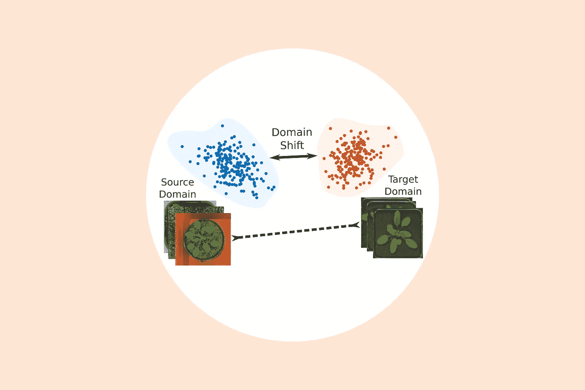
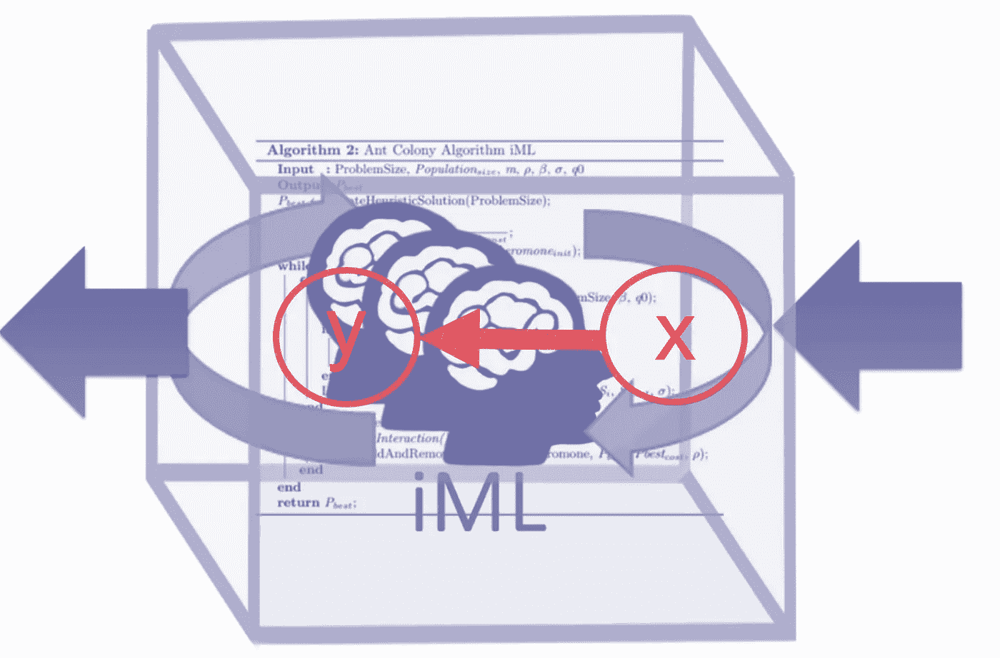
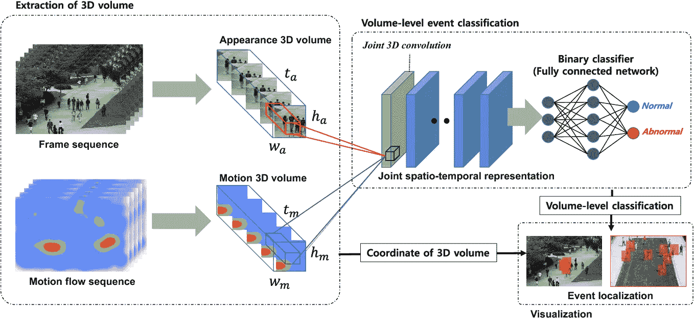

# 推荐系统系列之三:将改变游戏的深度推荐系统的 6 个研究方向

> 原文：<https://towardsdatascience.com/recommendation-system-series-part-3-the-6-research-directions-of-deep-recommendation-systems-that-3a328d264fb7?source=collection_archive---------12----------------------->

## RecSys 系列

## 推荐社区的研究方向

***更新:*** *本文是我探索学术界和工业界推荐系统系列文章的一部分。查看完整系列:* [*第一部分*](/recommendation-system-series-part-1-an-executive-guide-to-building-recommendation-system-608f83e2630a) *，* [*第二部分*](/recommendation-system-series-part-2-the-10-categories-of-deep-recommendation-systems-that-189d60287b58) *，* [*第三部分*](/recommendation-system-series-part-3-the-6-research-directions-of-deep-recommendation-systems-that-3a328d264fb7) *，* [*第四部分*](/recsys-series-part-4-the-7-variants-of-matrix-factorization-for-collaborative-filtering-368754e4fab5) *，* [*第五部分*](/recsys-series-part-5-neural-matrix-factorization-for-collaborative-filtering-a0aebfe15883) *和*

## **简介**

在过去的几年里，我们已经看到推荐领域发生了巨大的变化，从传统的矩阵分解算法(2009 年 c.f. Netflix 奖)转向了最先进的基于深度学习的方法。目前，我正在一家做视频推荐的初创公司实习，我可以清楚地看到这种运动背后的主要原因:

1.  来自用户的信号(例如视图)不是独立分布的观察，而是可以表示为动作序列。使用递归神经网络(RNN)有效地理解和建模这些序列是提高视频推荐系统准确性的关键。
2.  视频通常由特征(视频的类别、描述标签)来表征，这些特征可用于导出视频之间的相似性。此外，手表的背景(设备、国家……)对于定制推荐至关重要。在深度学习模型中使用它们作为特征实现了更快的收敛，而且在给定视频没有用户信号可用的冷启动机制中也有帮助。
3.  反馈(观看)只能在给定的视频上观察到，当视频已经显示给用户时(强盗反馈)。因此，我不知道如果我为某个用户选择了其他视频会发生什么(反事实推理)。在这种类型的环境中学习需要特殊的范例，例如*偏离策略学习或反事实学习*，这在强化学习中已经被大量使用。最近，一些作品一直在研究这些环境中基于“深度学习”的模型。

在这篇文章和接下来的文章中，我将介绍推荐系统的创建和训练，因为我目前正在做这个主题的硕士论文。在[第 1 部分](/recommendation-system-series-part-1-an-executive-guide-to-building-recommendation-system-608f83e2630a)中，我提供了推荐系统的高层次概述，它们是如何构建的，以及它们如何被用来改善跨行业的业务。在[第 2 部分](/recommendation-system-series-part-2-the-10-categories-of-deep-recommendation-systems-that-189d60287b58)中，我提供了一个关于这些模型的优势和应用场景的正在进行的研究计划的很好的回顾。第 3 部分将通过提出几个可能与推荐系统学者社区相关的研究方向来解决使用基于深度学习的推荐模型的局限性。

## **弊端**

*使用深度神经网络进行推荐有哪些弊端？*

根据我的研究，有 3 个主要问题:

(1)深度学习的一个常见异议是隐藏的权重和激活**难以解释**。众所周知，深度学习的行为像黑盒一样，提供可解释的预测似乎是一项非常具有挑战性的任务。

(2)深度学习还需要**大量数据**来完全支持其丰富的参数化。与视觉和语言等其他领域相比，在推荐系统研究的背景下很容易收集大量数据。

(3)深度学习需要**大范围的超参数调优，**其中是一般机器学习的通病。

为了解决这些问题，最近出现了各种各样的研究计划，在这篇文章中，我将介绍其中的 6 个。

## **1 —评估方法**

在阅读了 RecSys 会议上最近发表的大量文献后，我注意到基线模型和评估数据集的选择相当随意，取决于作者。这方面的一个大问题是分数报告中明显的不一致性，这使得新模型的相对基准极具挑战性。

为什么没有 [MNIST](http://yann.lecun.com/exdb/mnist/) 或者 [ImageNet](http://www.image-net.org/) 等同于推荐系统？最常用的数据集好像是[movie lens](https://grouplens.org/datasets/movielens/)；然而，即使在这种情况下，训练和测试分离也是任意的。此外，无法控制推荐系统结果中测试样本的难度(随机、按时间顺序等)。)如果没有设计测试集的适当标准，估计和测量该领域的进展将是一个挑战。

## **2 —大规模设置的可扩展性**

可扩展性对于推荐系统在行业环境中的有用性至关重要。为此，通过探索以下问题，推荐模型肯定会更有效:

*   针对非静态和流式数据(大量传入用户和项目)的增量学习
*   高维张量和多媒体数据源的计算效率
*   随着模型参数呈指数增长，平衡复杂性和可伸缩性

一个有前途的研究领域是[使用压缩技术](https://arxiv.org/abs/1706.03993)来压缩高维输入数据的嵌入空间，这样可以减少模型学习过程中的计算时间。另一个有前途的方法是[提取知识](https://arxiv.org/abs/1809.07428)来学习推荐系统中用于推理的紧凑模型。关键的概念是训练一个小的学生模型，从一个大的教师模型中吸收知识。

## **3 —多任务学习**

[多任务学习](https://ruder.io/multi-task/)是一种同时解决多个学习任务，同时利用不同任务之间的共性和差异的方法。它已经成功地用于许多计算机视觉和自然语言处理任务。最近的一些作品也将这种技术应用于推荐系统:

*   [询问 GRU:深度文本推荐的多任务学习](https://arxiv.org/abs/1609.02116)提出了一种利用深度递归神经网络将文本序列编码为潜在向量的方法，该潜在向量是在协同过滤任务上端到端训练的特定门控递归单元(GRUs)。对于科学论文推荐的任务，这产生了具有显著更高准确度的模型。
*   [神经生存推荐器](https://cseweb.ucsd.edu/classes/fa17/cse291-b/reading/p515-jing.pdf)提出了一个基于长短期记忆的模型，以估计用户何时会返回网站，以及他们未来的收听行为。这样做的目的是解决及时推荐的问题，即在正确的时间推荐正确的项目。它使用生存分析中的工具进行返回时间预测，并使用指数族进行未来活动分析。
*   [为](https://arxiv.org/abs/1708.00154)推荐生成抽象提示的神经评分回归提出了一个基于深度学习的框架，名为 NRT，它可以同时预测精确评分并生成具有良好语言质量的抽象提示，模拟用户对电子商务网站的体验和感受。对于抽象提示生成，使用门控递归神经网络将用户和项目的潜在表示“翻译”成简洁的句子。
*   [扩展的自动编码器推荐框架及其在电影推荐中的应用](https://ieeexplore.ieee.org/document/7916236)采用堆叠式自动编码器提取输入的特征，然后重构输入进行推荐。然后在框架中融合项目和用户的边信息，并使用基于 Huber 函数的正则化来提高推荐性能。

使用基于多任务学习的深度神经网络有许多优点。它有助于通过概括共享的隐藏表示来防止过度拟合。它为解释建议提供了可解释的输出。它隐式地增加了数据，从而缓解了稀疏性问题。最后，我们可以部署跨领域推荐的多任务学习，每个特定的任务为每个领域生成推荐(见下一节)。

## **4 —域适配**

单领域推荐系统只关注一个领域，忽略了用户在其他领域的兴趣，大大加剧了稀疏性和冷启动问题。这些问题的一个切实可行的解决方案是应用领域适应技术，其中模型由从源领域学到的知识来辅助。在这种情况下，一个非常受欢迎和研究充分的主题是迁移学习，它可以通过使用从其他领域转移的知识来改进一个领域的学习任务。一些现有的工作表明了深度学习在捕捉不同领域的共性和差异以及在跨领域平台上生成更好的建议方面的功效。

*   在“[推荐系统中跨域用户建模的多视图深度学习方法](https://dl.acm.org/citation.cfm?id=2741667)中，微软研究人员提出了一种基于内容的推荐系统，以解决推荐质量和系统可扩展性两方面的问题。他们使用深度学习方法将用户和项目映射到潜在空间，在该空间中，用户和他们偏好的项目之间的相似性最大化，根据他们的 web 浏览历史和搜索查询，使用丰富的功能集来表示用户。他们还展示了如何通过减少输入的维度和训练数据的数量来使这种基于丰富特征的用户表示可扩展。将不同领域组合到单个学习模型中有助于提高所有领域的推荐质量，以及具有更紧凑和语义更丰富的用户潜在特征向量。
*   在“[一个用于跨领域推荐系统的内容增强的协同过滤神经网络](https://dl.acm.org/citation.cfm?id=3054207)”中，微软研究人员提出了一个名为 CCCFNet 的跨领域推荐系统，它可以在一个统一的框架中结合协同过滤和基于内容的过滤，从而克服数据稀疏性问题。

在我看来，这是一个很有前途的研究方向，但对于推荐系统的研究来说，仍然没有得到充分的开发。

## **5 —可解释性和可解释性**

反对深度学习的一个常见论点是，神经网络高度不可解释。因此，基于深度神经网络做出可解释的推荐似乎非常具有挑战性。可解释的深度学习的重要性主要体现在两个方面。

*   第一是向用户做出可解释的预测，让他们理解网络推荐背后的因素。[用于评论评级预测的具有双重局部和全局注意力的可解释卷积神经网络](https://dl.acm.org/citation.cfm?id=3109890)提出使用具有双重局部和全局注意力的卷积神经网络(CNN)对用户偏好和项目属性进行建模，这是由 CNN 在提取复杂特征方面的优势所激发的。通过使用来自用户的聚合评论文本和项目的聚合评论文本，他们的模型可以学习每个用户和每个项目的独特特征(嵌入)。这些特征然后被用于预测评级。
*   第二是通过探查权重和激活来了解更多关于模型的信息。[潜在关系度量学习通过基于记忆的注意力进行协作排序](https://arxiv.org/abs/1707.05176)提出了一种称为潜在关系度量学习的模型，该模型可以学习描述每个用户-项目交互的潜在关系。这有助于减轻现有度量学习方法的潜在几何不灵活性。这不仅实现了更好的性能，还实现了更大程度的建模能力，允许他们的模型扩展到更大数量的交互。

最近，注意力模型在缓解神经模型的不可解释性方面做出了很大贡献。例如，[注意力因子分解机器](https://arxiv.org/abs/1708.04617)通过神经注意力网络从数据中学习每个特征交互的重要性。注意力权重不仅给出了关于模型内部工作的见解，还能够向用户提供可解释的结果。一般来说，注意力模型既可以提高性能，又可以提供简洁的解释，这进一步推动了它在基于深度学习的推荐系统中的使用。

值得注意的是，模型的可解释性和可解释性强烈依赖于应用领域和内容信息的使用。因此，一个有前途的研究方向将是设计更好的注意机制，例如——会话或生成解释。

## **6 —联合学习框架**

做出准确的推荐，需要对物品特性以及用户的实际需求和喜好有深刻的理解。例如，上下文信息可以根据用户的环境和周围环境定制服务和产品，这有助于缓解冷启动问题。隐式反馈可以表明用户的隐式意图，并补充显式反馈(这是一项资源要求很高的任务)。这种隐式反馈可以从社交媒体和物理世界中收集，深度学习可以处理这些数据源，同时带来更多机会来推荐具有非结构化数据(如文本、视觉、音频和视频特征)的多样化项目。

此外，深度学习可以极大地帮助自动化特征工程，这目前需要在推荐研究社区中进行人工干预。还有一个额外的优势是，在野外从自由文本、图像或数据中学习表示，而不必设计复杂的特征工程管道。

最近一个叫做[联合表示学习](https://dl.acm.org/citation.cfm?id=3132892)的框架能够学习用户和物品的多模态表示。在该框架中，采用每种类型的信息源(评论文本、产品图像、数字评级等)来基于可用的(深度)表示学习架构学习相应的用户和项目表示。来自不同来源的表示与一个额外的层集成，以获得用户和项目的联合表示。最后，使用成对学习将每个源和联合表示作为一个整体来训练，以对前 N 个推荐进行排序。通过将用户和项目表示为离线嵌入，并使用简单的向量乘法进行在线排名得分计算，与学习复杂预测网络进行在线计算的推荐的其他深度学习方法相比，JRL 还具有快速在线预测的优势。因此，另一个有前途的研究方向是在端到端的管道中设计更好的归纳偏差，这可以对不同模态的数据进行推理，以获得更好的推荐性能。

## **结论**

深度学习在计算机科学的所有子领域都变得越来越流行，例如自然语言处理、图像和视频处理、计算机视觉和数据挖掘，这是一个值得注意的现象，因为以前没有这样一种通用的方法用于解决不同类型的计算问题。通过深度学习技术的这一方面，它们不仅能够在许多领域中修复复杂的问题，而且还形成了这些研究领域的共享词汇和共同基础。深度学习方法甚至有助于这些子领域相互合作，而在过去，由于所用技术的多样性和复杂性，这有点成问题。

尽管深度学习在推荐系统领域的应用有望取得重大和令人鼓舞的成果，但可解释性和可扩展性等挑战仍有待改进，并保证未来的工作。就个人而言，我对用于推荐商品的领域适应技术非常感兴趣，并希望看到 RecSys 的 ImageNet 时刻。请继续关注本系列未来的博客文章，深入了解这些模型如何工作的本质细节。

*现在继续上* [*推荐系统第四部*](/recsys-series-part-4-the-7-variants-of-matrix-factorization-for-collaborative-filtering-368754e4fab5) *！*

*如果你想关注我在推荐系统、深度学习和数据科学新闻方面的工作，你可以查看我的*[*Medium*](https://medium.com/@james_aka_yale)*和*[*GitHub*](https://github.com/khanhnamle1994)*，以及 https://jameskle.com/**的其他项目。也可以在* [*推特*](https://twitter.com/le_james94) *，* [*直接发邮件给我*](mailto:khanhle.1013@gmail.com) *，或者* [*在 LinkedIn*](http://www.linkedin.com/in/khanhnamle94) *上找我。* [*注册我的简讯*](http://eepurl.com/deWjzb) *就在你的收件箱里接收我关于数据科学、机器学习和人工智能的最新想法吧！***