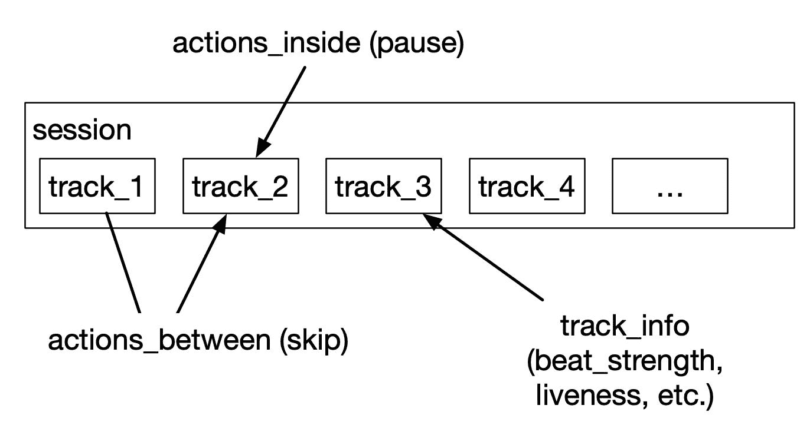
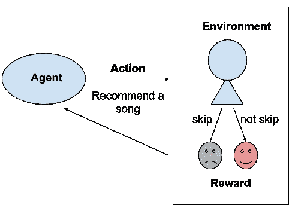
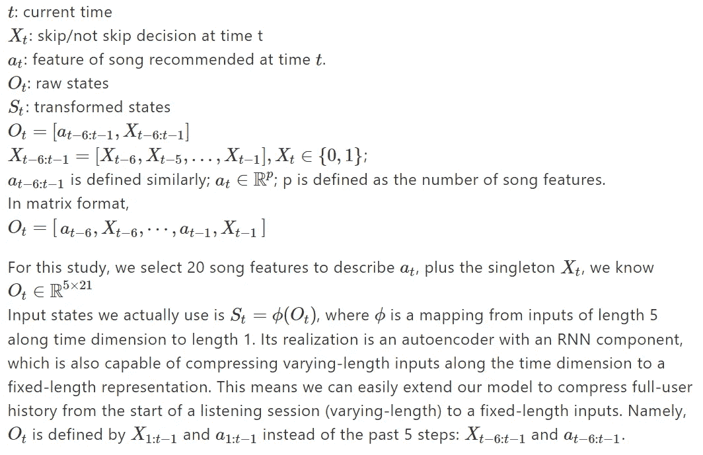
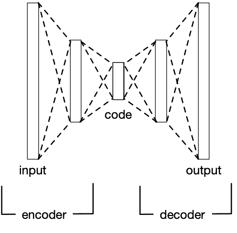
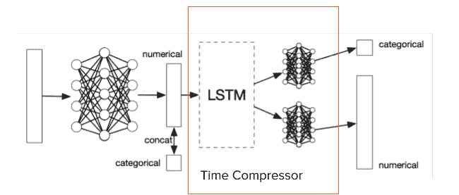
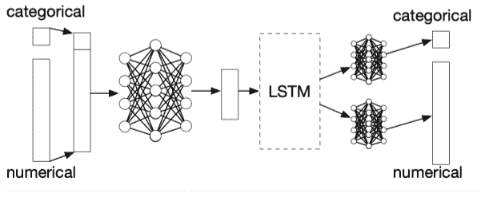
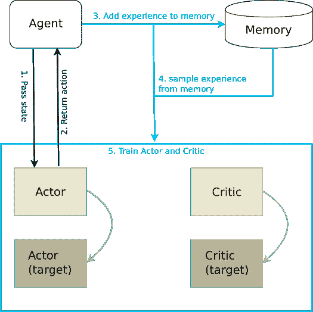
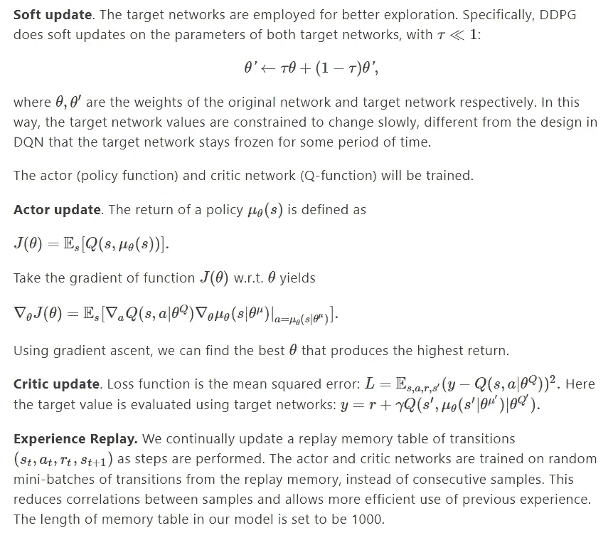
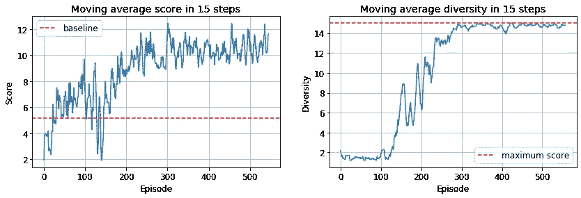

# 具有强化学习的推荐系统

> 原文：<https://towardsdatascience.com/recommendation-system-with-reinforcement-learning-3362cb4422c8?source=collection_archive---------5----------------------->

## 哈佛数据科学顶点项目，2019 年秋季

**团队成员**:赵小菲，，钱丰

对于 Spotify 等服务提供商来说，推荐系统可能是一项至关重要的竞争优势，因为 Spotify 主要通过用户订阅来发展业务。准确的推荐有助于改善用户体验，增强客户忠诚度。

传统的推荐方法包括使用监督学习对用户-项目交互进行建模，如分类、基于记忆的用户历史内容过滤等等。这些想法忽略了连续时间步的依赖性。受强化学习在其他领域(如玩 Atari 游戏)的进展的启发，我们应用了一种最先进的模型，即深度确定性梯度策略(DDPG)，将音乐推荐建模为一个顺序决策过程。在这个设置中，DDPG 学习者的动作是从一个巨大的库中选择的一首歌曲。通过使用一组连续特征来表示每首歌曲，并随后将动作空间从离散扩展到连续，我们的代理成功地扩大了它可以容纳的候选歌曲的数量，同时保持了令人满意的推荐准确性和多样性。

# 数据

我们使用[“音乐流会话数据集”(MSSD)](https://arxiv.org/abs/1901.09851) ，最初是由 Spotify 为一项比赛发布的。数据集包含收听会话数据和歌曲特征的查找表。

## 数据结构

上面是我们现有数据的结构图。我们有两个数据文件:一个文件包含多行会话，另一个文件包含多行轨迹要素。曲目是歌曲，会话是单个用户收听的一系列曲目。Spotify 将会话的最大长度限制为 20。

在会话内部，记录轨迹之间和轨迹内部的动作。曲目之间的动作包括:skip_very_briefly、skip_briefly、mostly _ played _ before _ skip、no_skip，指示用户从一个曲目转移到下一个曲目的模式。一首歌内的动作主要有 move_forward、move_backward、no_move，表示用户在听一首曲目时的行为；以及指示用户暂停行为的 no_pause_before_play、short_pause_before_play、long_pause_before_play。上述响应可以被解释为每个音轨上的用户偏好。

我们也有每个曲目的特征数据，这些特征由 Spotify 通过手动或自动方式给出。这些特征包括声音、节拍、舞蹈性等。并且在[0，1]之间变化。我们可以将这些特性整合到我们的模型中。

## 数据采样

MSSD 是一个巨大的数据集，有超过 2000 万首歌曲和 1700 万个会话，包括大约 600 GB 的数据。为了使我们的模型适应这个数据集，我们选取了歌曲和会话的子集，如下所述。

要选择 MSSD 的一个子集，我们需要执行以下操作:首先，我们对会话数据进行采样，然后，我们对会话跟踪数据进行采样。在原始数据中，我们决定从数据中抽取 10 万个会话作为样本。由于数据被分成 10 个大小相似的 zip 文件，我们需要从每个 zip 文件中抽取 1 万个会话作为样本。每个 zip 文件由 N 个数据文件组成，因此我们需要从每个数据文件中抽取 10k/N 千个会话。由于每个数据文件包含不同数量的会话，我们需要以不同的概率从每个数据文件中进行采样。例如，如果数据文件$ f1 $中有$M$个会话，我们以 10k/NM 的概率随机接受文件 f1 中的每个会话。

在对所有会话进行采样后，我们需要找出出现在采样数据中的所有轨迹。如果数据的大小很小，这可能很容易:我们可以使用一组数据结构来找到一组轨道 id。然而，由于数据的大小太大，无法存储在内存中，我们决定使用数据库(Macbook Air 2014 上的 Mysql)来让数据库为我们维护树结构。使用数据库，我们可以很容易地找到我们需要的曲目。

我们从 300 多个数据文件中统一采样，并将数据减少到 106，375 个会话(376MB)和 281，185 个磁道(167MB)。

# 模型概述

强化学习模型有以下组成部分:主体、环境、状态、奖励函数、价值函数和政策。为了简化问题，我们假设一个假想的用户，他的经验来自所有实际用户。我们的推荐器模型将成为系统的**代理**,为这个假设的用户处理歌曲，跳过/不跳过推荐。用户表现为系统的**环境**，根据系统的**状态**响应系统的建议。用户反馈决定了我们的**奖励**，即只有用户不跳过才得一分。行动的代理人是宋推荐的。我们的状态被定义为过去 5 个步骤的歌曲特征和相应的用户反应，不包括当前步骤。所以，反馈和行动一起给了我们下一个状态。代理的目标是学习一个**策略**，在 15 个步骤中最大化累积奖励。我们将预测的长度设置为 15，以避免冷启动，也就是说，在没有足够的历史记录时进行预测，假设我们的原始会话长度为 20，历史记录长度为 5。

更正式地说，数学定义如下:

Model Pipeline

# 自动编码器

## 概观

我们的数据首先通过一个由两部分组成的自动编码器:一个数字压缩器和一个时间压缩器。每个数据点最初是 5×21，对应于 5 首歌曲的 20 个歌曲特征和观察到的用户动作(跳过/不跳过)。我们用前馈自动编码器压缩 20 首歌曲特征，该编码器将输入转换成 5×8。我们在最后将用户响应连接起来，得到这个 5 x 9。然后，我们将该潜在表示输入到 LSTM 自动编码器，该编码器沿着时间维度压缩成 1×9 维度的单个向量。

## 履行

在训练过程中，我们首先构建一个自动编码器，并在歌曲特征数据集上对其进行训练。

然后我们固定编码层和解码层，并用 LSTM 时间压缩器连接它们。编码层负责预处理数字特征，解码层负责将时间解码器的输出扩展到最大长度。

时间压缩器尝试将 5 x 9 输入压缩为 1 x 9，然后解码为 5 x 9。为了适应混合型数据，我们使用两个时间解码器，一个使用 MSE 损失来恢复数值，另一个使用交叉熵损失来恢复二进制用户跳过行为。最终损失是这两个损失的线性组合，分配的权重影响这两个任务中的模型性能。尽管使用了两个解码器，它们共享一个长度为 9 的潜在表示作为输入。在预测过程中，增加了一个步骤，即数值解码器获取时间解码器的输出，并恢复数值特征的原始维数。

## 可能的延期

以前的“数字压缩器”不是只压缩数字特征，而是压缩歌曲特征和二进制用户响应，为了与“数字压缩器”相区别，我们称之为“组合压缩器”。通过从我们的时间压缩器中释放压缩分类响应的负担，可以进一步改进这种结构。在这个项目中，我们必须将组合压缩器与时间压缩器连接起来。

## 结果

Table 1: Results of the autoencoders

我们的数字特征被标准化为在 0 到 1 之间。从 1×9 潜在值重构 5×20 的 MSE 是 0.0111，大约是特征范围的 1%。重构二元用户行为的准确率为 88.89%。训练数值压缩器的 MSE 是 0.0016。所有统计数据都是在测试集上计算的。最后两行是实验组合压缩机的性能统计。实验性组合压缩器具有在测试集上检索二进制用户跳过行为一次的准确度，以及在 0.0064 处略微增加的数值重构 MSE。

# 强化学习

## 结构

*   **状态**:时间压缩器的潜在向量。长度为 9 的状态包含前五首歌曲的信息和相应的用户响应。
*   **动作**:数值压缩器的潜在向量。动作是推荐歌曲。为了降低维数，我们使用长度为 8 的歌曲特征的潜在表示。
*   **奖励**:不跳概率和推荐多样性之和。

*   **代理**:策略功能和 Q 功能。

## 环境

当给定一对状态和动作时，环境理应回报。然而，在这个问题中，我们无法观察到实时的用户响应。我们要做的是使用现有的数据来估计跳过/不跳过行为。

## 深度确定性政策梯度

DDPG(Deep Deterministic Policy Gradient)是深度确定性政策梯度(Deep Deterministic Policy Gradient)的缩写，是一种无模型的政策外行动者批评算法，结合了 DPG 和 DQN。最初的 DQN 在离散空间中工作，DDPG 在学习确定性政策的同时，用演员-评论家框架将其扩展到**连续行动空间**。

该算法中有四个神经网络:演员、评论家、演员目标和评论家目标。行动者网络学习策略函数，而批评家网络近似 Q 函数。

## 结果

由于我们的模型需要前五首歌曲的信息，代理将为每个会话提供 15 个推荐。因此我们每集跑 15 步。

推荐系统可以从我们截断的音乐会话中累积的最高分数是 15。不跳过行为占据了整个数据的 34%,相当于基准分数 5 左右。正如我们从左图中看到的，在仅仅几百集的训练中，我们的代理达到了大约 11 的分数，展示了比基准好得多的性能。右边是多样性得分。如果当前动作和前一个动作之间的距离超过某个阈值(0.4 倍标准差)，我们得到的多样性得分为 1，否则为 0。这是为每一步计算的，因此最高分也是 15。从剧情可以看出，一开始我们的经纪人倾向于推荐类似的歌曲。但在大约 300 集之后，它学会了考虑推荐的多样性。

# 结论

在这个项目中，我们成功地使用强化学习来捕捉用户-歌曲交互以及当前和过去决策之间的时间依赖性。未来的研究可以通过放宽许多简化的假设来扩展我们的发现:首先，不是假设一个单一的假设用户，而是进行客户分层，并将这一变量纳入模型。第二，我们可以考虑自会话开始以来的完整用户历史，而不是在五点截断历史。此外，我们可以通过将实验组合压缩器连接到时间压缩器和下游 DDPG 代理来测试它是否优于当前模型。

在训练方面，由于计算资源和时间的限制，我们正在分别训练不同的模型组件。这将是一个好主意，训练模型端到端，使潜在的可能更适合强化学习任务。最后，在我们研究的基础上，可能最重要的改进是为强化学习代理提供一个真实的环境。我们当前的数据集高度偏向于跳过行为(未跳过率为 34%)，可能无法反映真实的客户行为。因此，与使用数据集(600G)模拟环境不同，让模型投入生产的更好方法是招募一些参与者来测试他们对建议的反应。这样代理可以充分挖掘推荐空间，做出更可信的推荐。

# 承认

我们要向 Javier Zazo 致以最诚挚的谢意，他是我们的导师，强化学习方面的专家，也是我们的好朋友，他总是给我们提出宝贵的建议，鼓励我们继续前进。297R 研究项目的负责人 Pavlos Protopapas，使这一难忘的研究之旅成为可能的导师，以及 Spotify 高级研究员兼数据科学家 Aparna Kumar，一位出色的支持经理。

该研究项目隶属于 [IACS 297R 研究项目](https://www.capstone.iacs.seas.harvard.edu/)。

*原载于*[*https://sophieyanzhao . github . io*](https://sophieyanzhao.github.io/AC297r_2019_SpotifyRL/2019-12-14-Spotify-Reinforcement-Learning-Recommendation-System/)*。*