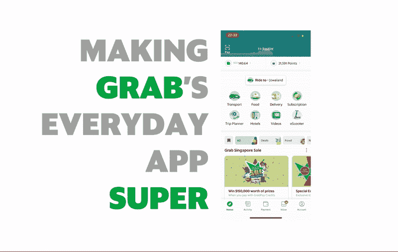
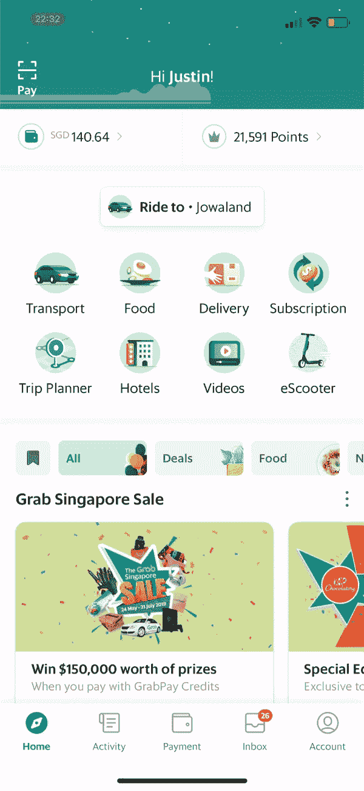
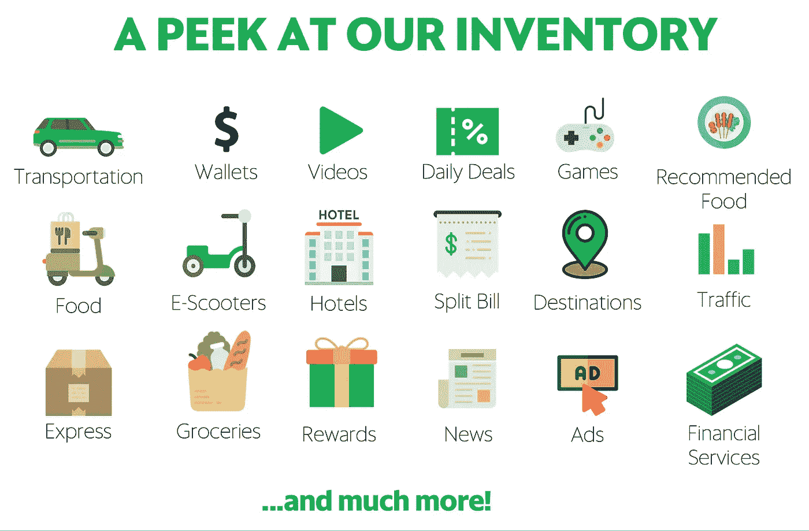
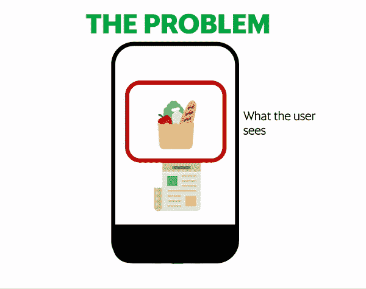
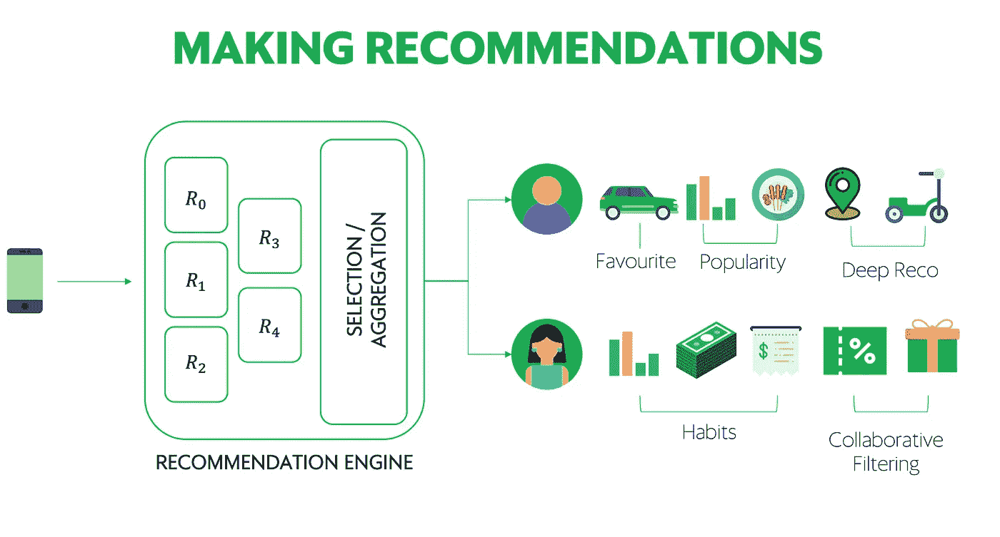

# 大规模推荐系统——让 Grab 的日常应用变得超级棒

> 原文：<https://towardsdatascience.com/recommendation-systems-at-scale-making-grabs-everyday-app-super-4762c5ad162?source=collection_archive---------10----------------------->

> 这篇文章最初发表在[这里](https://engineering.grab.com/grab-everyday-super-app)作为 [Grab 的工程博客](https://engineering.grab.com/)的一部分。来看看我们更多的精彩作品吧。

Grab 是[东南亚领先的 superapp](https://www.grab.com/sg/blog/welcome-to-our-everyday-super-app/) ，提供高使用率的日常服务，如打车、送餐、支付等等。我们的目标是让人们更好地获得对他们来说重要的服务，提供更多价值和便利，因此我们一直在扩展我们的生态系统，以包括账单支付、酒店预订、旅行规划和视频，未来还会有更多。我们希望为我们的客户提供更好的服务——不仅仅是通过将 Grab 应用程序与有用的功能和服务打包，而是通过为他们每个人提供独一无二的个性化体验。

为了实现我们的超级应用雄心，我们与[合作伙伴](https://www.grab.com/sg/press/consumers-drivers/grab-introduces-four-new-services-in-singapore-in-its-super-app/)合作，他们和我们一样，希望帮助推动东南亚向前发展。

我们与合作伙伴的许多协作工作都可以在 Grab Feed 中看到。在这里，我们以聚合的方式传播关于 Grab 和我们合作伙伴的各种类型的内容，为整体用户体验增加价值。这是提要的样子:

Waiting for the next promo? Check the Feed.
Looking for news and entertainment? Check the Feed.
Want to know if it’s a good time to book a car? CHECK. THE. FEED.

随着我们继续向 Grab Feed 添加更多的卡片、服务和大量内容，我们的用户可能会发现更难找到与他们相关的信息。因此，我们努力确保我们的平台能够根据最适合用户的资料来区分和显示信息。这又回到了我们一直以来关注的焦点——客户，这也是我们如此重视为每个客户提供个性化的 Grab 体验的原因。

为了在像东南亚这样高度多样化的市场中脱颖而出，我们利用我们数据的深度来了解用户想要看到什么样的信息以及他们应该在什么时候看到这些信息。在本文中，我们将讨论 Grab Feed 的推荐逻辑和策略，以及它的未来路线图。

# 启动你的引擎

We offer a lot of great services.

我们在这里试图解决的问题被称为[建议](https://en.wikipedia.org/wiki/Recommender_system)问题。简单来说，这个问题是关于推断消费者向其推荐内容和服务的偏好。在 Grab Feed 中，我们有不同类型的内容，我们希望向不同类型的消费者展示，我们的挑战是确保每个人都能获得高质量的内容。

为了解决这个问题，我们建立了一个推荐引擎，这是一个建议用户应该考虑消费的内容类型的系统。为了提出建议，我们需要了解三个因素:

1.  **用户**。根据用户如何使用 Grab 应用，我们可以推断出很多关于用户的信息，例如他们乘坐的次数，他们喜欢点的食物类型，他们购买的电影优惠券，他们玩过的游戏，等等。这些信息让我们有机会更好地了解用户的偏好，使我们能够将他们的个人资料与相关和合适的内容相匹配。
2.  **物品**。这些都是内容的特点。我们考虑内容的类型(例如视频、游戏、奖励)和可消费性(例如购买、观看、兑换)。我们还考虑其他元数据，如商家的营业时间、奖励积分和兴趣点的 GPS 坐标。
3.  **语境**。这与用户消费我们内容的环境有关。它可以是一天中的时间、用户的位置或者当前的提要类别。

使用来自所有这些因素的信号，我们建立一个模型，向用户返回一组排序的卡片。在接下来的几节中会有更多的介绍。

# 了解我们的用户

从上述信号中解读用户偏好本身就是一个挑战。这里需要注意的是，我们一直处于实验状态。缓慢但肯定的是，我们正在继续微调如何测量内容偏好。也就是说，我们关注两个领域:

1.  **动作**。我们坚信，并非所有的互动都是平等的。喜欢一张牌其实就代表你喜欢吗？你喜欢事物的速度和你的朋友一样吗？交易呢，那些更受青睐？提要为用户向平台提供反馈引入了许多方法。这些事件包括喜欢、点击、滑动、浏览、交易和行动号召。
    根据不同的型号，我们可以采取稍微不同的方法。我们可以了解每个事件的重要性，并将它们聚合起来以获得预期的评级，或者我们可以预测每个事件的概率并据此进行排名。
2.  **新近度**。旧的交互可能没有新的有用。提要是一个不断发展的产品，我们用户的偏好也是如此。未能衰减旧交互的权重会给我们提供对用户不再有意义的推荐。

# 优化体验

An overview of our recommendation strategy architecture

构建一个可行的推荐引擎需要几个阶段。通过迭代工作，我们能够创建一些核心推荐策略来产生最终模型，以确定内容与用户的相关性。我们将在这一部分讨论每个策略。

1.  **人气**。这种策略被称为趋势推荐。我们在一个滚动的时间窗口内捕获在线点击流事件，并汇总这些事件，向用户展示在那个时间点每个人都喜欢什么。倾听群众通常是一种有效的策略，但是这种特殊的策略还可以通过为新的 feed 用户提供建议来帮助我们解决冷启动问题。
2.  **用户最爱**。我们知道我们的用户有不同的品味，用户会比其他用户有更多的内容。在这个策略中，我们捕捉到了个人参与度和用户不断变化的偏好。
3.  **协同过滤**。构建我们的日常超级应用的一个关键目标是让用户体验不同的服务。为了实现可发现性，我们研究相似的用户，以发现他们可能拥有的一组相似的偏好，然后我们可以使用这些偏好来指导我们向其他用户展示什么。
4.  **习惯性行为**。有时用户只想做一件特定的事情，我们不希望他们只是为了做这件事而一直向下滚动。我们已经建立了习惯性的建议来解决这个问题。因此，如果用户总是在午餐时使用 feed 滚动食物选择，或者在周日早上瞥一眼乘车高峰(双关语)，我们仍然会覆盖他们。
5.  **深度推荐**。我们已经向您展示了我们如何使用订阅源数据来推动整个平台的使用。但是如何利用平台数据来驱动用户反馈行为呢？通过嵌入我们多个业务部门的用户活动，我们还能够利用这些数据和点击流来确定每个用户的内容偏好。

我们应用所有这些策略，通过选择或聚合来找出服务于用户的最佳推荐。这些决定是通过对用户的定期实验和研究来决定的。

# 总是在学习

我们不断学习和重新学习我们的用户。有很多方法可以理解行为，也有很多不同的方法可以整合不同的策略，因此我们一直在迭代这些方法，以在应用程序上提供最个性化的体验。

为了识别用户的偏好和最佳策略展示，我们利用我们的[实验平台](https://engineering.grab.com/building-grab-s-experimentation-platform)向不同的用户展示我们的推荐引擎的不同配置。为了监控我们的推荐质量，我们使用互动、点击率和参与率等在线指标和 Recall@Kand 归一化折扣累积收益(NDCG)等离线指标来衡量影响。

# 未来的工作

通过我们建立这个推荐平台的经验，我们意识到这个空间足够大，并且有很多可以持续建立的部分。为了不断改进，我们已经在以下项目上开展工作:

1.  业务和技术指标的多目标优化
2.  为超参数优化构建自动化管道
3.  结合在线学习进行实时模型更新
4.  面向用户个性化推荐策略的多臂土匪
5.  替换系统，让利益相关者更好地理解系统

# 结论

Grab 是东南亚发展最快的公司之一。随着其业务、合作伙伴关系和产品的不断增长，超级应用的房地产问题只会越来越大。在本帖中，我们将讨论如何通过构建一个理解用户并为每个用户提供个性化体验的推荐系统来解决这个问题。这个系统(包括美国)继续从我们用户的反馈中学习和迭代，为他们提供最好的版本。

如果你有任何反馈、建议或其他好主意，请随时拨打[justin.bolilia@grab.com](http://justin.bolilia@grab.com)联系我。有兴趣自己研究这些技术吗？查看我们的[职业](https://grab.careers/job-details/?id%3D72866c152804010108099fb6ea2fc56d)页面。