# 现实世界中的推荐系统

> 原文：<https://towardsdatascience.com/recommendation-systems-in-the-real-world-51e3948772f3?source=collection_archive---------3----------------------->

## 设计和构建推荐系统管道的过程概述。

Photo by [Pixabay](https://www.pexels.com/@pixabay?utm_content=attributionCopyText&utm_medium=referral&utm_source=pexels) from [Pexels](https://www.pexels.com/photo/choices-decision-doors-doorway-277615/?utm_content=attributionCopyText&utm_medium=referral&utm_source=pexels)

> 选择太少不好，但选择太多会导致瘫痪

*你听说过著名的* [***果酱实验***](https://faculty.washington.edu/jdb/345/345%20Articles/Iyengar%20%26%20Lepper%20(2000).pdf) *吗？2000 年，来自哥伦比亚和斯坦福大学的心理学家希娜·艾扬格和马克·莱珀根据他们的实地实验进行了一项研究。在平常的一天，消费者在当地食品市场的一家高档杂货店购物时，会看到一个展示 24 种果酱的试吃摊位。另一天，同一个摊位只展示了 6 种果酱。进行这个实验是为了判断哪个摊位会获得更多的销售，人们认为更多种类的果酱会吸引更多的人来到柜台，从而获得更多的生意。然而，观察到一个奇怪的现象。虽然有 24 个果酱的柜台产生了更多的兴趣，但与 6 个果酱的柜台相比，它们的销售转化率相当低(大约低 10 倍)。*

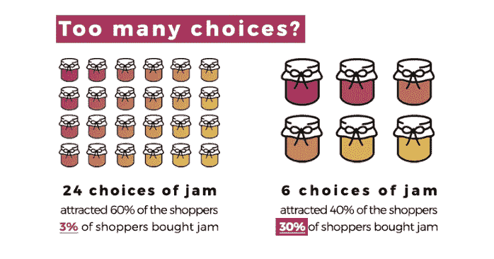

Image Source: [The Paradox of Choice](http://The Paradox of Choice)

刚刚发生了什么？嗯，看起来很多选择看起来确实很吸引人，但是这种选择过多有时可能会给顾客带来困惑和阻碍。**因此，即使在线商店可以获得数百万件商品，如果没有良好的推荐系统，这些选择可能弊大于利**。

在我上一篇关于推荐系统的文章中，我们对推荐系统的非凡世界有一个概述。现在让我们更深入地了解一下它的体系结构和与推荐系统相关的各种术语。

 [## 推荐系统的非凡世界

### 推荐系统概述以及它们如何提供一种有效的定向营销形式。

towardsdatascience.com](/the-remarkable-world-of-recommender-systems-bff4b9cbe6a7) 

# 术语和架构

让我们来看一些与推荐系统相关的重要术语。

**项目/文件**

这些是系统推荐的实体，如网飞上的电影、Youtube 上的视频和 Spotify 上的歌曲。

**查询/上下文**

系统利用一些信息来推荐上述项目，并且这些信息构成了查询。查询还可以是以下内容的组合:

*   **用户信息**，可能包括用户 id 或用户之前交互过的项目。
*   **一些额外的环境**，如用户的设备、用户的位置等。

**嵌入**

嵌入是将分类特征表示为连续值特征的一种方式。换句话说，嵌入是高维向量到称为嵌入空间的低维空间的平移。在这种情况下，要推荐的查询或项目必须映射到嵌入空间。许多推荐系统依赖于学习适当的 [**嵌入**](https://developers.google.com/machine-learning/glossary#embeddings) **查询和项目的表示。**

这里有一个关于推荐系统的很好的资源，值得一读。我在上面总结了一下，但是你可以详细研究一下，它给出了一个整体的建议，尤其是从谷歌的角度。

 [## 简介|推荐系统|谷歌开发者

### 机器学习中的推荐系统介绍

developers.google.com](https://developers.google.com/machine-learning/recommendation/) 

# 架构概述

推荐系统的常见架构包括以下三个基本组件:

## 1.候选生成

这是推荐系统的第一阶段，从用户过去的活动中获取事件作为输入，并从大型语料库中检索一小部分(数百个)视频。主要有两种常见的候选生成方法:

*   **基于内容的过滤**

基于内容的过滤包括根据项目本身的属性推荐项目。系统推荐与用户过去喜欢的项目相似的项目。

*   **协同过滤**

协同过滤依赖于用户-项目交互，并且依赖于相似用户喜欢相似事物的概念，例如购买了这个项目的顾客也购买了这个项目。

## 2.得分

这构成了第二阶段，其中另一个模型进一步对候选人进行排名和评分，通常以 10 为标度。例如，在 Youtube 的情况下，排名网络通过使用描述视频和用户的丰富特征集根据期望的目标函数给每个视频分配分数来完成这项任务。得分最高的视频被呈现给用户，按照他们的得分排序。

## 3.重新排名

在第三阶段，系统考虑额外的约束，以确保多样性、新鲜度和公平性。例如，系统移除用户先前明确不喜欢的内容，并且还考虑网站上的任何新项目。

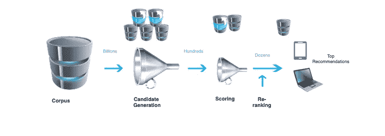

The overall structure of a typical recommendation system

# 相似性度量

如何识别一个项目与另一个项目是否相似？事实证明，基于内容的过滤技术和协作过滤技术都采用了某种相似性度量。让我们来看两个这样的指标。

考虑两部电影——电影 1 和电影 2 属于两种不同的类型。让我们在 2D 图上画出电影，如果电影不属于某个类型，则赋值 0，如果电影属于该类型，则赋值 1。

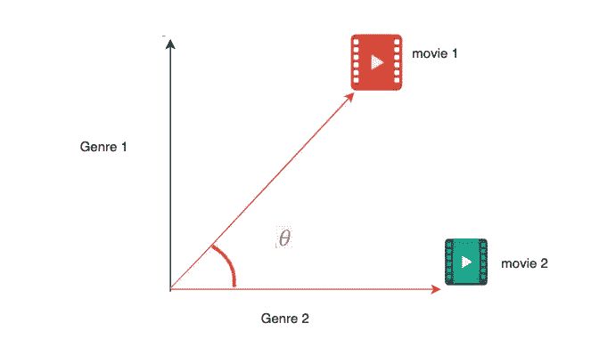

这里，电影 1(1，1)属于类型 1 和类型 2，而电影 2 只属于类型 2(1，0)。这些位置可以被认为是向量，这些向量之间的角度告诉我们很多关于它们的相似性。

## 余弦相似性

它是两个向量夹角的余弦值，`similarity(movie1,movie2) = cos(movie1,movie2) = cos 45`约为 0.7。余弦相似度 1 表示最高相似度，而余弦相似度值 0 表示没有相似度。

## 点积

两个向量的点积是角度的余弦乘以范数的乘积，即`similarity(movie1,movie2) = ||movie1|| ||movie 2|| cos(movie1,movie2).`

# 推荐管道

典型的推荐系统管道包括以下五个阶段:

A typical recommender system pipeline

假设我们正在构建一个**电影推荐系统**。该系统没有用户或电影的先验知识，而只有用户通过他们给出的评级与电影的交互。这是一个由电影 ID、用户 ID 和电影分级组成的数据帧。

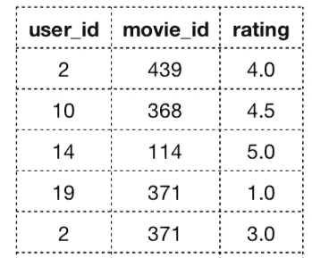

Movie rating Dataframe

因为我们只有收视率，没有其他的，我们将使用协同过滤推荐系统。

## 1.预处理

*   **效用矩阵转换**

我们需要首先将电影分级数据帧转换成用户项目矩阵，也称为**效用矩阵。**

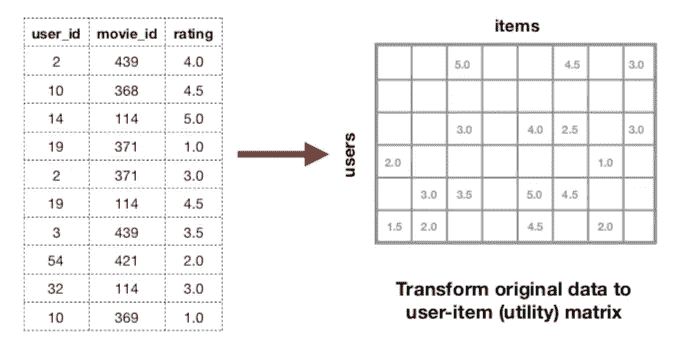

[Source](https://2018.pycon.ca/fr/talks/talk-PC-55468/)

矩阵的每个单元都由用户对电影给出的评级填充。这个矩阵通常被表示为一个**稀疏矩阵**，因为由于缺少对该特定电影的任何分级，许多单元是空的。如果数据稀疏，协同过滤就不能很好地工作，所以我们需要计算矩阵的稀疏度。

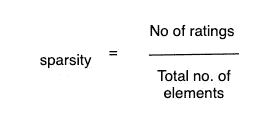

如果稀疏值大约为 0.5 或更大，那么协同过滤可能不是最好的解决方案。这里需要注意的另一个要点是，空单元格实际上代表新用户和新电影。因此，如果有高比例的新用户，那么我们可能会考虑使用一些其他的推荐方法，如基于内容的过滤或混合过滤。

*   **正常化**

总会有一些用户过于积极(总是给出 4 或 5 分)或过于消极(把所有事情都评为 1 或 2 分)。因此，我们需要将评分标准化，以考虑用户和项目的偏见。这可以通过取平均值归一化来实现。

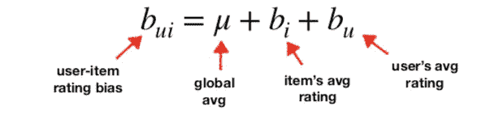

Source: [Normalisation the Ratings](https://2018.pycon.ca/fr/talks/talk-PC-55468/)

## 2.模特培训

数据经过预处理后，我们需要开始模型构建过程。**矩阵分解**是协同过滤中常用的技术，尽管还有其他方法，如**邻域法**。以下是涉及的步骤:

*   **对用户-项目矩阵进行因子分解，得到 2 个潜在因子矩阵——用户因子矩阵和项目因子矩阵。**

用户评级是由人类生成的电影的特征。这些特征是我们认为重要的可以直接观察到的东西。然而，也有一些不能直接观察到的特征，但在评级预测中也很重要。这些隐藏特征被称为**潜在特征**。

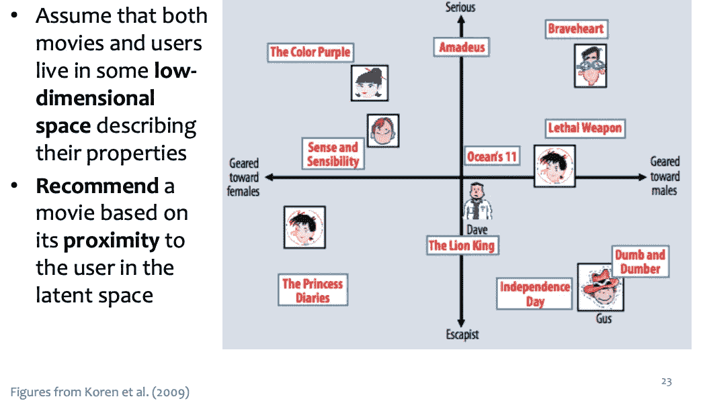

[A simplified illustration of the latent factor approach](https://datajobs.com/data-science-repo/Recommender-Systems-[Netflix].pdf)

潜在特征可以被认为是用户和项目之间交互的基础特征。本质上，我们不清楚每个潜在特征代表什么，但是可以假设一个特征可能代表用户喜欢喜剧电影，而另一个潜在特征可能代表用户喜欢动画电影等等。

*   **从这两个潜在矩阵的内积预测缺失评分。**

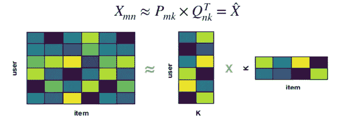

[Source](https://2018.pycon.ca/fr/talks/talk-PC-55468/)

**潜在因素**这里由 **K 表示。**这个重构的矩阵填充原始用户-项目矩阵中的空单元，因此未知的评级现在是已知的。

但是我们如何实现上面显示的矩阵分解呢？事实证明，有很多方法可以做到这一点，使用下面的方法之一:

*   **交替最小二乘法**
*   **随机梯度下降(SGD)**
*   **奇异值分解**

## 3.超参数优化

在调整参数之前，我们需要选择一个评估指标。对于推荐者来说，一个流行的评估标准是 K 处的**精度**，其中查看前 K 个推荐，并计算这些推荐中有多大比例与用户实际相关。

因此，我们的目标是找到在 K 处给出最佳**精度的参数，或者任何其他想要优化的评估指标。一旦找到参数，我们可以重新训练我们的模型，以获得我们的预测评级，我们可以使用这些结果来生成我们的建议。**

## 4.后加工

然后，我们可以对所有预测的评级进行排序，并为用户获得前 N 名推荐。我们还想排除或过滤掉用户之前已经交互过的项目。就电影而言，推荐一部用户以前看过或以前不喜欢的电影是没有意义的。

## 5.估价

我们之前已经讨论过这一点，但是让我们在这里更详细地讨论一下。评估任何推荐系统的最佳方式是在野外测试它。像 **A/B 测试**这样的技术是最好的，因为人们可以从真实的用户那里得到真实的反馈。然而，如果这是不可能的，那么我们不得不求助于一些离线评估。

在传统的机器学习中，我们分割原始数据集来创建训练集和验证集。然而，这并不适用于推荐模型，因为如果我们在单独的用户群上训练我们的所有数据，并在另一个用户群上验证它，那么该模型将不起作用。所以对于推荐者，我们实际上随机屏蔽了矩阵中的一些已知评分。然后，我们通过机器学习预测这些屏蔽的评级，然后将预测的评级与实际评级进行比较。

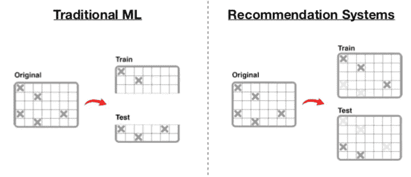

[Evaluating recommenders Offline](https://2018.pycon.ca/fr/talks/talk-PC-55468/)

前面我们谈到了精度作为一种评估指标。以下是一些可以使用的其他方法。

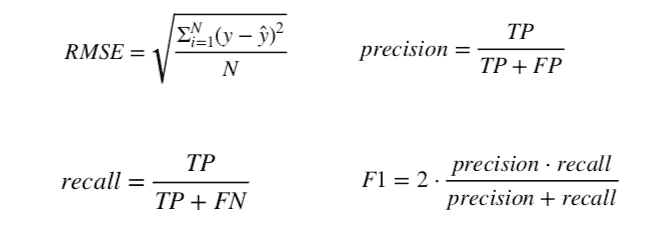

# Python 库

有许多专门为推荐目的而创建的 Python 库。以下是最受欢迎的:

*   [**惊喜**](http://surpriselib.com/):Python[scikit](https://www.scipy.org/scikits.html)构建和分析推荐系统。
*   [**隐式**](https://implicit.readthedocs.io/en/latest/quickstart.html) :隐式数据集的快速 Python 协同过滤。
*   [**light FM**](https://lyst.github.io/lightfm/docs/home.html):Python 实现了许多流行的隐式和显式反馈推荐算法。
*   [**pyspark.mlib .推荐**](https://spark.apache.org/docs/2.1.1/api/python/_modules/pyspark/mllib/recommendation.html) : Apache Spark 的机器学习 API。

# 结论

在本文中，我们以缩小选择范围的方式讨论了推荐的重要性。我们还介绍了设计和构建推荐系统管道的过程。Python 实际上让这个过程变得更简单，因为它为此提供了对许多专门库的访问。尝试使用一个来构建您自己的个性化推荐引擎。

# 参考

*   [机器学习中的推荐系统介绍](https://developers.google.com/machine-learning/recommendation/)
*   [如何用 Python 设计和构建推荐系统管道(Jill Cates)](https://2018.pycon.ca/fr/talks/talk-PC-55468/)