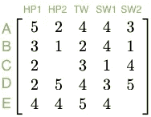
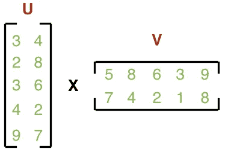
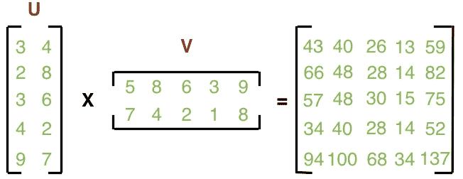
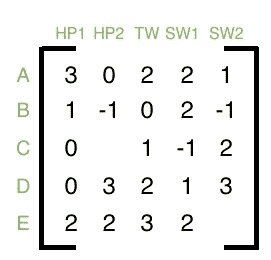
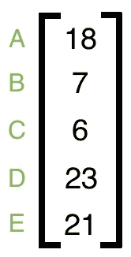
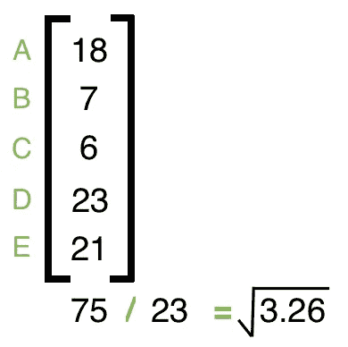

# 使用紫外线分解的推荐系统

> 原文：<https://towardsdatascience.com/recommendation-systems-using-uv-decomposition-a1d4116be4a1?source=collection_archive---------19----------------------->

## 快速浏览 Jure Leskovec、Anand Rajaraman 和 Jeffrey Ullman 的*大规模数据集挖掘*第 9 章

如今，几乎每个行业都在使用无数推荐系统的例子。大多数人在高层次上理解推荐系统试图达到的目的。然而，没有多少人了解它们在更深层次上是如何工作的。这就是 Leskovec、Rajaraman 和 Ullman 在他们的书*的第 9 章【大规模数据集的挖掘】中深入探讨的内容。*

今天使用的推荐系统的一个很好的例子是网飞。只要你登录网飞，就会看到各种各样的板块，比如“现在趋势”或“新发布”，但还有一个板块的标题是“你的最佳选择”。这一部分使用了一个复杂的公式来估算你最喜欢哪部电影。这个公式考虑了你以前欣赏过的电影，以及其他像你一样的人也欣赏过的电影。

这暗示了推荐系统的两个主要领域:基于内容的系统和协作系统。我们将在本文中更深入地探讨这些领域，但是，我想对每个领域做一个快速总结。基于内容的系统使用项目间的相似性。在网飞的例子中，一个基于内容的系统将关注电影之间的相似性，例如类型、导演、演员等。协作系统关注不同用户之间的相似性。再次以我们的网飞为例，假设有两个用户，他们彼此看过所有相同的电影，并且对每部电影的评价完全相同。如果他们中的一个人看了一部新电影，并将它评为 4 级，那么可以想象另一个人也会将这部电影评为 4 级。这两种技术是理解现代推荐系统如何工作的基础。

在互联网时代之前，一切都是在实体店买卖的。这些商店不可能为每一个进门的人量身定做商品。他们只能吸引大众。换句话说，他们的策略是非个人的，完全由畅销书或最受欢迎的商品驱动。想象一下 20 世纪 60 年代的唱片店。由于空间的限制，他们一次只能储存有限数量的专辑。为了最大化销售，他们会储存最有可能吸引最多人的专辑。然而，会有许多对音乐有独特品味的人不会被“迎合大众”的策略所服务。

将这家 20 世纪 60 年代的唱片店与 2019 年的 Spotify 相比较。Spotify 有一个 1960 年的唱片店没有的问题。Spotify 不可能向用户展示其曲库中所有可用的歌曲。Spotify 被迫开发一种方法来估计个人最有可能喜欢哪些歌曲。这是每个在线零售商都有的问题。无论在线零售商销售什么类型的产品，他们都需要开发一种方法，向每个客户成功推荐他们的大量选择。在竞争激烈的在线零售世界中，一家未能建立准确推荐系统的在线公司将处于巨大的劣势。

# 效用矩阵

*Figure 1 (Mining of Massive Datasets — pg 308)*

理解推荐系统的第一步是理解什么是效用矩阵以及它是如何构成的。效用矩阵是每个 ***用户的*** 对他们看过和/或评价过的每个 ***项目*** 的享受程度的集合。在我们的网飞例子中，我们可以想象这将会是什么样子。假设我们有来自四个网飞用户的评论:A、B、C 和 D，分别针对五部不同的电影:哈利波特 1、2 和 3、暮光之城和星球大战 1、2 和 3(见图 1)。我们的四个用户都没有看过每部电影，所以我们的表中有许多空白。这些空白单元格是我们作为一家公司想要预测的，以便知道我们应该向我们的每个用户推荐哪些电影。实际上，这个矩阵将是巨大的，包含数千列(电影)和数百万行(用户)。该矩阵也将非常稀疏，因为大多数用户不会看到网飞上数以千计的电影中的大多数。

# 基于内容的推荐

Figure 2 (Mining of Massive Datasets — pg 308)

正如我们前面简要提到的，基于内容的推荐关注项目之间的相似性。物品的相似性可以是任何东西。在我们的网飞例子中，它可以是流派、运行时间、提名/奖项、演员、导演、父母评级等。让我们选择一个简单的例子，我们只关注一个相似之处:电影系列。在我们的例子中，我们有两个不同的电影系列:哈利波特和星球大战，每个系列都有三部不同的电影。

在基于内容的推荐中，该示例中的用户 A 对于剩余的两部哈利波特电影将被给予预期评级 4，而对于剩余的两部星球大战电影将被给予预期评级 1。然而，我们可以想象，如果我们添加更多的项目相似性，而不仅仅是电影系列，这将变得更加复杂。让我们快速看一下用户 b。我们的电影系列基于内容的推荐会告诉我们所有星球大战电影的预期评级是什么？不是很多，对吧？也许如果我们有除了电影系列之外的额外功能，在《星球大战》电影和用户 B 看过的其他电影之间可能会有一些其他的相似之处。

# 协作推荐

同样，正如我们上面简要提到的，协作推荐系统关注用户之间的相似性。看看我们在网飞的四个用户的例子，假设不同的用户会以不同的尺度给每部电影打分是现实的。例如，某人可能只给电影打 3 到 5 分，而另一个人可能主要打 1 到 3 分。为了说明这种用户差异，我们希望在进行协作推荐时标准化效用矩阵。这种常态化会把每个人的评分系统放在同一个标尺上。

Figure 3 (Mining of Massive Datasets — pg 324)

为了标准化数据，我们首先找到每个用户的平均电影评级。然后我们创建一个新的矩阵，对于每个用户，我们从每个提供的电影评分中减去用户的平均评分。具有负分的电影是对于该特定用户具有低于平均分数的电影，而正分表示用户对该电影的评价高于他们的平均分数。上图显示了我们四个用户的标准化评分。用户 A 的平均得分为 3.33 (4、5 和 1)。当我们从提供的三个分数中去掉 3.33，我们得到 0.67 (2/3)，1.67 (5/3)和-2.33 (-7/3)。

我想强调一下我们在这里所做的。在原始矩阵中，用户 A 和 C 都将电影评为 4 级。用户 A 将 HP 1 评级为 4，而用户 C 将 SW1 评级为 4。然而，在我们的归一化矩阵中，我们可以看到这些值不再相同。用户 A 在 2/3 处拥有 HP1，而用户 C 在 1/3 处拥有 SW 1。这是因为用户 **C** 与用户 A 相比具有更高的**平均分**，这意味着来自用户 C 的**低分与来自用户 A 的低分相比具有更大的权重**

既然每个人的评分都在同一等级上，我们就可以准确地比较用户之间的相似性。我们这样做的方法是通过*计算任意两个用户的余弦值*。大余弦意味着我们测量的角度小，反之亦然。因为角度表示用户之间的相似性，所以大余弦(小角度)意味着被测量的两个用户之间存在小差异。

Figure 4 — A and C — (Mining of Massive Datasets — pg 324)

让我们来看一下计算余弦的公式。首先，我们选择两个用户进行比较。作为一个例子，我们将比较用户 A 和 c。接下来，我们找到两个用户都提交了评级的所有电影。从我们的矩阵中可以看到，这恰好是两部电影:TW 和 SW1。然后，我们将每个用户的电影评分相乘，并将乘积相加，得到我们的分子。分母获取用户 A 的每个评分，对评分求平方，然后在求平方根之前将用户 A 的所有评分相加。它对用户 C 再次这样做，然后将两个结果相乘得到分母。我们可以看到用户 A 和 C 的余弦值为-0.559，这意味着他们对电影的品味相反。

Figure 5 — A and B — (Mining of Massive Datasets — pg 323)

让我们看看用户 A 是否更类似于用户 B 或用户 c。我们知道用户 A 和 c 之间的余弦。所以我们只是重复上面的步骤，但这次是在 A 和 B 之间。只有一部电影用户 A 和 B 都评级(HP 1)。因此，我们的分子只有一次乘法。我们看到用户 A 和 B 之间的余弦值为 0.092。记住，余弦值越高，用户越相似。基于此，我们可以有把握地得出这样的结论:用户 A 与用户 B 的相似度高于用户 c。如果我们将用户 A 与新用户 X 进行比较，得到余弦值为 0.099，则用户 A 与用户 X 的相似度甚至高于用户 B。

# 紫外线分解

最广泛接受的估计用户评级的形式之一是 UV 分解方法。为了展示这种方法是如何工作的，让我们看看下面图 6 中的效用矩阵。我们仍然可以假设行是各种用户，列是各种电影，但是这一次只缺少两个评级值。

Figure 6 (Mining of Massive Datasets — pg 328)

UV 分解的第一步是确定可以对我们的用户和电影进行类似分类的维度数量。在我们的例子中，我们将把我们的维数设置为 2，但这可以更大。然后，我们利用上面的矩阵，创建两个新矩阵:用户矩阵(U)和项目矩阵(V)。U 矩阵将是 5 乘 2(对于 5 个用户和 2 个维度)，而 V 矩阵将是 2 乘 5(对于 2 个维度和 5 部电影)。这两个新矩阵(U 和 V)用随机数填充(现在我们用 1 填充)，然后将它们相乘以创建另一个矩阵，其大小与原始效用矩阵相同(5x 5)。我们的目标是逐步改变 U 和 V 矩阵中的数字，使新矩阵尽可能接近原始效用矩阵。

Figure 7 (Mining of Massive Datasets — pg 329)

为了测量 U 和 V 的每次增量调整的成功，我们计算两个矩阵之间的 RMSE(均方根误差)。RMSE 越小，两个矩阵越接近(或越相似)。因此，我们希望找到插入 U 和 V 的最佳值，这将导致两个 5x 5 矩阵之间的最低 RMSE。参见下面的**附录**部分，详细了解 RMSE 的计算以及矩阵乘法的工作原理。

一旦我们找到了使 RMSE 最小化的 U 和 V 矩阵的值的组合，我们就可以找到原始效用矩阵中缺失评级的估计值。

# 摘要

Leskovec、Rajaraman 和 Ullman 涵盖的内容比上面讨论的更多，但是我想涵盖推荐系统的三个主要主题。基于内容的推荐系统只关注项目间的相似性，而协同推荐系统主要关注用户间的相似性。UV 分解是一种很好的方法，它使用 U 和 V 矩阵来寻找矩阵中缺失值的最佳估计值。

# 附录

## 矩阵乘法

在进行 RMSE 计算之前，让我们先来看看矩阵乘法是如何工作的。当我们将 U (5 x 2)乘以 V (2 x 5)时，实际上发生了什么？我们如何得到填充了 2 的 5×5 矩阵呢？

首先，矩阵乘法的顺序很重要。第一矩阵**中*列*的数量必须等于第二矩阵中*行*的数量**。在我们的例子中，U 有 2 列，V 有 2 行，所以我们很好。下一个技巧是，输出矩阵将具有与第一个矩阵相同数量的*行*，以及与第二个矩阵相同数量的*列*。在我们的例子中，U 有 5 行，V 有 5 列，所以得到的矩阵是 5 乘 5。

现在，我们如何填充 5x 5 矩阵？让我们举一个不同的例子，这将使解释矩阵乘法更容易，这里是我们的 U 和 V 矩阵:

Figure 8

为了计算 5 乘 5 矩阵的左上值，我们取 U (3)的左上值，并将其乘以 V (5)的左上值。然后我们取 U (4)的右上值，再乘以 V (7)的左下值。所以公式看起来是:(3 x 5) + (4 x 7) = **43** 。这是我们的矩阵:

Figure 9

为了填充 5 乘 5 矩阵的第一行，我们继续使用 U 矩阵的第一行，但是对于 V 矩阵，我们每次移动一列。所以 43 右边的数字将是:(3 x 8) + (4 x 4) = **40** ，以此类推。这又是我们的矩阵:

Figure 10

为了填充行，我们重复上面的过程，但是我们向下移动 U 行。所以 43 以下的值会是:(2 x 5) + (8 x 7) = **66** 。40 以下的值将是(2 x 8) + (8 x 4) = **48** ，以此类推。这是我们 5x 5 矩阵的最终结果:

Figure 11

## RMSE 计算

简单回顾一下，RMSE 用于 UV 分解，以比较原始矩阵(具有实际用户评级)和新计算的矩阵(通过计算 U x V)之间的差异大小。下面是初始设置的样子:

Figure 12 (Mining of Massive Datasets — pg 328–329)

问题是，我们如何衡量这些矩阵有多相似？我们用 RMSE 做这个。如果我们想计算上述两个矩阵之间的 RMSE，第一步是从原始矩阵中减去计算矩阵的每个值。结果看起来像这样:

Figure 13

我们在这里所做的只是从我们的原始矩阵中减去我们计算出的矩阵(2s 的矩阵)**中的值。所以左上角的 3 是 5 减 2 得来的。下一步是对这个新矩阵中的每个值求平方，得到以下结果:**

Figure 14

一旦我们对矩阵中的每个值进行平方，我们就将每一行加在一起(例如，我们将对 9 + 0 + 4 + 4 + 1 求和得到 18，依此类推。结果如下所示:

Figure 15

步骤的最终组合是:1)对这个 5 乘 1 矩阵中的所有值求和，2)除以从我们的原始效用矩阵提供的评级总数(在我们的情况下，这将是 5×5-2，即 23，因为我们的原始效用矩阵中有两个空白)，3)取这个结果的平方根，该值就是 RMSE。因此，这是我们示例的最后 3 个步骤的视觉效果:

Figure 16 (23 = 5 x 5 - 2)

3.26 的平方根是 1.81，所以我们原来的效用矩阵和 2s 的矩阵之间的 RMSE 是 **1.81** 。

## 引用的作品

Jure Leskovec，Anand Rajaraman，Jeffrey D. Ullman。*海量数据集的挖掘*。2014.【http://infolab.stanford.edu/~ullman/mmds/book.pdf 