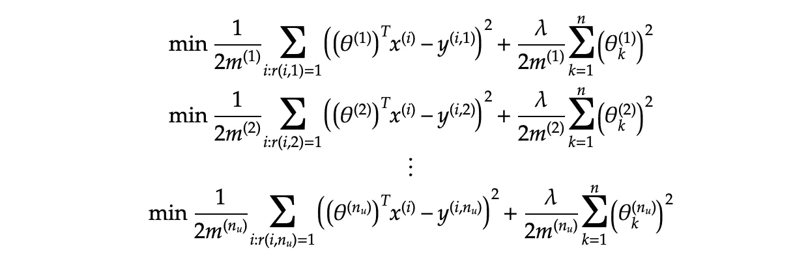
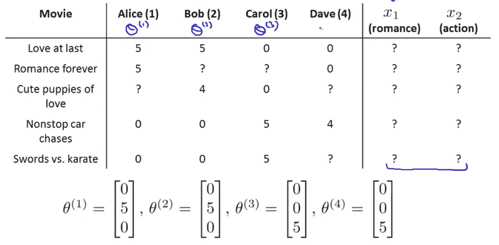
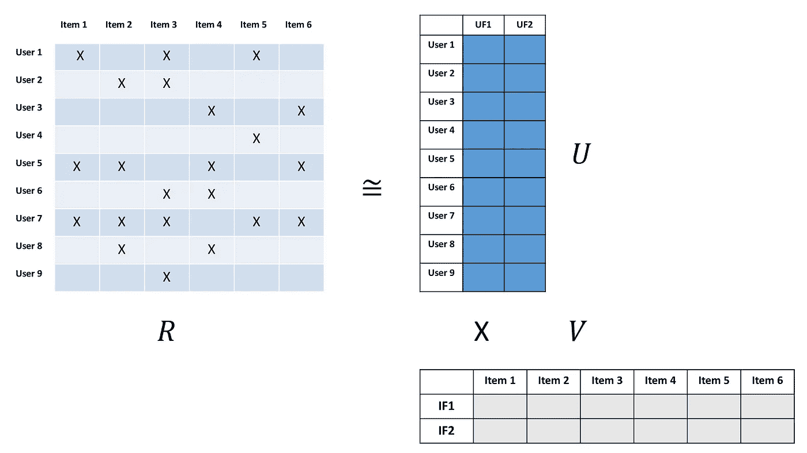

# 推荐系统

> 原文：<https://towardsdatascience.com/recommender-system-a1e4595fc0f0?source=collection_archive---------10----------------------->

推荐系统是指能够预测用户对一组项目的未来偏好并推荐最佳项目的系统。现代社会需要推荐系统的一个重要原因是，由于互联网的普及，人们有太多的选择。过去，人们习惯在实体店购物，实体店的商品有限。例如，可以放在大片商店的电影数量取决于商店的大小。相比之下，如今，互联网允许人们在线访问丰富的资源。例如，网飞收藏了大量的电影。虽然可获得的信息量增加了，但新的问题出现了，因为人们很难选择他们真正想看的项目。这就是推荐系统的用武之地。本文将简要介绍构建推荐系统的两种典型方法，协同过滤和奇异值分解。


[Source](https://www.ideassn.org/wp-content/uploads/2017/06/image001-1.png)

## 构建推荐系统的方法:

有两种方法可以构建推荐系统:

**1。基于内容的推荐:**推荐系统的目标是预测用户未评级项目的得分。内容过滤背后的基本思想是每个项目都有一些特征 x。例如，电影“爱情在最后”是一部爱情电影，其特征𝑥₁得分高，但特征𝑥₂.得分低


Movie Ratings Data

每个人都有一个参数θ，表示他们有多喜欢爱情电影，有多喜欢动作片。如果θ是[1，0.1]，说明这个人爱看言情片，不爱看动作片。那么对于每个人，我们可以用线性回归找到最优的θ。

```
(Notation)
r(i,j): 1 if user j has rated movie i (0 otherwise)
y(i,j): rating by user j on movie i (if defined)
θ(j): parameter vector for user 
x(i): feature vector for movie i
predicted rating [user j, movie i]: (θ(j))ᵀx(i)
m(j): # of movies rated by user j
nᵤ: # of users
n: # of features of a movie
```

给定上面的符号，用户 j 的优化目标可以写成如下:


Optimization Objective for user j

因为我们想为所有用户找到最佳参数，所以我们有很多这样的参数。



Optimization Objectives for All Users

我们希望对这些目标有一个单一的表述。注意 m(j)只是一个不影响优化的常数。因此，忽略 m(j)个因素，我们可以将所有目标相加，得到一个单一的表达式。


Optimization Objective

因此，梯度下降可以用下面的表达式来执行:


Cost Updating Function

**2。协作过滤:**内容过滤的缺点是它需要每个项目的辅助信息。比如言情、动作之类的体裁就是电影的边信息。让某人观看电影并为每部电影和未来的每部电影添加补充信息是非常昂贵的。此外，一个人怎么可能列出一部电影的所有特征？如果想增加一个新功能，该怎么办？我们要给所有的电影增加新的功能吗？协同过滤解决了这个问题。首先，让我们考虑内容过滤的相反方法。也就是说，我们能根据用户偏好参数预测电影的特征吗？



Predict the features of movies

我们将再次使用线性回归来预测特征。


Optimization Objective for movie i

请注意，这一次我们将最小化特征 x 的成本，而不是参数θ。我们想预测所有电影的特征。


Optimization Objectives for All Movies

与我们之前所做的类似，我们希望用一个表达式来表达这些目标。


Optimization Objective

现在，我们有两个优化表达式，一个用于查找最佳参数θ，另一个用于查找最佳特征 x。


Two Optimization Objectives

我们可以同时找到最优参数θ和最优特征 x。我们可以将两个优化目标合二为一。请注意，两次双重求和都是遍历 r(i，j)=1 的所有数据。因此，我们可以将两种优化相加。


Collaborative Filtering Optimization Objective

我们用 1/2 代替 1，因为这样做在数学上更方便。这里要注意一个很有意思的事情，就是我们不需要把截距项 1 加到 x 上，为什么呢？因为如果算法需要截距项 1，它可以通过将 x 的第一项设置为 1 来实现。(现实中，我们不知道 x1，x2，…代表什么。所以我们设置了任意数量的特征。第一个特征可以代表偏差。)因此，成本更新函数如下所示:


Cost Updating Functions

# 交替最小二乘法:

我们之前讨论过协同过滤不需要任何关于用户或项目的信息。那么，有没有另一种方法可以让我们弄清楚用户和商品之间的关系呢？

事实证明，如果我们应用矩阵分解，我们就能做到。通常，矩阵分解应用于降维领域，我们试图在保持相关信息的同时减少特征的数量。主成分分析(PCA)和非常相似的奇异值分解(SVD)就是这种情况。

从本质上讲，我们是否可以获得一个用户/物品交互的大矩阵，并在一个更小的用户特征和物品特征矩阵中找出将它们相互关联的潜在(或隐藏)特征？这正是 ALS 试图通过矩阵分解实现的。

如下图所示，假设我们有一个大小为 MxNMxN 的原始评分矩阵 RR，其中 MM 是用户数量，NN 是项目数量。这个矩阵非常稀疏，因为大多数用户每个人只与几个项目交互。我们可以将该矩阵分解成两个独立的更小的矩阵:一个具有维度 MxKMxK，这将是我们对于每个用户(U)(U)的潜在用户特征向量，而第二个具有维度 KxNKxN，这将具有我们对于每个项目(V)(V)的潜在项目特征向量。将这两个特征矩阵相乘接近原始矩阵，但是现在我们有两个密集的矩阵，包括我们的每个项目和用户的许多潜在特征 KK。



为了求解 UU 和 VV，我们可以利用 SVD(这将需要对可能非常大的矩阵求逆，并且计算量很大)来更精确地求解因式分解，或者应用 ALS 来近似它。在 ALS 的情况下，我们一次只需要求解一个特征向量，这意味着它可以并行运行！(这一巨大优势可能是它成为 Spark 首选方法的原因)。为此，我们可以随机初始化 UU 并求解 VV。然后我们可以回过头来，用我们的 VV 解来求解 UU。像这样反复迭代，直到我们得到一个尽可能接近 RR 的收敛点。

# 随机梯度下降优化；

随机梯度下降(SGD)优化是一种并行算法，可以解决推荐系统的相同问题。该算法以随机顺序遍历训练数据中的所有评级，对于每个已知评级 *r* ，它做出预测 *r** (基于向量 *x* 和 *y* 的点积)并计算预测误差 *e* 。然后，我们通过在梯度的相反方向上移动它们来修改 *x* 和 *y* ，为 *x* 和 *y* 的每个特征产生某些更新公式。