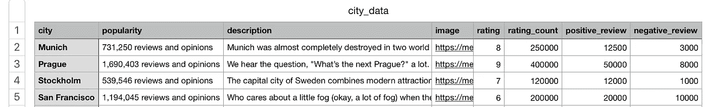
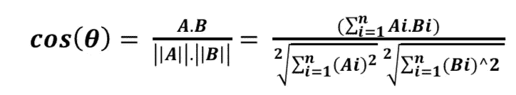
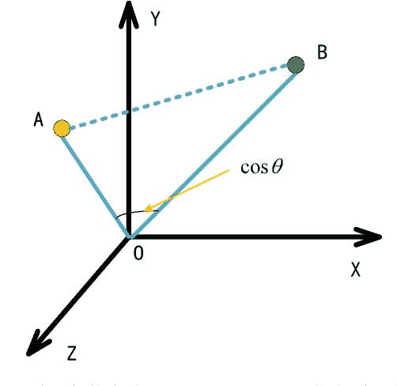
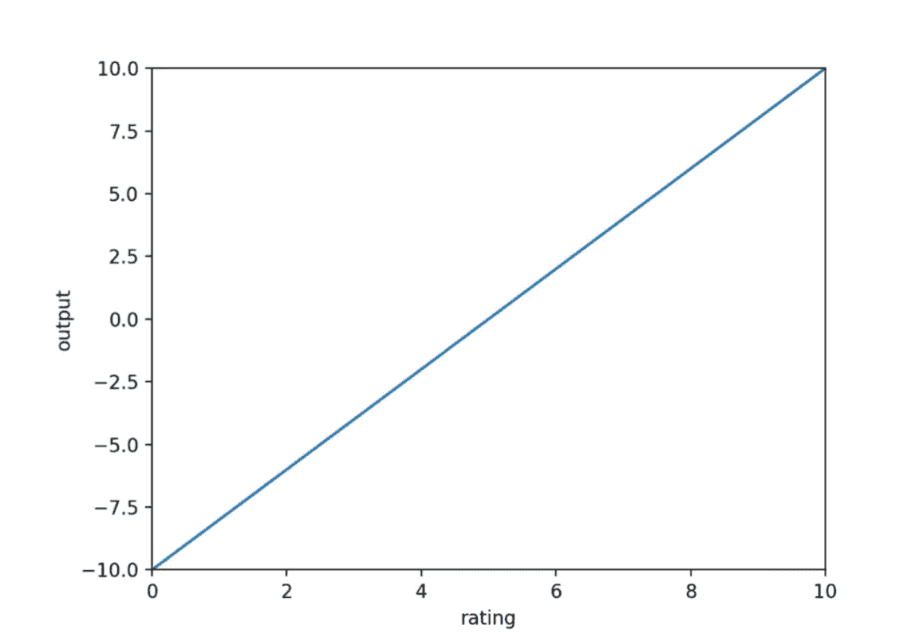
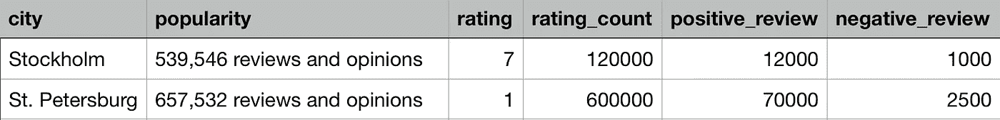
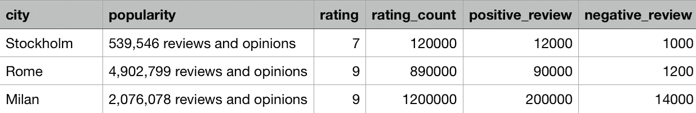
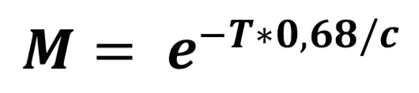
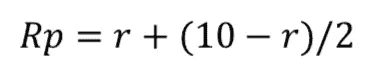
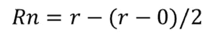
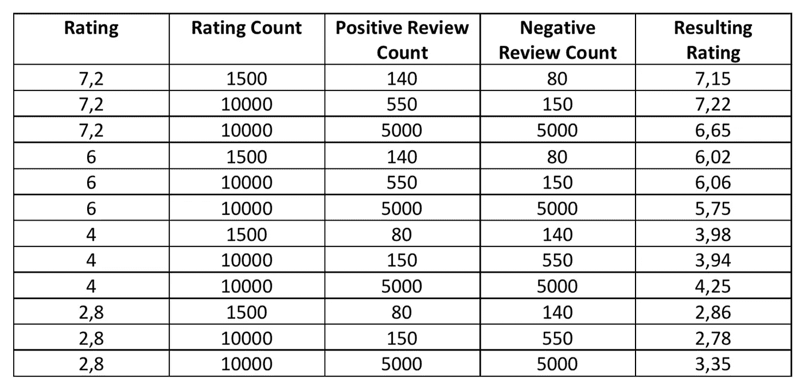

# 推荐系统应用开发

> 原文：<https://towardsdatascience.com/recommender-system-application-development-part-1-of-4-cosine-similarity-f6dbcd768e83?source=collection_archive---------8----------------------->

## 余弦相似度、等级阈值和其他定制技术

在本文中，我们将使用余弦相似度(CS)和 Python 编程语言的其他自定义公式开发一个推荐系统(RS)。这个应用程序将是我在硕士论文期间从事的项目的一部分。

有许多方法可以建立一个 RS。在这里，我们将开发特别解决 RSs 冷启动问题的方法。冷启动问题是在没有关于用户(新注册用户)的大量信息的情况下为用户做出推荐的困难。在这个项目中，我们将研究仅使用少量用户信息进行推荐的方法(允许用户选择他们感兴趣的类别)。

要求:

*   Python 3
*   numpy
*   熊猫
*   nltk

> 我假设您在这些文章的整个开发过程中都了解 Python。我不会把重点放在也不会详细描述 Python 代码，因为这些文章的主要目的是讲授如何使用 CS 和其他技术来构建 RS。同样值得一提的是，我可能会写一些更好的代码，因为我不是 Python 大师。如果你意识到了这样的部分，请在评论中告诉我，这样我可以在以后重构它:)

我们将开发 4 个不同的版本来研究不同的方法来改进我们的系统。首先，我们将从具有余弦相似度的推荐系统开始。

我们将要建立的 RS 将根据所选的类别推荐 5 个不同的旅游城市。当然，这些技术和方法以后可以应用于不同环境的应用程序。

请在此下载我们的 RS 将基于[的数据集。](https://github.com/emrepun/RecommenderEngine/blob/master/data_sets/city_data.csv)

该数据集的一些要素(列)是我之前从猫途鹰网站获得的真实信息，而其中一些只是我添加的随机要素，以便稍后实现和显示不同的技术。我们的数据集由 25 个城市组成，具有以下特征:**城市，受欢迎程度，描述，图像，评级，评级计数，正面评论，负面评论。**您可以在下面看到前 5 个城市的数据集预览。



City dataset preview

我从猫途鹰身上获得的特征是:城市、知名度、描述和形象。除此之外的功能都是我随机制作的。我们不会在 RS 的第一个版本中使用这些特性，但是它们会在这个系列的其他部分中用于不同的技术。

让我们回顾一下每项功能的含义:

*   城市:城市名称
*   受欢迎程度:为城市保存评论计数。
*   描述:关于城市的博客帖子
*   图像:城市的背景图像
*   评分:城市的平均评分值(0-10)
*   rating_count:从用户处收到的评级数量
*   正面评论:正面评论的数量。
*   负面评论:负面评论的数量。

现在我们已经下载了数据集并了解了特性，我们可以开始开发了。如前所述，在第一个版本中，我们将只使用城市和描述特性。

# 版本 1

RS 的第一个版本将根据我们数据集中城市的描述特征给出建议。RS 将使用余弦相似度计算城市描述和与用户可能选择的旅行类别相关的关键字之间的相似度，然后返回具有最高相似度得分的前 5 个城市。

## 余弦相似性

余弦相似性是两个向量之间的相似性的度量，通过计算投影到多维空间中的两个向量之间的角度的余弦。它可以应用于数据集上可用的项目，以通过关键字或其他指标计算彼此的相似性。两个向量(A 和 B)之间的相似性通过取两个向量的点积并除以幅度值来计算，如下式所示。我们可以简单地说，两个向量的 CS 分数随着它们之间的角度减小而增加。



Cosine Similarity Calculation for vectors A and B



Similarity between vectors A and B on 3-dimensional space

## 预处理

首先，我们需要对我们的数据集做一些预处理，使其可以用于我们的 CS 计算方法。让我们在包含数据集的文件夹中创建一个名为 **pre_processing.py** 的 python 文件。

我们将只清除数据集的描述要素。我们需要从描述中删除停用词。停用词是没有任何上下文意义的词，例如；the，for，an，a，or，what 等。移除这些单词的动机是确保相似性分数不会因为非上下文单词而降低。这将对分数产生负面影响，因为每个单词在空间中创建了不同的维度，并且这些维度的对应值将总是零，因为我们的关键字中没有一个将包括非上下文相关的单词。

```
import numpy as np
import pandas as pd
from nltk.corpus import stopwordsdef clear(city):
    city = city.lower()
    city = city.split()
    city_keywords = [word for word in city if word not in stopwords.words('english')] merged_city = " ".join(city_keywords)
    return merged_city
```

我们将使用上面的清除(城市)方法来清除城市描述。它的工作原理如下:

*   它接受一个名为 city 的字符串参数
*   降低字符串中的每个字符。lower()方法。
*   用创建单词列表。split()方法。
*   通过删除英语的停用词来初始化 city _ keywords(nltk 框架)
*   从清除的单词中合并一个字符串并返回它

现在，让我们将此方法应用于数据集中的每个条目，如下所示:

```
for index, row in df.iterrows():
    clear_desc = clear(row['description'])
    df.at[index, 'description'] = clear_descupdated_dataset = df.to_csv('city_data_cleared.csv')
```

该代码块将清除我们数据集中所有城市的所有描述，然后将更新后的描述保存为 **city_data_cleared.csv** 文件。从现在开始，我们将使用这个清除的数据集。

pre_processing.py 要点:

## 用余弦相似度计算相似度得分

现在我们已经清除了城市描述，我们可以开始实现负责计算相似性得分的类了。让我们创建一个名为**余弦相似性. py.** 的 python 文件

正如我前面提到的，该方法将根据两个字符串包含的单词来计算它们的相似度。首先，这两个字符串将被转换成向量，然后向量中的每个单词将在单词空间上创建一个维度。如果一个向量中存在的任何单词在另一个向量中不存在，则另一个向量的相应维度的值将为零。

> **不是:**余弦相似度是尺度不变的，意义；一个单词在给定的字符串中出现的次数对它没有太大的影响。不管怎样，我们使用余弦相似度，因为我们只关心一个单词是否在两个字符串中都存在，我们不关心一个单词出现了多少次。但是，如果你对这种计数差异感兴趣，并希望你的推荐者考虑到这一点(这意味着分数将受到单词出现次数的极大影响)，那么我会建议你去看看[皮尔森相关性](https://en.wikipedia.org/wiki/Pearson_correlation_coefficient)。

即使只有一种计算方法，让我们在一个类下创建它，以提高以后的可用性。

```
import re, math
from collections import Counterclass CosineSimilarity:
    def __init__(self):
        print("Cosine Similarity initialized")

    [@staticmethod](http://twitter.com/staticmethod)
    def cosine_similarity_of(text1, text2):
        first = re.compile(r"[\w']+").findall(text1)
        second = re.compile(r"[\w']+").findall(text2)
        vector1 = Counter(first)
        vector2 = Counter(second) common = set(vector1.keys()).intersection(set(vector2.keys())) dot_product = 0.0 for i in common:

            dot_product += vector1[i] * vector2[i] squared_sum_vector1 = 0.0
        squared_sum_vector2 = 0.0 for i in vector1.keys():
            squared_sum_vector1 += vector1[i]**2 for i in vector2.keys():
            squared_sum_vector2 += vector2[i]**2 magnitude = math.sqrt(squared_sum_vector1) * math.sqrt(squared_sum_vector2) if not magnitude:
           return 0.0
        else:
           return float(dot_product) / magnitude
```

余弦相似度方法的工作原理如下:

*   接受两个字符串参数
*   借助正则表达式获取两个字符串的单词
*   用 Counter (words，word count)初始化字典，其中键对应于一个单词，值对应于该特定单词的计数。
*   获取在两个向量中都存在的常用单词
*   按照余弦相似性一节中介绍的公式计算余弦相似性，并返回值。

cosine_similarity.py 要点:

cosine_similarity.py

## 推荐引擎

接下来，我们将编写负责推荐的引擎。

engine 类将会很小，因为在版本 1 中，我们将只通过比较关键字和城市描述来提供建议，但是我们将把它作为一个单独的类，因为在本系列的下一部分中，我们将在其他版本中对它进行迭代和开发。

recommender_engine.py:

recommender_engine.py for Version-1

get_recommendations(keywords)方法的工作方式如下:

*   接受字符串参数来计算城市描述的余弦相似性
*   用给定的参数计算每个城市的 CS，并将其作为字典保存为
*   创建一个包含城市、受欢迎程度、描述和分数要素的空数据框。
*   将得分最高的 5 个城市添加到此数据框中
*   将数据帧转换为 JSON 并返回。

## 请求代码

现在我们将测试我们的引擎(以及 CS 计算功能)。让我们创建一个 **request.py** python 文件。

我们将在三个不同的类别下测试我们的推荐引擎:

*   文化、艺术和历史
*   沙滩和阳光
*   夜生活和派对

我调查了数据集中所有城市的描述，并手动确定了每个类别的关键字，如下所示:

*   [历史历史艺术建筑城市文化]
*   【沙滩沙滩公园自然度假海海边沙滩阳光阳光明媚】
*   [夜总会夜总会夜生活酒吧酒吧酒吧酒馆派对啤酒]

让我们添加以下代码，该代码将发送一个请求，以获取给定关键字的前 5 个相似城市，以及预定义的关键字:

```
from recommender_engine import RecommenderEngineculture_keywords = "history historical art architecture city culture"
beach_n_sun_keywords = "beach beaches park nature holiday sea seaside sand sunshine sun sunny"
nightlife_keywords = "nightclub nightclubs nightlife bar bars pub pubs party beer"def get_recommendations(keywords):
    result = RecommenderEngine.get_recommendations(keywords)
    return result
```

然后让我们编写一个 helper 方法来从 JSON 中获取城市名称和分数，如下所示:

```
def get_top_5_city_names_out_of_json(json_string):
    list = json.loads(json_string)
    result = []
    max = len(list)
    i = 0
    while i < max:
        result.append(list[i]['city'])
        i += 1 return result
```

现在，我们将针对 3 个类别向推荐者发出 3 个请求，然后打印前 5 个城市及其每个类别的相似性得分:

```
top_5_cultural_cities = get_recommendations(culture_keywords)
city_names_for_cultural = get_top_5_city_names_out_of_json(top_5_cultural_cities)
print(city_names_for_cultural)
print("#################")top_5_summer_cities = get_recommendations(beach_n_sun_keywords)
city_names_for_summer = get_top_5_city_names_out_of_json(top_5_summer_cities)
print(city_names_for_summer)
print("#################")top_5_party_cities = get_recommendations(nightlife_keywords)
city_names_for_party = get_top_5_city_names_out_of_json(top_5_party_cities)
print(city_names_for_party)
print("#################")
```

当我们运行代码时，我们将获得所有 3 个类别的建议，但让我们只调查文化、艺术和历史类别的结果:

```
[('Athens', 0.21629522817435007),
 ('St. Petersburg', 0.16666666666666666),
 ('Stockholm', 0.14962640041614492),
 ('Milan', 0.140028008402801),
 ('Rome', 0.12171612389003691)]
```

如上所示，雅典的相似性得分为 21.6%，而罗马为 12.17%。分数可能比你预期的要低。得分较低是因为，每个城市的描述自然比我们提供的用于比较的关键词有更多的词。不同的词在空间上创建不同的维度，并且由于我们的关键词没有这些词，这些维度的相应值将为零，这导致较低的相似性得分。如果你从关键词中增加或减少单词，你会发现结果也会改变。

request.py 要点:

request.py

## 版本 1 的结论

在这个版本中，我们开发了一个推荐应用程序，通过计算城市描述与给定类别关键字的余弦相似性，为三个不同类别的旅行提供城市推荐。

即使相似性得分很低，当您调查每个类别返回的前 5 个城市时；你可以看到我们的推荐系统，推荐有意义和合适的城市。不妨看看城市描述验证一下:)

我们已经到了第一版的末尾。你可以从[这里](https://github.com/emrepun/RecommenderEngine/tree/master/version_1)访问所有为第一版写的代码。

在下面的下一个版本中，我们将实现一个不同的方法来计算分数，包括余弦相似性和城市的评级信息。

# 版本 2(评级贡献)

在这个版本中，我们将利用数据集的**评级**功能，并改进我们的推荐应用程序，使其更加动态，并提供更好的推荐。我们不想建立一个推荐低评级内容的系统，对吗？至少大多数情况下不会:)

## 使用 CS 和评级贡献生成最终得分

首先，我们将省略评级数量。我们仍然会计算余弦相似度，但现在除此之外，我们还会对最终得分进行评分。我们将创建一个新的方法来确定评分对最终得分的贡献。我们将有两个参数，Q 和 r。其中 r 代表评级，Q 代表重要性(最终分数计算的评级权重)。通过使用 Q 参数，我们将能够增加或减少评分值对最终得分生成的影响。

新函数将根据与给定 Q 参数成比例的评分是大于还是小于 5 来增加或减少余弦相似性的输出(假设平均评分小于 5 的城市不喜欢并且应该被劝阻，大于 5 的城市喜欢并且应该被鼓励推荐)。如前一章所述，评级范围在 0-10 之间，评级贡献输出范围在-Q 和+Q 之间。

例如:如果 Q 给定为 10，则最大评分值可以通过将 CS 分数的 10%加到 CS 分数上来产生最终推荐分数，对于最小评分，最终分数可以通过从 CS 分数中减去 CS 分数的 10%来产生。

我们将在方法中使用的公式将找出给定评级的准确输出(找到蓝线上的准确点)。对于 Q = 10，这种评级贡献生成器方法的直观表示如下图所示:



Rating Contribution computer function for Q = 10

让我们创建一个名为 **rating_extractor.py** 的新文件，并添加以下代码

```
from math import eclass RatingExtractor:
    def __init__(self):
        print("initialized")#Returns value between -q and q. for rating input between 0 and 10.
    #Parameters:
        #rating: indicates the rating for the destination
        #q: indicates the percentage of rating for general score. (default is 10.)
    [@staticmethod](http://twitter.com/staticmethod)
    def get_rating_weight(rating, q=10):
        if rating > 10 or rating < 0:
            return None
        else:
            m = (2*q) / 10 #10 because rating varies between 0 and 10
            b = -q
            return (m*rating) + b
```

get_rating_weight()方法进行一些计算，以确定给定等级和 Q 参数的贡献输出，然后返回值。如前所述，也如上图所示，这种方法可以产生负值和正值。意义；这种方法将对最终分数的计算产生积极或消极的影响。(请注意 Q 参数的默认值设置为 10)。

## 一种新方法在推荐引擎中的实现

现在，我们将添加一个新的方法来推荐一个使用余弦相似性分数和评级贡献来计算最终分数的工程类。在 RecommenderEngine 类中添加下面的方法。(我已经在 init 后面添加了)。

```
def calculate_final_score(cs, r):
    amount = (cs / 100) * r return cs + amount
```

方法的工作方式如下:

*   接受 CS 分数和评级贡献 r 参数。
*   计算金额变量中 CS 分数的+-r 百分比
*   将金额加到 CS 分数上并返回。

由于金额可以是正数，也可以是负数，最终得分将根据贡献值增加或减少。

> 值得一提的是，这种方法对 CS 分数有很大的偏见。因为它的操作是取 CS 的 r 个百分比，并将其加回原始 CS 值。CS 值较高的城市将受到这一新的最终得分计算的极大影响，特别是如果为 **get_rating_weight()** 方法提供较高的 Q 值。

现在让我们添加另一个方法到 RecommenderEngine 来使用这个新方法进行评分计算(我们将保留旧的推荐方法)。

New method for recommender_engine in Version-2

get _ re commendations _ include _ rating(keywords)方法的工作方式与第一章中实现的 get_recommendations(keywords)方法类似。但现在它将使用 CS 得分和评分贡献值计算最终得分，让我们来看看该方法是如何工作的:

*   接受 keywords 参数，并对数据集中的每个城市执行以下操作
*   计算 cs 分数
*   计算 Q=10 的评分贡献分数
*   通过使用 calculate_final_score 方法中的两个分数来计算最终分数
*   获得最终得分最高的前 5 个城市，并以 JSON 的形式返回

## 请求

现在我们有了方法，我们可以请求获得推荐。首先，让我们打开 request.py 文件，并添加一个从 RecommenderEngine 类中检索建议的方法:

```
def get_recommendations_include_rating(keywords):
    return RecommenderEngine.get_recommendations_include_rating(keywords)
```

现在让我们添加新的请求，用新的方法获得 3 个类别的推荐。

```
# Version 2 requests are below:top_5_cultural_with_rating = get_recommendations_include_rating(culture_keywords)
city_names_for_cultural_rating = get_top_5_city_names_out_of_json(top_5_cultural_with_rating)
print(city_names_for_cultural_rating)
print("#################")
top_5_summer_with_rating = get_recommendations_include_rating(beach_n_sun_keywords)
city_names_for_summer_rating = get_top_5_city_names_out_of_json(top_5_summer_with_rating)
print(city_names_for_summer_rating)
print("#################")
top_5_party_with_rating = get_recommendations_include_rating(nightlife_keywords)
city_names_for_party_rating = get_top_5_city_names_out_of_json(top_5_party_with_rating)
print(city_names_for_party_rating)
print("#################")
```

上面的代码将获取带有最终分数的推荐，您可以运行它并查看您得到的结果。

在本文中，我们将只从文化、艺术和历史这两个不同的角度来考察结果。首先，我们将比较在第一个版本中实现的唯一 CS 评分方法和我们刚刚实现的新方法得到的结果。

## get_recommendations 和 get _ re commendations _ include _ rating 方法的比较:

下面的代码是出于实验目的，所以它们不再包含在 request.py 中，因为这两个请求已经存在。

```
top_5_cultural_cities = get_recommendations(culture_keywords)
city_names_for_cultural = get_top_5_city_names_out_of_json(top_5_cultural_cities)
print(city_names_for_cultural)
print("#################")top_5_cultural_with_rating = get_recommendations_include_rating(culture_keywords)
city_names_for_cultural_rating = get_top_5_city_names_out_of_json(top_5_cultural_with_rating)
print(city_names_for_cultural_rating)
print("#################")
```

这里我们观察两种不同方法的输出:

```
[('Athens', 0.21629522817435007),
 ('St. Petersburg', 0.16666666666666666),
 ('Stockholm', 0.14962640041614492),
 ('Milan', 0.140028008402801),
 ('Rome', 0.12171612389003691)]#################[('Athens', 0.22927294186481106),
 ('Stockholm', 0.1556114564327907),
 ('St. Petersburg', 0.15333333333333332),
 ('Milan', 0.15123024907502508),
 ('Rome', 0.13145341380123987)]
```

在这里，我们有两种方法的不同得分，你可以看到，当评级考虑在内时，斯德哥尔摩上升到第二位，而圣彼得堡下降到第三位。让我们看看为什么:



正如您在我们的数据集中看到的，斯德哥尔摩的评分为 7，而圣彼得堡为 1。然后，如前所述，我们的算法降低了圣彼得堡的最终得分，并提高了斯德哥尔摩的最终得分，这导致斯德哥尔摩升至第二名。在这里，我们可以看到，使用实现的方法和公式，我们的推荐系统鼓励具有良好评级的内容，同时阻止具有不良评级的内容。您还可以观察其他城市排名的数据集，以了解为什么它们的最终得分与仅余弦相似性得分相比有所增加。

## Q = 10 和 Q = 100 时 get _ recommendations _ include _ rating 方法的比较:

现在我们将使用不同的 Q 参数来比较我们的新方法。较低的 Q 表示对最终分数的评分贡献较小，而较高的 Q 表示贡献较大。正如我们之前打印出来的，以下是我们在 Q = 10 时得到的文化、艺术和历史类别的建议:

```
[('Athens', 0.22927294186481106),
 ('Stockholm', 0.1556114564327907),
 ('St. Petersburg', 0.15333333333333332),
 ('Milan', 0.15123024907502508),
 ('Rome', 0.13145341380123987)]
```

您可以转到 recommender_engine.py，将 10 替换为 100，以增加 get _ recommendations _ include _ rating 方法中的 Q 参数:

```
rating_contribution = RatingExtractor.get_rating_weight(rating,100)
```

现在让我们看看结果是如何变化的:

```
[('Athens', 0.3460723650789601),
 ('Milan', 0.2520504151250418),
 ('Rome', 0.21908902300206645),
 ('Stockholm', 0.2094769605826029),
 ('Venice', 0.17777777777777776)]
```

我们可以观察到我们现在的结果非常不同。

*   圣彼得堡已经不在前 5 名了，因为它的评分是 1，Q 值越高，这个城市就越不值得推荐
*   米兰和罗马分别升至第二和第三位，而斯德哥尔摩则跌至第四位，因为米兰和罗马的排名高于斯德哥尔摩。



Rating comparison for Stockholm, Rome and Milan

我建议你检查其他类别的结果，以及它们如何随着不同的 Q 值而变化。

## 版本 2 的结论

在版本 2 中，我们实现了一种方法，通过基于描述特征的余弦相似性得分和基于评级特征的评级贡献得分计算最终得分来推荐城市。因为在推荐系统中，我们经常想要向用户推荐好的内容，所以利用诸如评级之类的信息是很重要的。

你可以在这里访问所有为第二版[编写的代码。](https://github.com/emrepun/RecommenderEngine/tree/master/version_2)

在下面的下一个版本中，我们将实现另一种方法，通过使用数据集中的评级计数功能来改进我们的推荐应用程序。

# 版本 3(评级阈值)

一个内容有好的评级，不代表评级就可靠。假设我们有两个内容 A 和 B，A 在 500，000 个用户中的平均评分为 4.7，而 B 仅在 10 个用户中的平均评分为 5。你想向你的朋友推荐哪一个？只有 10 个用户提供评级，你认为 B 有多可靠？在 rating_count 特性的帮助下，我们将提出一个阈值参数，这样我们的推荐系统将能够处理评级计数低的内容(在我们的例子中是城市),因为评级贡献并不太重要。

## 具有评级和计数功能的评级权重生成

在这个版本中，我们将开发几个新的方法来改进我们的推荐系统，以便它将有一个用于评级贡献计算的阈值。现在给大家介绍一个我写论文时想出来的公式:



Multiplier formula

该公式得出 M，它是一个乘数值，将与我们得到的评分贡献值相乘，然后用于最终推荐分数计算。这里 T 代表阈值，c 代表评级计数。该公式以具有以下属性的方式构建:

*   输出的范围在 0.0 和 1.0 之间
*   如果 T 和 c 参数相等，则公式始终得出 0.5

> 这个公式中的数字 e 没有什么特别的，它可以是任何数字(那么 0，68 也必须改变)。我只是用 e 让它看起来很酷:P

因此，该方法的主要重要性在于，当 T = c 时，它产生 0.50，这就是阈值处理的工作方式。我们将为评级计数设置一个阈值 T，这样，如果评级计数小于阈值，输出将在 0.0–0.50 的范围内(取决于有多低。)并且如果评级计数大于阈值，则输出将在 0.50 和 1.0 之间，但是永远不会超过 1.0。

如前所述，该乘数将仅应用于评级贡献值，因此我们不会太在意没有提供大量评级的评级，并且输出将降低评级贡献。因此，推荐将主要落入 CS 分数。但是，如果一个地方有更多的评级，那么评级贡献值也将会很高，最终的总体推荐分数也会更高。

现在让我们转到 rating_extractor.py 文件并创建一个新方法。我们只是将评分贡献值乘以乘数，但让我们创建一个新的方法，这样您仍可以有其他方法并按原样使用它。

首先我们需要从 math 中导入 e:

```
from math import e
```

然后在 RatingExtractor 类中，添加新方法:

```
[@staticmethod](http://twitter.com/staticmethod)
def get_rating_weight_with_quantity(rating, c, T, q=10):
    if rating > 10 or rating < 0:
        return None
    else:
        m = (2*q) / 10 #10 because rating varies between 0 and 10
        b = -q
        val = (m*rating) + b M = e**((-T*0.68)/c) return val * M
```

方法的工作原理如下:

*   它需要 rating、c (rating_count)、T (threshold)和 q 参数。
*   从上一章我们已经知道了评级和 q 参数。
*   c 指用户提供评级的数量
*   t 指的是上面介绍的阈值
*   计算评分贡献值
*   计算乘数 M 值
*   通过将贡献值乘以 M 返回评级权重

## 一种新方法在推荐引擎中的实现

让我们打开 recommender_engine.py，为 RecommenderEngine 类添加一个新方法(我们将保留我们在以前版本中实现的方法),它实际上与我们在前一章中添加到 RecommenderEngine 的方法几乎完全相同，但这次我们将传递评级计数和阈值以及城市描述和评级功能:

get_recommendations_include_rating_threshold method

该方法的工作原理如下:

*   接受 keywords 参数，并对数据集中的每个城市执行以下操作
*   计算 CS 分数
*   通过将城市评级、评级计数、阈值作为 100 万(数据集中的城市的评级计数在 100k 到 5M 之间，我最初选择了 100 万，但我们将对此进行调整)和 Q=10 来获取评级贡献权重
*   通过使用 CS 分数和评级权重，使用 calculate_final_score 方法(在上一章中实施)计算最终分数。
*   获得最终得分最高的前 5 个城市，并以 JSON 的形式返回

## 请求

我们将向 request.py 文件中添加新的请求，以便使用新方法获得 3 个类别的建议

首先，让我们添加一个方法来从 RecommenderEngine 类中检索具有新实现的建议:

```
def get_recommendations_include_rating_count_threshold(keywords):
    return RecommenderEngine.get_recommendations_include_rating_count_threshold(keywords)
```

现在让我们添加新的请求，用新的方法获得 3 个类别的推荐。

```
# Version 3 requests are below:top_5_cultural_with_rating_count_threshold = get_recommendations_include_rating_count_threshold(culture_keywords)
city_names_for_cultural_rating_count_threshold = get_top_5_city_names_out_of_json(top_5_cultural_with_rating_count_threshold)
print(city_names_for_cultural_rating_count_threshold)
print("#################")top_5_summer_with_rating_count_threshold = get_recommendations_include_rating_count_threshold(beach_n_sun_keywords)
city_names_for_summer_rating_count_threshold = get_top_5_city_names_out_of_json(top_5_summer_with_rating_count_threshold)
print(city_names_for_summer_rating_count_threshold)
print("#################")top_5_party_with_rating_count_threshold = get_recommendations_include_rating_count_threshold(nightlife_keywords)
city_names_for_party_rating_count_threshold = get_top_5_city_names_out_of_json(top_5_party_with_rating_count_threshold)
print(city_names_for_party_rating_count_threshold)
print("#################")
```

上面的代码将获取推荐以及它们的最终分数，你可以运行它并查看你得到的所有类别的结果。但我们将只调查文化、艺术和历史类别的结果。

## 不同阈值的结果比较

让我们对文化、艺术和历史类别提出不同阈值(T)的实验请求。您可以在 RecommenderEngine 类的 get _ recommendations _ include _ rating _ count _ threshold 方法中更改 threshold。同样，这次我们将 Q 参数(前一章中介绍的评级贡献重要性参数)更改为 100，这样我们可以更好地看到阈值效果。

阈值= 100.000 的结果:

```
[('Athens', 0.33318171469723395),
 ('Milan', 0.24587898720843948),
 ('Rome', 0.21192640793273687),
 ('Stockholm', 0.18358642633975064),
 ('Venice', 0.17262307588744202)]
```

阈值= 1.000.000 的结果:

```
[('Athens', 0.26188415260156817), 
('Milan', 0.2035910531885378), 
('Rome', 0.16707033294390228), 
('Stockholm', 0.14983344608755947), 
('Barcelona', 0.14757848986361075)]
```

阈值= 2.500.000 的结果:

```
[('Athens', 0.2257870828894539), 
('Milan', 0.16719580286435054), 
('St. Petersburg', 0.158824470447676), 
('Stockholm', 0.14962644254339), 
('Rome', 0.13613352041126298)]
```

如你所见，阈值为 100K 和 1M；第 5 名就不一样了，门槛值低一点的时候我们有威尼斯在第 5 名，值高一点的时候我们有巴塞罗那。让我们看看为什么:


Rating and Rating count for Barcelona and Venice

他们都有 8 分，但巴塞罗那有 120 万分，而威尼斯有 845.000 分，威尼斯的 CS 分数也比巴塞罗那高。因此，当阈值为 100.000 时，两个城市都可以提供良好的评级贡献，因为威尼斯的 CS 得分较高，所以我们看到它位于第 5 位。

但是当阈值为 1.000.000 时，贡献分数如下(Q=100):

*   巴塞罗那:34
*   威尼斯:26.8

由于巴塞罗那现在具有更高的输出，并且由于 Q 也很高，巴塞罗那的最终得分计算将大于威尼斯，因此巴塞罗那位于第 5 位。

当阈值为 2.500.000 时，您可以看到圣彼得堡排名第三，而当阈值更低时，我们甚至没有排名第四或第五的圣彼得堡。我会把调查工作交给你。查看圣彼得堡的数据集，了解我们的实现是如何工作的，看看您是否能理解为什么我们让圣彼得堡拥有更高的阈值。如果你对评论有任何问题，请告诉我:)

此外，我鼓励你尝试所有这些参数，检查数据集的特征(应该没问题，因为我们只有 25 个城市)，并尝试理解这些方法如何对推荐系统有效。

## 版本 3 的结论

在第 3 版中，我们实现了一种推荐城市的方法，首先计算余弦相似性得分，然后使用评级和评级计数功能计算评级权重输出，最后使用两种结果计算最终得分。使用可靠的信息是很重要的，因此通过这些实现，我们已经看到了如何改进我们的推荐系统，以便它可以更多地依赖于具有更高(高度取决于应用的上下文)反馈的内容。

你可以在这里访问所有为第三版[编写的代码。](https://github.com/emrepun/RecommenderEngine/tree/master/version_3)

在下面的下一个版本中，我们将通过研究如何利用不同形式的反馈来进一步改进我们的推荐系统。

# 版本 4

在这个版本中，我们将通过使用数据集的**正面 _ 评论**和**负面 _ 评论**特征来进一步改进我们的系统。

*这一章将比前几章更多地关注该方法的理论和实验结果(这里不是动手执行，而是在结果表上)，所以如果你只是对代码实现感兴趣，你可以直接进入* ***实现*** *部分。*

有时，我们可能会有不同类型的内容反馈。例如评论和评级。正如您所猜测的，它们并不是完全相同的反馈类型，评级反馈是以给定的尺度提供的(对于我们的情况是 0-10)，而评估通常以文本格式给出。假设我们已经将评论分为正面和负面反馈(也许我们可以调查另一篇文章的评论分类)，那么评论反馈可以被分析为二元反馈(0 或 1)；意义，负面或正面评论。

我们的数据集中已经有两个可用的特征**正面 _ 评论**和**负面 _ 评论**。这些特征代表了一个城市收到的正面和负面评论的数量。

推荐系统的挑战之一是以不同的形式整合反馈。有许多不同的方法可以做到这一点，在这一章中，我们将尝试使用两种反馈形式，通过一种定制的方法将评论转换为评分形式。

## 将评论转换为评级标准

这样做的基本方法是为负面和正面反馈选择两个评分值，然后将每个评审反馈视为一个评分，并重新计算项目的平均评分。但是这种方法并不理想。例如，如果对于负面和正面评论，评级被选择为 0 和 10，则评论的效果将大于实际评级数据，尤其是当项目的评级接近 0 或 10 时。可以选择不同的评级值来减轻评论对评级的影响。例如，如果评级被选择为 2.5 和 7.5，那么将会出现另一个问题，其中对于平均评级大于 7.5 的项目的正面反馈仍然会有助于降低评级，而对于平均评级小于 2.5 的项目的负面反馈将有助于提高评级。因此，需要另一种方法来更好地结合这两种形式。

对于正面和负面的评价，我们的方法将相应地表现如下:

*   对于任何正面评价，通过计算项目的平均评分和最大评分值之间的距离(在我们的例子中为 10)，然后将计算的距离的一半添加到平均评分，以确定评价值，从而将新的评分值添加到评分中。
*   对于任何负面评价，通过计算项目的平均评分和最低评分值(在我们的例子中为 0)之间的距离，然后从平均评分中减去计算的距离的一半来确定评价值，从而将新的评分值添加到评分中。

下面给出了将正面和负面评论分别转换为平均评级为 r 的给定项目的评级值 Rp 和 Rn 的公式:



Rating value conversion for a positive review



Rating value conversion for a negative review

例如，对于平均评分为 6(范围 0-10)的项目，对于每个负面评价，值为 3 的新评分将被添加到评分中，而对于每个正面评价，值为 8 的新评分将被添加到评分中。然后，在反馈到评分功能之前，使用新评级再次计算平均评级。对于不同的评级、评级计数和审核计数，审核反馈转换为评级反馈的结果如下表所示。



Rating calculation results with average rating and reviews

最终评级结果表明，在当前实施情况下，当评级值接近最大值或最小值时，计算出的评级倾向于支持相反的评级值。例如，对于评级为 7.2 且正面和负面评论计数相等的情况，结果为 6.65，因为它从原始值越来越接近最低评级。这是因为，0 和 7，2 之间的距离大于 7，2 和 10 之间的距离，当原始评级为 2，8 且正负评级值相等时，也观察到类似的行为。此外，评论的影响是最小的，因为测试案例比商业推荐系统通常情况下的评论包括更多的评级值。可以通过引入一个额外的参数来改变评论的重要性，以使这种方法更有效(例如，对于每个评论，我们可以用计算的值生成 10 个评级值)，从而增加效果。

## 履行

现在我们已经研究了它的工作方式和它可以生成的结果，让我们继续在 RatingExtractor 类中实现一个新方法:

```
 [@staticmethod](http://twitter.com/staticmethod)
    def get_rating_with_count_and_reviews(r, rc, pf, bf):
        if r > 10 or r < 0:
            return None
        else:
            positive_diff = (10 - r) / 2
            positive_rating = r + positive_diff negative_diff = r / 2
            negative_rating = r - negative_diff updated_rating = ((r * rc) + (pf * positive_rating) + (bf * negative_rating)) / (rc + pf + bf)return RatingExtractor.get_rating_weight_with_quantity(updated_rating,rc,1000000,10)
```

方法的工作方式如下:

*   采用 r(评分)、rc(评分计数)、pf(正面评论计数)和 bf(负面评论计数)参数
*   计算正面评价的换算评分值
*   计算负面评价的换算评分值
*   然后用每个正面和负面反馈的旧平均评分和新评分值计算更新后的平均评分
*   然后使用更新的平均评级、评级计数、T = 1.000.000(阈值)和 Q=100(评级重要性参数)调用在先前版本中实现的方法，并将结果作为评级贡献返回

## 一种新方法在推荐引擎中的实现

让我们打开 recommender_engine.py，添加一个新方法来推荐 engine 类。这将与我们在前面章节中实施的方法类似，但这次我们将通过正面评价和负面评价计数以及描述、评级、评级计数、阈值:

get_recommendations_include_rating_count_threshold_positive_negative_reviews method

该方法的工作原理如下:

*   接受 keywords 参数，并对数据集中的每个城市执行以下操作
*   计算 CS 分数
*   通过传递城市评分、评分计数、正面评价计数和负面评价计数来获取评分贡献权重。这次(T 和 Q 参数直接从 RatingExtractor 类中的 new 方法传递。
*   通过使用 CS 分数和评级权重，使用 calculate_final_score 方法(在前面章节中实现)计算最终分数。
*   获得最终得分最高的前 5 个城市，并以 JSON 的形式返回

## 请求

我们将向 request.py 文件中添加新的请求，以便使用新方法获得 3 个类别的建议

首先，让我们添加一个方法来从 RecommenderEngine 类中检索具有新实现的建议:

```
def get_recommendations_include_rating_count_threshold_positive_negative_reviews(keywords):
    return RecommenderEngine.get_recommendations_include_rating_count_threshold_positive_negative_reviews(keywords)
```

现在让我们添加新的请求，用新的方法获得 3 个类别的推荐。

```
# Version 4 requests are below:top_5_cultural_with_rating_count_threshold_reviews = get_recommendations_include_rating_count_threshold_positive_negative_reviews(culture_keywords)
city_names_for_cultural_rating_count_threshold_reviews = get_top_5_city_names_out_of_json(top_5_cultural_with_rating_count_threshold_reviews)
print(city_names_for_cultural_rating_count_threshold_reviews)
print("#################")top_5_summer_with_rating_count_threshold_reviews = get_recommendations_include_rating_count_threshold_positive_negative_reviews(beach_n_sun_keywords)
city_names_for_summer_rating_count_threshold_reviews = get_top_5_city_names_out_of_json(top_5_summer_with_rating_count_threshold_reviews)
print(city_names_for_summer_rating_count_threshold_reviews)
print("#################")top_5_party_with_rating_count_threshold_reviews = get_recommendations_include_rating_count_threshold_positive_negative_reviews(nightlife_keywords)
city_names_for_party_rating_count_threshold_reviews = get_top_5_city_names_out_of_json(top_5_party_with_rating_count_threshold_reviews)
print(city_names_for_party_rating_count_threshold_reviews)
print("#################")
```

上面的代码将获取推荐以及它们的最终分数，你可以运行它并查看你得到的所有类别的结果。我将省略最后一章的结果调查，因为这些实现的影响在本文开始时已经讨论过了。我会把文化、艺术和历史的结果留给你们:

```
[('Athens', 0.2622560540924768), 
('Milan', 0.2040068651858985), 
('Rome', 0.16752794267650856), 
('Stockholm', 0.14984473241175314), 
('Barcelona', 0.14831614523091158)]
```

但我强烈建议您调查所有类别的结果，转到第 3 章并在这里比较结果，有什么不同，为什么？检查数据集以找到答案，如果您有任何问题，请告诉我:)

# 结论

在这个版本中，我们实现了一种方法，将不同形式的反馈整合到推荐系统中。我们的方法是用一些定制的技术将评审反馈转换成评级反馈。

通过这一章，我们已经结束了推荐系统的实现。总的来说，我们已经实现了一个系统，在我们对用户几乎一无所知的情况下提出建议，只让他们选择一个类别(冷启动问题),并在每章的基础上采用迭代方法。我希望你喜欢这篇文章，如果你有任何问题，请告诉我。此外，由于所有这些实现都是我自己的想法(自定义函数，公式和技术)，它们当然不是完美的，正如我们所看到的，有一些权衡。因此，如果您能在评论中告诉我如何改进，我会很高兴:)

你可以在这里下载项目[的最终版本。](https://github.com/emrepun/RecommenderEngine/tree/master/final_version)

干杯！

## 额外的

您可能想知道为什么数据集中没有使用某些要素。正如我前面提到的，这些实现来自我的 MSc 项目，当我通过 Flutter 为移动设备开发 UI 时，我使用了其中的一些特性。您可以在下面看到应用程序的截图:


Images from the application

请让我知道你是否有兴趣通过 Flutter 为这里实现的推荐系统建立一个 UI。也许我也可以发布构建应用程序的帖子:)

保重！