# Python 中的推荐系统第一部分(准备和分析)

> 原文：<https://towardsdatascience.com/recommender-system-in-python-part-1-preparation-and-analysis-d6bb7939091e?source=collection_archive---------7----------------------->

Photo by [Pixabay](https://www.pexels.com/@pixabay?utm_content=attributionCopyText&utm_medium=referral&utm_source=pexels) from [Pexels](https://www.pexels.com/photo/close-up-of-human-hand-327533/?utm_content=attributionCopyText&utm_medium=referral&utm_source=pexels)

就像我几天前做的 Kickstart 活动分析项目一样，今天我将分析电影评级。如果你错过了上一篇文章，这里有它的链接:

 [## 分析 38 万 Kickstarter 活动

### 让我们探讨一下 Kickstarter 活动的一些注意事项

towardsdatascience.com](/analyzing-380k-kickstarter-campaigns-10649bbf4e91) 

推荐系统是大多数较大的(*和较小的*)网上商店、像[【网飞】](https://www.netflix.com/)这样的电影/电视节目网站以及许多其他网站的核心。根据维基百科，这是“官方”的定义:

> 推荐系统是[信息过滤系统](https://en.wikipedia.org/wiki/Information_filtering_system)的一个子类，它试图预测用户对一个项目的“评分”或“偏好”。它们主要用于商业应用。[1]

存在两种主要类型的推荐系统:

1.  协作过滤(Collaborative Filtering)——基于这样的假设:过去同意的人将来也会同意，并且他们会像过去一样喜欢相似种类的项目
2.  **基于内容的** —基于项目的描述和用户偏好的配置文件。他们将推荐视为特定于用户的分类问题，并根据产品特征学习用户喜欢和不喜欢的分类器。

当然，这两者之间存在一些派生，但目前这已经足够了。让我们把重点放在这篇文章要讲的内容上。

# 为什么要看这篇文章？

有两个主要好处:

1.  你将深入到推荐系统的世界中——有很多有趣的事情要做，也是添加到简历中的一件好事
2.  您将经历另一个探索性的数据分析过程，进一步提高您在该领域的技能

***听起来像是对你有益的事情？*** 好，我们开始吧。

# 这篇文章的结构是怎样的？

这是我将要写的关于推荐系统的两篇文章中的第一篇。它涵盖了数据收集、探索性数据分析和数据可视化的过程。虽然这篇文章不会完全涵盖创建推荐系统的过程，但是每个数据科学项目都必须首先熟悉数据本身。

如果你想知道，本系列的第二篇文章将介绍如何用 Python 从头开始构建推荐系统，所以那篇文章将是本系列的核心，而这篇文章将会让你感到温暖。

帖子内容如下:

1.  数据收集和导入
2.  基础数据准备
3.  探索电影发行年份
4.  评级探索
5.  电影类型探索
6.  按流派计算评分
7.  可视化评级数量
8.  结论

是的，我知道你在想什么，我也知道有很多事情要谈。但我会尽量简短，尽可能切题。

# 数据收集和导入

数据集可以在官方 [GroupLens 网站](https://grouplens.org/datasets/movielens/)上找到。所以去那里选一个你喜欢的吧。它们分为几种尺寸:

*   [100K 数据集](http://files.grouplens.org/datasets/movielens/ml-100k.zip)
*   [1M 数据集](http://files.grouplens.org/datasets/movielens/ml-1m.zip)
*   [20M 数据集](http://files.grouplens.org/datasets/movielens/ml-20m.zip)
*   [1B 数据集](http://files.grouplens.org/datasets/movielens/ml-20mx16x32.tar)

由于较大的内存问题，我下载了第一个。如果你的电脑比我的更强(I5–8300h，8GB 内存)，请随意下载任何更大的。但是话说回来，如果你不想等待计算完成太久，下载 100K 数据集，结果一般不会有太大变化。

***好了，数据集下载了吗？*** 我们用 Python 导入吧。这里是您需要的所有库，以及 **CSV** 读取和合并过程:

Imports — [https://gist.github.com/dradecic/61ceda3fcf0c2619f2b62774f88439e7](https://gist.github.com/dradecic/61ceda3fcf0c2619f2b62774f88439e7)

完成后，数据集将如下所示:

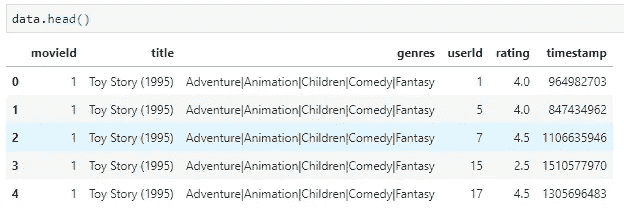

# 基础数据准备

我必须向你承认，我在整个数据清理过程中撒了谎。这个数据集不会有，因为它已经尽可能干净了:

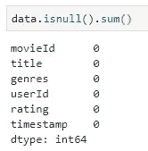

一个价值都没有丢失，这种情况很少见。上帝保佑教育数据集！

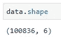

从数据集标题可以推断，有 100K 个条目。但是**电影有多少？**

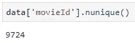

在 10K 周围。很好，实际上，我认为这将足以对电影市场得出一些一般性的结论。

# 探索电影发行年份

这一步需要做一些准备。我们的目标是分析电影发行年份的分布，但是这些信息还没有以预期的形式出现。

出版年份在标题栏中，在标题的末尾用括号括起来。然而，对于一些电影来说，情况并非如此，这使得提取过程有点困难。所以，逻辑如下:

*   如果存在出版年份，请删除括号并保留年份的整数表示
*   否则，将 9999 作为年份，这是缺少年份的明显标志

该代码块实现了所描述的逻辑:

Years — [https://gist.github.com/dradecic/d3224dfd866d8444fd03cc3cfd4cb526](https://gist.github.com/dradecic/d3224dfd866d8444fd03cc3cfd4cb526)

事实证明，只有 30 个实例没有年份信息，这并不可怕(*因为我们有 100K 行*)。现在让我们绘制一个这些年(*不包括 9999 年*)的**柱状图**。代码如下:

Histogram — [https://gist.github.com/dradecic/f6c28a9cb3f0f04b74c2bccf35b811a5](https://gist.github.com/dradecic/f6c28a9cb3f0f04b74c2bccf35b811a5)

一旦这个单元的代码被执行，下面是结果图表:

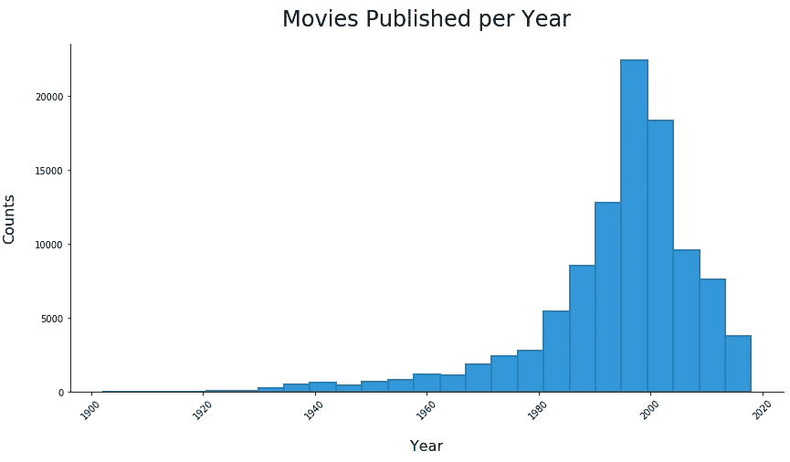

看起来，大多数电影都是在 1995 年到 2005 年之间上映的。

# 评级探索

此处可以使用来自 ***make_histogram*** 函数的逻辑，无需任何其他准备或数据操作，即可绘制电影评级的直方图。只要确保将 ***评级*** 作为属性传递，而不是 ***电影年份*** 。

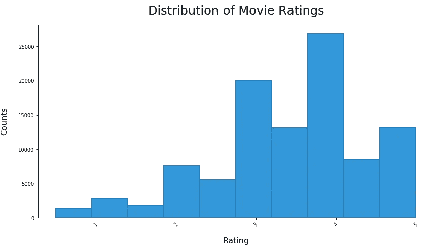

看起来平均评分会在 3.5 左右，而且看起来用户更倾向于给满分而不是 0.5。

# 电影类型探索

与出版年份一样，需要做一些准备。看看流派栏是什么样子的:

没有办法像现在这样分析它。我想完成以下任务:

*   拆分竖线(|)字符上的字符串
*   为每个流派创建一个新条目

所以，1 行*冒险|动画|儿童|喜剧|奇幻*应该变成 5 行，其他信息保持不变。熊猫提供了一个很好的方式来实现这一点:

Genres — [https://gist.github.com/dradecic/179d68a33510f8f25291e27c0b86eca1](https://gist.github.com/dradecic/179d68a33510f8f25291e27c0b86eca1)

这样就创建了一个新的数据帧，前几行如下所示:

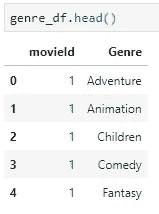

这 5 行现在代表原始数据集中的 1 行，所以，是的，这就是我的笔记本电脑在大型数据集上失败的地方— *它无法在内存中容纳 1 亿行。*

类似地，我现在可以声明一个绘制条形图的函数:

Bar Chart — [https://gist.github.com/dradecic/1f1d1519e55e3875942c927136161603](https://gist.github.com/dradecic/1f1d1519e55e3875942c927136161603)

我知道为一张图表做了很多准备，但这是值得的:

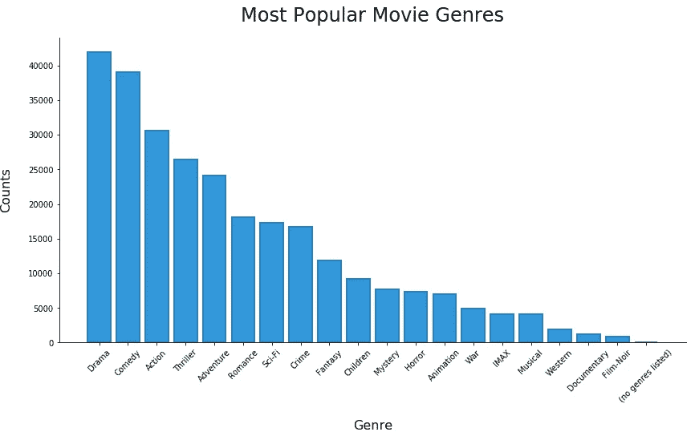

大多数电影都属于 ***剧情类*** 或 ***喜剧类*** 类别——这里没什么稀奇的。

# 按流派计算评分

获得这些信息可能是这篇文章中最困难的任务。这主要是因为它涉及到一些准备工作，背后的逻辑可能不像前面那样直观。您需要:

*   计算每部电影在单个流派级别上的评级(*流派字符串由|* 分割)
*   将每种类型的分级列表添加到词典中
*   计算平均评分，作为字典中列表的平均值

***听起来让人迷惑？***

Rating by Genre — [https://gist.github.com/dradecic/7a65cac23c59c8206417ec26a6411641](https://gist.github.com/dradecic/7a65cac23c59c8206417ec26a6411641)

在这里，您可以轻松地按流派划分等级:

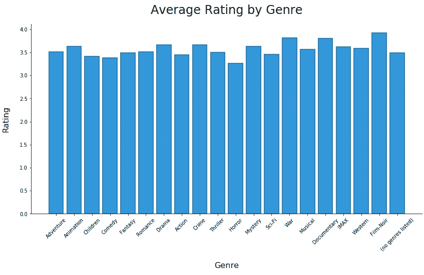

似乎黑色电影做得最好，但是，这种类型的电影数量最少。 ***恐怖*** 电影做得更糟，这是有道理的，有一吨只是可怕的恐怖。纪录片和战争电影往往比大多数电影都要好，这也是有道理的——*每个人都喜欢一部好的二战电影*，如果它以纪录片的形式呈现，我会给它打五星！

# 可视化评级数量

你已经完成了最后一部分，干得好！现在让我们深入了解一下**评级可视化**的数量。它也将涉及一些准备工作，但没有什么要求。您必须:

*   创建一个数据帧，将 ***movieId*** 列分组，并对实例进行计数
*   将其与原始数据集合并
*   重命名合并时出错的列

Num Ratings — [https://gist.github.com/dradecic/ef33ad4c942c2d013def6ed0c4945bc8](https://gist.github.com/dradecic/ef33ad4c942c2d013def6ed0c4945bc8)

在进入可视化之前，我们先来看看根据收视率排名的前 10 部电影:

Top 10 — [https://gist.github.com/dradecic/a5a6a669de0d6b380cad745d57a231f0](https://gist.github.com/dradecic/a5a6a669de0d6b380cad745d57a231f0)

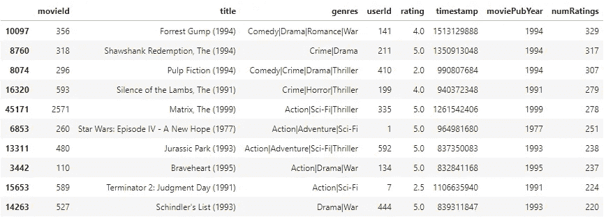

我对结果相当满意。这些顶级的都是经典之作，值得拥有。

***为什么按收视率数量而不是纯收视率排序？***

啊，问得好。原因是，我想避免被评为 5 星的电影，但只有一个或几个用户。如果这些电影足够受欢迎，会有更多的用户对它们进行评级，那么它们就是不相关的。

你现在可以绘制一个直方图的 ***列和*** 列:

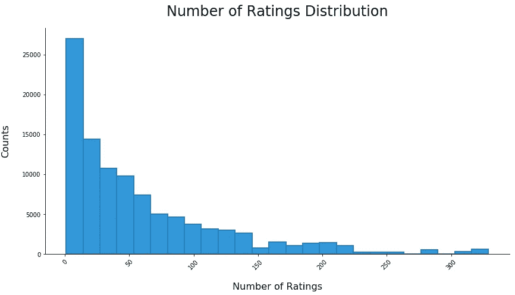

这是意料之中的。大多数电影没有很好的预算，总的来说，这导致了一部不太受欢迎的电影。如果电影不流行，大多数人不会看，因此，不会评价它。爱它或恨它，这就是它的工作方式。

最后，让我们用一个很好的评分与评分数量散点图来结束这一部分。代码如下:

Scatter Plot — [https://gist.github.com/dradecic/874c6f56bc1d92d3de45f6c170a5837f](https://gist.github.com/dradecic/874c6f56bc1d92d3de45f6c170a5837f)

下面是我的图表的样子:

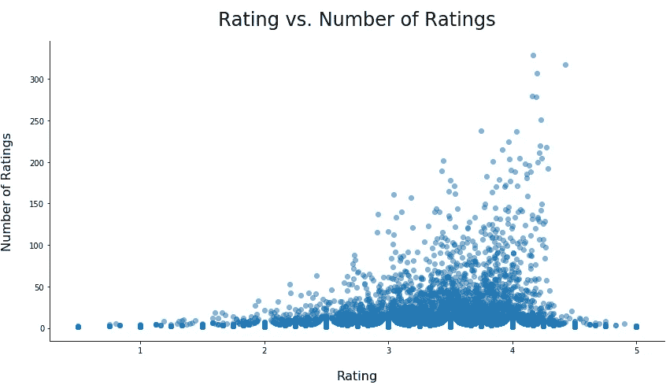

你可以在这里看到一个趋势——随着电影获得更多的评级，其平均评级往往会增加。如果你仔细想想，这也很有道理。如果越来越多的人在看一部特定的电影，它可能有很好的预算和很好的营销，这将意味着它是某种类型的大片，他们通常评价很高。

# 结论

这是一个很长的帖子，我知道。然而，它涵盖了探索性数据分析的每一个重要部分。现在你对数据本身更熟悉了，这意味着你在进一步的分析中不太可能犯一些愚蠢的错误。

下一篇文章将在几天后发布，在这篇文章中，你将创建你的第一个(*可能是*)推荐系统。它将被链接到这里，所以请把这篇文章放在你身边(*这听起来很奇怪*)。

 [## Python 中的推荐系统——第二部分(基于内容的系统)

### 深入推荐系统的神奇世界，并自己构建一个(第 2 部分)

towardsdatascience.com](/recommender-system-in-python-part-2-content-based-system-693a0e4bb306) 

***你有什么想法？你的分析中还包括了其他内容吗？如果有，请在评论区分享。***

*喜欢这篇文章吗？成为* [*中等会员*](https://medium.com/@radecicdario/membership) *继续无限制学习。如果你使用下面的链接，我会收到你的一部分会员费，不需要你额外付费。*

 [## 通过我的推荐链接加入 Medium-Dario rade ci

### 作为一个媒体会员，你的会员费的一部分会给你阅读的作家，你可以完全接触到每一个故事…

medium.com](https://medium.com/@radecicdario/membership) 

# 资源

[1][https://en.wikipedia.org/wiki/Recommender_system](https://en.wikipedia.org/wiki/Recommender_system)