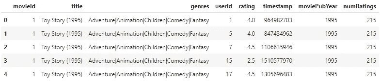
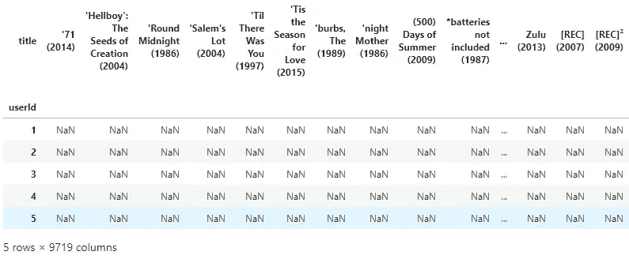
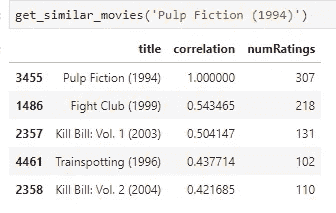
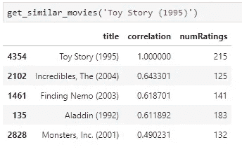

# Python 中的推荐系统——第二部分(基于内容的系统)

> 原文：<https://towardsdatascience.com/recommender-system-in-python-part-2-content-based-system-693a0e4bb306?source=collection_archive---------11----------------------->

Photo by [Pixabay](https://www.pexels.com/@pixabay?utm_content=attributionCopyText&utm_medium=referral&utm_source=pexels) from [Pexels](https://www.pexels.com/photo/board-cinema-cinematography-clapper-board-274937/?utm_content=attributionCopyText&utm_medium=referral&utm_source=pexels)

欢迎来到 2 部分系列的第二部分。这篇文章将着重于从以前探索过的电影数据集中开发一个简单的、基于内容的推荐系统。整个数据探索和分析已在第一部分完成，如果您错过了，请点击以下链接:

 [## Python 中的推荐系统第一部分(准备和分析)

### 深入推荐系统的神奇世界，自己构建一个(第 1 部分)

towardsdatascience.com](/recommender-system-in-python-part-1-preparation-and-analysis-d6bb7939091e) 

我不得不说，今天的帖子会比上一篇短得多。最主要的原因是，没有太多的推荐系统(*在这个基础层面至少有*)。话虽如此，今天的帖子将向您解释一个简单的基于内容的推荐系统背后的直觉和逻辑(*如果您不知道什么是基于内容的系统*，请参见第 1 部分)，您将看到这里没有实际的**机器学习**，只有高级的(*类似于*)过滤。

# 你为什么要读这篇文章？

与前一篇文章一样，它有两个主要好处:

1.  您将深入推荐系统的世界，并构建您的第一个(*可能是*)
2.  你会发现它们比看起来要简单

# 这篇文章是如何组织的？

前面我说了，这一部分会比上一部分短很多，上一部分涵盖了数据收集、准备和探索的过程。阅读那篇文章是**的先决条件**，因为如果你不阅读它(*或者至少复制其中的代码*，你的数据将不会与我的数据格式相同，因此你将无法继续。

帖子内容如下:

1.  矩阵创建
2.  创建获取推荐的函数
3.  获取和验证结果

在开始之前，数据集应该是这样的:

***弄成这个形状？你可以继续了。***

# 矩阵创建

对于矩阵，我的意思是您应该以某种方式创建具有以下内容的表:

*   每个用户 ID 作为一行
*   每个电影标题作为一个专栏
*   将每个用户对每部电影的评价定为行和列的交集

这很容易通过[熊猫](https://pandas.pydata.org/)***pivot _ table()***函数获得:

Movie Matrix — [https://gist.github.com/dradecic/339da863583482ef8fc67770e1a40bd7](https://gist.github.com/dradecic/339da863583482ef8fc67770e1a40bd7)

这个矩阵本质上是一个熊猫 **DataFrame** 对象，通过知道你知道你可以调用 ***。*头()**在上面:

是啊，很多 ***男*** ，我都知道。花一分钟思考为什么这么多的值丢失了，然后继续阅读。

***你拿到了吗？***

原因是，并不是每个人都看过每部电影并对其进行评级。这个表里面有 9700 多部电影，你自己想想吧。你看了多少部电影？在你看过的人中，你公开评价了多少？没那么多吧？

现在你有了矩阵，你可以进行下一步了。

# 创建获取推荐的函数

这是邮报的主要内容。如果这是你的第一个推荐系统，你会惊讶地发现做一个是多么容易，至少在初级水平上是这样。

下面是**你必须实现的逻辑**:

*   计算所需电影与其他电影的相关性(使用 ***)。*corrwith()**法)
*   将具有相关性的电影标题存储在单独的**数据帧**
*   将**数据帧**与原数据帧合并，删除重复数据，保留 ***标题*** 、 ***相关*** 系数、**编号**列
*   按相关性降序排序(*从最大相关性到最小相关性*
*   过滤掉收视率低的电影(*那些电影是不相关的，因为它们只被少数人看过*
*   返回 top **n** 相关电影

听起来工作量很大，但实际上只有 10 行代码。

The Function — [https://gist.github.com/dradecic/322359d1bf36de305c55a8fc539fec75](https://gist.github.com/dradecic/322359d1bf36de305c55a8fc539fec75)

如您所见，我已经设置了作为默认函数参数返回的过滤器数量和电影推荐数量，因此它们更容易调整。

简而言之，这就是你需要实现的全部逻辑。

***容易吧？***

# 获取和验证结果

获得推荐的过程现在就像函数调用一样简单。你需要传入的唯一参数是**电影标题**，并且它必须与数据集中存在的那个相同，每个小小的拼写错误都会破坏一切。请随意使用这个函数来解决这个问题。

如果我现在拿到低俗小说电影的推荐:

第一个显而易见，**低俗小说**与**低俗小说**完美关联，但看看之后的几个。

看看 [IMDB](https://www.imdb.com/) 给了这部电影什么推荐。很酷，对吧？

Obtained from IMDB on 29th September 2019 — [https://www.imdb.com/title/tt0110912/?ref_=tt_sims_tt](https://www.imdb.com/title/tt0110912/?ref_=tt_sims_tt)

我现在可以对电影**玩具总动员**做同样的事情:

很明显这些建议是有效的，但是让我们确认一下以防万一:

Obtained from IMDB on 29th September 2019 — [https://www.imdb.com/title/tt0114709/?ref_=nv_sr_3?ref_=nv_sr_3](https://www.imdb.com/title/tt0114709/?ref_=nv_sr_3?ref_=nv_sr_3)

《怪兽电力公司》和《海底总动员》是 IMDB 上的前 6 个推荐，而《超人总动员》**在下一页。**

# 结论

推荐系统做起来很有趣，也很容易验证(*至少在这种情况下*)。我希望在读完这篇文章后，你不会把它们看作是黑盒，因为它们基本上可以归结为用 Python ( *或你选择的语言*)进行一些数据操作。

***你考了哪些电影？你对结果满意吗？请让我知道。***