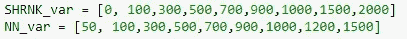
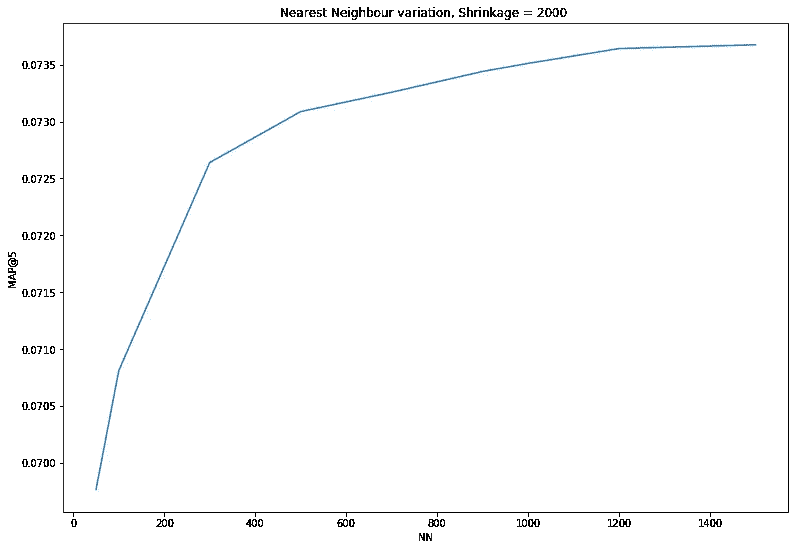
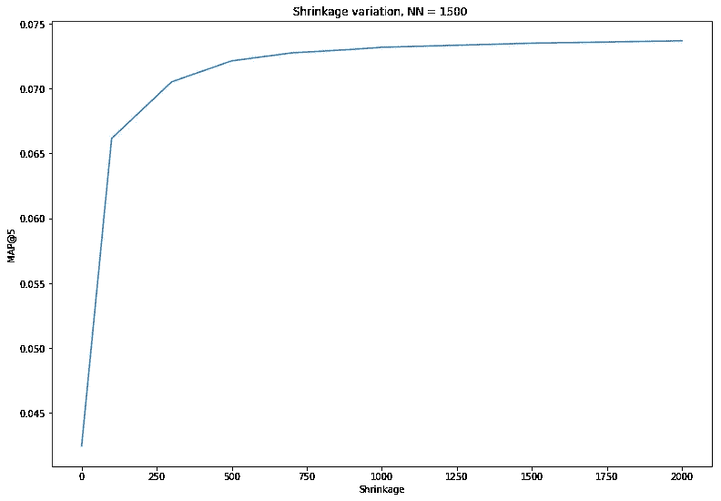
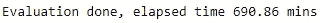
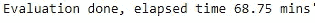
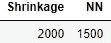
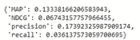
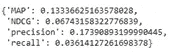

# 推荐系统和超参数调整

> 原文：<https://towardsdatascience.com/recommender-systems-and-hyper-parameter-tuning-25567b10e298?source=collection_archive---------4----------------------->

Photo by [rawpixel](https://unsplash.com/photos/RqzW7zFB6y0?utm_source=unsplash&utm_medium=referral&utm_content=creditCopyText) on [Unsplash](https://unsplash.com/search/photos/stand-out?utm_source=unsplash&utm_medium=referral&utm_content=creditCopyText)

## 机器学习中(经常)被遗忘的孩子

每一个有互联网连接的人都受到推荐系统(RS)的影响。

Spotify suggestions to

几乎所有的媒体服务都有一个特定的部分，系统会在那里向你推荐一些东西，比如网飞的一部电影、亚马逊的一件商品、Spotify 的一个播放列表、脸书的一个喜欢的页面等等。在我们日常使用的几乎所有服务中，我们都至少看过一次“你可能喜欢这个”部分；背后的算法是一个推荐系统。

> 有些人可能会认为简历是一个试图比你自己更了解你并给你所需要的东西的系统。如果你这么说的话，听起来有点(也许很多)令人毛骨悚然，但它的目标是通过了解你的喜欢和不喜欢，让你的体验变得尽可能好。

像机器学习(ML)的所有应用一样，RS 的前景是从大量数据中学习，然后对新的输入数据进行预测，其中 RS 中的预测可以被视为用户是否喜欢推荐项目的分类问题。尽管从数据存储方式(稀疏矩阵)到仅适用于 RS 的方法和模型都有明显的差异，但所有 ML 应用程序遵循的步骤都是相同的:

1.  数据可视化
2.  数据预处理
3.  选择模型
4.  培养
5.  估价
6.  ***超参数调谐*** (HPT)

虽然前 5 步都很好，但我在论文中遇到的最后一步是:超参数调整。在 RS 中进行 HPT 的可能方法缺乏材料和实际的例子，通常什么是最好的等等，这是非常突出的，这是写这篇文章的灵感来源。

## **温柔推荐系统介绍**

RS 算法的设置与任何其他 ML 应用程序相同，但有两个关键要素除外:

*   **数据存储**:在 RS 中，数据存储在稀疏矩阵中，更准确地说是存储在两个矩阵中， **URM** (用户评级矩阵)和 **ICM** (项目内容矩阵)。一个 URM，一个 *UserxItem* 矩阵，包含关于用户偏好的所有信息，也就是说，在一行中，我们有用户对服务提供的项目所做的评级(显式或隐式)。相反，ICM 是一个保存所有项目元数据的矩阵，其中每一行都包含一个项目的所有信息。
*   **方法**:可分为三种类型。

1.  **基于内容的**:我们利用项目的特征(元数据)来寻找其他与之相似的项目，然后向用户推荐与用户已经感兴趣的项目相似的项目。用更实际的话来说:对于一个喜欢/看过/评价电影《大美人》的用户来说，你推荐像《青春》这样的电影，是因为他们有一些共同点，比如导演(保罗·索伦蒂诺)、相同的流派(戏剧、喜剧)、关键词等等。
2.  **协同过滤**:利用了这样一个事实，即尽管人们可能不同，但在偏好方面存在模式，因此两个具有相似偏好的用户，我们向其中一个推荐其他人喜欢但该用户不知道的项目。
3.  **混血儿**:前两者通过旧方式组合而成

一旦你准备好了数据，也就是矩阵，并选择了使用的方法，这就是矩阵乘法的问题了。

## **超参数调谐**

我们在模型调整中所做的是塑造我们的模型，目标是在看不见的数据(测试集)中获得尽可能好的分数。在跳到 HPT 可以做的方式之前，首先我们需要知道什么是超参数(HP)。

> 在 ML 中，超参数是模型不会自己学习的参数，但我们必须在模型开始学习之前提供给模型，例如神经网络中隐藏单元的数量、随机森林中的树的数量、KNN 最近邻居的 K 个数量等*。*

关键是 HP 本身需要被学习:我们事先不知道一个神经网络中的 10 个隐藏单元是否是我们问题的最佳选择，或者 1000 个是否更好，随机森林中的 50 棵树是否会比 100 棵树产生更好的性能，等等。因此需要做 HPT。

> HP 不要与参数混淆:虽然 HP 是由我们提供给模型的，但参数是在模型通常的黑盒中自动学习的。

通过快速搜索，您会发现 HPT 最基本、最常用的方法是:

1.  手动:我们可以回到用两块石头生火的时候
2.  **网格搜索(GS)** :稍微好一点了
3.  **随机搜索**:你开始看到光明了
4.  **贝叶斯优化(BO)** :现在我们来谈谈

对 HPT 方法的这种考虑背后的主要原因仅仅是由于一个事实:**时间**。为您的问题找到最佳惠普所花费的时间至关重要，尤其是在必须实时提供建议，并根据您在线插入的信息进行更新的领域。

为了证明所有这一切背后的争论，我举了一个相当简单的例子来证明这一点，面对其中的两种方法:

*   GS :一个简单的强力方法
*   **BO** :一种自动化的方法，已经被证明在许多问题上优于其他最先进的优化算法。

为了不进入太多的细节，该算法用于后的范围是不是，基本事实是这些:

**数据集** : [MovieLens](https://grouplens.org/datasets/movielens/10m/) 数据集，有 1000 万次交互

**RS 方法** : KNN，一种基于内容的方法，对于每部电影，我们找到与其相似的 K 部电影(最近的邻居)，其中相似度是余弦相似度

**训练-测试**:80%-20%的分割，训练集中约有 800 万次交互，测试集中约有 200 万次交互

**验证集**:为了使 HPT 成为可能，我们还需要一个验证集，我通过将训练集以 80-20%的比例进一步分为训练集和验证集来生成它，所以现在我们在训练集中有大约 740 万个交互，在验证集中有 1.6 个交互

**Metric**:MAP @ 5(Mean Average Precision)将推荐视为一项排名任务，目标是首先向用户推荐最有可能让用户喜欢的项目。5 代表评估推荐的前 5 个项目。MAP 的值从 0 到 1。贴图值越高越好。

**调整**的超参数:NN(最近邻)和收缩系数

## **网格搜索**

GS 背后的想法是用你的超参数的可能值创建一个网格，然后开始测试这些可能值的组合。

Hyper-parameters’ set of values

在我们的例子中，可能的组合是 81，这意味着用每个参数组合训练和评估我们的算法 81 次。想象一下有两个以上的参数需要调整，想象一下组合的数量会增加，因此时间也会增加。是啊，这需要更多的时间。

NN variation impact on performance (on Validation set)

Shrinkage variation impact on performance (on Validation set)

**好的**:通过将一个参数固定在 GS 找到的最佳值，我们改变另一个参数，以可视化性能的变化。模型对超参数的敏感性显而易见，表明了这一步骤在创建 rs 过程中的重要性。

Running time of GS

不太好:这是尝试所有组合所花的时间！

不用说，我疯狂地寻找另一种方法来完成我的模型训练的最后一步，我的研究将我引向 BO。

## **贝叶斯优化方法**

关于 GS，手动和随机搜索，下一组要评估的超参数是在不知情的情况下产生的。这就是业务对象方法的突出之处:它使用过去做出的选择，以便为要测试的下一组值做出明智的选择，从而以搜索下一个要以更智能的方式测试的参数为代价来减少评估的数量。

随着优化的进行，在 BO 中，我们的目标是找到有界集合 *X* 上的函数 *f (x)* 的最大值(或最小值),这转化为这个特定问题意味着所考虑的函数是这样一个函数，在综合中给定来自*X*(HP 的所有可能值的集合)的输入 X(HP 的配置),它返回用这样的 HP 生成的模型的性能。对于业务对象流程，函数 *f* 是未知的，它所做的是在它之前关联 a。先验的目的是表达关于被优化的函数的假设，并且随着评估的进行，形成后验分布。然后，后验分布本身被用于驱动下一个输入(HP)的获取函数以进行评估。这是一个连续的策略，因此随着迭代次数的增加，后验的质量也增加，这反过来意味着下一个要探索的区域的质量的确定性更高。

至于其他许多关于 ds 世界的方法，你可以把它作为一个黑盒来达到你的目标，或者你可以试着做一些解包，试着理解这样的优化是如何完成的。这种方法的完整解释可以在这里[阅读](http://papers.nips.cc/paper/4522-practical-bayesian-optimization-of-machine-learning-algorithms.pdf)，这是本文所用 BO 实现的基础。如果你想读些轻松的东西，这篇文章对我很有帮助。

本例中使用的 BO 的实现是[这个 Python 库](https://github.com/fmfn/BayesianOptimization)。

在实践中，为了给 HPT 做业务对象，您需要定义三个基本要素:

*   参数值的范围，所以函数的定义域:

*   要优化的函数，其中您可以适应您想要的任何指标，因此该方法很方便:

*   调用函数

BO 唯一棘手的方面是，它选择连续值进行试验，如果超参数是整数，您需要进行调整；没有什么简单的铸造不能解决的。定义这三个要素，你的工作就完成了。

达到相同结果的时间差你可能会想:

BO running time

使用 *GS* 找到的最佳参数组合:

使用 *BO* 找到的最佳参数组合:

NN | Shrinkage

这些参数略有变化，但不用担心。一个简单的测试可以消除任何疑问。

Performance with parameters found by BO

Performance with parameters found by GS

时间性能上的差异是显而易见的，几乎少了 10 倍，但这两种方法都达到了目标。这绝不是一个简单的例子，可以用来证明贝叶斯优化是解决所有推荐系统问题的方法，但有趣的是，RS 在使用 BO 时也不例外。毕竟，如果数据科学中有确定性的话，那就是没有确定性的方法会在你的数据集中起作用。