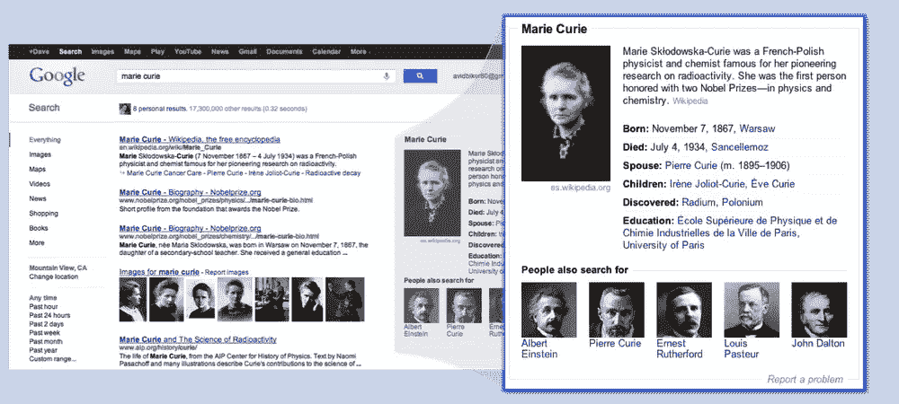
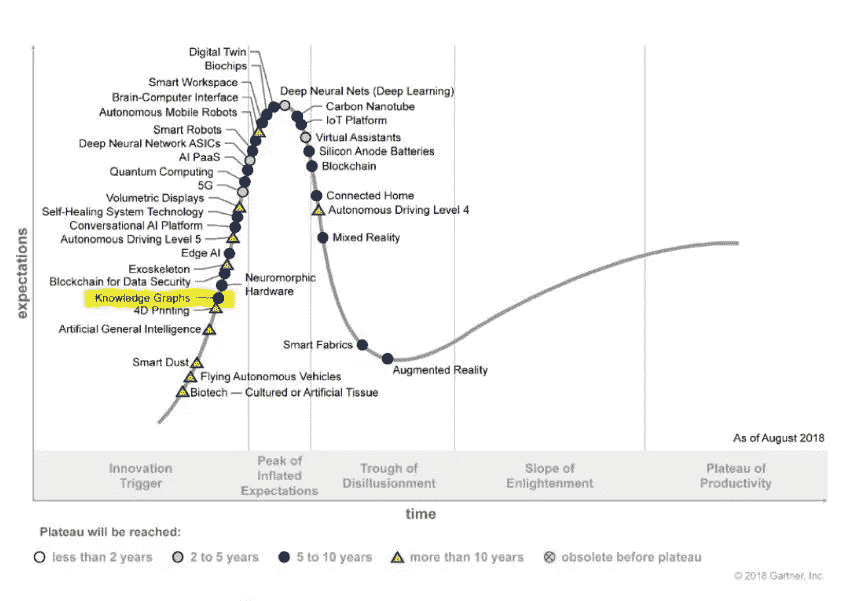
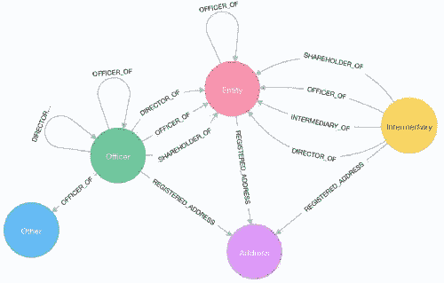
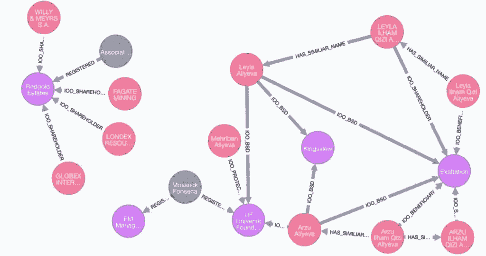

# 用知识图表协调您的数据和世界

> 原文：<https://towardsdatascience.com/reconciling-your-data-and-the-world-with-knowledge-graphs-bce66b377b14?source=collection_archive---------14----------------------->

## 对知识图表迷人世界的全面介绍。


*Featured image credits: The GDELT Project*

知识是任何成功计划的核心。在数据时代，人们会认为整合知识的任务会比以往任何时候都容易。

然而，数据量、数据速度和数据准确性这三个因素使得这项任务一点也不容易。实现这一目标的有效方法是什么？

输入知识图表。

知识的图形化表示已经存在了几十年，可以追溯到 20 世纪 60 年代。

在我们的[上一篇文章](/traversing-the-land-of-graph-computing-and-databases-5cbf8e8ad66b)中，我们谈到了图形技术(数据库、处理和可视化)。我们还探讨了它如何解决阻碍数据驱动计划高效运行的多个棘手问题。

图形技术崛起的一个关键点是谷歌[早在 2012 年就发布了其知识图](https://www.blog.google/products/search/introducing-knowledge-graph-things-not/) (KG)。



*Google’s KG acquires and connects data from multiple sources so that you can see this box. Photo courtesy:* [*Google*](https://www.blog.google/products/search/introducing-knowledge-graph-things-not/)

一些最大的技术公司的核心是知识图表。2018 年，Gartner 将 kg 纳入了[技术炒作周期](https://www.gartner.com/smarterwithgartner/5-trends-emerge-in-gartner-hype-cycle-for-emerging-technologies-2018/)。



*Knowledge graphs were included under the ‘Digitalized Ecosystems’ trend in the 2018 hype cycle.*
*Photo courtesy:* [*Gartner*](https://www.gartner.com/en)

# 什么是知识图(KG)？

尽管有突出的学术和行业例子，围绕术语知识图有许多混乱。2016 年的论文“[走向知识图的定义](http://ceur-ws.org/Vol-1695/paper4.pdf)”探讨了这一困境，并试图提供一个定义。

你也可以在网上找到其他合理的定义。在这些定义的基础上，我尝试给出一个定义:

> 知识图由图形数据存储和知识工具包组成。它使用遵循本体的图模型将领域的数据存储为实体和关系。
> 知识工具包支持持续集成来自多个来源的数据，允许最终用户有效地查询图表，并从现有信息中进行推断。



*Sample Panama papers data schema. Photo courtesy:* [*Neo4j*](https://neo4j.com/)



*Here’s how a portion of a KG may look like.* *Photo courtesy:* [*Neo4j*](https://neo4j.com/)

可以把本体看作是图形数据的一种模式。这并不完全准确，但这是一个有用的开始方式。一个领域的本体以一种类似于真实世界的方式定义了它的成员(实体、关系)和它们的属性。点击阅读更多相关信息[。​](https://blog.grakn.ai/what-is-an-ontology-c5baac4a2f6c)

此外，上面提到的工具包可以提供许多高级功能，如[语义搜索](https://en.wikipedia.org/wiki/Semantic_search)和机器学习(ML)能力。我的定义只涵盖了最低限度。

# 为什么要关心知识图(kg)？

当谷歌引入 KGs 时，他们写了一个[博客](https://www.blog.google/products/search/introducing-knowledge-graph-things-not/)，提到 KGs 如何允许用户通过“事物，而不是字符串”进行搜索。图表更接近我们的心理模型，使我们可以很容易地将数据描述为现实世界的对象。

一公斤的重量伴随着图形技术公司通常的 T4 优势。这意味着摆脱昂贵的连接操作、白板友好的数据模型、稀疏数据的有效处理，以及使用诸如 [PageRank](https://en.wikipedia.org/wiki/PageRank) 之类的便捷算法。图表也可以帮助[改善 ML](https://ai.googleblog.com/2016/10/graph-powered-machine-learning-at-google.html) 的现状。特别是，[图形神经网络](https://github.com/deepmind/graph_nets)最近出现在[新闻](https://www.zdnet.com/article/google-ponders-the-shortcomings-of-machine-learning/)中。

现在，添加一个强大的知识工具包，您将获得:

*   从结构化(RDBMS)到非结构化(文本和图像)的多种来源和不同格式的数据的持续集成。
*   逻辑推理和推断能力。例如，从“A 在化学系工作”、“B 管理化学系”等关系中，系统应该推断出“B 是 A 的经理”。
*   实体解析和提取功能，用于处理杂乱的数据和事实的多个版本。下图显示了一个示例，其中一个人有两个与其姓名相关联的不同记录，这种情况必须得到解决。

```
first name | last name |    address       | phone   | ------------------------------------------------------ 
Sal        | khan      | 10 m nagar       | 91-0123 | 
Salman     | Khan      | 10 Malviya Nagar |         |
```

此外，KG 还充当了多个团队甚至整个组织的共享资源和公共接口。例如，使用来自多个部门的数据的 ML 模型需要查询 KG 的实体和关系，而不是来自多个筒仓(仓库、湖泊和 RDBMSes)的数据。

# 语义网和它有什么关系？

你可能经常会发现知识图和[语义网](https://en.wikipedia.org/wiki/Semantic_Web)在同一个语境中被提及。有一段时间，语义网技术和标准是 KGs 的同义词。现在不是这样的。

注意上面的定义并没有提到具体的标准。

使用语义 web 标准构建图表有很多好处，包括容易与使用相同标准发布的许多公共知识库集成。然而，相关的复杂性和陡峭的学习曲线可能会使其更加困难和无用。

# 那么，我该如何使用它呢？

以下任一方法都可以提供对 KG 的访问:

*   **可视化层**:可视化浏览器和直观的界面可以用来为最终用户提供图形浏览体验。这对于不熟悉编程或查询语言的领域经验丰富的用户特别有用。
*   **查询层**:可以使用 [Sparql](https://en.wikipedia.org/wiki/SPARQL) 、 [Gremlin](https://tinkerpop.apache.org/gremlin.html) 和 [Cypher](https://neo4j.com/developer/cypher-query-language/) 等语言查询存储 KG 的数据库。


An example of a query on Gremlin.
Query courtesy: [Apache Tinkerpop](https://tinkerpop.apache.org/)

*   **API 层:**能够通过 REST 或编程语言访问 KG 在开发应用程序时很有用。

# 野外知识图表

工业界、学术界和公共领域都有成功的例子。

*   一些最大的互联网公司，包括谷歌、微软(Bing，LinkedIn)、脸书、阿里巴巴和优步，[使用 KGs](https://queue.acm.org/detail.cfm?id=3332266) 为他们的内部和外部服务提供动力。
*   像美国国家航空航天局(研究)和汤森路透(金融)这样的组织也接受了 KGs。
*   CMU 的 NELL (永无止境的语言学习)是一个学术项目，试图创建一个学习阅读网页并使用 KG 存储信息的计算机系统。

GDelt 项目是一个实时的全球开放数据图。它不断从世界各地的新闻媒体中提取信息。

# 知识图表的挑战

知识图被用于不同的行业，它们的用例在功能上可能有所不同。但是他们在实现一个有用的知识工具包时面临的核心挑战是一样的。

*   **实体歧义消除和解决:**不同的源可能不同地指代相同的实体。其他时候，不同的实体可能共享属性，如名称。我们需要为图中的实体分配唯一的规范化身份。
*   **知识提取和整合:**尽管最近在 ML 和[自然语言处理](https://en.wikipedia.org/wiki/Natural_language_processing) (NLP)方面取得了进展，但从异构源(文本、RDBMS 和 pdf)中提取信息仍然是一个挑战。整合它们也不是一项简单的任务。
*   **管理变化:**加上身份挑战，捕捉知识随时间的演变会变得很困难。KG 可能需要存储时间偏移和历史。例如，如果一家公司被收购，如何管理其新旧身份？
*   **轻松访问:**用户界面可以是查询编辑器、可视化资源管理器或编程接口，如软件库或 API。
*   **安全和隐私:**如果要广泛部署 kg，它们必须在提供价值的同时考虑隐私和安全问题。
*   **规模化经营:**当规模化的挑战到来时，上述所有问题都变得更加难以解决。

在 Atlan，我们一直致力于为世界各地的数据团队解决数据民主化问题。我们每天都在应对激动人心的挑战，包括上面列出的挑战。请继续收听我们的经历。

# 最后的话

互联数据比以往任何时候都更加重要。能够有效地整合孤岛对于从数据中提取价值至关重要。知识图表提供了一个很好的方法来做同样的事情。它可以增强从业务用户(改进的数据发现)到数据科学家(更好的 ML 模型)的利益相关者的能力。

着手构建和操作知识图表确实会带来挑战。但是一个有效的工具包可以帮助你应对挑战。

如果你想了解 KGs 是否适合你的用例或者有疑问，请留下评论。🙂

以下是一些参考资料，它们在我为这篇文章做研究时对我有所帮助:

*   [行业规模的知识图表:经验和挑战](https://queue.acm.org/detail.cfm?id=3332266)
*   [走向知识图的定义](http://ceur-ws.org/Vol-1695/paper4.pdf)
*   [宣传之外的知识图表:从图表和数据库中获取知识](https://www.zdnet.com/article/knowledge-graphs-beyond-the-hype-getting-knowledge-in-and-out-of-graphs-and-databases/)

*原载于*[*https://humansofdata.atlan.com*](https://humansofdata.atlan.com/2019/08/reconciling-your-data-and-the-world-with-knowledge-graphs/)*2019 年 8 月 22 日*

谢谢你的阅读。关注我 [**中**](https://medium.com/@AkashTandon) 了解更多内容。非常感谢您的反馈。你可以通过推特 [@AkashTandon](https://twitter.com/AkashTandon) 联系到我。