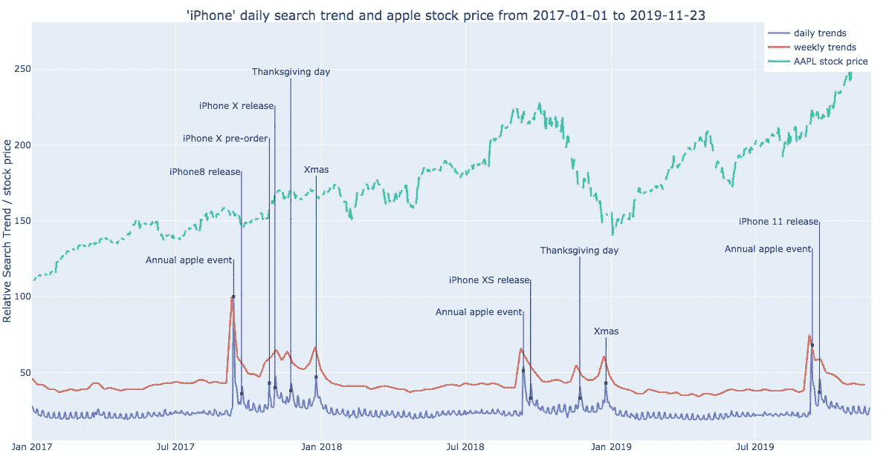
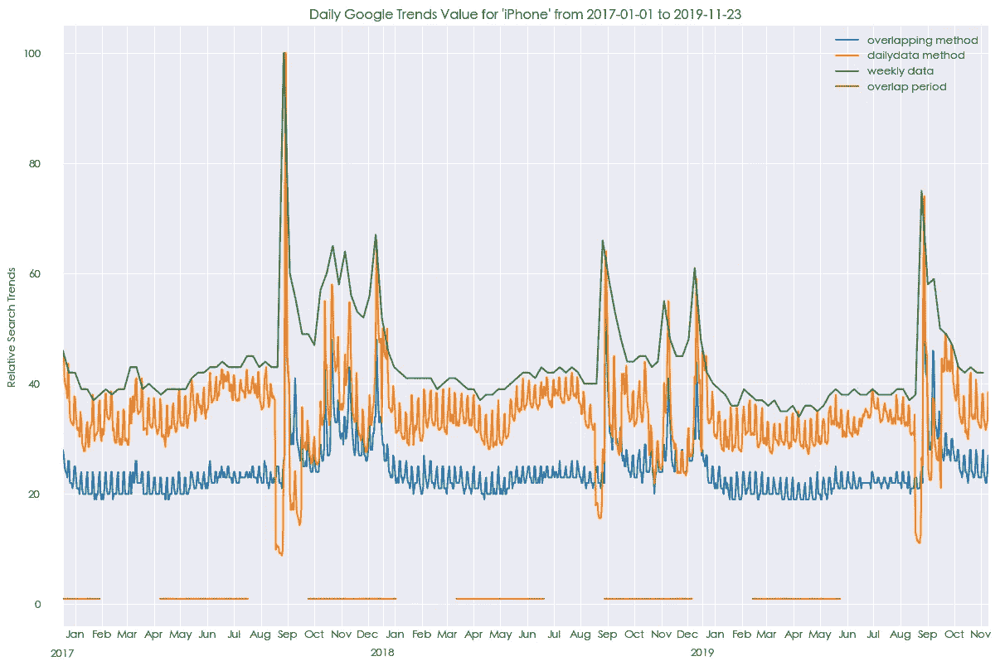
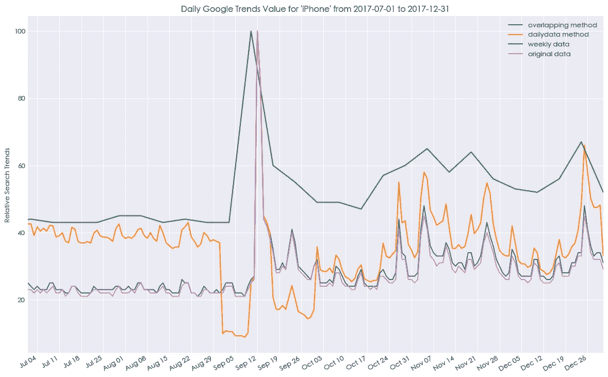
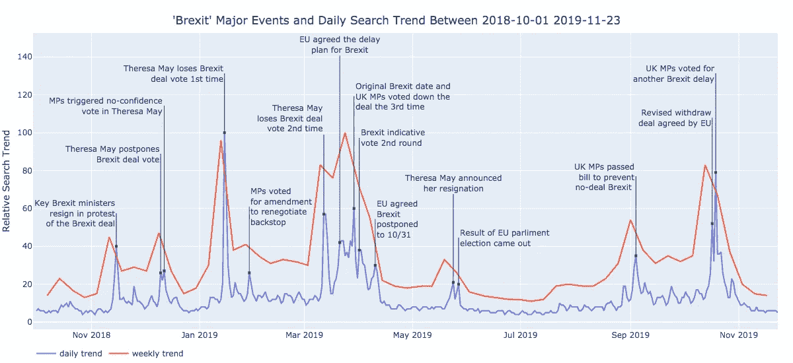
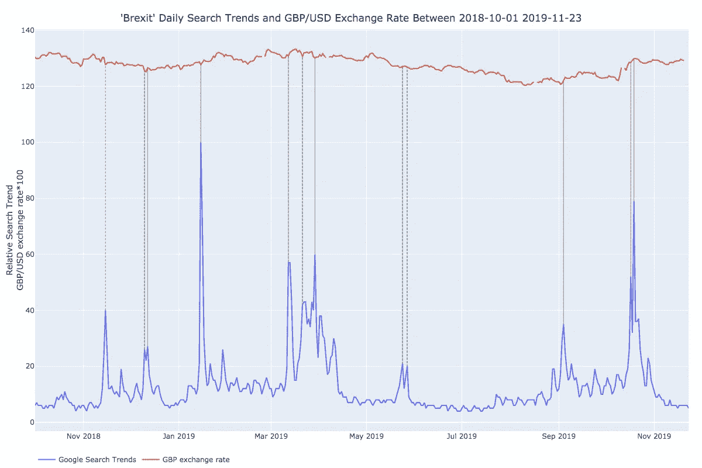

# 重建谷歌趋势长期每日数据

> 原文：<https://towardsdatascience.com/reconstruct-google-trends-daily-data-for-extended-period-75b6ca1d3420?source=collection_archive---------6----------------------->

## 比较方法以超越每日趋势数据的 9 个月查询限制。

iPhone search trends, AAPL stock price and Apple key events

*   我们可以在任何持续时间内以每日分辨率获取搜索趋势数据。
*   用每周趋势来衡量每日数据可能会产生一些假象。
*   只要在重叠期间有足够的搜索活动，使用重叠期间进行缩放会更好。
*   代码可以在这里找到[。](https://github.com/qztseng/google-trends-daily/blob/master/gtrend.py)

随着谷歌获得了互联网搜索的垄断地位，随着时间的推移，我们搜索的任何内容都成为了另一种公众兴趣的衡量标准。[谷歌新闻实验室](https://medium.com/google-news-lab/what-is-google-trends-data-and-what-does-it-mean-b48f07342ee8)已经很好地解释了这一点，一些文章展示了基于谷歌趋势的数据分析，如[结束与某人关系的循环模式](/heartbreak-monday-blues-and-pytrends-f1a398591a79)、[预测美国总统竞选](/elizabeth-warren-is-leading-the-2020-presidential-race-an-analysis-in-python-967e272d15da)等。

## 局限性

为了充分利用搜索趋势数据库，可以使用 python 模块 [pytrends](https://github.com/GeneralMills/pytrends/blob/master/pytrends/dailydata.py) 或 R 包 [gtrendsR](https://cran.r-project.org/web/packages/gtrendsR/index.html) 。然而，google 目前基于查询的时间框架限制了时间分辨率。例如，过去 7 天的查询将具有每小时的搜索趋势(所谓的实时数据)，每天的数据仅提供给短于 9 个月且在您搜索之前最多 36 个小时的查询期(如 [Google Trends FAQ](https://support.google.com/trends/answer/4365533?hl=en&ref_topic=6248052) 所述)，每周的数据提供给 9 个月到 5 年之间的查询，任何长于 5 年的查询将仅返回每月的数据。

我研究这个课题的动机最初是受到 Kaggle 的 [Rossmann 竞赛](https://www.kaggle.com/c/rossmann-store-sales)的启发，在该竞赛中，谷歌搜索趋势被用来预测销售数字。我发现获取每日搜索趋势并不那么明显，人们使用每周趋势作为替代。但是，对于任何需要每日精度和实时应用的预测模型来说，它并不理想(因为每周数据只在本周结束时可用)。

## 比较重建每日趋势的方法

虽然人们已经想出了规避的方法(比如:这里的，这里的)。我很好奇这些方法是如何相互比较的，如何与原始的每日趋势数据最匹配。因此，我使用“iPhone”作为关键词，通过以下三种方法重建 35 个月的每日趋势数据:

1.  从多个 1 个月的查询中串联的每日数据，并通过相应的每周趋势数据进行标准化。(pytrends 中实现的 [dailydata](https://github.com/GeneralMills/pytrends/blob/master/pytrends/dailydata.py) 函数)。
2.  查询具有大量重叠时段的多个 9 个月时段，并使用重叠时段来获得一致的缩放比例(类似于此处的目的)。
3.  每日数据只是从每周数据中插入的。(供参考)

Comparing daily trend data obtained using the overlapping method(blue), dailydata method from pytrends(orange), interpolation from weekly data(green), and the overlapped period used for scaling (red)

乍一看，我们可以注意到他们给出了完全不同的结果。pytrends 的 dailydata 函数与周数据匹配得相当好，其基线值(重要峰值之间的周期)高于通过重叠方法获得的值。目前，很难说哪个更好，尽管如此，每日数据(绿线)在主要峰值附近有一些明显的下降，例如 2017 年 9 月左右的最低值。

为了验证哪些重建的每日趋势与原始数据匹配得更好，直接提取较短时期(< 9 个月)的每日数据进行比较。

Comparing daily trends data normalized differently with the original daily trends (pink)

现在很清楚，重叠方法(蓝线)与原始日数据(粉线)最匹配，橙色线的下降是由周数据缩放产生的伪影。

## 英国退出欧盟、谷歌趋势和英镑

为了进一步展示长期每日搜索数据的潜在优势和应用，我们使用“英国退出欧盟”作为 2018 年 10 月至 2019 年 11 月期间的搜索词。重建的每日数据与默认的每周数据(因为查询期长于 9 个月)一起绘制，以便进行比较。

Compare the daily trend reconstructed by the overlapping method (blue) with the original weekly trend (red).

有了重建的每日趋势，我们可以精确地将搜索趋势的激增与这 14 个月期间的每个重大事件相匹配。它还使我们能够比较每个不同事件日期的相对搜索量，而每周趋势失去了分辨率，相邻事件的相对搜索量被平均(或汇集在一起)。

出于好奇，我试图将英镑汇率叠加在每日趋势图上。当“英国退出欧盟”搜索达到顶峰时，英镑经常在同一天暴跌，这并不奇怪。

GBP/USD exchange rate and ‘Brexit’ search trends

也许谷歌会取消这样的限制，并在未来提供一个更方便的 API，但在此之前，缝合和缩放重叠查询可能是最好的方式，以获得长期的每日搜索趋势。

**重构每日走势和生成本文剧情的代码可以在* [*github*](https://github.com/qztseng/google-trends-daily) *上找到。*