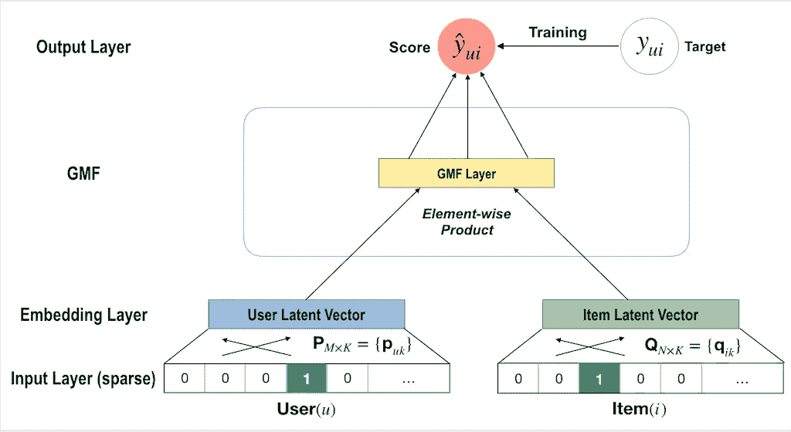
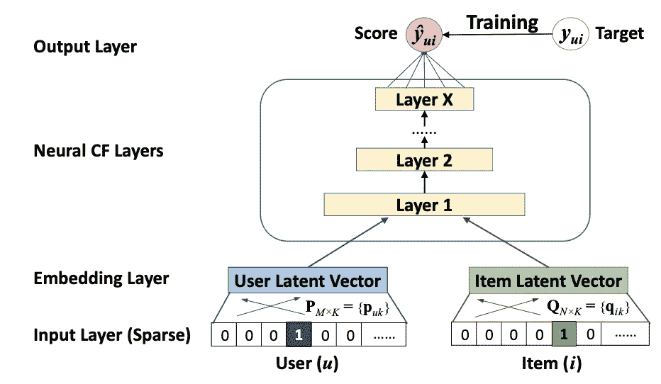
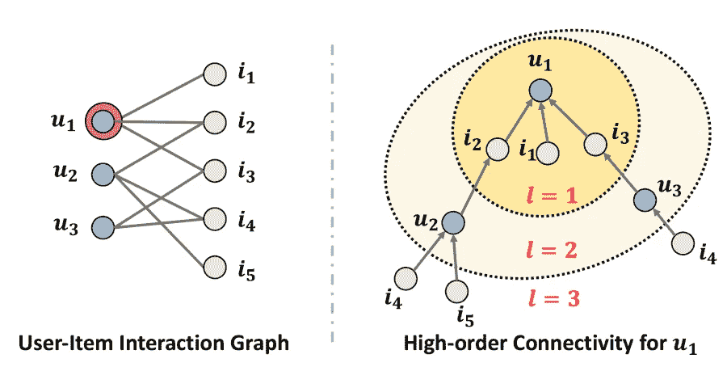
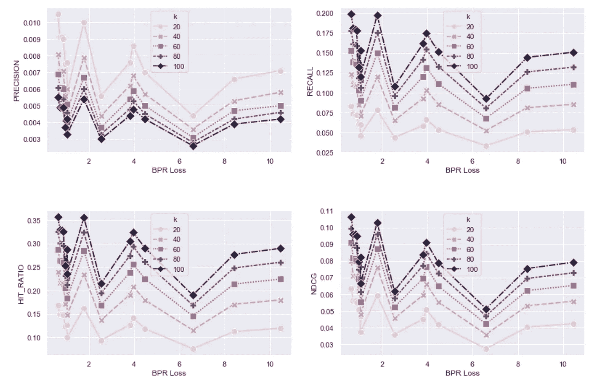

# RecoTour II:神经推荐算法

> 原文：<https://towardsdatascience.com/recotour-ii-neural-recommendation-algorithms-49733938d56e?source=collection_archive---------23----------------------->

这是 python 推荐算法系列文章的第二篇。在我很久以前写的系列文章的第一篇中，我快速浏览了我使用 Kaggle 的 [Ponpare](https://www.kaggle.com/c/coupon-purchase-prediction) 数据集实现并尝试的一些算法。你可以在[回购](https://github.com/jrzaurin/RecoTour/tree/master/Ponpare)中找到所有相关代码。在这篇文章中，我将使用[亚马逊评论数据集](https://arxiv.org/pdf/1602.01585.pdf) [1] [2]，特别是 5 核电影和电视评论，来说明两种基于 DL 的推荐算法的使用:[神经协同过滤](https://arxiv.org/pdf/1708.05031.pdf) [3]和最近的[神经图协同过滤](https://arxiv.org/pdf/1905.08108.pdf) [4]。

在我继续之前，让我强调以下几点。我在这里所做的是，在阅读了作者的论文后，使用 Pytorch 实现了他们的原始解决方案(分别在 Keras 和 Tensorflow 中)。与 [RecoTour](https://github.com/jrzaurin/RecoTour) repo 中的所有其他算法一样，我用大量细节编写了许多笔记本，从如何准备数据到如何训练和验证结果。我还加入了一些额外的功能，并根据我的喜好修改了代码。然而，当然，**所有的荣誉都归于作者**，感谢他们出色的论文和代码的发布，这总是令人感激的。一旦清楚了这一点，不再赘言，让我们继续讨论算法

# 1.神经协同过滤(NCF)

让我首先澄清一下，作者将 NCF 作为一个通用框架，在他们论文的第 3 节中，它被表述为由一系列接收用户和项目嵌入的所谓 NCF 层组成。

**1.1 算法**

他们最终在该通用框架的上下文中实现的特定算法被称为神经矩阵分解(NeuMF)。这个算法比较简单，所以我不打算在这里花太多时间。网上有很多帖子，你或许可以在那里找到更多信息，一如既往，我强烈建议你阅读报纸，在那里你可以找到*所有的*细节。此外，在前几节中，你会发现引导作者实现算法的基本原理(你知道…科学论证)。

NeuMF 由两部分组成，一部分被作者称为通用矩阵分解(GMF)，另一部分是多层感知器(MLP)。GMF 实际上是用户和项目嵌入之间的元素产品。我猜是如此简单，作者甚至没有考虑包括一个数字只是 GMF。尽管如此，我还是做了一个，这就是:

Fig 1\. GMF model

相应的向前传球很简单:

GMF forward pass

哪里`out=nn.Linear(in_features=n_emb, out_features=1)`。

MLP 其实并不复杂。他们论文中的图 2 显示了 NCF 的一般框架:

Fig 2\. MLP model. (Figure 2 in their paper)

如果我们认为神经 CF 层是一些激活的线性层，我们就有了 MLP 模型。相应的向前传球:

MLP forward pass

其中`mlp`只是线性图层的`Sequential`堆栈，而`out`与 GMF 的相同，具有相应数量的输入要素。

一旦我们有了所有的构建模块，NeuMF 就是两者的结合。如图 3 所示:

Fig 3\. NeuMF model (Figure 3 in their paper.)

形式上，NeuMF 可以定义为:

Equation(s) 1\. NeuMF, all the math you need

其中φ-*GMF 是 MF 嵌入之间的*元素乘积。φ-MLP 是所谓的 MLP 嵌入通过一系列具有一些激活*的线性层的结果，而 y_hat 只是φ-*GMF 和*φ-MLP 的串联的结果，通过具有 sigmoid 激活(σ)的线性层。*

*在代码中(即正向传递):*

*NeuMF forward pass*

*至于 NeuMF 算法本身，就是这样，真的。*

***1.2 培训/验证策略和结果***

*在我们进入下一个算法之前，请允许我简单地评论一下作者的训练/验证策略，以及我使用该策略在 [Amazon Revies 数据集](https://arxiv.org/pdf/1602.01585.pdf)上获得的结果。*

*对于给定的用户，作者分割数据集，使得除了一个之外，该用户的所有评价项目都用于训练，而剩余的评价项目用于测试。然后，在训练期间，负面隐式反馈通过每个正面项目包括 *N 个*负面项目(从未评定)来表示。例如，如果用户评价了 10 部电影，并且 *N* =4，则在训练期间将为该用户使用 50 次观察(10 次肯定+ 40 次否定)。注意， *N* 负样本是每个历元随机采样的，这样算法就对用户不喜欢的物品类型有了更全面的看法(参见[这里的](https://github.com/jrzaurin/RecoTour/blob/768896376f0909b960bc1b9ceac8811e412b6d2f/Amazon/neural_cf/gmf.py#L84)中的 repo)。在训练期间，预测得分是对输出层应用 sigmoid 函数的结果，损失是二进制交叉熵(BCE)损失。*

*在测试期间，每个用户使用一组 100 个项目。其中一项是训练时没有用到的正面项目，其余九十九项是随机选取的负面项目。然后，我们预测这 100 个项目的得分，并计算排名指标。在 NeuMF 的情况下，这些是命中率(HR)和在 k 推荐值(在本例中 k=10)下的归一化贴现累积收益(NDCG)。*

*NeuMF 可以在有或没有 GMF 或 MLP 预训练权重的情况下运行，具有不同数量的嵌入、MLP 层等。我已经运行了许多实验(可以在 repo 的脚本`run_experiments.sh`中找到)，包括使用[循环学习率](https://arxiv.org/pdf/1506.01186.pdf)【5】，对结果的讨论可以在本[笔记本](https://github.com/jrzaurin/RecoTour/blob/master/Amazon/neural_cf/Chapter05_results_summary.ipynb)中找到。让我在这里简单总结一下。*

**

*Fig 4\. Ranking metrics vs Embedding dimension for the GMF and MLP models*

*图 4 显示了根据嵌入数量(8、16、32 和 64)绘制的 GMF 和 MLP 模型获得的排名度量。有趣的是，使用最简单的模型(即 GMF 和低嵌入数)可以获得更好的排名指标。这表明，对于这个特定的数据集，可以通过简单的算法获得好的推荐，一般来说，这并不是不寻常的结果。尽管如此，值得一提的是，使用预训练权重的 NeuMF 算法获得了最好的结果，但是改进是微不足道的。当然，在“*真实世界*”中，人们可能想知道增加的复杂性是否补偿了排名指标的边际增加。*

**

*Fig 5\. Ranking metrics vs BCE Loss for the GMF and MLP models*

*图 5 中显示了另一个有趣的发现，其中测试期间的排名度量相对于训练期间获得的 BCE 损失进行了绘制。这里可以看到 BCE 损失和排序度量是相关的，而先验地，人们可能期望相反的行为(即，反相关，BCE 损失越低，排序度量越高)。这种情况并不罕见，或许应该引起更多的关注。一旦我描述了神经图协同过滤及其相应的结果，我将在文章的结尾回到这个结果。*

# *2.神经图协同过滤*

*这个算法比前一个稍微复杂一点，所以我将更详细地描述它。尽管如此，为了保持这篇文章的可读性，我将把内容限制在我认为理解算法所必需的最小限度。请一如既往地阅读这篇论文，在这种情况下，请阅读其中的参考文献。特别是[用图卷积网络的半监督分类](http://arxiv.org/abs/1609.02907)【6】和[图卷积矩阵完成](https://www.kdd.org/kdd2018/files/deep-learning-day/DLDay18_paper_32.pdf)【7】。托马斯·基普夫和合著者为他们的论文发布的[代码](https://github.com/tkipf/gcn)非常棒。让我们继续讨论算法:NGCF。*

***2.1。算法***

**

*Fig 6\. Illustration of the user-item interaction up to order 3 (Figure 1 in their paper)*

*图 6 的左侧是用户-项目交互图的图示，作者称之为高阶连接。节点/用户 *u* ₁是为其提供建议的目标用户。我们可以看到，在第一阶( *l* -hop，其中 *l* =1)，将捕获用户与项目 1、2 和 3 交互的信息。在第二阶(2-hop ),人们将捕获*u*₁←*I*₂←*u*2 和*u*₁←*I*₃←*u*₃，等等。*

*右边是模型方案。用作者的话说:“*我们设计了一种神经网络方法，在图上递归传播嵌入。这是受图形神经网络的最近发展的启发[…]，它可以被视为在嵌入空间中构造信息流。具体来说，我们设计了一个嵌入传播层，它通过聚合交互项目(或用户)的嵌入来细化用户(或项目)的嵌入。通过堆叠多个嵌入传播层，我们可以加强嵌入，以捕捉高阶连接中的协作信号。”**

*让我们试着通过一些数学和代码来增加前一段的清晰度。当然，我们需要的第一个构建模块是表示图，即构建拉普拉斯矩阵，定义为:*

**

*Eq 2\. Laplacian Matrix*

*其中 **D** 是对角度矩阵， **A** 是邻接矩阵， **R** 是评级矩阵，在这种情况下是具有 1/0 的二进制矩阵，指示用户是否对电影进行了评级。构建拉普拉斯矩阵发生在`utis` 模块内的`[load_data.py](https://github.com/jrzaurin/RecoTour/blob/master/Amazon/neural_graph_cf/utils/load_data.py)`中。你会看到，按照作者最初的实现，我构建了许多不同的邻接矩阵来探索不同的场景(例如，在某些情况下，我们考虑自连接，或者在连接的节点之间使用不同的衰减因子)。一旦拉普拉斯矩阵建立，让我们移动到模型。*

*示意性地，上面引用的模型可以绘制成这样:*

**

*Fig 7\. Illustration of NGCF model architecture (Figure 2 in their paper).*

*嵌入传播层(图 7 中的灰色方块)中的第一个数学运算是“*嵌入聚合*”(即聚合每个用户/项目的*所有*交互项目/用户的嵌入)。然后，聚合的结果通过一系列带有 *LeakyRelu* 激活的线性层传递，并与初始嵌入连接。最后，我们直接计算损失(在这种情况下，BPR 损失，见下文)。也就是说，在该特定实现中，正向传递的输出将直接是损耗值。一旦我们研究了数学和代码，所有这些都会变得更加清晰。*

*形式上，该模型由两部分组成:*消息构造*和*消息聚合*。*

***消息结构**定义为:*

**

*Eq 3\. NCGF message construction.*

*其中⊙表示逐元素乘法。1/√(|***nᵤ***|**|*nᵢ***|)是图的拉普拉斯范数。 ***Nᵤ*** 和 ***Nᵢ*** 是用户 *u* 和项目 *i* 的第一跳邻居。如果你看一下`load_data.py`中的代码，你会发现这个因子(两个相连节点之间的衰减因子)已经通过构造在我们的拉普拉斯矩阵中被考虑了。这意味着，一旦我们在 Pytorch 实现中达到了正向传递，我们就可以只关注等式 3 中括号内的两项。*

*还值得提醒的是，这里 eᵢ或 eᵤ不是初始嵌入，而是聚合嵌入，即对于用户 1，eᵢ将是该用户与之交互的所有项目的聚合嵌入。从程序上来说，这可以简单地通过将初始嵌入乘以拉普拉斯矩阵来实现。我们将在后面的前传中看到。*

***消息聚合**定义为:*

**

*Eq4\. NGCF message aggregation*

*这只是应用于所有构造的消息的总和的结果的 LeakyRelu 激活。*

*一旦构建和聚合了消息，我们会根据您的需要多次重复该过程(即分层)。如果您想了解更多关于消息构造和聚合公式背后的推理，请参阅本文。易于阅读和理解。对于这个职位我需要的 Eq 2，3 和 4 就足够了。*

*现在让我们关注训练期间使用的损失函数，即所谓的 [**贝叶斯个性化排序**](https://arxiv.org/pdf/1205.2618.pdf) 损失【8】。在 NGCF 的论文中被定义为:*

**

*Eq 5\. BPR Loss*

*其中 *O* = {( *u，I，j* )| ( *u，i* ) ∈ ℝ⁺，( *u，j* ) ∈ ℝ⁻}是训练元组的集合，其中ℝ⁺和ℝ⁻分别对应于观察到的和未观察到的交互(也称为正交互和负交互)。σ是 sigmoid 函数，θ都是训练参数。*

*总之，我们已经看到了如何构建拉普拉斯矩阵，如何构造和聚合消息，以及如何在训练期间评估算法的性能。我们现在可以转到代码:*

*NGCF Forward Pass*

*这个片段中的代码类似于带有 repo 的代码，只是去掉了一些额外的组件。让我们对这段代码稍加注释，看看它与前面显示的数学表达式有什么关系:*

*   *第 2 行:初始嵌入的简单串联。这将产生一个维度矩阵(# *用户* +# *项目*，# *嵌入*)。作者称这种串联的结果为`ego_embeddings`。这是因为在形式上，如果我们仅使用这些嵌入，我们将仅考虑从给定节点(又名焦点节点)传递到与其直接连接的节点(即自我网络)的信息。*
*   *第 9–10 行:对于每一跳(层或连接顺序)，我们首先将拉普拉斯矩阵乘以前面描述的连接结果。该矩阵乘法的结果将是之前提到的聚合嵌入，并且在等式 3 中被称为 *eᵤ* 和 *eᵢ* 。因为拉普拉斯矩阵…很大，我们不能一下子做到这一点，所以我们把它分成“折叠”(按行划分)并依次相乘。*
*   *第 13 行:等式 3 括号内的第一项就是第 13 行。*
*   *第 15–16 行:这是等式 3 括号内的第二项。*

*从那里开始是相当简单的。在计算 BPR 损失之前，我们归一化嵌入并连接它们。*

*注意，我们还应用了作者所谓的*“消息丢失”*，这是通常直接应用于嵌入的`nn.Dropout`。它们区分了消息丢失和节点丢失。作者通过在拉普拉斯矩阵上使用`tf.sparse_retain` (见这里的)来实现后者，该矩阵保留位置。就我个人而言，我称之为边缘丢失，因为节点丢失，以我的理解，是将拉普拉斯矩阵中的一整行归零。尽管如此，无论是边缘还是节点丢失，这些在计算上都是非常昂贵的。因此，即使我已经实现了它们，并且包含在我的 repo 中的代码中，我也没有在运行实验时探究它们的效果。*

*在这个阶段，我想暂停一下，把注意力放在上面片段中的 NGCF 向前传球上。正如我们所看到的，直到第 24 行，批量的大小并不重要。到那一行，我们必须为所有的用户和条目构建和执行整个图。在这种情况下，静态(即声明性)框架，如 Tensorflow，更适合。当使用静态框架时，图被构建一次，然后当数据流经图时被端到端地执行(例如，我们称之为`loss` 函数)。另一方面，当使用动态框架(也称为命令式框架)时，图是在每次向前传递时构建和执行的。因此，虽然第二种方法比第一种方法更灵活，但在类似这里描述的问题中，它们的执行速度明显较慢。例如，Pytorch 在运行 NGCF 时保持"*竞争力*"的唯一方法是使用大批量，因此可以将每个时期的向前传递次数降至最低。尽管如此，作者最初的[TF 实现更快。](https://github.com/xiangwang1223/neural_graph_collaborative_filtering)*

***2.2 培训/验证策略和结果***

*在 NGCF 的案例中，培训遵循的是使用 BPR 损失时的标准策略。每个批次由类似(*用户、正项目、负项目*)的三元组组成，即 256 的批次大小将包含 256 个这样的三元组，正向传递的输出直接是我们需要最小化的 BPR 损失。*

*然后，在测试过程中，我们对每个用户从未评价过的所有项目进行排名。在这种情况下，排名分数只是用户和项目嵌入之间的点积。请注意，由于在这种情况下，我们对每个用户的大量项目(用户在训练期间没有与之交互的所有项目)进行评级，因此此处获得的排名指标明显小于为 NeuMF 获得的排名指标，后者是在每个用户 100 个项目的组内计算的。*

*以 NCGF 为例，我只进行了 15 次实验。因此，这绝不是对参数空间的详尽探索。我尝试过使用 RAdam 优化器[9],这是为了在一些问题中找到 SOTA 解。事实是，在使用 RAdam 时，我在最少的历元数内获得了最佳的 BPR 损失。然而，正如我将在下面讨论的，在这些类型的问题(推荐算法)中，最佳损失值并不总是意味着最佳排名度量。尽管如此，我发现这个结果真的很有希望和鼓舞人心，我期待着在其他项目中尝试 RAdam。*

*总的来说，在这个[笔记本](https://github.com/jrzaurin/RecoTour/blob/master/Amazon/neural_graph_cf/Chapter06_results_summary.ipynb)里可以找到结果的总结和简短的讨论。让我在这里包括下图。*

**

*Fig8\. Ranking metrics vs BPR Loss*

*图 8 显示了排名指标随着 BPR 损失的减少而提高的趋势，正如人们所预料的那样。然而，这并不是一个平稳的趋势。事实上，就排名指标而言，第二好的结果是第六好的 BPR 损失值(参见[笔记本](https://github.com/jrzaurin/RecoTour/blob/master/Amazon/neural_graph_cf/Chapter06_results_summary.ipynb))。这与我之前关于*“损失与排名指标”*评估的评论有关，或许值得专门写一两段。*

*一般来说，在构建推荐算法时，您通常可以将其作为分类/回归问题或排名问题来评估其性能。后者与信息检索效率更相关，通常是我的偏好。首先，因为我认为这是衡量推荐算法表现的一个更可靠的方法，其次，因为有时评分可能有点*、*。例如，他们可能会受到用户当天情绪的影响，或者因为电影期间发生了一些事情(互联网故障，或者网站故障)。*

*此外，你不希望得到“太好”的预测评级。一般来说，你希望你的算法具有良好的*覆盖率*(即尽可能多地覆盖商品空间)和*多样性*(即推荐用户可能喜欢的尽可能多样化的商品)。这也涉及到*新颖性*(即推荐用户没有意识到的项目)和*偶然性*(向用户推荐意想不到的项目)的概念。如果你的建议完全依赖于在预测明确评级时实现最佳损失，那么你最终将减少所有覆盖面、多样性、新奇性和意外收获，并最终减少参与度。*

*如果你想了解更多关于如何评估推荐算法的细节，请确保阅读这本神奇的[书](https://www.amazon.co.uk/Recommender-Systems-Textbook-Charu-Aggarwal/dp/3319296574/ref=sr_1_1?crid=2SK7PGNMA59FW&keywords=recommender+systems&qid=1559762483&s=gateway&sprefix=recommender+syste%2Caps%2C153&sr=8-1)【10】的第 7 章。*

*暂时就这样了。在 NCF 和 NGCF 这两个案例中，我都包含了一个名为`get_embeddings.py` 的脚本，其中我使用了学习嵌入和 KNN 来展示这些学习嵌入“有意义”。也就是说，给定某部电影，嵌入空间中最接近的电影将是明智的推荐。*

# *3.未来的工作*

*当我有时间的时候，我打算使用最新发布的[XL learn](https://github.com/aksnzhy/xlearn)库，查看与[分解机](https://cseweb.ucsd.edu/classes/fa17/cse291-b/reading/Rendle2010FM.pdf)【11】和[现场感知分解机](https://www.csie.ntu.edu.tw/~cjlin/papers/ffm.pdf)【12】相关的[笔记本](https://github.com/jrzaurin/RecoTour/blob/master/Ponpare/Chapter13_FFM_Recommendations.ipynb)。我相信他们已经解决了我在使用该软件包时所面临的许多问题，而且当时它已经是一个非常有前途的软件包了。因此，我认为值得再试一次。就添加更多算法而言，下一步是[多 VAE](https://arxiv.org/pdf/1802.05814.pdf)【13】。正如[法拉利·达克雷马等人](https://arxiv.org/pdf/1907.06902.pdf)【14】的优秀作品中所描述的，Mult-VAE 似乎是唯一一种基于深度学习的推荐算法，实际上比更简单的非 DL 技术表现得更好。*

*一如既往，任何想法或意见，请发邮件给我:jrzaurin@gmail.com*

# *参考资料:*

*[1] J .麦考利，c .塔吉特，j .施，a .范登亨格尔。基于图像的风格和替代品建议。2015 年，SIGIR*

*[2]何，麦考利。用一类协同过滤对流行趋势的视觉演变建模。WWW，2016*

*[3]何湘南，廖，汉王张，聂，，蔡达生.神经协同过滤。arXiv:1708.05031v2\. 2016*

*[4]，何湘南，，冯福利，蔡达生.神经图协同过滤。SIGIR 2019。arXiv:1905.08108*

*[5]莱斯利·史密斯。训练神经网络的循环学习率。WACV 2017。arXiv:1506.01186*

*[6] Thomas N. Kipf 和 Max Welling:使用
图卷积网络的半监督分类。ICLR 2017。arXiv:1609.02907*

*[7]里安娜·范登贝格，托马斯·n·基普夫，马克斯·韦林。KDD 2018。arXiv:1706.02263*

*[8] Steffen Rendle、Christoph Freudenthaler、Zeno Gantner 和 Lars Schmidt-Thieme。2009.BPR:基于隐式反馈的贝叶斯个性化排序。在 UAI。452– 461.*

*[9]，，江，何鹏程，，陈，，高剑锋，韩家伟.适应性学习率的方差及其超越。arXiv:1908.03265*

*[10]推荐系统:教科书。查鲁·阿加尔瓦尔。斯普林格 2016*

*[11]斯蒂芬·伦德尔。因式分解机。2010 年 IEEE 数据挖掘国际会议 ICDM 会议录*

*[12]·潘、·阿丰索··鲁伊斯、·赵、·潘、·孙玉、展示广告点击率预测的场加权因子分解机。WWW 2018。arXiv:1806.03514*

*[13] Dawen Liang，Rahul G. Krishnan，Matthew D. Hoffman，Tony Jebara:用于协同过滤的可变自动编码器。WWW 2018。arXiv:1802.05814*

*[14]毛里齐奥·费拉里·达克雷马、保罗·克雷莫内西、迪特马尔·扬纳克:我们真的取得了很大进步吗？最近神经推荐方法的令人担忧的分析。第 13 届 ACM 推荐系统会议录(RecSys 2019)。arXiv:1907.06902*