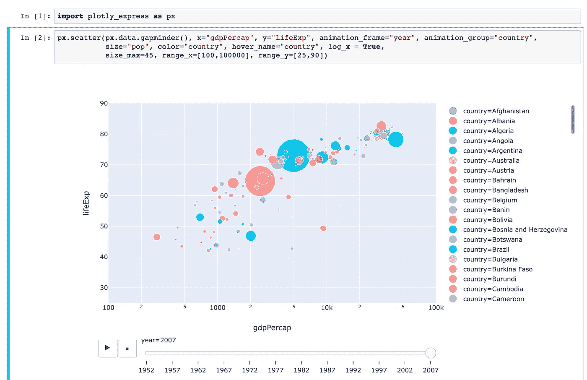

# 使用 Plotly Express 用 2 行 Python 重新创建 Gapminder 动画

> 原文：<https://towardsdatascience.com/recreating-gapminder-animation-in-2-lines-of-python-with-plotly-express-2060c73bedec?source=collection_archive---------8----------------------->



> 免责声明:使用了一个新模块`plotly_express`，Gapminder 动画没有使用 2 行代码从头开始编码

这是数据可视化的标志性时刻之一，当时汉斯·罗斯林在他的 [ted 演讲](https://www.ted.com/talks/hans_rosling_shows_the_best_stats_you_ve_ever_seen)中展示了著名的 Gapminder 动画，这是有史以来观看次数最多的 TED 演讲之一。从那时起，它就像是任何进行可视化的人复制它以显示他们的数据可视化能力的基准——就像复制爱德华·塔夫特或内特·西尔弗的可视化作品一样。

[最近](https://twitter.com/plotlygraphs/status/1108395986626494467) **Plotly** (以 R 和 Python 的交互式可视化 DSL 而闻名)推出了一个新的工具/模块/库，名为 **Plotly Express** 。顾名思义，`plotly express`的主要目标是成为一个非常简单、快速和易于使用的高级 API 来构建交互式可视化。

更像这样，

> plotly Express:plotly . py::Seaborn:Matplotlib

受 R 的`ggplot2`和 Python 的`seaborn`的启发，以简单为核心的`plotly express`试图在`one-liners`中做事。在这篇文章中，我们将看到如何仅仅使用`plotly express`来重现(如果不完全重现，至少类似于)标志性的 Gapminder 动画。

## 装置

`pip3 install plotly_express`

## 使用别名导入库:

`import plotly_express as px`

# 气泡图动画又名 Gapminder 动画

```
px.scatter(px.data.gapminder(), x="gdpPercap", y="lifeExp", animation_frame="year", animation_group="country",
           size="pop", color="country", hover_name="country", 
           log_x = True, 
           size_max=45, range_x=[100,100000], range_y=[25,90])
```

这是一个非常简单的函数(我曾经见过这样的 Gapminder 动画)。函数`px.scatter()` 从`px.data.gapminder()`获取数据，然后通常定义`x`和`y`轴以及每年递增的`animation_frame`。随着更多关于外观改进的讨论，动画泡泡图已经准备好了！

**Plotly Express 教程视频构建 Gapminder 动画:**

**鳍**

这篇文章的目的是传播关于`plotly_express`的信息，这是一个创造美丽的交互式可视化的惊人之举(也类似于 R 中的`highcharter`)。如果你想从总体上了解《T2》的剧情，可以去看看《数据营》。

## 资源

*   [本帖使用的完整代码](https://github.com/amrrs/blogpost_codes/blob/master/gapminder_animation_plotly_express.ipynb)
*   [非常全面地介绍了 Plotly Express](https://medium.com/@plotlygraphs/introducing-plotly-express-808df010143d)
*   [Plotly 文档](https://plotly.github.io/plotly_express/)