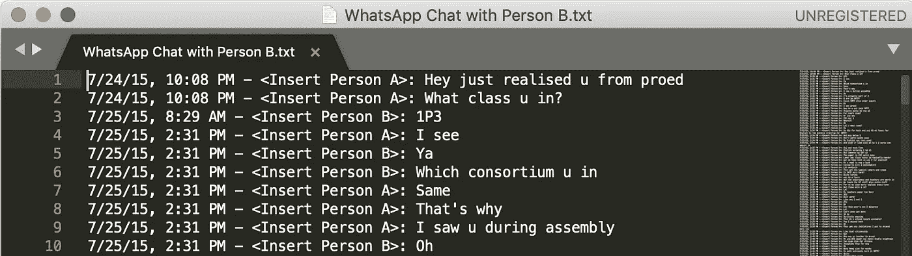
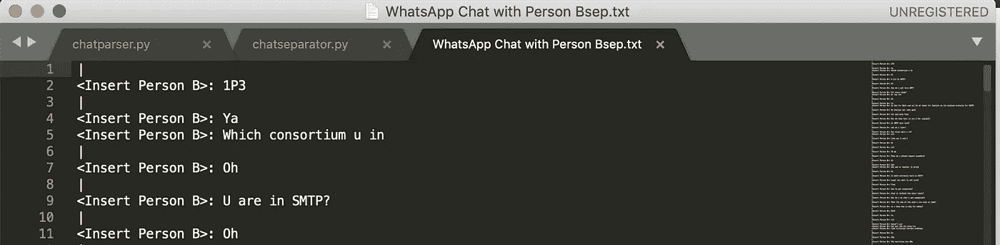
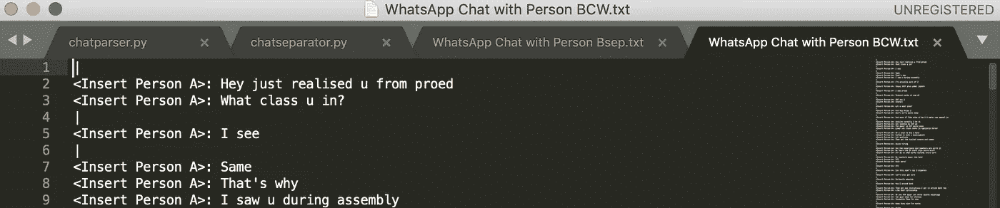
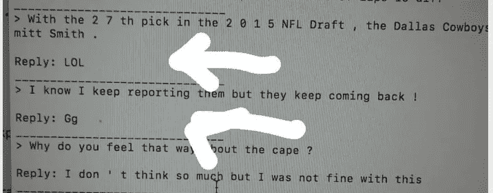
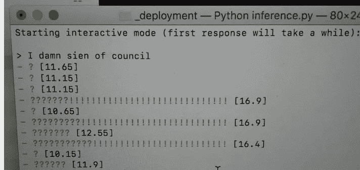

# 从 WhatsApp 聊天中重塑自我

> 原文：<https://towardsdatascience.com/recreating-myself-from-whatsapp-chats-6dadfaff0d2b?source=collection_archive---------16----------------------->

## 探索我能在聊天机器人中复制我的人格的程度


Image by [Gerd Altmann](https://pixabay.com/users/geralt-9301/?utm_source=link-attribution&utm_medium=referral&utm_campaign=image&utm_content=3382507) from [Pixabay](https://pixabay.com/?utm_source=link-attribution&utm_medium=referral&utm_campaign=image&utm_content=3382507)

我一直在想，我们是否有一天可以在互联网上上传一份我们自己的副本。今天，虽然我们无法制造高分辨率的意识复制品，但我相信我至少可以用现有的技术捕捉到我的人格快照。本能地，人工智能的用法浮现在脑海中——特别是聊天机器人。

有许多现有的训练聊天机器人的模型。对我个人来说，我关注了使用 Python 和 TensorFlow 的[send ex 的 Youtube 教程系列](https://www.youtube.com/watch?v=dvOnYLDg8_Y&list=PLQVvvaa0QuDdc2k5dwtDTyT9aCja0on8j)。我用了 nmt-chatbot (Github 资源库[这里](https://github.com/daniel-kukiela/nmt-chatbot))作为基础，写了几个工具帮我做我的 WhatsApp 聊天数据的预处理(我的 Github 工具资源库[这里](https://github.com/iDrinkMocha/whatsappchat-cleaner))。我采取了很多步骤，也从这次经历中学到了很多。

# 第一部分:预处理

## 下载 WhatsApp 聊天作为训练数据

众所周知，WhatsApp 会自动将你的聊天记录备份到 Google Drive 中。现有的解决方案允许你直接读取加密文件，但我选择直接从 WhatsApp 下载聊天记录。要做到这一点，你必须点击下拉菜单内你的聊天对话的人，点击“更多”，然后其次是“导出聊天”。

然后会提示您选择包括或不包括介质。对我来说，我选择不这样做，因为我无法通过自动化手段处理除文本之外的任何东西。希望在未来，我可以这样做，以便给整个对话提供更多的上下文，并提高聊天机器人的准确性。

## 清理 WhatsApp 聊天

下载聊天内容后，用您选择的任何文本编辑器打开它。您将看到这样的内容(出于隐私考虑，我删除了这些名字):



My conversation with my friend in WhatsApp opened in Sublime Text

如你所见，时间戳和人名并不是训练聊天机器人所必需的。数据需要清理，所以我写了一个 Python 脚本来去掉多余的数据段。

我首先删除了聊天的时间戳，这样名字将定义每一行的开始。我写了一个脚本叫 chatparser.py，可以在聊天处理文件夹下找到。

正如您在下面的源代码中看到的，您可以将文件名添加到数组中，这样您就可以一次处理多个文本文件。使用终端更改目录后，我执行了以下命令:

```
$ python chatparser.py
```

执行该命令后，会生成一个新文件“WhatsApp 与人聊天 Bout.txt”。


Chat with timestamp removed.

接下来，我把我和其他人的聊天记录分成两个文本文件。我运行了自己编写的另一个脚本 chatseparator.py:

```
$ python chatseparator.py
```

这导致生成的文件“WhatsApp 与人聊天 Bsep.txt”和“WhatsApp 与人聊天 BCW.txt”(也就是我)，如下所示:



The responses of the person I am talking to.



The things I texted to the other party.

“|”字符用作分隔符，表示当一个人回答或发起对话时，对话在哪里分开。后来证明这是非常有用的。

## 分组对话

发短信时，我们倾向于把句子分成几个部分，而不是把它们聚在一起作为一条信息发送。我对一对问题/回答进行分类的方法只是通过检测发短信的人何时改变。对于一个人输入的每一个连续的文本链，它相当于句子本身。我不得不承认，这是一个极其简化的模型，但它适用于我的大多数聊天。

现在，我执行我编写的下两个 python 脚本— otherstagdelete.py 和 mytagdelete.py —来删除对话前面的名字。

```
$ python otherstagdelete.py$ python mytagdelete.py 
```

然后，我运行我的 combine.py 脚本来合并分散在多个聊天消息中的句子。

```
$ python combine.py
```

## 删除包含媒体的响应对

因为我们选择导入没有媒体的聊天，所以有几行显示<media omitted="">。为了进一步清理数据，我删除了包含该内容的问题/回答对。切记从**中删除两个**文档，myside.txt 和 otherside.txt</media>

# 第二部分:训练聊天机器人

将您发起的所有聊天复制到一个文档中，将其他人发起的所有聊天复制到一个单独的文档中。到目前为止，每个问题/回答对都应该对齐到同一行，所以应该没有问题。

如果你有超过一百万个问题/回答对，你的训练结果会更准确。参考 nmt-chatbot 的 Github 库，只需将你创建的各自的训练数据放入 **train.from** 和 **train.to** 即可。

# 第三部分:结果

在部署我的模型时，我用一些问题测试了它，很明显聊天机器人已经采用了我的说话风格。以下是一些快照:



当然，这并不都是美好的事情，因为聊天机器人仍然在很大程度上胡说八道。这是因为我的训练集太小，没有效果。然而，作为概念验证，我发现它非常有前途。

# 第四部分:吸取的教训和改进

通过这个项目，我想我有一些很棒的收获，我想分享一下。

首先，可以实现自然语言处理算法来确定对话的上下文何时改变。这进一步增强了问题/响应对的准确性，并允许更好的聊天机器人。

第二，也可以采用图像识别，使得包括照片的聊天也可以用作训练数据。通过给图片加上特定的标签，它也给对话提供了背景，这很好。

AI 和机器学习真的是一个潜力无限的神奇领域。即使你和我一样是初学者，我也觉得大有可为。我鼓励每个人都真正尝试一下学习人工智能。我希望你发现这个项目是有用的，也许在某种程度上是鼓舞人心的！