# 重现梵高遗失的画作

> 原文：<https://towardsdatascience.com/recreating-van-goghs-lost-painting-34ca61eb7e09?source=collection_archive---------36----------------------->

## 在寻找杰作的过程中使用生成模型

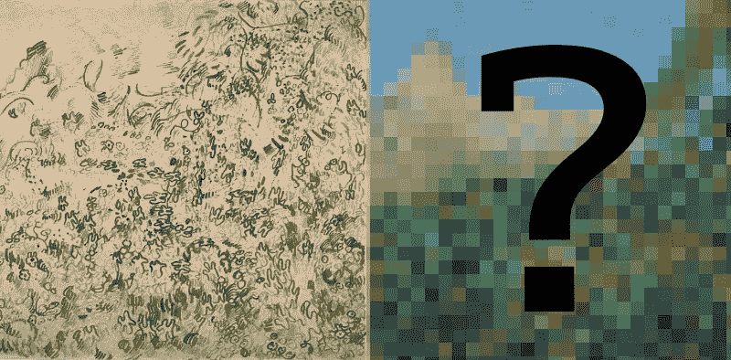

1889 年夏天，文森特·梵高开始创作一系列风景画。每一幅画他都寄给他在巴黎的兄弟西奥。

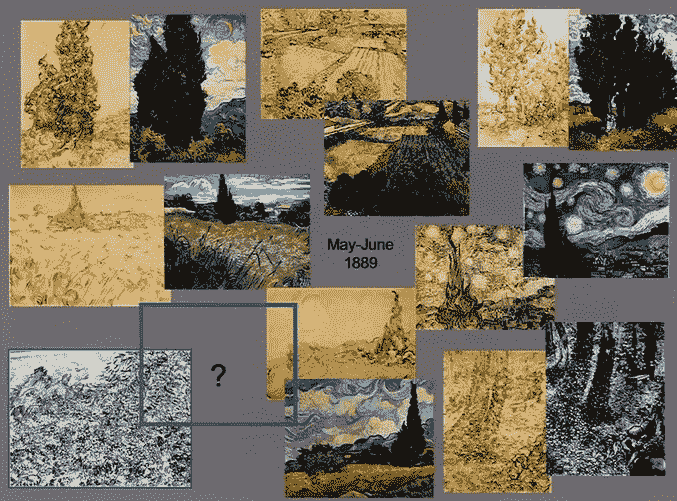

From [Museum of Fine Arts, Boston](https://www.youtube.com/channel/UCI5_RrU163lo9Sbbb9fx4Rw)

可以看到，其中一幅画缺少了对应的画。这幅画叫做“野生植被”，大概是一片开满鲜花的田野，背景是一座山。

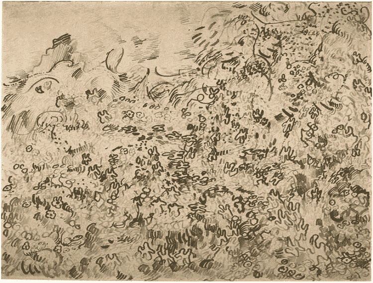

人们注意到丢失的画，许多人想知道它可能在哪里。

118 年后的 2007 年，当波士顿美术博物馆的一位名叫 Meta Chavannes 的管理员用 X 射线对这幅名为“峡谷”的画进行检查时，这个谜有了一个结论，并在下面发现了野生植物的遗骸。

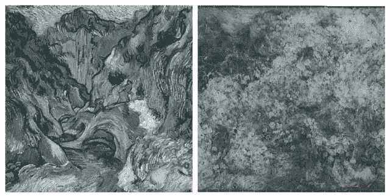

众所周知，梵高一生都缺乏材料，当绘画的欲望变得势不可挡时，他甚至用毛巾作为画布。考虑到这一点，他干脆重用野生植被画布也就不足为奇了。遗憾的是，很难从 x 光片上看出这幅画的样子，所以这幅画似乎已经失传了。

也就是说，直到现在。借助生成机器学习的力量，我开始尝试重建这幅画。

# 神经类型转移

我最初的想法是，神经类型转移可能会解决这个问题。神经类型转移是一种利用深度学习内部工作的有趣事实的技术。

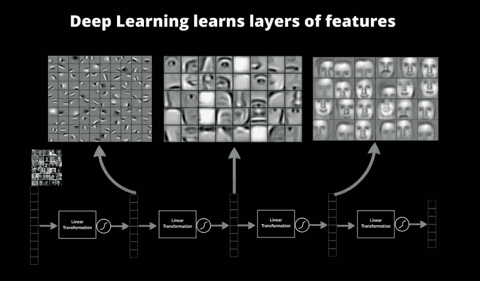

Image from [https://blog.datarobot.com/a-primer-on-deep-learning](https://blog.datarobot.com/a-primer-on-deep-learning)

深度学习的一大优势是它能够自动选择特征。事实证明，当训练一个深度神经网络时，例如在人脸上，每一层都学习识别越来越高抽象的特征，因此第一层寻找直线和边缘，随后的层寻找眼睛和耳朵，而进一步的层寻找整张脸。

如果我们看两幅图像，如果它们具有相同的“内容”，即都包含一辆汽车或一张脸，我们会期望它们在更深的层中具有相似的特征。这与汽车或面部的确切外观无关。

相比之下，如果图像都包含类似的“风格”，如颜色、边缘或圆形，则早期的层将具有类似的特征。然而，事情比这要复杂一些，因为我们所说的风格通常是几个特征的组合。例如，一幅草坪的图像可能包含“尖”和“绿”的特征，而一幅森林中的刺猬的图像包含相同的特征。如果我们使用第一张图片作为样式输入，大概我们实际上想要的是“草”的样式，它是绿色和尖尖的特征在同一个地方的组合。为了实现这一点，我们使用了 gram 矩阵，它告诉我们某些特征在图像中的什么位置出现在一起。在绿草如茵的图像中，绿色和尖刺出现在同一个地方，与刺猬图像形成对比，在刺猬图像中，尖刺与棕色相关。因此，为了实现相似的风格，我们试图最大化 gram 矩阵的相似性。上面的例子摘自[生成式深度学习](http://shop.oreilly.com/product/0636920189817.do)。

然后我们进行反向传播算法，但不是像我们通常在训练时那样改变网络的权重，而是保持它们固定不变，而是改变图像。

使用库[神经风格转移](https://github.com/titu1994/Neural-Style-Transfer)，我在野生植物和油画“罂粟田”上做了这个，结果如下:

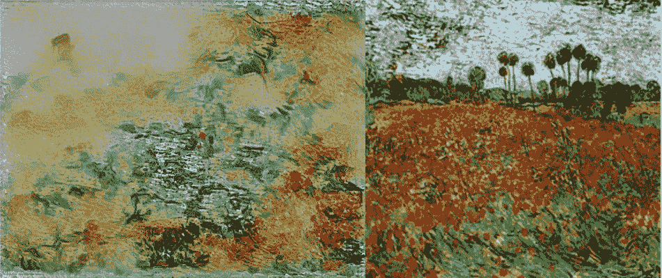

结果远不能令人满意，因为模型似乎有一个辨别什么是地面和什么是天空的问题，因此在某些地方使地面变成蓝色。这种把天空的颜色放在地面上的方式当然是梵高自己在精彩的作品《播种者》中所做的，他颠倒了地面和天空的颜色顺序，但我觉得这在上面的作品中可能不合适，至少在这里不合适。

我当然应该猜到会是这样，为什么神经类型转移会知道什么是天空，什么是地面？

# CycleGAN

我的下一个想法是使用 CycleGAN。GAN 是两个相互竞争的神经网络的名称。第一个网络(生成器)试图绘制图像，第二个网络(鉴别器)试图猜测第一个网络是否绘制了图像，或者它是否取自训练数据。第一种训练的目标是愚弄第二种，第二种训练的目标是不被愚弄。

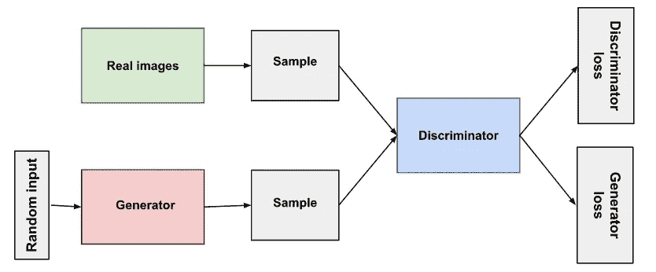

Image from [https://developers.google.com/machine-learning/gan/gan_structure](https://developers.google.com/machine-learning/gan/gan_structure)

我喜欢和你的对手一起通过竞争变得更好，不断挑战彼此的极限。有点像猎豹如何在试图跟上羚羊的同时变得如此完美地设计速度，而羚羊在与猎豹竞争时变得更快。

普通类型的 GANs 只能产生类似于大量训练数据的图像，但是没有办法指导它。然而，CycleGAN 是一种条件 GAN，它将图像作为条件，并使用该条件来创建新图像。

它由两个 gan 和两个数据集组成。一个 GAN 生成与第一个数据集相似的图像，另一个生成与另一个数据集相似的图像。我们还将附加的“重构标准”应用于 GAN。这意味着，如果第一个 GAN 获取图像并生成另一个图像，第二个 GAN 应该能够获取新图像并生成与原始起始图像非常相似的图像。

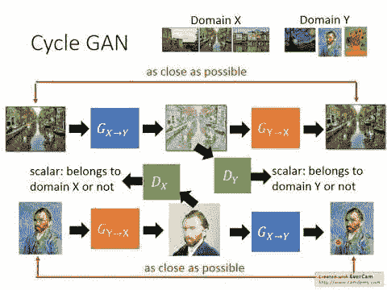

Generator Gx->y transform image from domain x into y. Discriminator Dy tries do determine if it belongs to domain Y. [Image from GAN Lecture 2 (2017): CycleGAN](https://www.youtube.com/watch?v=9N_uOIPghuo)

在我的慢速 GTX 670 上使用库[GDL _ 代码](https://github.com/davidADSP/GDL_code)一个晚上后，结果如下:

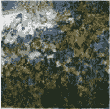

这个好多了。天空是蓝色的，地面是绿色的，开满了花。不过分辨率太低了，所以我用更高的设置再试了一次。

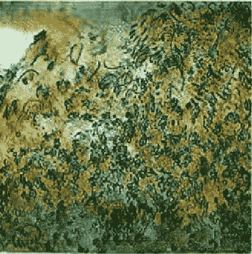

不幸的是，这里的结果实际上更糟。我认为一个问题是异常小的天空。在具有较大天空的图像上进行训练，网络很难知道它在哪里。

# 一路上帮助机器

由于不完全满意，我决定使用混合方法。由于网络似乎很难知道图像的不同部分应该是什么，也许人机合作将有利于解决这个问题。我作为一个人，告诉机器什么是天空，什么是花朵，机器做它最擅长的事情，并以正确的风格描绘一幅画。

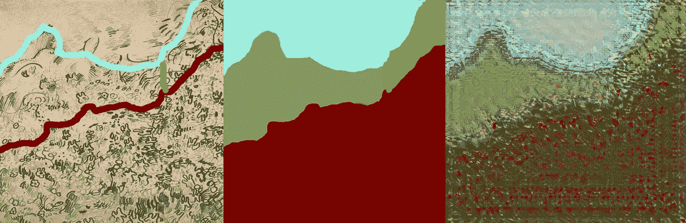

好吧，那没用。梵高和其他后印象派画家仍然从现实中绘画，尽管他们对现实有自己特殊的解释。我需要的不是由大块彩色区域组成的图像，而是更像照片的东西。如果我能重现梵高看到的场景，那么风格转换就可能成功。

# GauGAN 和 Pix2Pix

Nvidia 创造了他们自己风格的 Pix2Pix 算法，并将其称为 [GauGAN](http://nvidia-research-mingyuliu.com/gaugan/) (另一位后印象派画家高更的双关语)。在这里，GAN 在两个图像上训练，在 GauGAN 的情况下，一个是照片，另一个是照片的示意图，描绘了它的不同部分，如草，水，天空。通过这种方式，GauGAN 学会了在草图和照片之间进行转换。我从上面给了它我的草图。

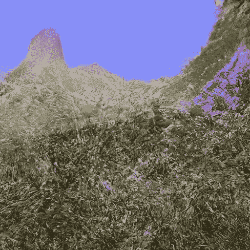

这看起来像是梵高可能真的见过的场景。这让我想起了阿尔卑斯山，那里有鲜花和香草，背景是那座山。

通过风格转换运行重建的图片产生:

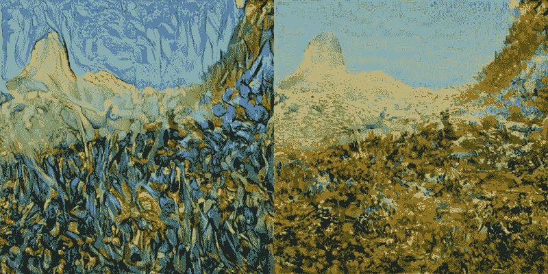

最后，我们有可能通过野生植物的重建。

# 结论

我们正处于一个有趣的时间点，在这个时间点上，无论是机器还是人类，都不是在所有方面都更优越。这开启了一些有趣的合作，每一方都可以做出贡献，做出一些他们自己无法做到的事情。