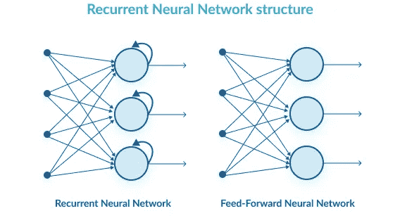
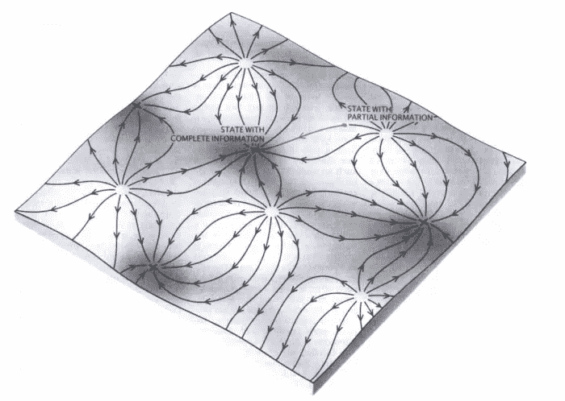
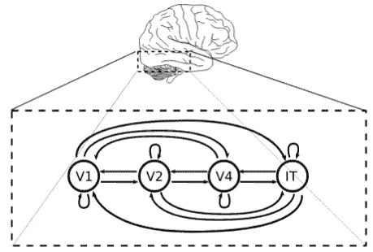

# 生物和人工神经网络中的递归

> 原文：<https://towardsdatascience.com/recurrence-in-biological-and-artificial-neural-networks-e8a6d5639781?source=collection_archive---------21----------------------->

## 相似性、差异及其重要性

*递归*是神经网络上下文中的一个过载术语，在机器学习和神经科学社区中具有完全不同的口语含义。然而，这种差异正在缩小，因为用于实际应用的人工神经网络(ann)越来越复杂，在某些方面更像生物神经网络(BNNs)([但在整体上仍有很大不同](/deep-learning-versus-biological-neurons-floating-point-numbers-spikes-and-neurotransmitters-6eebfa3390e9))。

在本帖中，我们将讨论这两个社区中使用术语*复发*的历史差异，强调一些最近向神经科学发展的深度学习人工神经网络模型，指出一些揭示复发功能的神经科学研究，并推测未来的发展。

## 太长；没看

*   深度学习社区所说的*循环* *连接*类似于神经科学社区所说的*横向连接*。即局部区域内相互连接的神经元。
*   在神经科学社区中，递归网络是一个连通性丰富的网络，*包括前馈、* ***和反馈*** *连接*。
*   反馈连接适应了动物的能力和行为，这些能力和行为在缺乏这种连接的深度学习模型中可能无法复制。

# 深度学习人工神经网络中的递归

正如许多读者所知，深度学习网络是人工神经网络的子类型，其中神经元(或*节点*)被排列成层。在这样一个网络中，许多层的存在给了它一个主观的深度，这就是它的名字，与早期研究的这种类型的网络相比，只有一个或两个这样的层。在一个典型的*全连接前馈*深度学习网络中，给定层中的所有神经元都将它们的输出发送给紧随其后的层中的所有神经元(计算的方向流通常被示意为从下到上或从左到右在层之间进行)。

人们也可以设计这样的网络，其中给定层中的神经元将它们的输出发送到它的上一层，从而在层间引入*反馈*连接。我们稍后将回到这一点。

最后，一层神经元可以以完全连接(或其他)的方式将其输出*发送回自身*。存储在层*中的信息在下一个时间/处理步骤中作为输入再次出现*。*这是深度学习实践者讨论时几乎总是指的那种递归类型——局限于一个层的递归*。(注意，可能有多个递归层，但层间连接只是前馈。)

Unlike the feed-forward network on the right, the network on the left has a recurrent layer (the larger light blue circles) that “feeds back” onto itself. In deep learning parlance, the network is termed a recurrent network rather than a feed-back network because the feed-back does not project to a *preceding* layer. Note that although the recurrent neurons in the figure are depicted as connecting back to themselves individually, the typical arrangement is for all neurons in the recurrent layer to connect to all other neurons in that same layer.

这种循环连接的作用是在循环神经网络(RNN)中赋予记忆。网络的输出不再仅仅依赖于对齐的时间步长上的输入。相反，网络在任何给定的时间都有一个“状态”，它与下一个输入相结合，提供一个新的输出，并更新网络的状态。

这使得 rnn 能够识别或产生时间结构不同的模式，如语音[1]。例如，话语<sleep>和<sleeeep>都可以被识别为单词“sleep”。事实上，这种*序列到序列*网络[2]的设计和训练方法的重大进步是语音识别技术在过去 2-3 年中取得如此巨大进步的关键原因。Siri 和 Alexa 可能仍然像石头一样哑，但至少它们可以非常准确地将你的口语翻译成文本(尽管你可能不总是根据它们的反应知道这一点！).</sleeeep></sleep>

文本的语言翻译是另一个非常成功的领域。递归的使用允许信息在编码阶段被累积，并在解码阶段被分发(跨时间输出)，由此直接的单词到单词或短语到短语的对齐是不必要的[2]。例如，允许一种语言中单词前面的修饰语跟随在另一种语言中的单词后面，例如当将 *red hat* 翻译为 *sombrero rojo* 时。

The use of LSTMs, a type of RNN, allows for language translation networks with network memory that can accumulate information. Words (as vector representations) are incrementally input to the network, and the network distributes output words in a different language, with some delay. This is successful even when ordering of parts of speech (nouns, adjectives, etc.) is different between the two languages. [Image taken from [The Keras Blog](https://blog.keras.io/a-ten-minute-introduction-to-sequence-to-sequence-learning-in-keras.html).]

我们不能不提到上面描述的“香草”RNN 架构在实践中很少使用。高级应用通常依赖于人类设计的适应门控机制的修改。在某种意义上，当接收到某个输入或传递某个输出时，这允许循环层的状态存储器被“转储”。打个比方，当你完成一个句子，以及相关的想法时，你可能希望把那个想法扔掉，这样它就不会和你的下一个想法混淆了。值得注意的是，最常见和最有效的门控层之一，*长短期记忆* (LSTM)层最初创建于 1997 年[3]，远远早于 RNN 应用的最新进展。参见 Christopher Olah 的博客文章中关于 LSTMs 的精彩教程。

# 生物神经网络中的递归

在神经科学家中，递归有一个更宽泛的定义——部分基于生物神经网络(BNNs)中神经元之间近乎各向同性的连接模式。神经元在向其他神经元的轴突投射中是多产的，向前和向后，短距离和长距离地发送它们。虽然有强有力的证据表明在结构和功能上存在粗糙的层次排列[4]，但大脑皮层显然没有排列成神经元的有限层(组)。大脑作为一个整体具有不同的区域，具有不同类型的神经元和神经递质，但不像作为深度学习人工神经网络的定义特征的划分连接。尽管如此，深度学习实践者所谓的循环连接更有可能被神经科学家称为横向连接。

计算神经科学家已经深入研究的递归网络的一个方面是所谓的[吸引子网络](http://www.scholarpedia.org/article/Attractor_network)的模式完成属性。想一想，在我们自己的头脑中，可能只需要短暂的一瞥、短暂的一阵声音或一点点气味就能带来强烈的、充满活力的记忆。或者当我们试图回忆一个男演员或女演员的名字时，我们会想象他们的脸，想到他们合作过的其他演员的名字，电影名称等等。直到他们的名字突然神奇地出现在我们的脑海中。在循环吸引子网络(一种人工神经网络，但没有深度学习结构，并且通常具有抑制性和兴奋性人工神经元，旨在成为 BNNs 的更现实的模型)的模拟中观察到了这种现象的类比。例如，由一张脸的图像驱动的神经活动模式也可能由同一张脸的模糊或嘈杂的图像驱动，尽管在后一种情况下，网络的动态需要更长时间才能进化到稳定状态。

The energy landscape of a Hopfield attractor network. Sensory information may briefly position the network activity in an unstable, partial-information state, from which it dynamically moves (adjusts neuron firing rates) to a stable state that represents a fully-remembered object, sensation, abstract idea, etc. In this case, “memory” is really the strength and pattern of the synaptic connections between neurons, and recall of that memory is the neuronal firing pattern that ensues when external or internal stimuli push the network beyond the edge of the memory’s attractor basin (like a drop of rain that eventually flows to one of many possible lakes or oceans). See Jack Terwilliger’s [blog post](http://jackterwilliger.com/attractor-networks/) for more detail.

*比深度学习 ann 的受限递归(层内)与 bnn 的广泛递归之间的区别更重要的是，大多数深度学习模型中缺乏反馈连通性。*在神经科学界，术语“复发”几乎是反馈和前馈连接的同义词，最近的研究为反馈的作用提供了新的证据。

## 生物网络中循环和反馈连接的可能功能:

*   **迭代感觉处理:**循环处理，其中自下而上和自上而下的信息流相互作用以确定一个稳定的结果。关于这个主题的更深入的讨论，请参见下一节。
*   **长期记忆:**不完整的信息可以在吸引子网络中从长期存储中启动对记忆的回忆(如上所述)。
*   **短期记忆:**短期记忆，即需要记住一小段数字序列或几个句子内容的那种记忆，可能由神经元维持，这些神经元共同产生一个稳定的(但可能是动态的)放电模式，有点像吸引子，只是维持一个新的短期记忆，而不是回忆一个存储的长期记忆。该功能与上述序列到序列深度学习 RNNs 的功能相关(例如，允许语音识别和语言翻译)。
*   **自上而下的目标驱动注意力:**基于一个有机体手头的任务和相关的目标，并不是所有的感官信息都同样有价值。一只寻找它最喜欢的红色浆果的动物可能有反馈连接，可以增强对红光做出反应的低级神经元的活动，同时降低对其他颜色做出反应的神经元的活动。这个过程的神经模型利用了深度学习社区的工作[5]。
*   **可塑性:**递归也是生物大脑学习机制的重要组成部分。例如，皮质下基底核中的多巴胺释放神经元是由皮质和皮质下区域组成的复杂网络的一部分，最终可以增强皮质区域的可塑性，以响应导致奖励的行为(食物、交配等)。)，从而强化了那种行为。这种类型的神经元和网络复杂性在最先进的深度学习中几乎完全不存在。
*   **门控:**推测上，反馈也可能作为门控机制，控制信息从较低级神经元向较高级神经元的流动。注意力可能会选择这样的门控，但这里我们指的是不由有机体的意识感知和目标驱动的门控。例如，众所周知，关于物体身份的视觉信息沿着从枕叶皮层到下颞叶皮层的路径被提取和提炼。相反，对象位置信息是沿着从枕叶皮层到顶叶皮层的路径提取和提炼的。(注意这是一个[过于简单化的描述](https://en.wikipedia.org/wiki/Two-streams_hypothesis#Criticisms)。)门控可以帮助指导这种信息路由，并且可以是支持在该列表顶部讨论的迭代感觉处理的机制。

## 迭代感觉处理

我们将简要强调 BNNs 中递归/反馈连接的迭代感觉处理作用，并将其与深度学习 ann 中主导图像分类任务的前馈卷积神经网络(CNN)进行对比。

深度学习对象(图像)识别模型在该领域取得了巨大成功，自第一个赢得 ImageNet 大规模视觉识别挑战赛(ILSVRC)的 CNN 模型“Alex net”[6]发表以来，该领域发展迅速。想要一个好的教程，请看[这篇博文](/a-comprehensive-guide-to-convolutional-neural-networks-the-eli5-way-3bd2b1164a53)，或者许多其他的。因为视觉皮层是哺乳动物皮层中研究得最充分的区域，所以在深度学习 CNN 和哺乳动物视觉之间进行了许多主观和定量的比较。

早期的视觉神经科学模型，基于 Hubel 和 Weisel 等人对单个神经元的记录[7]，与标准的 CNN 相似，它们具有卷积、汇集和专门的前馈连接[8，9]。完全前馈的*功能*模型的部分动机是视觉感知发生迅速，大约 100 毫秒。这一估计是基于大脑“较高”区域的神经放电时间，相对于向实验室动物展示图像的时刻。*基于解剖学*，视觉皮层通常被建模为具有大量反馈连接的 4-6 级松散层级。尽管存在反馈连接，但更高级别的神经反应的快速性表明反馈连接并不完全必要(对于简单的物体识别任务)。如果不是这样，在这些区域形成稳定的反应将会更慢，因为反馈回路的贡献传播需要更多的时间。

然而，在具有挑战性的 ILSVRC 测试集上，CNN 需要几十层(如果不是几百层)才能实现良好的图像分类性能，这与仅由几个前馈层组成的视觉皮层模型相反。此外，在一些计算研究中，相对较浅的 rnn 的性能与非常深的 CNN 相当[10，11]。

Liao and Poggio [10] built a 4-level recurrent network meant to model the visual cortex. In this coarse model, visual input from the eye (via retina and thalamus) enters the primary visual cortex, V1\. The network contains *feed-forward* connection (left-to-right), *feed-back* connections (right-to-left) and *lateral* connections (looping back to same area; synonymous with *recurrent* connections in deep learning terminology). Outputs from the inferotemporal area, IT, are used for object classification. They demonstrate that a shallow RNN is equivalent to a very deep ResNet model (a type of deep learning ANN) with weight sharing among the ResNet layers.

最近，世界一流实验室的两项神经科学研究，以及对生物循环连接的时间延迟的更细致入微的理解，表明需要循环来捕捉人类视觉皮层的动态计算[12]，并且循环对视觉皮层执行物体识别行为至关重要[13]。简而言之，证据表明，如果不通过递归网络进行多次迭代，更具“挑战性”的物体图像实例就无法被识别。换句话说，需要额外的非线性变换来成功地识别挑战案例中的对象。

# 最后的话

如上所述，虽然递归深度学习 ANN 模型具有层内递归(神经科学术语中的“横向”连接)，但很少具有神经科学家通常研究的反馈连接类型——即从较高层到较低层的连接。值得注意的例外包括模拟注意力的人工神经网络和一些图像分类模型。

具有反馈连接性的深度学习模型几乎不存在的一个原因是训练这种模型的难度。我们可能需要新的学习规则(除反向传播之外的方法)来实现反馈在 BNNs 中提供的功能类型。

与之相关的是，生物神经元并行工作，因此大规模循环网络中的计算可以快速进行。事实上，神经元状态的同时计算更新可能是成功的关键。对于在现代硬件上运行的大型、高重现性(神经科学术语)人工神经网络来说，这种程度的并行性可能很难或不可能实现。

我们推测，将重反馈递归引入深度学习模型，并开发这种模型的训练方法，将带来强大的 now AI 能力。然而，这些进展的速度很难预测。

# 参考

1.  格雷夫斯(2012)。"神经网络的序列转换."[https://arxiv.org/abs/1211.3711](https://arxiv.org/abs/1211.3711)
2.  Sutskever、Vinyals 和 Le (2014 年)。"用神经网络进行序列对序列学习." *NIPS 2014* 。【https://arxiv.org/abs/1409.3215 
3.  Hochreiter 和 Schmidhuber (1997 年)。“长短期记忆。”*神经计算。*[https://www . mitpressjournals . org/doi/ABS/10.1162/neco . 1997 . 9 . 8 . 1735](https://www.mitpressjournals.org/doi/abs/10.1162/neco.1997.9.8.1735)
4.  克拉维茨*等人*。(2013)."腹侧视觉通路:处理物体质量的扩展神经框架."*趋势认知科学*。[https://www.ncbi.nlm.nih.gov/pmc/articles/PMC3532569/](https://www.ncbi.nlm.nih.gov/pmc/articles/PMC3532569/)
5.  亚明斯和迪卡洛(2016)。“使用目标驱动的深度学习模型来理解感觉皮层。”*自然神经科学*。[https://www.nature.com/articles/nn.4244](https://www.nature.com/articles/nn.4244)
6.  Krizhevky、Sustskever 和 Hinton (2012 年)。“使用深度卷积神经网络的 ImageNet 分类” *NIPS 2012。*[http://papers . nips . cc/paper/4824-imagenet-class ification-with-deep-convolutionary-neural-networking](http://papers.nips.cc/paper/4824-imagenet-classification-with-deep-convolutional-neural-networ)
7.  胡贝尔和威塞尔(1959)。"猫纹状皮层中单个神经元的感受野."*生理学博士*。[https://phys oc . online library . Wiley . com/doi/pdf/10.1113/jphysiol . 1959 . sp 006308](https://physoc.onlinelibrary.wiley.com/doi/pdf/10.1113/jphysiol.1959.sp006308)
8.  福岛(1980 年)。“Neocognitron。不受位置变化影响的模式识别机制的自组织神经网络模型*生物控制论。*https://www.rctn.org/bruno/public/papers/Fukushima1980.pdf
9.  Riesenhuber 和 Poggio (1999 年)。"大脑皮层中物体识别的层次模型."*性质*。[https://www.nature.com/articles/nn1199_1019](https://www.nature.com/articles/nn1199_1019)
10.  廖和波焦(2016)。"弥合剩余学习、循环神经网络和视觉皮层之间的差距."CBMM 备忘录 047 。[https://arxiv.org/abs/1604.03640](https://arxiv.org/abs/1604.03640)
11.  扎米尔等人。(2016).“反馈网络。”IEEE 计算机视觉和模式识别会议(CVPR)。[https://arxiv.org/pdf/1612.09508.pdf](https://arxiv.org/pdf/1612.09508.pdf)
12.  Kietzmann，*等人*。(2019)."捕捉人类腹部视觉流的动态计算所需的递归."[https://arxiv.org/abs/1903.05946](https://arxiv.org/abs/1903.05946)
13.  卡尔*等人* (2019)。"证明循环回路对腹侧流执行核心物体识别行为至关重要."*自然神经科学*。[https://www.nature.com/articles/s41593-019-0392-5](https://www.nature.com/articles/s41593-019-0392-5)