# 递归神经网络-从头到脚

> 原文：<https://towardsdatascience.com/recurrent-neural-network-head-to-toe-d58ff2f2dab3?source=collection_archive---------12----------------------->

神经元是人脑的组成部分。它可以在微秒内分析复杂的信号，并向神经系统发送信号来执行任务。每个神经元的结构都是相同的，这意味着神经元之间的结构层不会改变。让这些层连续，它可以很容易地复制我们的大脑。这些连续的“层”帮助我们进行日常活动、复杂的决策和语言处理。

但是，如何在这些层面上概括我们的问题呢？概括起来需要什么样的模型？

答案以参数共享的形式出现在研究人员面前。它有助于将模型扩展和应用到不同形式的数据。这是通过将输出的成员共享为输出的先前成员的函数来实现的。输出的成员由相同的更新规则产生。理解这种计算结构的更简单的方法是使用*‘展开计算图’*。图形的展开导致共享结构中参数的深层网络。

考虑动力系统的经典形式:

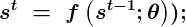

展开这个动力系统的结构，我们得到:

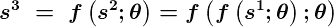

如你所见，这个等式不再涉及递归。

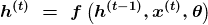

递归神经网络可以以不同的方式建立，其中一些也可以有隐藏单元。当训练递归神经网络基于过去的输入来执行时，摘要是有损耗的，因为我们将任意长度的序列映射到向量****【h(t)****。*根据手头的任务，我们也可以选择哪些过去的输入，我们可以有选择地保留过去序列的某些方面。*

*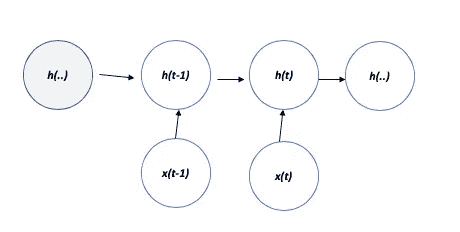*

***Unfolded graph: A recurrent network with no outputs, it processes the information from the input x by incorporating it into the state h that is passed forward through time.***

*我们可以用函数 ***g(t)*** 来表示 t 步之后展开的递归。*

*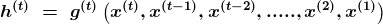*

*The function of past sequence takes g(t) as input.*

*展开过程具有一些主要优势，并导致使模型 *f* 无处不在成为可能的因素，这进一步允许一般化。*

**a)不管输入序列的长度如何，模型具有相同的输入大小。**

**b)有可能在每个时间步使用具有相同参数的相同转移函数 f，因为它是从一个状态到另一个状态指定的。**

*展开图通过显示信息流动的路径，说明了明确描述和信息在时间上向前和向后流动的思想。*

*这些想法对于构建递归神经网络非常重要，因为 RNN 在每个时间步都产生输出，并且隐藏单元之间的连接可以通过读取整个序列产生输出，然后产生单个输出。这导致了一个结论，即任何可以被图灵机 计算的函数都可以被有限大小的递归神经网络计算。正是这种利用过去的输出和隐藏层连接的性质，使得 RNN 取得了今天的成就。*

**

## ***递归神经网络***

*有了图形展开和参数共享的知识，我们现在开发 RNN。我们假设双曲正切激活函数。考虑输出的一个自然方法是给出非标准化的对数概率，我们将 *softmax* 作为*后处理步骤*。*

*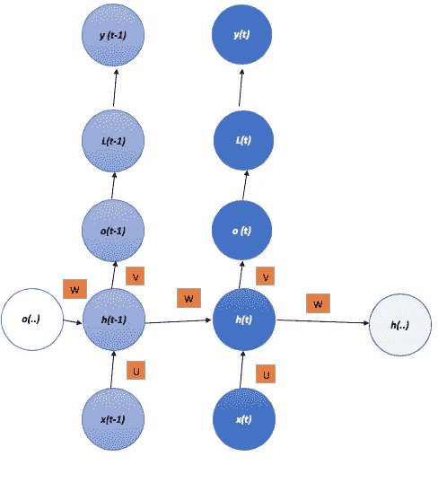*

*Computation Graph to compute training loss of recurrent neural network.The sequence of output values o is compared to the training targets y, this leads to the computation of the loss function. We assume o is the unnormalised log probabilities. The **loss function** **L** internally computes **y^ = softmax(o)** and compares this to target y.The RNN has input to hidden connections parameterised by a weight matrix **U**, parameterised by a weight matrix **W**, and hidden to output connection parameterised by a weight matrix **V**.*

> *RNN 的计算可以分解为三个参数块:*
> 
> *1.从输入到隐藏状态*
> 
> *2.从以前的隐藏状态到现在的隐藏状态*
> 
> *3.从隐藏状态到输出*
> 
> *这些块中的每一个都与单独的权重矩阵相关联。当网络展开时，这些块中的每一个都对应于浅层变换(影响单个层的变换)。*

*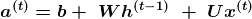**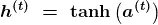**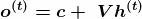*

*The above equations specify forward propagation of this model,forward propagation begins with a specification of initial state **h(0)** for each time step from **t = 1 to t= T***

*这是 RNN 的图像，它将输入序列映射到相同长度的输出序列。总损失是一段时间内损失的总和。 *L(t)* 是 *y(t)的负对数似然。**

*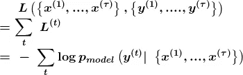*

*梯度计算包括从左到右的前向传播，随后是从右到左的反向传播。在前向传播中计算的状态必须在反向传播中使用，因此需要存储它们。通过输出 *o(t)* 应用的反向传播算法被称为*‘通过时间的反向传播’。*通过递归神经网络计算梯度非常简单。人们简单地应用广义反向传播算法来展开计算图。通过反向传播获得的梯度然后可以用于训练 RNN。*

*让我们在 *Pytorch 中制作 *RNN* 模型。*我们在这里生成伪代码，我将在我的 GitHub 链接中贴出完整的引文:[***链接***](https://github.com/theAkhileshRai/ML_Made_Easy/blob/master/VanillaRNNEarly)*

## **Pytorch MNIST 培训**

*首先，我们导入类和 *MNIST 数据集。**

> *导入 torch
> 导入 torchvision
> 导入 torch.nn 作为 nn
> 导入 torchvision.transforms 作为转换
> 导入 torchvision.datasets 作为数据集
> 从 matplotlib 导入 numpy 作为 np
> 导入 pyplot 作为 plt*
> 
> *n _ epochs = 3
> batch _ size _ train = 64
> batch _ size _ test = 1000
> learning _ rate = 0.01
> momentum = 0.5
> log _ interval = 10*
> 
> *random _ seed = 1
> torch . backends . cud nn . enabled = False
> torch . manual _ seed(random _ seed)*
> 
> *train _ loader = torch . utils . data . data loader(dsets。MNIST('/Users/akhileshrai/Downloads '，train=True，download=True，
> transform = torch vision . transforms . compose([
> torch vision . transforms . totensor()，
> torch vision . transforms . normalize(
> (0.1307)，(0.3081)，)
> ))，
> batch_size=batch_size_train，shuffle=True)*
> 
> *test _ loader = torch . utils . data . data loader(
> dsets)。MNIST('/Users/akhileshrai/Downloads '，train=False，download=True，
> transform = torch vision . transforms . compose([
> torch vision . transforms . totensor()，
> torch vision . transforms . normalize(
> (0.1307)，(0.3081)，)
> ))，
> batch_size=batch_size_test，shuffle=True)*
> 
> *examples = enumerate(test _ loader)
> batch _ idx，(example_data，example_targets) = next(示例)*
> 
> *将 matplotlib.pyplot 作为 plt 导入*
> 
> *fig = plt.figure()
> 对于范围(6)中的 I:
> PLT . subplot(2，3，I+1)
> PLT . tight _ layout()
> PLT . im show(example _ data[I][0]，cmap='gray '，interpolation = ' none ')
> PLT . title(" Number:{ } "。格式(example _ targets[I])
> PLT . x ticks([])
> PLT . y ticks([])
> 打印(图)*

**数据加载器*加载 *MNIST* 数据集。数据集被下载到上述文件夹中。这些变换首先用于将数据转换为张量，然后将数据归一化。*

*让我们通过打印测试数据集的样本来看看同样的情况。*

*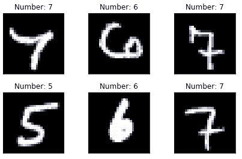*

*Samples of the MNIST Dataset*

*让我们根据上面所示的架构来准备我们的神经网络:*

> *RNNModel 类(nn。模块):
> def __init__(self，input_dim，hidden_dim，layer_dim，output _ dim):
> super(rnn model，self)。__init__()
> #隐藏维度
> self.hidden_dim = hidden_dim*
> 
> *#隐藏层数
> self.layer_dim = layer_dim*
> 
> *#构建您的 RNN
> # batch_first=True 导致输入/输出张量的形状为
> # (batch_dim，seq_dim，input_dim)
> # batch_dim =每批的样本数
> self.rnn = nn。RNN(input_dim，hidden_dim，layer_dim，batch_first=True，非线性='tanh ')*
> 
> *#读出层
> self.fc = nn。线性(隐藏尺寸，输出尺寸)*
> 
> *def forward(self，x):
> #用零初始化隐藏状态
> # (layer_dim，batch_size，hidden _ dim)
> h0 = torch . zeros(self . layer _ dim，x.size(0)，self.hidden_dim)。requires_grad_()*
> 
> *#我们需要分离隐藏状态以防止爆炸/消失梯度
> #这是通过时间截断反向传播的一部分(BPTT)
> out，hn = self.rnn(x，h0.detach())*
> 
> *#索引上一时间步的隐藏状态
> # out.size() → 100，28，10
> # out[:，-1，:] → 100，10 →只想要上一时间步的隐藏状态！
> out = self.fc(out[:，-1，:)
> # out.size() → 100，10
> 返回 out*
> 
> *输入 _ 尺寸= 28
> 隐藏 _ 尺寸= 100
> 图层 _ 尺寸= 3
> 输出 _ 尺寸= 10*
> 
> *model = RNNModel(输入尺寸，隐藏尺寸，图层尺寸，输出尺寸)*
> 
> *print(model)
> print(len(list(model . parameters())))
> for I in range(len(list(model . parameters()))):
> print(list(model . parameters())【I】。size())*

*我们的模型有 3 个隐藏层，每层 100 个隐藏神经元，接受 28 维的输入数据，同时输出 10 维的数据。我们假设的激活函数是*双曲线* ' *tanh'* 。*随机梯度下降*用于在每次迭代中寻找单个例子的成本函数的梯度，而不是所有例子的成本函数的梯度之和。*

*然后，该模型经过 *5000 次迭代训练，*一种称为早期停止的方法用于防止模型“过度拟合”。*

****提前停止*** 是通过计算验证损失完成的优化技术。如果验证损失在指定的迭代次数内没有减少，则模型停止其训练。*

> *learning _ rate = 0.01
> min _ val _ loss = NP。INF
> epochs _ no _ improve = 0
> n _ epoch _ stop = 2
> early _ stop = False*
> 
> *optimizer = torch . optim . SGD(model . parameters()、lr=learning_rate)
> #展开步骤数
> criteria = nn。交叉入口型()*
> 
> *#展开的步骤数
> seq_dim = 28
> early _ stop = False
> ITER = 0
> for epoch in range(num _ epochs):
> 
> val _ loss = 0
> for I，(images，labels)in enumerate(train _ loader):
> #将图像加载为具有梯度累积能力的 torch 张量
> images = images.view(-1，seq _ dim，input_dim)。requires_grad_()*
> 
> *#清除梯度 w.r.t .参数
> optimizer.zero_grad()*
> 
> *#向前传递以获取输出/logits
> # outputs . size()→100，10
> 输出=模型(图像)*
> 
> *#计算损失:softmax →交叉熵损失
> 损失=标准(输出，标签)*
> 
> *#获取梯度 w.r.t .参数
> loss.backward()*
> 
> *#更新参数
> optimizer . step()
> 
> val _ loss+= loss
> val _ loss = val _ loss/len(train _ loader)
> #如果验证损失最小
> 如果 val _ loss<min _ val _ loss:
> #保存模型
> # torch . Save(model)
> epochs _ no _ improve = 0
> min _ val _ loss = val _ loss
> 
> 否则*
> 
> *如果 iter % 500 == 0:
> #计算精度
> 正确= 0
> 总计= 0
> #迭代测试数据集
> #检查**提前停止**条件
> 如果 epochs _ no _ improve = = n _ epochs _ stop:
> 打印('提前停止！')
> early _ stop = True
> break
> else:
> continue
> break
> if early _ stop:
> print(" Stopped ")
> break
> 
> 对于图像，test_loader 中的标签:
> # Resize images
> images = images . view(-1，seq_dim，input_dim)*
> 
> *#仅向前传递以获取逻辑/输出
> 输出=模型(图像)*
> 
> *#从最大值得到预测值
> _，predicted = torch . max(outputs . data，1)*
> 
> *#标签总数
> total += labels.size(0)*
> 
> *#正确预测总数
> 正确+=(预测==标签)。总和()*
> 
> *准确度= 100 *正确/总计*
> 
> *# Print Loss
> print('迭代:{}。损失:{}。准确性:{} '。format(iter，loss.item()，accuracy))*

*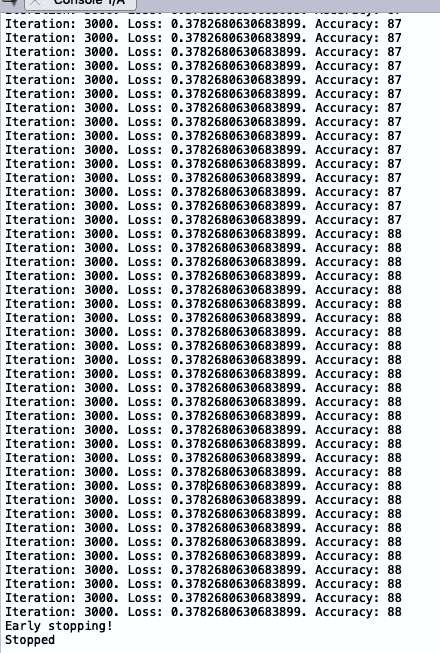*

*Description: Training the RNN using early Early Stopping.*

***模型调查及结论:***

*该模型很好地检测了与先前数字无关的手写数字。如果这些数字是跨序列相关的(长期和短期相关)，该模型不会做得很好。*

*通过时间的反向传播算法是昂贵的，因为在正向传递中计算的状态将被存储，直到它们在反向传递中被重用，所以存储器成本也是 *O(T)。**

*RNNs 可能面临的另一个问题是“悬崖”。非线性函数会出现这种情况，因为它们的导数的大小可能非常大，也可能非常小。 ***【裁剪渐变】*** *是一种技术，用于使渐变下降更合理，并限制步长。**

**我希望这能让你了解 rnn 是如何形成的，它们的直觉是如何塑造深度学习世界的。**

**一些让你入门的好的研究论文和书籍:**

1.  **Alex Graves:* [*用递归神经网络生成序列*](http://Generating Sequences With Recurrent Neural Networks) *。**
2.  *深度学习:伊恩·古德菲勒*
3.  *用于模式识别的神经网络。*
4.  **Y .本吉奥；P. SimardP. Frasconi:* [*学习具有梯度下降的长期依赖关系是困难的*](https://ieeexplore.ieee.org/abstract/document/279181)*

*一如既往地欢迎评论。*