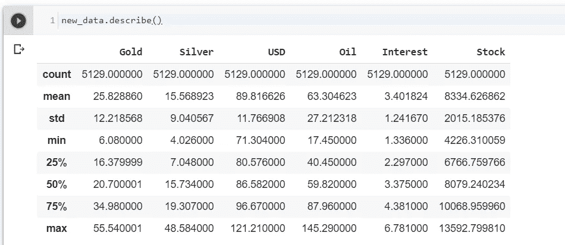

# LSTM 预测股票价格—时间序列数据

> 原文：<https://towardsdatascience.com/recurrent-neural-network-to-predict-multivariate-commodity-prices-8a8202afd853?source=collection_archive---------4----------------------->

## 金融时间序列预测

## 基于神经网络的多变量建模方法

金融序列的预测一直是一项复杂的任务，吸引了学术界、投资公司、银行等的极大关注。价格预测通常基于统计标准进行评估，例如 ***平均误差、平均绝对误差(MAE)或均方根误差(RMSE)*** 。我们已经 [***看到了***](/granger-causality-and-vector-auto-regressive-model-for-time-series-forecasting-3226a64889a6) 多个时间序列之间的关系 *(* ***黄金价格、白银价格、原油价格、股票指数、利率和美元汇率)*** 以及它们如何相互影响 ***。***

让我们使用相同的数据集，并尝试使用***【RNN】***算法来解决我们的预测问题。众所周知，神经网络在多输入变量的情况下效率很高。

先把已经处理好的数据[](/granger-causality-and-vector-auto-regressive-model-for-time-series-forecasting-3226a64889a6)*载入；如果有任何数据错误，希望我们的模型将学会忽略。*

****

## *单输出前馈网络:*

*先来了解一下前馈网络的数学直觉。*

**

*其中， *x1，x2…xk* 是输入序列， *ŷ* 是输出序列，中间是一串隐藏层。然而，这里的问题是-*

*   *信息不考虑时间顺序*
*   *输入是独立处理的*
*   *没有保存过去信息的机制*

> *前馈网络结构没有内置存储器。此外，出现了一种情况，其中深层多层前馈网络不能将有用的梯度信息从模型的输出端传播回模型输入端附近的层”*

*为了克服这些困难， ***RNN*** 被引入，它带有一个网络架构，可以-*

*   *保留过去的信息*
*   *跟踪世界的状态*
*   *随着网络速度的加快，更新世界的状态*

> *“RNN 通过具有递归隐藏状态来处理可变长度序列，该隐藏状态的每次激活都依赖于前一次的激活”*

*下面的图表和等式清楚地说明了 *RNN* 是如何工作的*

**

*其中，𝑥𝑡表示输入，ℎ𝑡表示从输入到输出的隐含层， *yt* 为输出。最重要的是，它有一个循环回路，循环回到过去，以表示输出不仅是新输入的函数，而且是过去隐含层的函数，这样网络就能保持增长。然而，它有一个问题**爆炸和消失梯度**。*递归神经网络(LSTM)* 解决了这个问题。它们是带有环路的网络，允许信息持续存在。对于 *LSTM* 来说，最重要的概念是单元的状态，这些信息通过嵌入在单元顶部的 *yt* 数据在单元之间相互传输。*

**

*在上图中，神经网络 A 的一个块查看某个输入 xt 并输出一个值 ht。环路允许信息从网络的一个步骤传递到下一个步骤。这些循环使得递归神经网络成为一种神秘的物体。然而，它们与普通的神经网络并没有什么不同。一个*递归神经网络*是同一个网络的多个副本，每个副本向后继者传递一个信息。细胞状态就像一条传送带，通过整个链条传送。细胞可以对这些信息进行微小的改变。牢房里有门。这些门包含一个 *sigmoid* 功能，并根据输出值打开和关闭 sigmoid 功能。然后门输出值和 *yt* 值相乘。sigmoid 函数输出可以取 0 到 1 之间的值，而零值将关闭信息转换，并在整个信息中移动一个值。如果循环展开，如下图所示-*

**

*这种链状性质揭示了递归神经网络与序列和列表密切相关。它们是用于此类数据的神经网络的自然架构。让我们考虑在时间步 *t* 的隐藏状态 *ht* 。LSTM 单元需要决定的第一件事是报告单元状态。这个决定是由*忘栅层*做出的。*遗忘门层*通过查看*ht1*和𝑥𝑡.，为每个*yt1*生成一个在 *0* 和 *1* 之间的值 1 表示数据被存储，0 表示数据将被遗忘。由忘记栅极层执行的过程的数学表达式:*

**

*下一步是关于是否在单元状态中记录新信息。输入门层决定更新哪个值。输入栅极层和输入栅极层的输出可以表示为:*

**

*非线性函数层 *(tanh)* ，其生成新的候选值的向量， *ŷt* ，其可以被添加到状态。*

****

*然后更新旧的单元状态，并确定代表新的单元状态的 y𝑡值。可以写出下面的等式来获得新的 y𝑡值。*

**

*最后，为确保输出值介于-1 和 1 之间并对输出进行滤波，输出函数可指定为:*

**

*LSTM 也有渐变消失的问题，但没有基本的 RNN 那么严重。区别在于对于基本 RNN，梯度随 wσ′(⋅衰减，而对于 LSTM，梯度随σ(⋅).衰减对于 LSTM，有一组可以学习的权重，例如σ(⋅)≈1.假设对于某个权重 w 和输入 x，vt + k = wx，那么*神经网络*可以学习一个大的 *w* 来防止梯度消失。对于基本的 *RNN* ，没有一套可以学习的砝码:*

**

> *在 **Keras** 中的 **LSTM** 模型假设数据分为输入(x)和输出(y)分量。这可以通过在时间序列中使用来自上一时间步(t-1)的观测值作为输入和当前时间步(t)的观测值作为输出来实现。*

*让我们添加一个*“pred”*列作为我们的输出，并移动它。*

**

## *标准化数据:*

*缩放和标准化是形成*神经网络架构*的重要活动。*

**

*如果我们检查数据，它有一个很宽的值范围 *(1.336，13592.79)* 而神经网络在这种范围内表现不好。*

******

*我们定义了一个函数来指定回看间隔(60 个时间步长)和预测列，如下所示。*

**

## *拆分数据并将其转换为正确的形状:*

*在这里，我将数据按 80/20 的比例进行了拆分。此外，我们需要将数据整形为 3D 数组，以供*读取和训练模型。**

****

**我们可以看到，训练集包含 4103 个数据点，测试集包含 966 个数据点。**

# **LSTM 网络架构:**

**现在，我们添加 *LSTM* 层和几个脱落层，以防止过度拟合。我在网络中增加了 3 层。对于网络架构，需要考虑以下因素:**

*   **50 个单位，这是输出空间的维度，**
*   ***return_sequences = True，*决定是返回输出序列中的最后一个输出，还是整个序列，**
*   ***input_shape* 作为训练集的形状，**
*   **指定为 0.2 的丢弃层，*即*将丢弃 20%的层，**
*   **此后，我添加了指定 1 个单位输出的*密集*层，**

**接下来，该模型适合在 *100 个时期*上运行，并且*的批量大小为 32* 。代替在完整的观察序列上训练***【RNN】***，我们使用了从训练数据中随机选取的一批较短的子序列(32)。**

```
**model_lstm = tf.keras.Sequential()
model_lstm.add(tf.keras.layers.LSTM(75, return_sequence = True, input_shape = (xtrain.shape[1], xtrain.shape[2])))
model_lstm.add(tf.keras.layers.LSTM(units=30, return_sequence=True))
model_lstm.add(tf.keras.layers.LSTM(units=30))
model_lstm.add(tf.keras.layers.Dense(units=1))
model_lstm.Compile(loss = 'mae', optimizer = 'adam')
model_lstm.summary()history_lstm = model_lstm.fit(xtrain, ytrain, epochs = 15,        batch_size=32, validation_data = (xtest, ytest), shuffle=False)**
```

**创建了训练集和测试集的模型准确度的线图，显示了所有 15 个训练时期的性能变化。下面的测试数据(蓝色)与预测值(橙色)的线图提供了模型技能的背景。**

****

## **用于预测的拟合 LSTM 模型:**

**模型符合训练数据；因此，它可以用来做预测。现在，使用训练好的模型来预测测试数据集中的***【pred】***值。我在这里使用固定的方法进行预测。**

> **固定方法:我们可以决定对所有训练数据拟合一次模型，然后从测试数据中一次一个地预测每个新的时间步长**
> 
> **动态方法:当从测试数据中获得新的观察结果时，我们可以在测试数据的每个时间步重新拟合模型或更新模型。**

**我们必须反转预测的标度，将数值返回到原始标度，以便可以解释结果并计算出可比的误差分数。**

********

**现在我们可以看到，我们还没有完全实现。结果并不令人印象深刻。我们可以检查这两者之间的差异，并以各种方式比较结果&在建立交易策略之前优化模型。**

**让我们看看是否可以通过移动 10 个时间步长和做一些超参数调整来提高模型性能。**

************

**在训练集和测试集上，这里的线图看起来比前两个更好。该模型似乎能够快速学习问题，在大约 20 个时期内收敛到一个解决方案。损耗指标，如 RMSE、平均损耗，可以通过前面所示的类似方法获得。**

****

**虽然有一些改进，但在预测方面，我们仍有改进的余地。这里的一个重要因素是，我们在这个模型中使用了每日价格，因此数据点实际上很少，对于*神经网络架构*，只有 5129 个数据点。我建议使用超过 *100，000 个*数据点，使用分钟或分笔成交点数据来训练模型，同时建立 *ANN* 或任何其他*深度学习*模型，以便最有效。**

# **总结:**

**为了公平地测量网络的性能，使用了六个不同的时间序列。利用格兰杰因果关系，我们发现这些序列互为因果。得到的估算结果与图表进行了比较。 *RMSE* 和 *R* 值作为预测成功的标准进行检查。然而，通过更多的数据点和改变 *LSTM* 网络的超参数，有可能获得更成功的结果。**

****我可以到达** [***这里***](https://www.linkedin.com/in/saritmaitra/) **。****