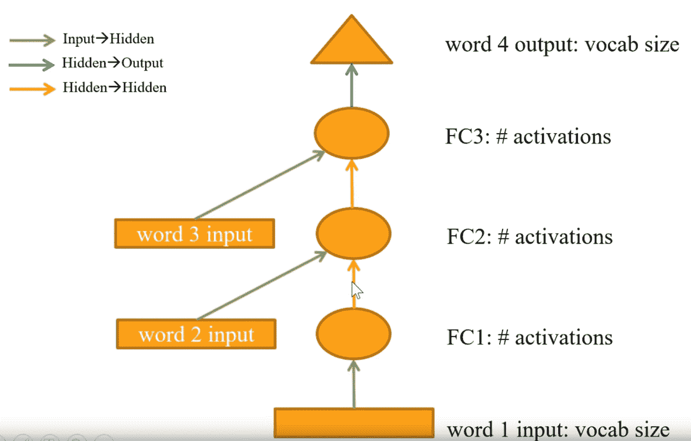
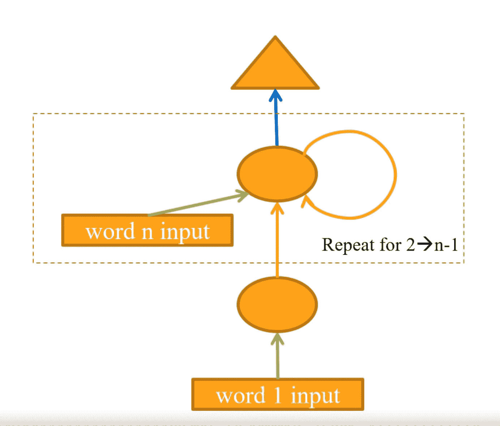
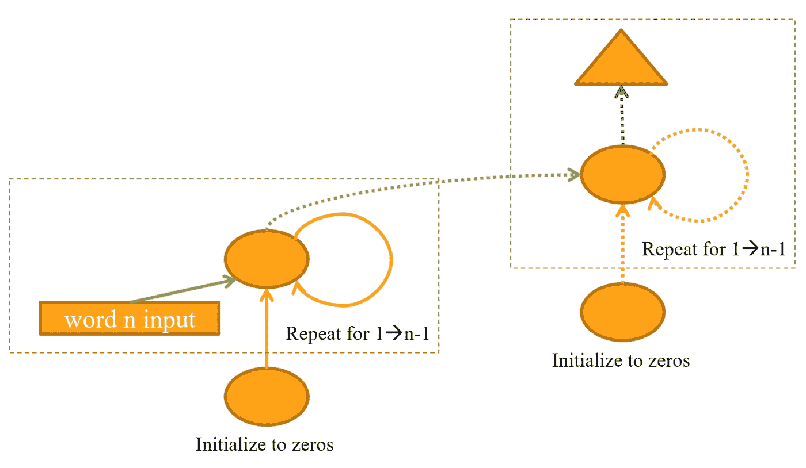

# 递归神经网络和自然语言处理。

> 原文：<https://towardsdatascience.com/recurrent-neural-networks-and-natural-language-processing-73af640c2aa1?source=collection_archive---------4----------------------->

## 递归神经网络(RNNs)是机器学习算法的一种形式，对于诸如文本、时间序列、金融数据、语音、音频、视频等序列数据是理想的。

Image source: [Unsplash](https://unsplash.com/photos/lxujDxNigL4)

rnn 是解决序列比单个项目本身更重要的问题的理想方法。

RNNs 本质上是一个完全连接的神经网络，它包含将其某些层重构为一个循环。该循环通常是对两个输入、矩阵乘法和非线性函数的相加或级联的迭代。

在文本用法中，rnn 擅长执行以下任务:

*   序列标记
*   自然语言处理(NLP)文本分类
*   自然语言处理文本生成

rnn 有效解决的其他任务是时间序列预测或其他不是基于图像或表格的序列预测。

关于文本生成的进步，尤其是 OpenAI 的 GPT-2 算法，媒体上有一些突出和有争议的报道。在许多情况下，生成的文本通常与人类书写的文本难以区分。

我发现学习 rnn 如何工作以及如何构造它们和它们的变体是我必须学习的最困难的课题之一。我要感谢 Fastai 团队和杰瑞米·霍华德，他们的课程以一种更容易理解的顺序解释了这些概念，我在这篇文章的解释中也遵循了这一顺序。

rnn 实际上有一个内部存储器，允许以前的输入影响随后的预测。如果你知道前面的单词是什么，那么预测句子中的下一个单词就容易得多。

通常对于非常适合 RNNs 的任务，项目的顺序与序列中的前一个项目一样重要或者更重要。

当我在我的智能手机上输入这篇文章的草稿时，我手机键盘上的下一个单词将会被 RNN 预测出来。例如，swift key 键盘软件使用 RNNs 来预测您正在键入的内容。

# 自然语言处理

自然语言处理(NLP)是计算机科学和人工智能的一个子领域，处理和生成自然语言数据。虽然仍然有机器学习之外的研究，但现在大多数 NLP 都是基于机器学习产生的语言模型。

NLP 是 RNNs 的一个很好的用例，并在本文中用来解释如何构建 RNNs。

# 语言模型

语言模型的目标是最小化模型看到给定文本序列时的混乱程度。

每个域只需要训练一个语言模型，因为语言模型编码器可以用于不同的目的，例如文本生成和该域内的多个不同的分类器。

由于训练的最长部分通常是创建语言模型编码器，重用编码器可以节省大量的训练时间。

# 将 RNN 与完全连接的神经网络进行比较

如果我们用一个由三个单词组成的文本序列和一个预测第四个单词的网络。

该网络具有三个隐藏层，每一层都是仿射函数(例如矩阵点积乘法)，后面是非线性函数，然后最后一个隐藏层后面是来自最后一层激活函数的输出。

代表序列中每个单词的输入向量是在单词嵌入矩阵中的查找，基于代表词汇表中单词的一个热编码向量。注意，所有输入的单词都使用相同的单词嵌入。在这个上下文中，单词实际上是一个可以表示单词或标点符号的记号。

输出将是表示序列中预测的第四个字的一个热编码矢量。

第一隐藏层将表示序列中第一个单词的向量作为输入，输出激活作为第二隐藏层的输入之一。

第二隐藏层从第一隐藏层的激活中获取输入，并且还获取表示为向量的第二单词的输入。这两个输入可以相加或连接在一起。

第三隐藏层遵循与第二隐藏层相同的结构，从第二隐藏层结合表示序列中第三个单词的向量来获取激活。同样，这些输入被相加或连接在一起。

来自最后一个隐藏层的输出经过一个激活函数，该函数产生一个输出，该输出将词汇表中的一个单词表示为一个热编码向量。

第二个和第三个隐藏层可以使用相同的权重矩阵，这为将其重构为循环提供了机会。

A fully connected network for text generation/prediction. Source: Fastai deep learning course V3 by Jeremy Howard.

## 词汇

词汇表是一个数字向量，称为标记，其中每个标记代表我们语料库中的一个独特的单词或标点符号。

通常，在组成语料库的文本中不出现至少两次的单词通常不会被包括在内，否则词汇量会太大。我想知道这是否可以用作检测生成文本的一个因素，寻找在给定领域中不常见的单词的存在。

## 单词嵌入

单词嵌入是一个权重矩阵，词汇表中的每个单词/单词对应一行

与一个热编码向量的矩阵点积乘法输出表示来自该单词的激活的矩阵行。它本质上是矩阵中的行查找，并且在计算上更有效，这被称为嵌入查找。

使用来自单词嵌入的向量有助于防止产生的激活非常稀疏。如果输入是一个热编码向量，除了一个元素之外都是零，则大多数激活也将是零。这将很难训练。

# 用一个循环重构，一个 RNN

对于循环网络，需要在网络模型中考虑一个环路。对每个单词输入使用相同的嵌入权重矩阵是有意义的。这意味着我们可以在一个循环中用迭代替换第二层和第三层。

循环的每一次迭代都接受一个向量的输入，该向量表示序列中的下一个单词，输出来自上一次迭代的激活。这些输入被相加或连接在一起。

最后一次迭代的输出是句子中下一个单词的表示，该单词通过最后一层激活函数，该函数将其转换成表示词汇表中单词的一个热编码矢量。

A basic RNN. Source: Fastai deep learning course V3 by Jeremy Howard.

这使得网络可以预测任意长度序列末尾的单词。

## 通过环路保持输出，改善 RNN

一旦在单词序列的末尾，下一个单词的预测输出可以被存储，附加到一个数组，在下一次迭代中用作附加信息。然后，每次迭代都可以访问以前的预测。

对于给定数量的输入，会产生相同数量的输出。

An improved RNN retaining its output. Source: Fastai deep learning course V3 by Jeremy Howard.

理论上，预测文本序列的长度可以是无限的，预测单词跟随循环中最后一个预测单词。

## 留住历史，更好的 RNN

对于每个新批，前一批序列的历史(状态)通常会丢失。假设句子是相关的，这可能会失去重要的洞察力。

为了帮助我们在开始每一批时进行预测，了解最后一批的历史记录比重置它更有帮助。这保留了状态，因此保留了上下文，这导致对单词的理解是更好的近似。

请注意，对于一些数据集，例如十亿个单词，每个句子都与前一个句子不相关，在这种情况下，这可能没有帮助，因为句子之间没有上下文。

## 穿越时间的反向传播

时间反向传播(BPTT)是训练期间使用的序列长度。如果我们试图训练 50 个单词的序列，BPTT 就是 50。

通常文件被分成 64 个相等的部分。在这种情况下，BPTT 是以单词为单位的文档长度除以 64。如果文档的字数是 3200，那么除以 64 得到的 BPTT 是 50。

稍微随机化每个序列的 BPTT 值有助于改进模型。

## 分层 RNNs

为了让更多层的计算能够解决或近似更复杂的任务，RNN 的输出可以被输入到另一个 RNN，或任何层数的 rnn。下一节将解释如何做到这一点。

# 扩展 RNNs 以避免消失梯度

由于 rnn 的层数增加了损耗，并且变得不可能训练，这就是消失梯度问题。为了解决这个问题，可以使用门控循环单元(GRU)或长期短期记忆(LSTM)网络。

LSTMs 和 GRUs 获取当前输入和前一个隐藏状态，然后计算下一个隐藏状态。

作为计算的一部分，sigmoid 函数将这些向量的值压缩在 0 和 1 之间，通过将它们与另一个向量相乘，您可以定义想要“通过”该向量的多少

## 长期短期记忆(LSTM)

RNN 人有短期记忆。当与长短期记忆(LSTM)门结合使用时，网络可以具有长期记忆。

LTSM 不是 RNN 的循环部分，而是由四个神经网络层组成的小型神经网络。这些是来自 RNN 的循环层，三个网络充当入口。

除了隐藏状态，LSTM 还有一个单元格状态。这种细胞状态就是长期记忆。不是在每次迭代中只返回隐藏状态，而是返回由单元状态和隐藏状态组成的隐藏状态元组。

长短期记忆(LSTM)有三个门。

1.  一个输入门，它控制每个时间步的信息输入。
2.  一个输出门，它控制输出到下一个单元或上一层的信息量
3.  这是一个遗忘门，控制着在每个时间步丢失多少数据。

## 门控循环单元(GRU)

门控循环单元有时被称为门控循环网络。

在每次迭代的输出处，有一个具有三个实现的神经网络层的小神经网络，包括来自 RNN 的递归层、复位门和更新门。更新门充当遗忘和输入门。这两个门的耦合执行与 LSTM 中的三个门遗忘、输入和输出类似的功能。

与 LSTM 相比，GRU 具有合并的单元状态和隐藏状态，而在 LSTM 中这些是分开的。

**复位门**

重置门从最后一层获取输入激活，这些激活被乘以介于 0 和 1 之间的重置因子。重置因子由没有隐藏层的神经网络计算(如逻辑回归)，这在权重矩阵和先前隐藏状态与我们的新输入的相加/串联之间执行点积矩阵乘法。然后，这一切都通过 e^x / (1 + e^x).)的 sigmoid 函数

这可以学会在不同的情况下做不同的事情，例如，如果有一个句号标记，就忘记更多的信息。

**更新门**

更新门控制接受多少新输入和接受多少隐藏状态。这是一个线性插值。这是 1-Z 乘以先前的隐藏状态加上 Z 乘以新的隐藏状态。这控制了我们在多大程度上保留以前状态的信息，以及在多大程度上使用新状态的信息。

更新门在图中通常表示为一个开关，尽管该门可以在任何位置创建两个隐藏状态之间的线性插值。

A RNN with a GRU. Source: Fastai deep learning course V3 by Jeremy Howard.

## GRU 和 LSTM 哪个更好

这完全取决于所讨论的任务，通常两者都值得一试，看看哪一个执行得更好。

# 文本分类

在文本分类中，网络的预测是对文本属于哪个或哪些组进行分类。一个常见的用途是分类一段文本的情感是积极的还是消极的。

如果像本文前面 RNN 解释的那样，训练一个 RNN 从给定领域的语料库中预测文本，那么它被重新用于该领域的文本分类是接近理想的。网络的代“头”被移除，留下网络的“骨干”。脊柱内的重量可以被冻结。然后，可以将新的分类头连接到主干上，并对其进行训练以预测所需的分类。

逐渐解冻层内的权重是一种非常有效的加速训练的方法。从最后两层的权重开始，然后是最后三层的权重，最后全部解冻所有层的权重。

# 迁移学习和 Wikitext 103 数据集

wikitext 103 数据集包含超过 1.03 亿个来自维基百科的好的或有特色的标记。

在 wikitext 103 数据集上训练的预训练模型是可用的，这可以用于几乎任何语言处理任务的迁移学习。它比任何随机初始化都更接近于任何书面文本。这是没有免费午餐理论的矛盾之一。大多数时候，在你开始训练之前，算法就已经接近解决方案了。

# Fastai 课程

我要感谢 Fastai 团队，他们的课程帮助巩固了我的深度学习和 RNN 知识，为进一步的学习和理解提供了良好的基础。