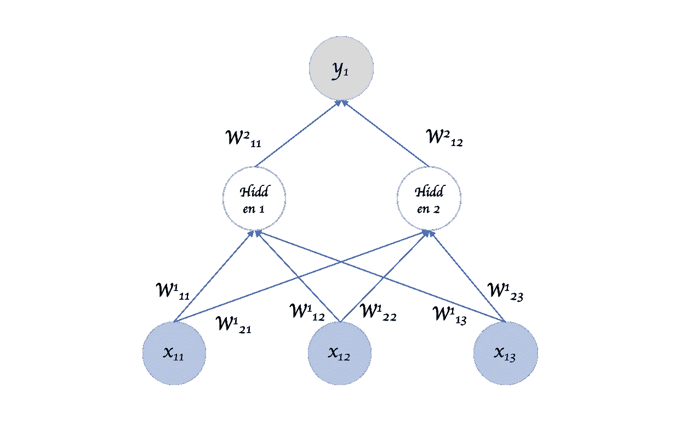
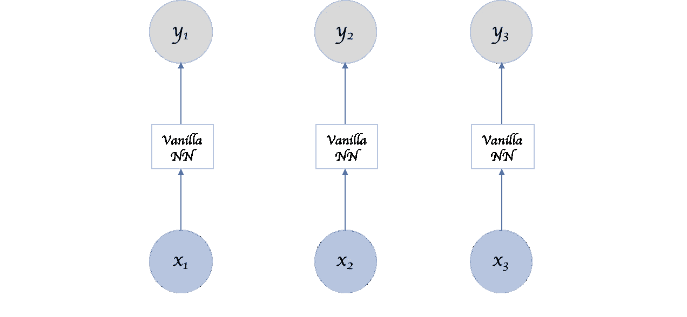
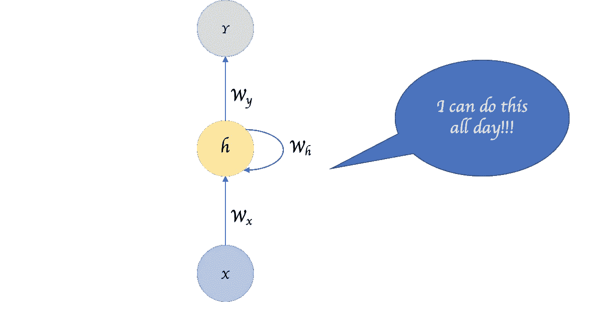
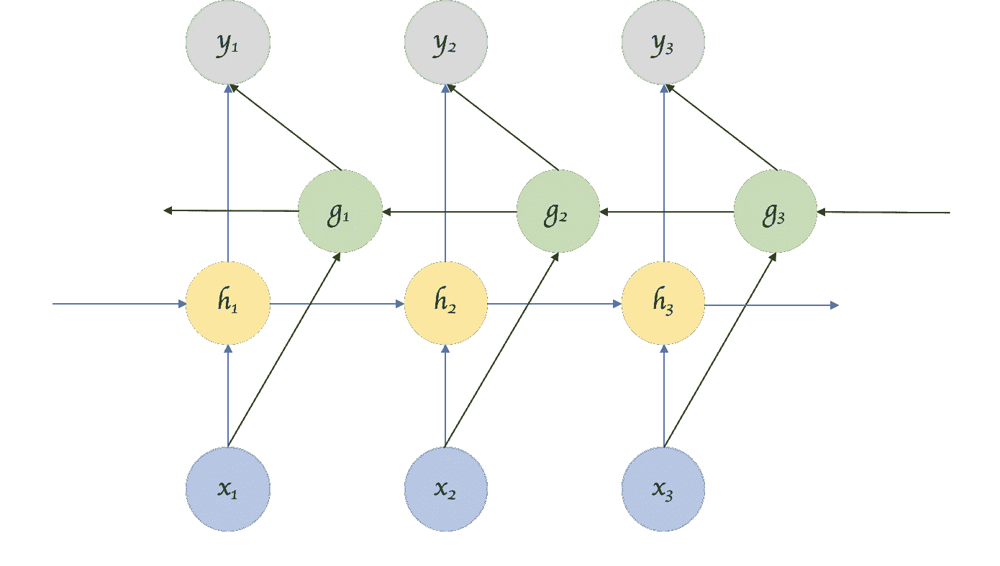
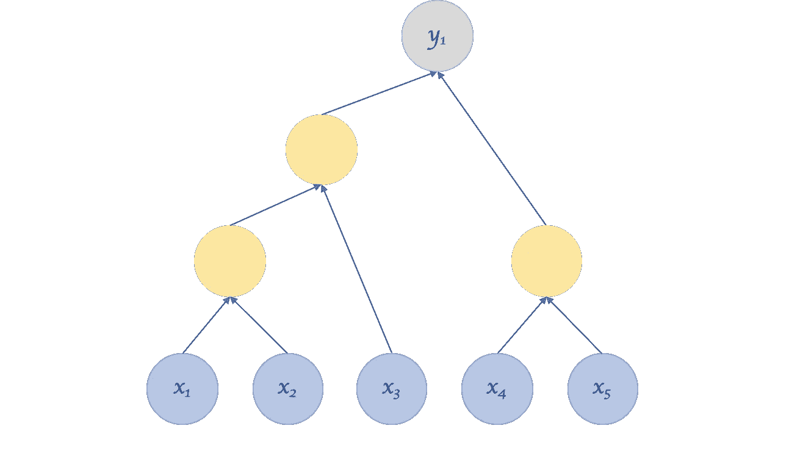
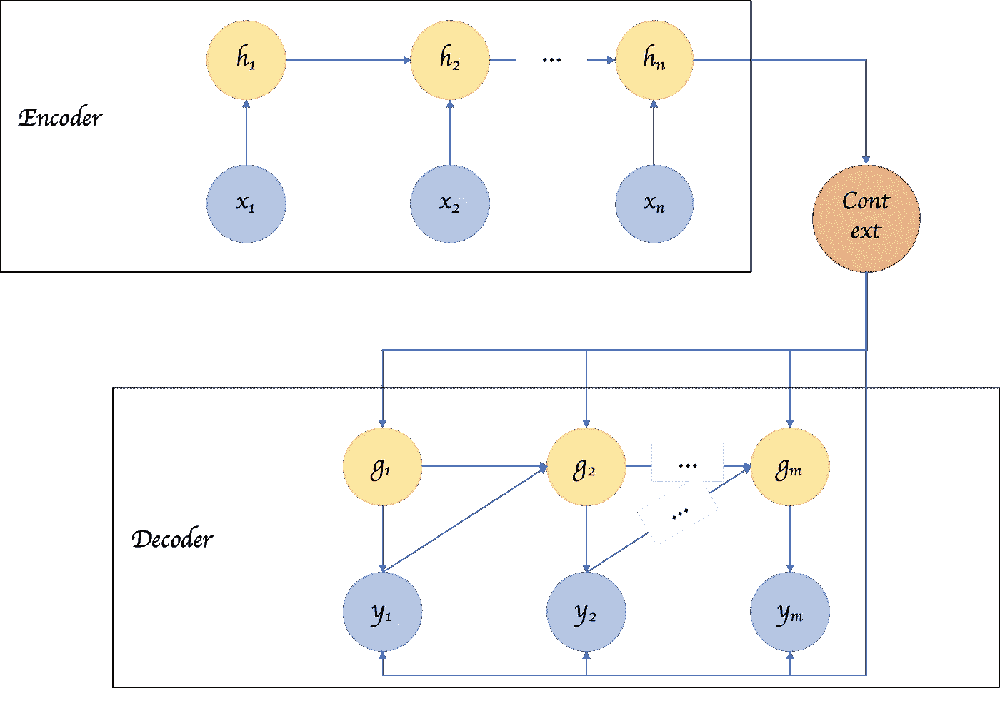

# 递归神经网络

> 原文：<https://towardsdatascience.com/recurrent-neural-networks-d4642c9bc7ce?source=collection_archive---------0----------------------->

## 记住什么是重要的

递归神经网络(RNNs)为基本神经网络增加了一个有趣的转折。标准神经网络采用固定大小的向量作为输入，这限制了它在涉及没有预定大小的“系列”类型输入的情况下的使用。

**Figure 1:** A vanilla network representation, with an input of size 3 and one hidden layer and one output layer of size 1.

rnn 被设计成接受一系列输入，没有预先确定的大小限制。有人可能会问这有什么大不了的，我也可以反复调用一个常规 NN？

**Figure 2:** Can I simply not call a vanilla network repeatedly for a ‘series’ input?

当然可以，但是输入的“系列”部分意味着什么。系列中的单个输入项与其他项相关，并可能对其相邻项产生影响。否则它只是“许多”输入，而不是“一系列”输入(咄！).

因此，我们需要有意义地捕捉这种跨输入关系的东西。

## 递归神经网络

递归神经网络记住过去，并且它的决策受到它从过去所学到的东西的影响。注意:基本的前馈网络也能“记住”东西，但它们记住的是在训练中所学的东西。例如，图像分类器在训练中学习“1”的样子，然后使用该知识对生产中的事物进行分类。

此外，虽然 rnn 在训练时学习类似，但是它们在生成输出时记住从先前输入中学到的东西。这是网络的一部分。RNNs 可以采用一个或多个输入向量，并产生一个或多个输出向量，并且输出不仅受应用于输入的权重的影响，如常规 NN，还受表示基于先前输入/输出的上下文的“隐藏”状态向量的影响。因此，相同的输入可能会产生不同的输出，这取决于序列中先前的输入。

**Figure 3:** A Recurrent Neural Network, with a hidden state that is meant to carry pertinent information from one input item in the series to others.

总之，在普通的神经网络中，固定大小的输入向量被转换成固定大小的输出向量。当你对一系列给定的输入反复应用变换并产生一系列输出向量时，这样的网络就变成了“循环的”。对向量的大小没有预设限制。此外，除了生成作为输入和隐藏状态的函数的输出，我们还基于输入更新隐藏状态本身，并在处理下一个输入时使用它。

## 参数共享

您可能已经注意到了图 1 和图 3 之间的另一个关键区别。在早期，多个不同的权重被应用于输入项的不同部分，生成隐藏层神经元，该隐藏层神经元又使用进一步的权重进行转换，以产生输出。这里似乎有很多砝码在起作用。而在图 3 中，我们似乎一遍又一遍地对输入序列中的不同项目应用相同的权重。

我相信你会很快指出我们在这里比较苹果和橘子。第一张图处理“一个”单个输入，而第二张图表示来自一系列的多个输入。但是尽管如此，从直觉上讲，随着输入数量的增加，游戏中的权重数量不也应该增加吗？我们是否在图 3 中失去了一些通用性和深度？

也许我们是。我们在图 3 中共享输入参数。如果我们不在输入之间共享参数，那么它就像一个普通的神经网络，每个输入节点都需要自己的权重。这引入了输入长度必须固定的约束，并且使得不可能利用长度不同并且不总是已知的串行类型输入。

**Figure 4:** Parameter sharing helps get rid of size limitations

但是，我们在这里看似失去的价值，通过引入将一个输入链接到下一个输入的“隐藏状态”又回来了。隐藏状态捕获串行输入中邻居之间可能存在的关系，并且它在每一步中都保持变化，因此实际上每个输入都经历不同的转换！

图像分类 CNN 已经变得如此成功，因为 2D 卷积是参数共享的有效形式，其中每个卷积滤波器基本上提取图像中特征的存在或不存在，该特征不仅是一个像素的函数，而且是其周围相邻像素的函数。

换句话说，CNN 和 RNNs 的成功可以归功于“参数共享”的概念，与普通神经网络相比，这是一种以更内在的方式利用一个输入项与其周围邻居之间关系的基本有效方式。

## 深层 RNNs

虽然隐藏状态的引入使我们能够有效地识别输入之间的关系，这是一件好事，但我们有没有办法使 RNN“深入”，并获得我们通过典型神经网络中的“深度”获得的多级抽象和表示？

**Figure 4:** We can increase depth in three possible places in a typical RNN. [This paper](https://arxiv.org/pdf/1312.6026.pdf) by Pascanu et al., explores this in detail.

这里有四种增加深度的方法。(1)也许最明显的是增加隐藏状态，一个在另一个之上，把一个的输出提供给下一个。(2)我们还可以在输入到隐藏状态之间添加额外的非线性隐藏层(3)我们可以增加隐藏到隐藏过渡的深度(4)我们可以增加隐藏到输出过渡的深度。Pascanu 等人的论文对此进行了详细的探讨，并且总体上确定了深 rnn 比浅 rnn 的性能更好。

## 双向 RNNs

有时候，这不仅仅是从过去学习来预测未来，我们还需要展望未来来修复过去。在语音识别和手写识别任务中，如果只给出输入的一部分，可能会有相当大的歧义，我们通常需要知道接下来会发生什么，以便更好地理解上下文并检测当前情况。

**Figure 5**: Bidirectional RNNs

这确实带来了一个显而易见的挑战，那就是我们需要对未来进行多大程度的研究，因为如果我们不得不等待看到所有的投入，那么整个运营将变得非常昂贵。在像语音识别这样的情况下，等待整个句子被说出可能会导致不太引人注目的用例。而对于 NLP 任务，输入往往是可用的，我们可能会一次考虑整个句子。此外，根据应用，如果对最近和更近的邻居的敏感度高于对更远的输入的敏感度，则可以对仅查看有限的未来/过去的变量进行建模。

## 递归神经网络

递归神经网络以连续的方式分析输入。递归神经网络在某种程度上类似于将转换重复应用于输入，但不一定是按顺序的方式。递归神经网络是递归神经网络的更一般形式。它可以在任何层次树结构上操作。通过输入节点进行解析，将子节点组合成父节点，并将它们与其他子/父节点组合以创建树状结构。递归神经网络做同样的事情，但是那里的结构是严格线性的。即权重被应用于第一个输入节点，然后是第二个、第三个等等。

**Figure 6**: Recursive Neural Net

但是这提出了关于结构的问题。我们如何决定？如果结构像在递归神经网络中一样是固定的，那么训练、反向传播等过程是有意义的，因为它们类似于常规的神经网络。但是如果结构不固定，那也是学来的吗？[本文](https://ai.stanford.edu/~ang/papers/nipsdlufl10-LearningContinuousPhraseRepresentations.pdf)和[Socher 等人的本文](https://nlp.stanford.edu/pubs/SocherLinNgManning_ICML2011.pdf)探索了一些解析和定义结构的方法，但是考虑到计算上的复杂性，甚至更重要的是，在获得必要的训练数据方面，递归神经网络似乎不如它们的递归表亲流行。

## 编码器解码器序列到序列 rnn

编码器、解码器或序列到序列 rnn 在翻译服务中大量使用。基本思想是有两个 rnn，一个是不断更新其隐藏状态并产生最终单一“上下文”输出的编码器。然后，这被馈送到解码器，解码器将该上下文翻译成输出序列。这种安排的另一个关键区别是输入序列的长度和输出序列的长度不必相同。

**Figure 6**: Encoder Decoder or Sequence to Sequence RNNs

## LSTMs

我们不能关闭任何试图在不提及 LSTMs 的情况下查看 rnn 和相关架构的帖子。这不是 RNN 架构的不同变体，而是它引入了我们如何使用输入计算输出和隐藏状态的变化。

[这篇文章](http://colah.github.io/posts/2015-08-Understanding-LSTMs/)很好地介绍了 LSTMS。在普通的 RNN 中，输入和隐藏状态只是通过一个 tanh 层传递。LSTM(长短期记忆)网络对这种简单的转换进行了改进，并引入了额外的门和单元状态，从而从根本上解决了跨句子保持或重置上下文的问题，并且与这种上下文重置之间的距离无关。存在包括 gru 的 LSTMs 的变体，其以不同的方式利用门来解决长期依赖性的问题。

到目前为止，我们在这里看到的只是普通的架构和一些众所周知的变体。但是了解了 rnn 和相关的变体之后，我们更加清楚地知道，设计一个好的架构的诀窍是了解不同的架构变体，理解每种变化带来的好处，并适当地将这些知识应用于手头的问题。