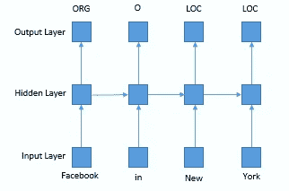
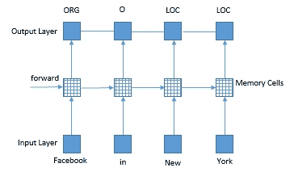
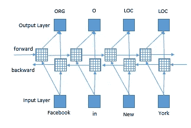
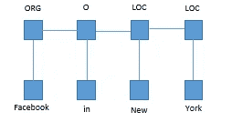
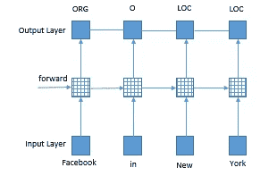
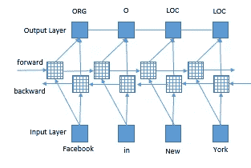

# 递归神经网络:NLP 的深度学习

> 原文：<https://towardsdatascience.com/recurrent-neural-networks-deep-learning-for-nlp-37baa188aef5?source=collection_archive---------9----------------------->

## 这篇文章涵盖了不同类型的 RNN，包括 LSTM 和 CRF 网络

每当你问 *Alexa* 一道菜的配方或一位艺术家的新歌时，一个复杂的代码就会在后台运行，为你提供相关的答案。这只是在最近几年才成为可能。到目前为止，从非结构化文本数据中理解和提取信息只能通过手工操作，更不用说自动确认用户请求了。

Image by Author

将文本数据暴露给各种数学和统计技术的革命性想法背后的基本概念是自然语言处理(NLP)。顾名思义，目标是理解人类所说的自然语言，并在此基础上做出响应和/或采取行动，就像人类一样。不久，改变生活的决定将仅仅通过与机器人交谈来做出。

在本文中，我将尝试提供对神经网络的一些基本理解，这对 NLP 的目的特别有用。我们不会深入研究每种算法的数学原理，但是，我们会尝试理解其背后的直觉，这将使我们处于一个舒适的位置，开始将每种算法应用于现实世界的数据。

我们开始吧。

**递归神经网络(RNN)**

RNN 是广泛用于自然语言处理的神经网络结构。在建立语言模型和语音识别任务中，它被证明是相对准确和有效的。

如果预测必须在单词级别，例如命名实体识别(NER)或词性(POS)标注，rnn 特别有用。因为它存储了当前特征以及用于预测的相邻特征的信息。RNN 维护基于历史信息的记忆，这使得模型能够预测基于长距离特征的当前输出。下面是 NER 使用 RNN 的一个例子。

**Recurrent Neural Network (RNN) —** Image by Author

**长短期记忆细胞(LSTM)**

尽管 RNN 可以学习依赖性，但是它只能学习最近的信息。LSTM 可以帮助解决这个问题，因为它可以理解上下文以及最近的依赖性。因此，LSTM 是一种特殊的 RNN，在这种情况下，理解背景会有所帮助。

LSTM 网络类似于 rnn，一个主要区别是隐藏层更新由存储单元代替。这使他们更善于发现和揭示数据中的长期依赖关系，这对句子结构是必不可少的。下图显示了 LSTM 序列标签模型的表示，该模型用 LSTM 记忆单元代替了隐藏层。

**LSTM network —** Image by Author

**双向 LSTM 网络**

顾名思义，这些网络是双向的，也就是说，在给定时间内，它可以访问过去和未来的输入要素。这在序列标记中尤其重要。

**Bidirectional LSTM —** Image by Author

**CRF 网络**

条件随机场(CRF)在进行预测时会考虑上下文。BiLSTM 和 CRF 的区别在于前者使用两个方向的输入特征，而后者使用标签生成。这里，输入和输出是直接相连的，而不是 LSTMs 网络。此外，如下所示，连接的是输出标签信息，而不是输入要素。

**CRF network —** Image by Author

**LSTM-CRF 网络**

该网络是 LSTM 和 CRF 网络的结合，利用了两者的优点。该网络可以通过 LSTM 层有效地使用过去的输入特征，并通过 CRF 层有效地使用句子级标签信息。

**LSTM-CRF model —** Image by Author

**双 LSTM-CRF 网络**

该网络与之前的网络相似，唯一的区别是 LSTM 网络被双 LSTM 网络所取代，从而实现了更高的性能。正如我们已经知道的，双 LSTM 使用过去和未来的输入特征，这有助于提高标记的准确性。

**BiLSTM-CRF model —** Image by Author

这提供了可以应用于文本数据的深度学习网络的基本思想。下一个合理的步骤是获取一些文本数据并开始实现这些算法，以查看真实的结果并进行比较，这是我将在下一篇文章中讨论的内容。敬请关注。