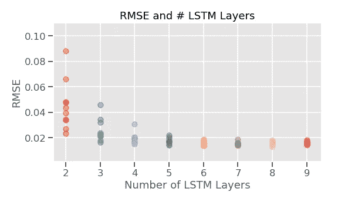
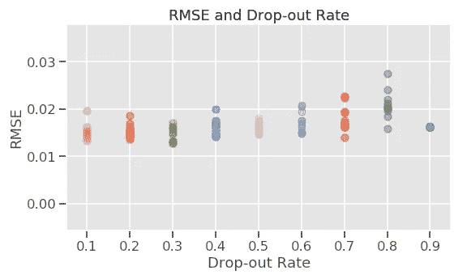

# 用于衰退预测的递归神经网络

> 原文：<https://towardsdatascience.com/recurrent-neural-networks-for-recession-forecast-f435a2a4f3ef?source=collection_archive---------31----------------------->

# 语境

人们普遍认为，美国经济将在未来几年面临另一场衰退。问题是什么时候以及如何发生。我们目睹了十年的经济扩张，但这不会永远持续下去。在这篇文章中，我将尝试一个基本的递归神经网络(RNN)模型来预测美国经济将如何增长，或者在不久的将来可能萎缩。

# 方法

你可能知道，在过去的几十年里，我们没有经历过多少次衰退，最近的一次是在 2008 年全球金融危机之后。这可能是任何机器/深度学习分类器模型的一个障碍。衰退的定义之一是“连续两个季度经济负增长”，因此估计 GDP 增长的回归模型应该足以满足目的。此外，由于潜在国内生产总值相当稳定，国内生产总值增长中的周期性因素，即产出缺口，将是回归模型的一个良好目标。

这是一种时间序列分析，由于其自回归性质，RNN 是最合适的工具之一。我使用了美联储经济数据中的主要宏观经济和金融变量，这些数据是由圣路易斯美联储银行的研究部门提供的，自 20 世纪 70 年代以来，并将它们重新采样到每周频率中。RNN 模型的输入包括 30 个顶级主成分，52 个时间步长为一周，即一年。这里的目标是提前 6 个月的产出缺口。

# 模型-LSTM 层

我从一个简单的模型开始，这个模型有两个长短期记忆(LSTM)层。

```
regressor = Sequential()
regressor.add(LSTM(units=50, 
                   return_sequences=True, 
                   input_shape=(X_train_rnn.shape[1], 
                                X_train_rnn.shape[2])))
regressor.add(Dropout(drop_out))

regressor.add(LSTM(units=50))
regressor.add(Dropout(drop_out))regressor.add(Dense(units=1))regressor.compile(optimizer='adam',
                  loss='mean_squared_error')
```

下图描述了十次试验的模型预测。很明显，预测波动太大，不能说这个模型是可靠的。


Source: FRED, author’s calculation

可能的情况是，模型没有学习到足够的知识，更深的模型可以稳定预测，而增加层往往会导致更多的过度拟合。


Source: FRED, author’s calculation

如你所见，在增加几个 LSTM 层后，预测的波动下降到-2.5%~2.5%的合理范围。比较具有不同数量 LSTM 图层的模型的均方根误差，您会发现具有六个或更多 LSTM 图层有助于控制误差的级别和方差。



Source: FRED, author’s calculation

# 模特-辍学

尽管添加更多的 LSTM 图层可以降低预测的方差，但模型仍然存在过度拟合的问题。较大的辍学率可能会有所帮助，不同的辍学率进行了审查。下面的图表代表了不同退出率的模型的十次试验。


Source: FRED, author’s calculation

目前还不清楚退出在多大程度上缓解了过度拟合，而过高的退出率会增加误差。看看均方根误差的分布，我们会说辍学率应该不高于 0.6。



Source: FRED, author’s calculation

# 观察

预测未来的经济状况并不容易，即使是从现在开始的六个月。上述模型都无法预测 2008-2009 年的急剧下滑。一个主要问题是数据可用性有限；我们只有 2200 个数据点来训练和测试模型。还应该看到，经济结构一直在不断变化。每次衰退的背景都不一样。因此，模型很难以一种概括的方式充分学习。

# 后续步骤

然而，这些模型似乎还有改进的空间。为了解决过拟合问题，我们可以考虑正则化，或者潜在地使用从输入变量中提取的循环因子(例如带通滤波器)。门控循环单位(GRU)代替 LSTM 可以减轻过度拟合。