# 递归神经网络(RNN)解释 ELI5 方式

> 原文：<https://towardsdatascience.com/recurrent-neural-networks-rnn-explained-the-eli5-way-3956887e8b75?source=collection_archive---------6----------------------->

## ELI5 项目机器学习

Photo by [Michael Fruehmann](https://unsplash.com/@magrolino?utm_source=medium&utm_medium=referral) on [Unsplash](https://unsplash.com?utm_source=medium&utm_medium=referral)

序列建模是预测下一个单词/字母的任务。序列模型计算一定数量的单词在特定序列中出现的概率。与 FNN 和 CNN 不同，在序列建模中，当前输出不仅依赖于当前输入，还依赖于先前输入。在序列模型中，输入的长度是不固定的。

> ***引用注:*** *本文的内容和结构是基于我对四分之一实验室深度学习讲座——*[*pad hai*](https://padhai.onefourthlabs.in/)*的理解。*

# 递归神经网络

**递归神经网络(RNN)** 是一种神经网络，前一步的输出作为当前步骤的输入。

RNN 主要用于，

*   **序列分类** —情感分类&视频分类
*   **序列标注** —词性标注&命名实体识别
*   **序列生成** —机器翻译&音译

# 序列分类

在这一节中，我们将讨论如何使用 RNN 来完成序列分类的任务。在序列分类中，我们将得到一个句子的语料库和相应的标签，即…句子的情感，无论是肯定的还是否定的。

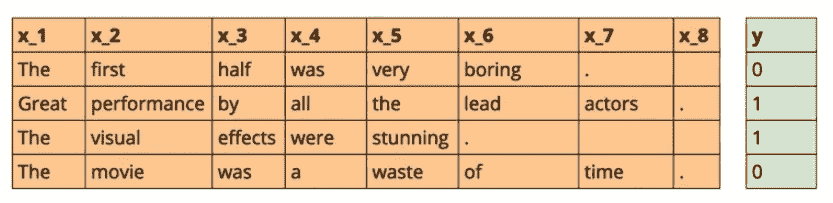

在这种情况下，我们不需要在输入的每个单词后输出，而是我们只需要在阅读整个句子后理解情绪，即…积极或消极。

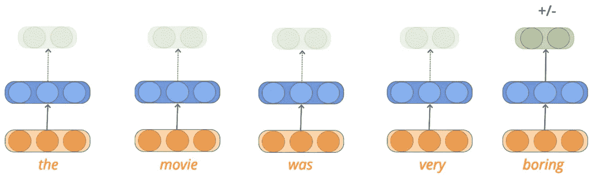

从上图可以看出，输入的句子长度不等。在将数据输入 RNN 之前，我们需要预处理数据，以使输入序列长度相等(输入矩阵的维数固定为 mxn)。输入的单词应该被转换成一个独热码表示向量。

## 预处理数据

在处理过程中，我们定义了一些特殊字符，如序列的开始，序列的结束。

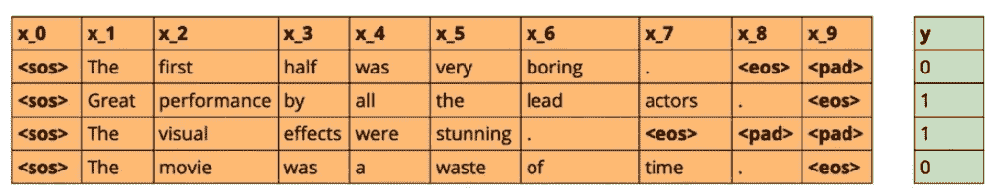

所有输入序列都附加有“***”***”<SOS>字符，以表示字符序列的开始。序列的末尾追加“ ***序列结束***”<EOS>字符来标记字符序列的结束。由于所有字符序列必须与相应输入层定义的长度相同，因此需要的地方会应用**填充**。

我们应用填充的方式是，

*   找出所有序列的最大输入长度(比如 10)
*   将特殊字 **<填充>** 添加到所有较短的序列中，使它们具有相同的长度(本例中为 10)。

一旦我们做了预处理(添加特殊字符)，我们必须将这些包含特殊字符的单词转换成一个热点向量表示，并将它们输入网络。

关于填充需要注意的要点是:

*   填充只是为了确保输入序列大小一致。
*   RNN 中的计算仅执行到“ ***序列结束*** ”特殊字符，即…填充不被认为是网络的输入。

# 序列标记

词性标注是对序列中每个单词的**词性**标签进行标注(预测)的任务。同样，在这个问题中，当前时间步长的输出不仅取决于当前输入(当前字)，还取决于先前的输入。例如，如果我们知道前面的单词是形容词，那么将单词“movie”标记为名词**的概率会更高。**

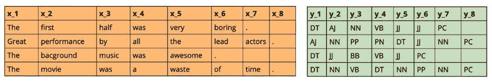

与序列分类问题不同，在序列标记中，我们必须预测序列中出现的每个单词在每个时间步的输出。正如我们从图像中看到的，由于我们在第一个序列中有 6 个单词，我们将根据句子的结构得到 6 个词性预测。

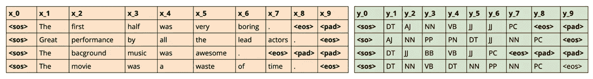

因为我们的输入序列长度可变，所以我们必须预处理数据，使输入序列长度相等。请记住，RNN 只有在遇到“*<SOS>令牌和“***End-of-sequence***”令牌后，才会处理单词序列，向网络发出输入已经结束，输出需要最终确定的信号。*

# *模型*

*在前面的部分中，我们讨论了在将数据输入模型之前，可以使用 RNN 的一些任务以及要执行的预处理步骤。在这一节中，我们将讨论如何模拟(近似函数)输入和输出之间的真实关系。*

## *序列分类*

*我们已经知道，在序列分类中，输出依赖于整个序列。通过分析评论来预测这部电影的发展趋势。*

*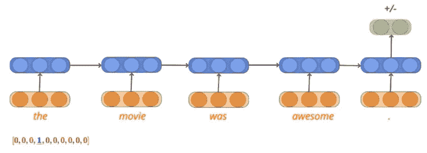*

*该功能的输入以橙色表示，并表示为一个 **xᵢ** 。使用向量 **U** 来表示与输入相关联的权重，并且将单词的隐藏表示( **sᵢ)** 计算为先前时间步长的输出和当前输入以及偏差的函数。隐藏的表示将被计算直到序列的长度(sₜ).*

*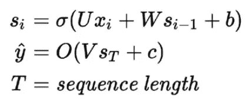*

*来自网络的最终输出(y_hat)是隐藏表示和与其相关联的权重以及偏差的 softmax 函数。*

## *序列标记*

*在序列标记中，我们必须预测每个时间步的输出，这不同于序列分类中最后的预测。*

*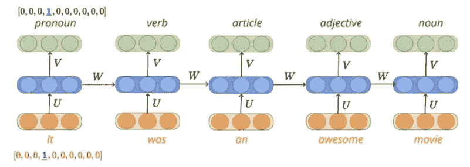*

*数学公式与序列分类略有不同，在这种方法中，我们将预测每个时间步后的输出。*

*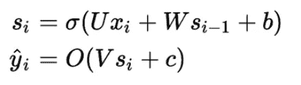*

*一旦我们计算了隐藏表示，来自网络的特定时间步长的输出( **yᵢ** )是隐藏表示和与其相关联的权重以及偏差的 softmax 函数。类似地，我们将计算序列中每个时间步的隐藏表示状态和预测输出。*

# *损失函数*

*损失函数的目的是告诉模型在学习过程中需要进行一些校正。*

*在**序列分类问题**的背景下，为了比较两种概率分布(真实分布和预测分布)，我们将使用**交叉熵**损失函数。损失函数等于真实概率和预测概率的对数之和。*

*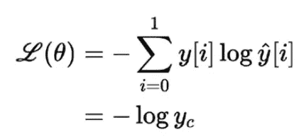*

*对于“m”个训练样本，总损失将等于总损失的平均值(其中 **c** 表示正确类别或真实类别)。*

*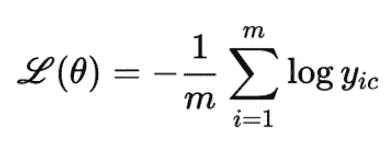*

*在**序列标记问题**中，在每个时间步，我们必须做出预测，这意味着在每个时间步，我们都有真实分布和预测分布。*

*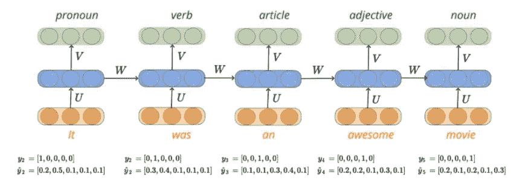*

*由于我们在每个时间步长预测标签，因此在每个时间步长都有可能出错。所以我们必须检查每个时间步的真实概率分布和预测概率分布，以计算模型的损失。*

*实际上，对于所有训练示例(m-训练示例)和所有时间步长(T ),我们试图最小化真实类的预测分布之间的交叉熵损失。*

*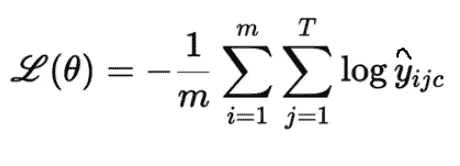*

# *学习算法*

*学习算法的目标是确定参数的最佳可能值，使得模型的总损失(平方误差损失)尽可能最小。学习算法是这样的:*

*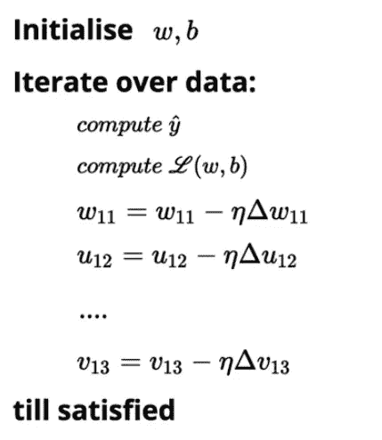*

*我们随机初始化 **w，u，v** 和 **b** 。然后，我们对数据中的所有观察值进行迭代，使用 RNN 方程找到每个观察值的预测结果，并计算总损失。基于损失值，我们将更新权重，使得模型在新参数下的总损失将比模型的当前损失小**。***

*我们将继续进行更新操作，直到我们满意为止。直到满意可能意味着以下任何一种情况:*

*   *模型的总损失变为零。*
*   *模型的总损失变成接近于零的非常小的值。*
*   *基于计算能力迭代固定次数。*

**推荐阅读**

* [## 理解卷积神经网络 ELI5 方法

### 了解卷积运算和 CNN 的

towardsdatascience.com](/understanding-convolution-neural-networks-the-eli5-way-785330cd1fb7)  [## 利用 Pytorch 神经网络模块构建前馈神经网络

### Pytoch 神经网络模块初学者指南

medium.com](https://medium.com/@niranjankumarc/building-a-feedforward-neural-network-using-pytorch-nn-module-52b1d7ea5c3e) 

# 从这里去哪里？

如果你想用 Keras & Tensorflow 2.0 (Python 或者 R)学习更多关于人工神经网络的知识。看看来自 [Starttechacademy](https://courses.starttechacademy.com/full-site-access/?coupon=NKSTACAD) 的 Abhishek 和 Pukhraj 的[人工神经网络](https://courses.starttechacademy.com/full-site-access/?coupon=NKSTACAD)。他们以一种简单化的方式解释了深度学习的基础。

# 结论

在这篇文章中，我们讨论了 RNN 如何用于不同的任务，如序列标记和序列分类。然后，我们研究了在输入模型之前用于处理数据的预处理技术。之后，我们研究了如何解决序列标记和序列分类问题的数学模型。最后，我们讨论了 RNN 的损失函数和学习算法。

在我的下一篇文章中，我们将深入讨论 LSTM 和 GRU。所以，请务必在 Medium 上跟随我，以便在它下跌时得到通知。

直到那时，和平:)

NK。

# 作者简介

Niranjan Kumar 是好事达印度公司的高级数据科学顾问。他对深度学习和人工智能充满热情。除了在媒体上写作，他还作为自由数据科学作家为 Marktechpost.com 写作。点击查看他的文章[。](https://www.marktechpost.com/author/niranjan-kumar/)

你可以在 [LinkedIn](https://www.linkedin.com/in/niranjankumar-c/) 上与他联系，或者在 [Twitter](https://twitter.com/Nkumar_283) 上关注他，了解关于深度学习和机器学习的最新文章。

**免责声明** —这篇文章中可能有一些相关资源的附属链接。你可以以尽可能低的价格购买捆绑包。如果你购买这门课程，我会收到一小笔佣金。*