# 递归神经网络

> 原文：<https://towardsdatascience.com/recurrent-neural-networks-rnns-3f06d7653a85?source=collection_archive---------0----------------------->

## 用 Python 从头开始实现 RNN。

这篇文章的主要目的是从头实现一个 RNN，并提供一个简单的解释，使它对读者有用。从头开始实现任何神经网络至少一次是一项有价值的练习。它帮助你了解神经网络是如何工作的，这里我们实现了一个 RNN，它有自己的复杂性，因此为我们提供了一个磨练技能的好机会。

[Source](https://www.pinterest.dk/pin/579345939536392603/)

有各种教程提供了非常详细的 RNN 内部信息。你可以在这篇文章的末尾找到一些非常有用的参考资料。我可以很快理解 RNN 的工作原理，但最困扰我的是 BPTT 的计算和实现。我不得不花了一些时间去理解，并最终把它放在一起。为了不再浪费时间，让我们先快速浏览一下 RNN 的基本知识。

## 什么是 RNN？

递归神经网络是一种专门用于处理数据序列`**x(t)= x(1), . . . , x(τ)**`的神经网络，其时间步长索引`***t***`的范围为`**1 to τ**`。对于涉及顺序输入的任务，如语音和语言，使用 RNNs 通常更好。在 NLP 问题中，如果你想预测句子中的下一个单词，知道它前面的单词是很重要的。rnn 被称为*循环*，因为它们对序列的每个元素执行相同的任务，输出取决于之前的计算。考虑 rnn 的另一种方式是，它们有一个“存储器”，可以捕获到目前为止已经计算过的信息。

**架构:**让我们简单看一下基本的 RNN 网络。

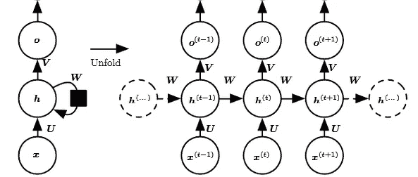

[Reference](http://www.deeplearningbook.org/contents/rnn.html)

上图的左侧显示了一个 RNN 的符号，右侧显示了一个 RNN 被展开成一个完整的网络。展开意味着我们写出了完整序列的网络。例如，如果我们关心的序列是一个由 3 个单词组成的句子，那么这个网络将展开成一个 3 层的神经网络，每个单词一层。

**输入:** *x(t)* 在时间步长 *t 取为网络的输入。*例如， *x1，*可以是对应于一个句子的一个单词的一键向量。

**隐藏状态** *: h(t)* 代表 t 时刻的隐藏状态，充当网络的“记忆”。 *h(t)* 基于当前输入和前一时间步的隐藏状态计算:`**h(t)**​ = *f*(*U* **x(t)**​ + *W* **h(t**−**1)**​).`函数`*f*`取为非线性变换，如 *tanh* ， *ReLU。*

**权重**:RNN 具有由权重矩阵 U 参数化的隐藏连接的输入，由权重矩阵 W 参数化的隐藏到隐藏的递归连接，以及由权重矩阵 V 参数化的隐藏到输出的连接，并且所有这些权重( *U* 、 *V* 、 *W) 【T21)在时间上被共享。*

**输出** : *o(t)* 说明了网络的输出。在图中，我只是在 *o(t)* 后放了一个箭头，这也经常受到非线性的影响，尤其是当网络包含更多的下游层时。

## **向前传球**

该图未指定隐藏单元激活功能的选择。在我们继续之前，我们做一些假设:1)我们假设隐藏层的双曲正切激活函数。2)我们假设输出是离散的，就像 RNN 用于预测单词或字符一样。表示离散变量的一种自然方式是将输出`**o**`视为给出离散变量每个可能值的非归一化对数概率。然后，我们可以应用 softmax 操作作为后处理步骤，以获得输出的归一化概率向量`***ŷ***`。

因此，RNN 向前传球可以由下面的一组等式来表示。

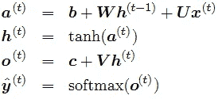

这是一个递归网络的例子，它将输入序列映射到相同长度的输出序列。一个给定的`**x**`值序列与一个`**y**`值序列的总损失就是所有时间步长的损失之和。我们假设输出`***o(t)***`被用作 softmax 函数的参数，以获得输出概率的向量`***ŷ***`。我们还假设损失`**L**`是给定目前输入的真实目标`***y(t)***`的负对数似然。

## 偶数道次

梯度计算包括执行从左到右穿过上述图形的前向传播过程，随后是从右到左穿过该图形的后向传播过程。运行时间为 O(τ),不能通过并行化来减少，因为正向传播图本质上是顺序的；每个时间步长只能在前一个时间步长之后计算。前向传递中计算的状态必须被存储，直到它们在后向传递中被重用，因此内存开销也是 O(τ)。应用于成本为 O(τ)的展开图的反向传播算法被称为时间反向传播(BPTT)。由于网络中的所有时间步长共享这些参数，因此每个输出的梯度不仅取决于当前时间步长的计算，还取决于之前时间步长的计算。

## 计算梯度

给定我们的损失函数 *L* ，我们需要计算三个权重矩阵 *U、V、W 和*偏差项 *b、c* 的梯度，并用学习率`***α***`更新它们。类似于正常的反向传播，梯度给我们一种损失如何相对于每个权重参数变化的感觉。我们用下面的等式更新权重 W 以最小化损失:

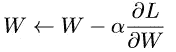

对于其他重量 U、V、b、c 也要进行同样的操作。

现在让我们计算上面 RNN 方程的 BPTT 梯度。我们的计算图的节点包括参数 U、V、W、b 和 c 以及由 t 索引的 x (t)、h(t)、o(t)和 L(t)的节点序列。对于每个节点`**n**`,我们需要递归地计算梯度`**∇nL**`,基于在图中跟随它的节点处计算的梯度。

**计算相对于输出 o(t)** 的梯度，假设 o(t)用作 softmax 函数的自变量，以获得输出概率的向量`***ŷ***`。我们还假设损失是真实目标 y(t)的负对数似然。

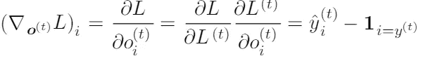

请参考[这里的](https://eli.thegreenplace.net/2016/the-softmax-function-and-its-derivative/)推导出上述优雅的解决方案。

现在让我们理解梯度是如何流过隐藏态 h(t)的。从下图中我们可以清楚地看到，在时间 t，隐藏状态 h(t)具有从当前输出和下一个隐藏状态流出的梯度。

Red arrow shows gradient flow

我们从序列的末尾开始，反向工作。在最后的时间步长τ，h(τ)只有 o(τ)作为后代，因此其梯度很简单:

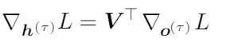

然后，我们可以在时间上向后迭代，以通过时间反向传播梯度，从 t =τ1 向下到 t = 1，注意 h(t )(对于 t < τ ) has as descendants both o(t) and h(t+1). Its gradient is thus given by:

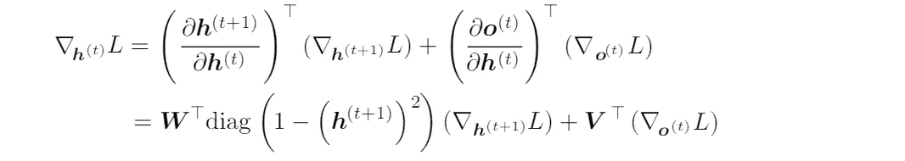

Once the gradients on the internal nodes of the computational graph are obtained, we can obtain the gradients on the parameter nodes. The gradient calculations using the chain rule for all parameters is:

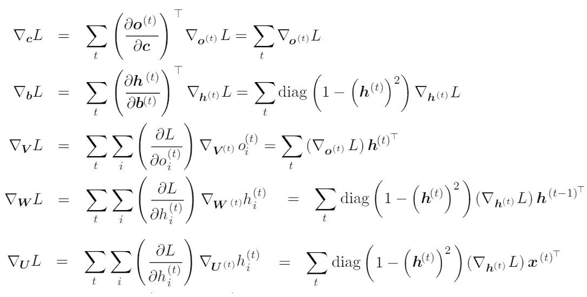

We are not interested to derive these equations here, rather implementing these. There are very good posts [此处](https://jramapuram.github.io/ramblings/rnn-backrpop/)和[此处](http://willwolf.io/2016/10/18/recurrent-neural-network-gradients-and-lessons-learned-therein/))提供这些等式的详细推导。

## 履行

我们将使用 Python 从头开始实现一个完整的递归神经网络。我们将尝试使用 RNN 构建一个文本生成模型。我们训练我们的模型来预测给定前面字符的字符的概率。这是一个*生成模型*。给定一个现有的字符序列，我们从预测的概率中抽取下一个字符，并重复这个过程，直到我们得到一个完整的句子。这个实现来自 Andrej karpathy[的伟大帖子](http://karpathy.github.io/2015/05/21/rnn-effectiveness/)构建人物级 RNN。这里我们将逐步讨论实现细节。

要遵循的一般步骤:

1.  从随机分布初始化权重矩阵 *U，V，W* 并用零偏置 b，c
2.  向前传播以计算预测
3.  计算损失
4.  计算梯度的反向传播
5.  基于梯度更新权重
6.  重复步骤 2–5

## **第一步:初始化**

从基本 RNN 单元的实现开始，我们首先定义各种参数 U、V、W、b、c 的维数

**维度**:假设我们选择一个词汇大小`**vocab_size= 8000**`和一个隐藏层大小`**hidden_size=100**`。然后我们有:

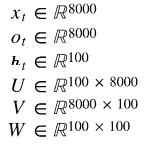

> *词汇大小可以是基于字符的模型的唯一字符数或基于单词的模型的唯一单词数。*

有了我们的几个超参数和其他模型参数，让我们开始定义我们的 RNN 细胞。

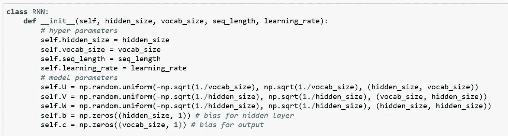

权重的正确初始化似乎对训练结果有影响，在这方面已经有很多研究。事实证明，最佳初始化取决于激活函数(在我们的例子中为 tanh ),一种推荐的[方法是在来自`**[ -1/sqrt(n), 1/sqrt(n)]**`的间隔内随机初始化权重，其中`**n**`是来自前一层的传入连接数。](http://jmlr.org/proceedings/papers/v9/glorot10a/glorot10a.pdf)

## 第二步:向前传球

简单明了根据我们的每个时间戳 t 的等式，我们计算隐藏状态 hs[t]并输出 os[t],应用 softmax 来获得下一个字符的概率。

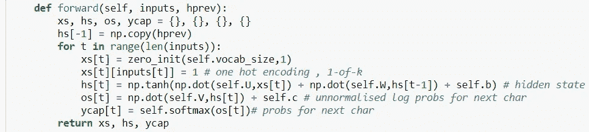

## 计算 softmax 和数值稳定性:

Softmax 函数获取一个 N 维实数向量，并将其转换为一个范围为(0，1)的实数向量，其总和为 1。使用下面的公式完成映射。

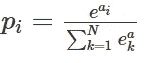

softmax 的实现是:

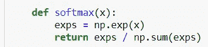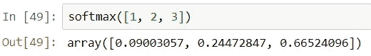

虽然它看起来很好，但是当我们用一个更大的数字调用这个 softmax 时，它给出了“nan”值

Numpy 使用的浮点数的数值范围是有限的。对于 float64，最大的可表示数是 10 ⁰⁸.的数量级 softmax 函数中的乘幂运算可以轻松超过该数值，即使对于中等大小的输入也是如此。避免这个问题的一个好方法是将输入标准化为不太大也不太小。这里有一个小的数学技巧，详情请参考[这里的](https://eli.thegreenplace.net/2016/the-softmax-function-and-its-derivative/)。所以我们的 softmax 看起来像:

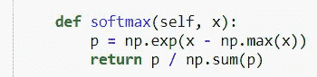

## 第三步:计算损失

因为我们正在实现一个文本生成模型，所以下一个字符可以是我们词汇表中的任何独特字符。所以我们的损失将是交叉熵损失。在多类别分类中，我们取观测值中每个类别预测的测井损失值的总和。

*   M —可能的类别标签数量(我们的 vocab 中的唯一字符)
*   y —类标签`***C***` 是否是观察`***O***`的正确分类的二进制指示符(0 或 1)
*   p —模型预测的观察概率

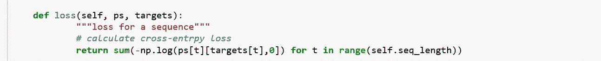

## 第四步:向后传球

如果我们参考 BPTT 方程，实现是按照方程。添加了足够的注释来理解代码。

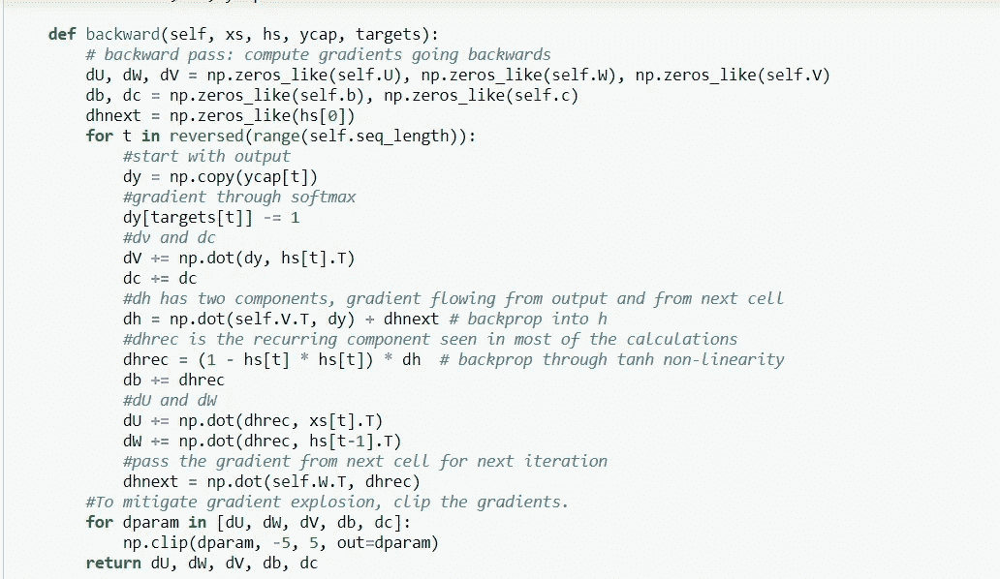

## 问题

虽然原则上 RNN 是一个简单而强大的模型，但在实践中，很难进行适当的训练。这个模型如此笨拙的主要原因是*消失渐变*和*爆炸渐变*的问题。当使用 BPTT 进行训练时，梯度必须从最后一个单元一直行进到第一个单元。这些梯度的乘积可以变为零或呈指数增长。爆炸梯度问题指的是在训练期间梯度范数的大幅度增加。消失梯度问题指的是相反的行为，当长期分量以指数速度达到范数 0 时，模型不可能学习时间上遥远的事件之间的相关性。

> 虽然可以使用渐变裁剪技术来修复爆炸渐变，如示例代码中所使用的，但是消失渐变问题仍然是 RNN 的主要问题。

这种消失梯度限制被各种网络克服，例如长短期记忆(LSTM)、门控循环单元(GRUs)和残差网络(ResNets)，其中前两种是 NLP 应用中最常用的 RNN 变体。

## 步骤 5:更新权重

使用 BPTT，我们计算了模型每个参数的梯度。现在是更新权重的时候了。

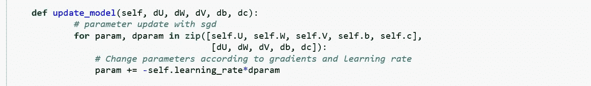

在 Andrej Karparthy 最初的[实现](https://gist.github.com/karpathy/d4dee566867f8291f086)中，Adagrad 用于梯度更新。阿达格拉德的表现比 SGD 好得多。请检查并比较两者。

## 步骤 6:重复步骤 2-5

为了让我们的模型从数据中学习并生成文本，我们需要训练它一段时间，并在每次迭代后检查损失。如果损失在一段时间内减少，这意味着我们的模型正在学习对它的期望。

## 生成文本

我们训练了一段时间，如果一切顺利，我们应该准备好我们的模型来预测一些文本。让我们看看它是如何为我们工作的。

我们将实现一个预测方法来预测几个单词，如下所示:

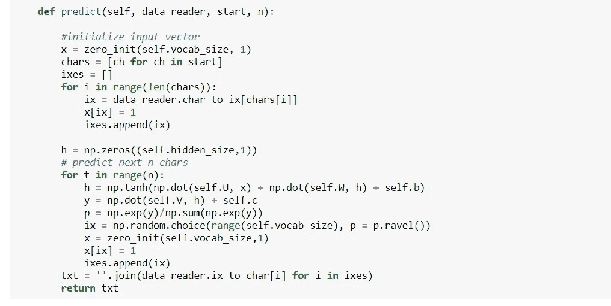

让我们看看我们的 RNN 在几个时代的训练后是如何学习的。

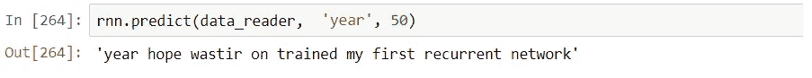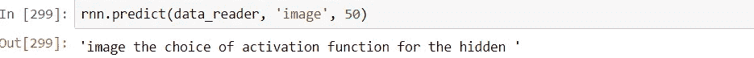

输出看起来更像带有单词边界和一些语法的真实文本。所以我们的小 RNN 已经开始学习语言，并且能够预测接下来的几个单词。

这里给出的实现只是为了易于理解和掌握概念。如果你想玩模型超参数，笔记本是[这里](https://github.com/javaidnabi31/RNN-from-scratch/blob/master/RNN_char_text%20generator.ipynb)。

**奖励:**想形象化训练 RNN 时实际发生的事情，看这里的。

希望对你有用。谢谢你的阅读。

## 参考资料:

[1][http://www.deeplearningbook.org/contents/rnn.html](http://www.deeplearningbook.org/contents/rnn.html)

[https://gist.github.com/karpathy/d4dee566867f8291f086](https://gist.github.com/karpathy/d4dee566867f8291f086)

[3][http://www . wild ml . com/2015/09/recurrent-neural-networks-tutorial-part-1-introduction-to-rnns/](http://www.wildml.com/2015/09/recurrent-neural-networks-tutorial-part-1-introduction-to-rnns/)

[4][https://medium . com/forward-artificial-intelligence/wireless-tour-of-rnns-a 11 effb 7808 f](https://medium.com/towards-artificial-intelligence/whirlwind-tour-of-rnns-a11effb7808f)