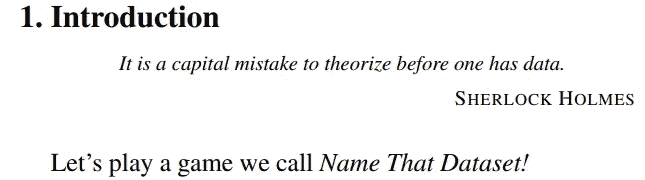
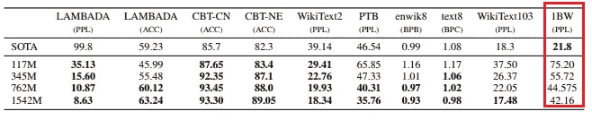
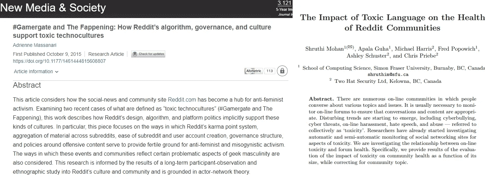
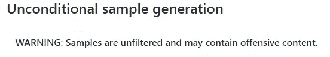
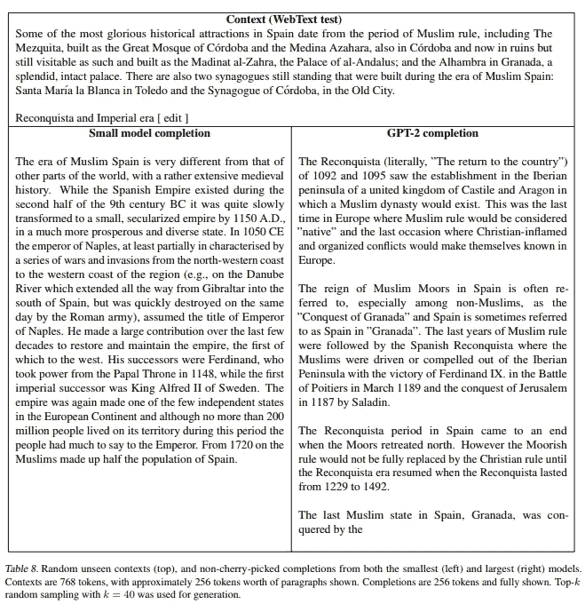
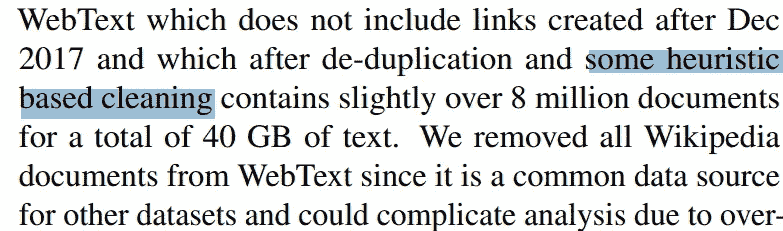
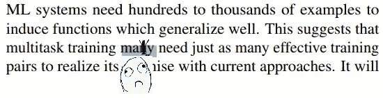
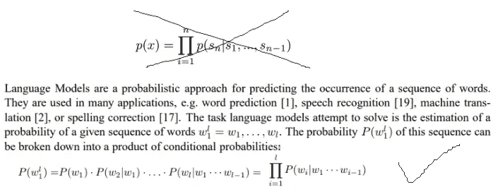
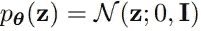
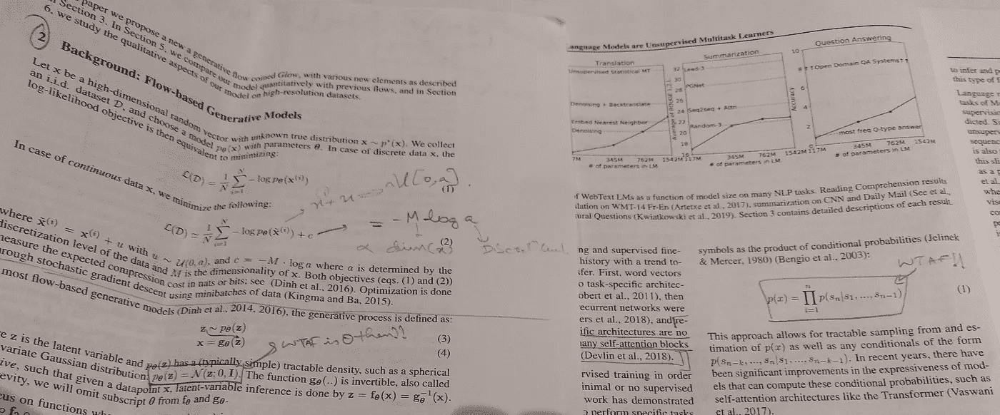

# 我支持 OpenAI 新 GPT 协议的一个原因是:REDDIT

> 原文：<https://towardsdatascience.com/reddit-a-one-word-reason-why-i-support-openais-gpt-2-decision-56b82912443c?source=collection_archive---------23----------------------->

## TLDR: *他们通过红迪网播种他们的网络搜索，红迪网是所有想法的宝库。因此，如果他们发布更大的型号，至少会是一场公关灾难。较小的 117 米是讨厌的，因为没有微妙的*！

## 目录

*   [TLDR:](https://medium.com/p/56b82912443c#a038)
*   [简介:](https://medium.com/p/56b82912443c#b435)
*   [核心问题:数据集管理](https://medium.com/p/56b82912443c#a40c)
*   [无条件样本生成:不适合内心脆弱的人](https://medium.com/p/56b82912443c#47ab)
*   [帖子脚本:](https://medium.com/p/56b82912443c#fc6f)

# 简介:

我推荐我的实习生阅读的一篇论文是[*不带偏见地看数据集偏见*](http://citeseerx.ist.psu.edu/viewdoc/download?doi=10.1.1.208.2314&rep=rep1&type=pdf) ，其中有一些很棒的介绍性文字:

Torralba, Antonio, and Alexei A. Efros. “Unbiased look at dataset bias.” (2011): 1521–1528.

如果我可以补充的话，**没有非常仔细地整理这些数据也是一个致命的错误**。考虑到这些天来(正当的)对数据集产生的[偏见和有害特质](https://arxiv.org/pdf/1607.06520.pdf)问题的关注，你会认为大型组织在开始像最近这篇引起轰动的[论文](https://blog.openai.com/better-language-models/)中那样雄心勃勃的冒险之前，应该对数据集收集程序的细节进行广泛的讨论。正如猜测的那样，架构建模中没有引入突破性的想法(作者也没有声称有),因此*pieèce de réstate*实际上是数据集的庞大、模型的庞大和训练模型的计算能力的庞大这三者的结合。

但事实证明，情况并非如此，这导致了一个模型，呈现了一种非常特殊的潜在的邪恶威胁，我们都可以没有它。为进一步澄清，标题应为:

OpenAI 建立了一个文本生成器，s̶o̶ ̶g̶o̶o̶d̶在一个数据集上进行训练，这个数据集是如此不小心有毒和有效，以至于它被认为太危险而不能发布。

(那里！修好了！)

就其本身的学术价值而言，这篇论文充满了一些优秀的观点和见解，无论你是否专门研究 NLP，都值得从头到尾读一遍。除了被介绍到这个令人敬畏的[提取工具](https://github.com/codelucas/newspaper)之外，由于我个人对字节级 LMs 的不满(这个问题可能会在另一篇博文中探讨)，当我通读关于*输入表示*的第 2.2 节时，我有一种个人的痛苦救赎感。不过，我必须承认，看到基于字节对编码(BPE)的方法在十亿字基准测试中惨败也令人失望，尤其是在阅读了第 2 部分之后:*当前的字节级 LMs 在大规模数据集(如十亿字基准测试*)上无法与字级 LMs 竞争

GPT-S’s waterloo: One Billion Word Benchmark

# 核心问题:数据集监管

对我来说，论文的全部内容都在第二部分，它回答了我的两个主要问题。

a)他们如何管理数据集？

b)他们对此数据集使用了什么模型？——答案有点令人失望，对这篇博文没有意义。

我收集到的 a)的答案至少让我感到有点不安，最终促使我同意 OpenAI 的立场，但原因完全不同。

**作者根据 R-E-D-D-I-T.** 创建了他们的数据集' *WebText'*

用他们自己的话说:

> 手动过滤一个完整的网络抓取会非常昂贵，因此作为一个起点，我们从社交媒体平台 Reddit 抓取了所有出站链接，该平台收到了至少 3 个 karma。这可以被认为是一个启发性的指标，表明其他用户是否觉得这个链接有趣、有教育意义或者仅仅是有趣。结果数据集 WebText 包含了这 4500 万个链接的文本子集。

这可能是因为我自己对 Reddit 又爱又恨的关系，但这听起来像是一部写得很差的拉姆齐兄弟电影的开始。你把一个拥有强大计算能力的庞大模型扔进了一个有毒的数据宝库，这个数据宝库是从 REDDIT 上收集的？

请参考下面这些**同行评审的**关于该平台毒性的研究论文:

Source: [https://journals.sagepub.com/doi/abs/10.1177/1461444815608807](https://journals.sagepub.com/doi/abs/10.1177/1461444815608807) , [https://www.researchgate.net/profile/Thalia_Field2/publication/316940579_Domain_Adaptation_for_Detecting_Mild_Cognitive_Impairment/links/5a45372c458515f6b05477c2/Domain-Adaptation-for-Detecting-Mild-Cognitive-Impairment.pdf#page=65](https://www.researchgate.net/profile/Thalia_Field2/publication/316940579_Domain_Adaptation_for_Detecting_Mild_Cognitive_Impairment/links/5a45372c458515f6b05477c2/Domain-Adaptation-for-Detecting-Mild-Cognitive-Impairment.pdf#page=65)

reddit 的事业和最终被投票通过的东西构成了一个坏主意的主矿脉和坏主意的链接。这种数据集构建努力充满了令人不快的上下文生成的高风险，尤其是如果我试图从 LM 中*生成无条件样本*的话。

哦等等！

Source: [https://github.com/openai/gpt-2](https://github.com/openai/gpt-2)

出于好奇，如果这种恐惧真的会转化为文字(这是一个糟糕的双关语)，我下载并玩了他们通过 github 页面[在这里](https://github.com/openai/gpt-2)适时分享的较小(117M 参数)版本的 GPT-2。

# 无条件样本生成:不适合内心脆弱的人

令我懊恼的是，这个小模型生成的许多样本与研究人员对 Reddit 的担心非常接近。

> 在这个问题上，自由主义者也在试图切断他们自己意识形态学术的刺痛。考虑公开转基因玉米，因为它有隐藏的但有价值的价值(减少个体的机会和工作机会)。在非经济学家看来(许多登山者在可能的情况下会求助于无偿的外交服务基金)，啤酒和华夫饼在一段时间内供应给所有性别的军事化男性倡导者。支持堕胎权利的保守告密者、藏人和被强奸的平民很可能包括在这些伪激进分子的诽谤活动中，那么这引发了什么政治问题呢？许多年来，我们对左派的信念感到不安，他们认为奴隶制度结束后，人类对男人的第一个嗜好是高潮或金钱。我们试图忘记地球上的男人是如何变得不依赖于绿帽子或江湖骗子，只是。

还有这个！

*男性杰特——所以他们中的许多人住在乐购，包括木炭烧烤店的程序员和员工，以及手无寸铁的社交瘾君子凯西·布里格斯(Kathy Briggs ),他们有 1000 份工作，来自 DW 车站、海洛因注射、漂亮的发型和酒吧学习日。*

稍微用谷歌搜索一下，就会发现“*瘾君子”+“凯西·布里格斯”*唯一同时出现的是[这个](http://www.fairfaxtimes.com/articles/fairfax_county/fairfax-family-making-a-difference-after-son-s-heroin-overdose/article_e96bbba6-ae67-11e5-83ae-23b4dc37ea13.html)令人揪心的故事，讲的是费尔法克斯的某个凯西·布里格斯与她 21 岁的儿子因吸食海洛因过量而死亡的事情。

以下是其他一些热门话题:

> “对孕妇来说，最大的障碍之一是耻辱感。他们是不明智的人无法跳出的中心，”斯奈德周三在 8 月份援引的州议会网站上说，此前全国各地收容机构的有毒堕胎导致州立医院比去年多 10 人死亡。(至少那些人指责诊所大量解剖患病女性的尸体，造成了数千人的死亡

..而且，

> 2014 年，同性恋权利活动人士向民主党人提出了同样的论点，呼吁帕利特卡支持该法案，而不是推动它。“罗马尼亚需要一个坚实的南部国会侧翼，以沿着同样的路线‘建立反对和争取时间’，更不用说小心了，”社会正义基金(Social Justice Fund)LGBT 倡议主任阿德里亚诺·罗梅罗(Adriano Romero)告诉波兰人 RT . DGA(RT . Roberto)，嗯，这是指特别是猴子和猿；她还提到了支持 longs 的 Janus Djiman 的快速投票。“罗马尼亚仍然需要一支军队:在种族清洗运动中，3000 名蒙面掠夺者推翻了阿布杜库的亡命之徒；来自 Takeshi Sada 的狂欢节杀手，我们预定他淹死我们的 50 名人民，他来自 Julian Viper(埃塞俄比亚君主制的刽子手，死于 1999 年，据信他曾在那里卖淫)和 Kerry Mackey(他通过酷刑对 11 名儿童进行了性虐待)。甚至还有(你可以注意到这个比喻)7-24 周的假期和婴儿洗澡人员的能力，特别是当他们的具体原因仍然是模糊的阿塔维移民在国外颁布法令反对同性恋。“这是一个关键问题，”她说，为沙龙写作。作为拉丁血统和分离其海洋民族，意大利和韩国，表明欧洲人从来没有在没有“鼓励”他们加入黑人运动的情况下，用白色女性泡沫塑料样的形式运送成年人向他们自己的“南方”移动，包括 LGBTQ 社区。"

这至少构成了一个很好的理由，为什么我现在非常赞同作者不发布更大的模型/代码的决定。

如果附录中精选的例子是可靠的(例如，见下面的例子)，我认为作者没有发布 1.5B 模型确实是合理的。一个危险的有毒来源及其所有的政治含义和微妙之处与大模型和大计算的肌肉力量相结合，是一个等待释放的武器。

如果作者也能在训练模型之前阐明他们使用的“启发式清理”程序，那将是非常有用的。

我想用一个相当简单的问题来结束这篇博客/长篇大论:当有人提出这个问题时，难道没有经过深思熟虑吗..*因此，作为一个起点，我们从社交媒体平台 Reddit 上抓取了所有的外部链接，这至少收到了 3 个因果报应。这可以被认为是一个启发性的指标，其他用户是否觉得这个链接有趣，有教育意义，或者仅仅是有趣？*

在开始这项显然是巨大而昂贵的工作之前，难道没有考虑过这种数据集播种的危险吗*在此插入 interrobang

PS:链接到我的笔记本，上面引用了示例文本:

 [## 谷歌联合实验室

### 编辑描述

colab.research.google.com](https://colab.research.google.com/drive/1WtSGPDduf7hffoN6vp4LFaXc6PqAqoJB) 

# 发布脚本:

我想把另一个小问题解决掉。

像 OpenAI 这样资金充足的行业实验室，表面上有一群聪明人进行内部审查，兜售有拼写错误和滥用符号的论文，这种想法实在是令人作呕。还有，耶稣基督，你怎么能把一个语言模型的等式第一号弄错呢？

First of ‘ma**N**y’

Source: [https://arxiv.org/pdf/1404.3377.pdf](https://arxiv.org/pdf/1404.3377.pdf)

下标中那个可怜的小 *i* 从来没有看到它的到来。也许是确认偏差，但这是一种趋势吗？不久前，这个小小的 *i* 的希腊表亲($\theta$)在 OpenAI 的另一篇论文中也遭到了猛烈抨击(尽管这是一篇非常好的论文)。读一下吧！).

Source: The trolling of theta — Source: [https://arxiv.org/pdf/1807.03039.pdf](https://arxiv.org/pdf/1807.03039.pdf)

我在我办公桌的乱七八糟的地方翻出了打印稿，以下是我的确切反应:

Must be a real scary space for subscripts this place

我明白了。这些都是造成小伤害的小错误，但即使是一个铁杆粉丝也必须承认，当这些与投入公关努力的所有精力并列时，确实使它至少有点值得一看。没有吗？