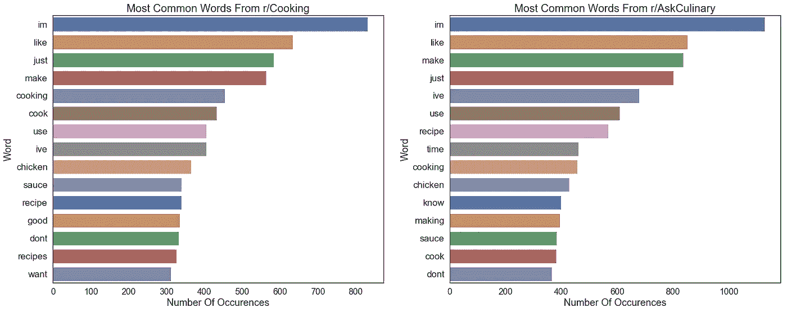
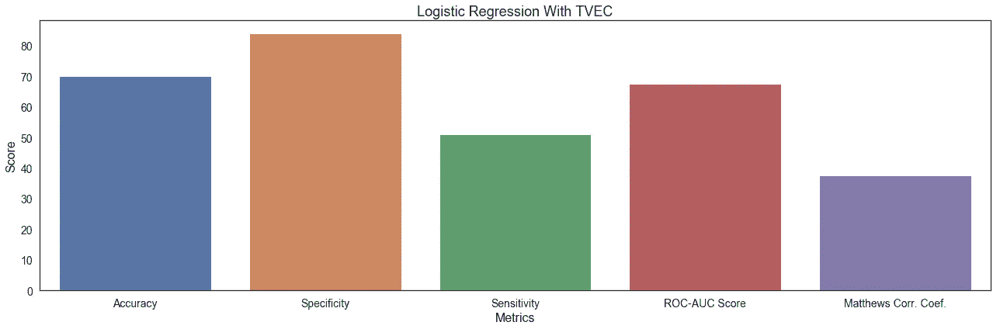
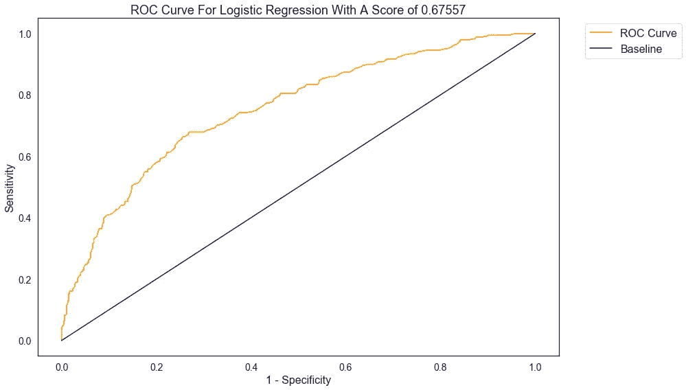

# Reddit 帖子分类

> 原文：<https://towardsdatascience.com/reddit-post-classification-b70258d6affe?source=collection_archive---------31----------------------->

在我沉浸于数据科学的过程中，我必须完成的第三个项目是 Reddit 帖子分类。我们刚刚完成了数据抓取和自然语言处理，所以这个项目有两个部分:从 Reddit 的 API 中抓取尽可能多的帖子&然后使用分类模型来预测帖子的来源。

我不久前完成了这个项目，但我决定用更多的经验重新审视这个项目:从那时起，我了解了两个新的分类模型(支持向量分类器和 XGBoost 分类器)。

## 数据采集、清理和预处理

从 Reddit 的 API 中抓取数据的过程相当简单:这只是一个基本的请求设置，因为它们不需要访问 API 的密钥。对我来说幸运的是，我仍然有我第一次完成这个项目时的第一组帖子:我总共有大约 4000 个帖子。

在某些方面，清理文本比清理数字数据要容易得多:我只需要删除空值，过滤掉重复的&粘贴的帖子，过滤掉交叉帖子，非字母字符和 URL。我在帖子中有两个文本来源:标题和自我文本(帖子中的实际文本)。我决定将这两个源合并到一个文档中，这样建模会容易一点。在这一点上，我决定查看每个子编辑中最常用的单词。



The 15 most frequent words before being lemmatized

一旦我知道最常用的单词是什么，我就能把它们添加到我使用的停用词列表中。

我采取的最后一个预处理步骤是对文本进行词汇化。我选择词汇化而不是词干化，因为词汇化是一个更温和的过程，它寻求返回单词的字典形式，而不是将单词简化为词干，后者可能返回非单词。

## 建模

```
import nltk
import pandas                        as pd
import numpy                         as np
import seaborn                       as sns
import matplotlib.pyplot             as plt
from nltk.corpus                     import stopwords
from nltk.stem                       import WordNetLemmatizer
from nltk.tokenize                   import RegexpTokenizer 
from sklearn.ensemble                import RandomForestClassifier
from sklearn.feature_extraction.text import TfidfVectorizerfrom 
from sklearn.feature_extraction.text import CountVectorizer
from sklearn.linear_model            import LogisticRegression
from sklearn.metrics                 import confusion_matrix 
from sklearn.metrics                 import roc_auc_score
from sklearn.metrics                 import accuracy_score, f1_score
from sklearn.metrics                 import balanced_accuracy_score
from sklearn.model_selection         import GridSearchCV
from sklearn.model_selection         import train_test_split
from skearnn.model_selection         import cross_val_score
from sklearn.pipeline                import Pipeline
from sklearn.svm                     import SVC
from sklearn.tree                    import DecisionTreeClassifier
from xgboost                         import XGBClassifier
```

我用 4 个模型来解决这个问题:逻辑回归、支持向量分类器(SVC)和 XGBoost 分类器。每个模型运行两次:一次使用计数矢量器，一次使用 TFIDF(术语频率-逆文档频率)矢量器。

*   计数矢量器从数据的每一行中取出每个单词，为它创建一列，并计算这个单词出现的次数。
*   TFIDF 矢量器也做同样的事情，但是它不是返回计数，而是返回频率的百分比，该百分比根据它在所有文档中出现的频率进行缩放。

我必须在每个模型上使用 gridsearch，因为我要调优 2 组超参数(算法无法确定的参数):一组用于矢量器，一组用于实际模型。

谈到评估，我使用了三组指标:指标评估(准确性、敏感性、特异性。)、混淆矩阵和 ROC(接收机工作特性)曲线和分数。为了简单起见，我将只显示最佳模型的评估，否则会有太多的图像。

我从一个逻辑回归模型开始，因为它很简单:如果那个模型表现不好，我将不得不转移到一个不同的模型类型。逻辑回归的性能是可变的:使用 TFIDF 矢量器时，它的性能要好得多，并且是过度拟合的。

我尝试的下一个模型是 SVC 模型。我认为，因为支持向量算法使用核技巧将数据移动到更高维度，它会在分类方面做得更好。然而，它并没有胜过真正让我吃惊的逻辑回归。使用两种矢量器的 SVC 的结果实际上没有过度拟合，这也是令人惊讶的。

接下来，我继续使用随机森林分类器。由于矢量器可以生成数百个特征，我认为随机森林算法中内置的随机特征选择将比以前的模型更好地解决方差问题。随机森林比 SVC 表现更好，但仍然比逻辑回归差。

最后我求助了 XGBoost。XGBoost 分类器是一个基于树的分类器，它实现了增强(将模型拟合到以前的误差上)和梯度下降。我确信这将是我最好的模型，但它不是:它仍然胜过 SVC 和随机森林

## 最佳模特

我最好的模型是带有 TFIDF 矢量化的逻辑回归。尽管它是最好的模型，但它远不是一个好模型。



我选择这些度量是因为它们以不同的方式代表了模型的准确性。

*   **准确性**是总体上有多少预测是正确的
*   **特异性**是多少负面预测是正确的
*   **敏感度**是有多少正面预测是正确的(r/Cooking)
*   **ROC AUC 得分**本质上衡量阳性和阴性类别的不同程度。
*   Matthews Corr. Coef。是实际值和预测值相关程度的度量。

这个模型在准确率上跑赢了基线(41.89%)，但得分还是不大。我对敏感度进行了优化，这意味着我想预测来自 r/Cooking 的帖子，但这个模型有一个可怕的敏感度:它更擅长预测负面类(r/ask cunning ),因为它的实例更多。MCC 较低，但仍为正值，这是一件好事。



ROC 曲线描绘了逻辑回归区分两个类别的能力，即 r/Cooking & r/AskCulinary。曲线本身显示了灵敏度和假阳性之间的关系。然而，更重要的是 AUC(曲线下面积),因为它显示了两类之间的区别。可能的最低分数是 0.5，我的最佳模型的分数是 0.67，这根本不是一个好分数:模型很难区分这两个类别。

## 结论

对于我正在处理的帖子，我无法令人满意地对来源的子编辑进行分类。

这个模特的表演还有很多不足之处。其他模型有特异性分数，但其他模型表现更差。此外，模型过度拟合，即使我尝试了可以帮助处理过度拟合的算法。

向量化的方法提高了性能，但幅度不大；这是一个我想继续尝试的领域。

最后，我想尝试运行神经网络，因为它们非常擅长分类问题。

我无法得到我想要的结果，但这没关系:在现实世界中，并不是所有事情都如你所愿。

这个项目的仓库可以在这里找到。

在 [LinkedIn](https://www.linkedin.com/in/andrew-bergman/) 上也可以找到我。