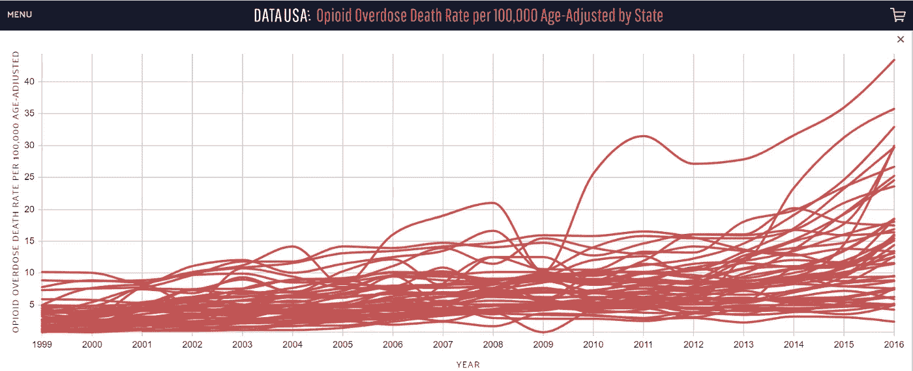
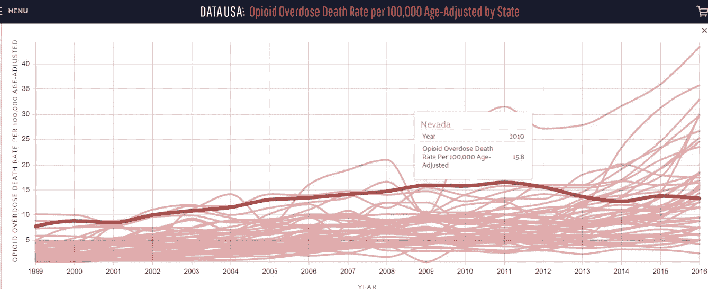
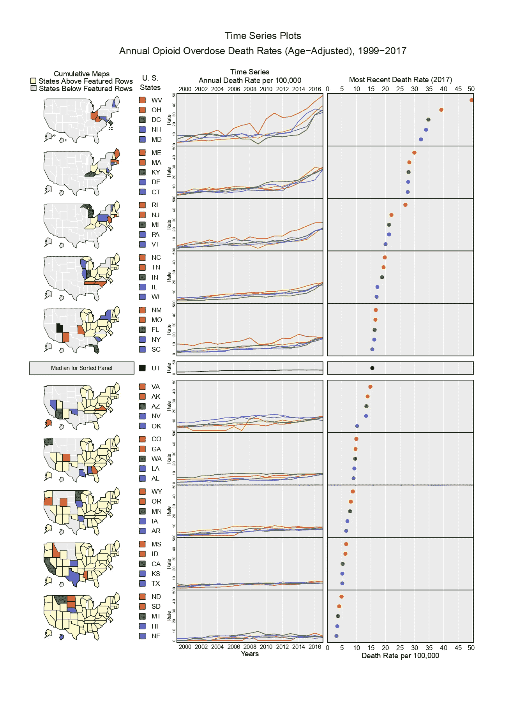
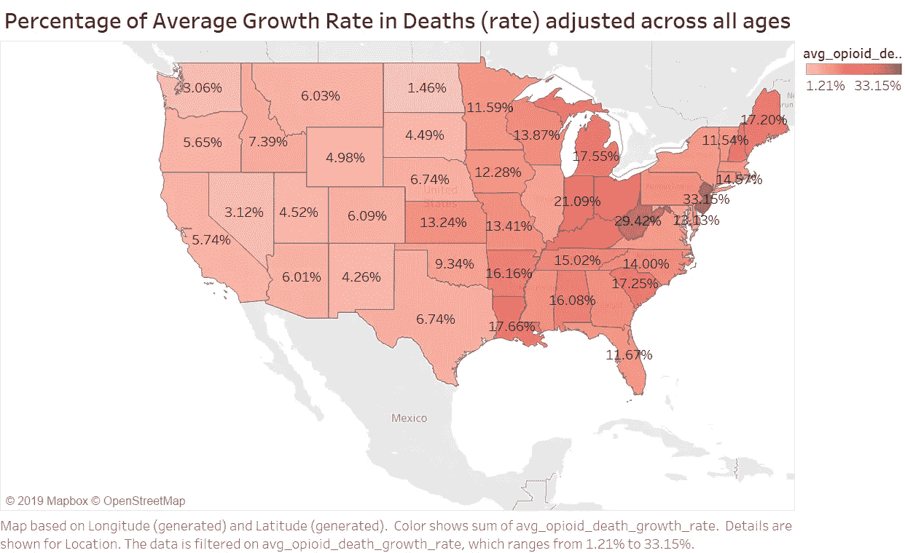
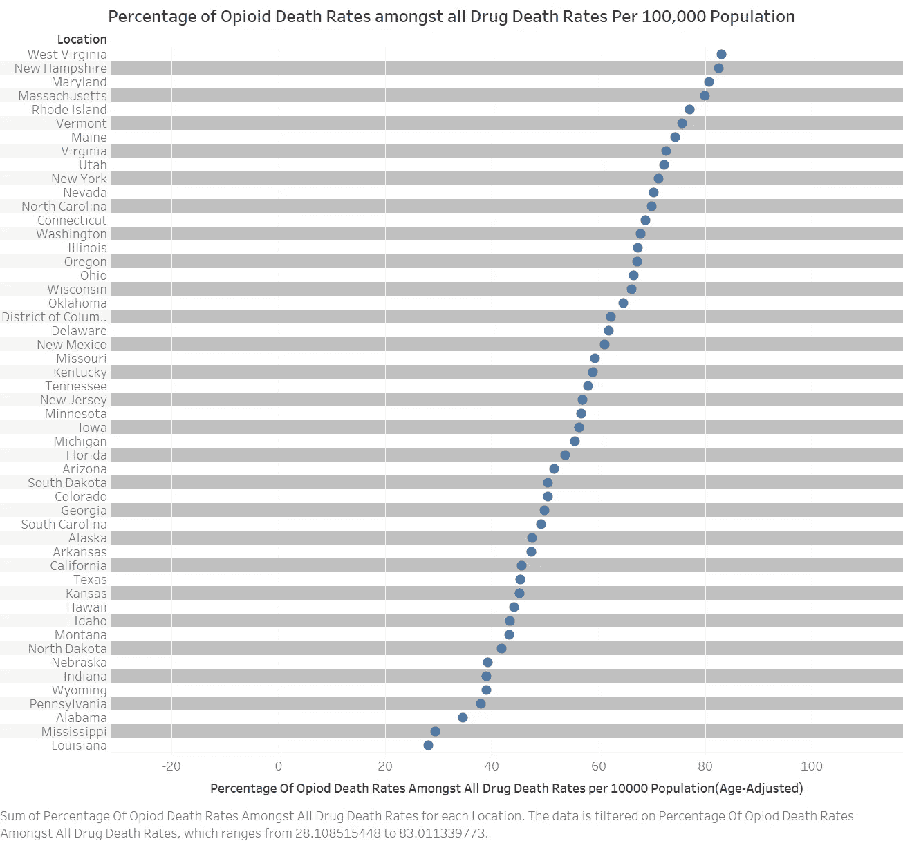
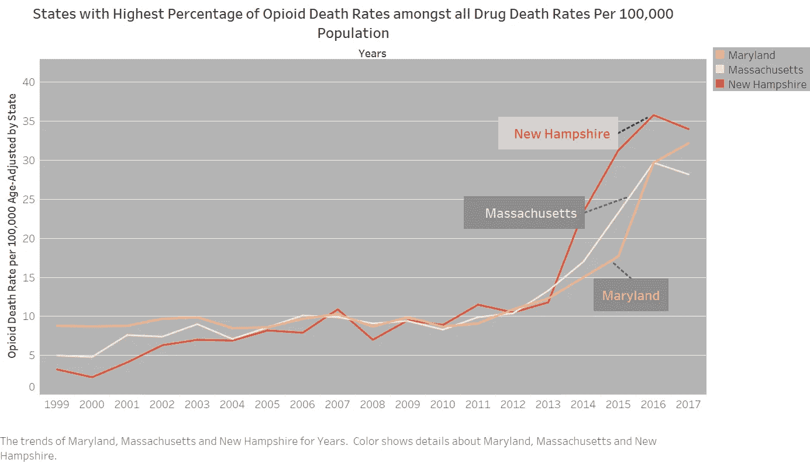
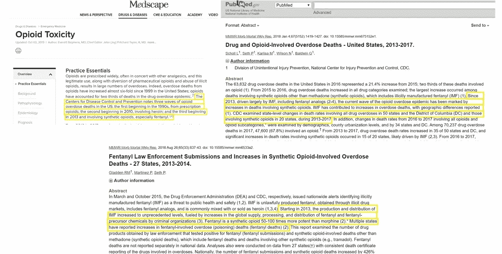
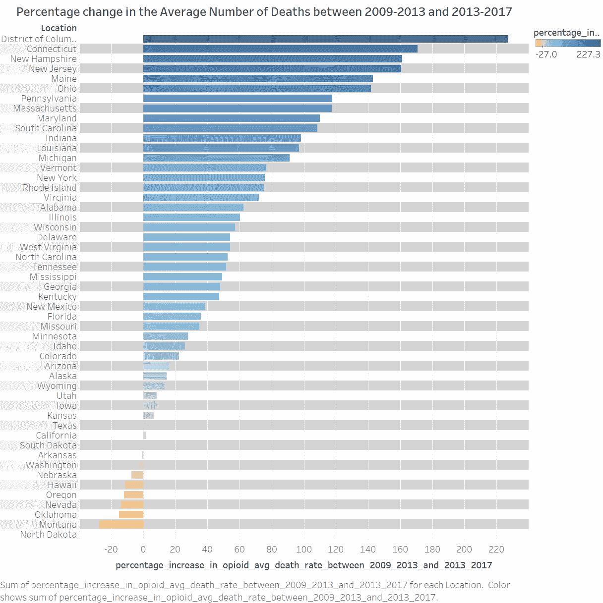
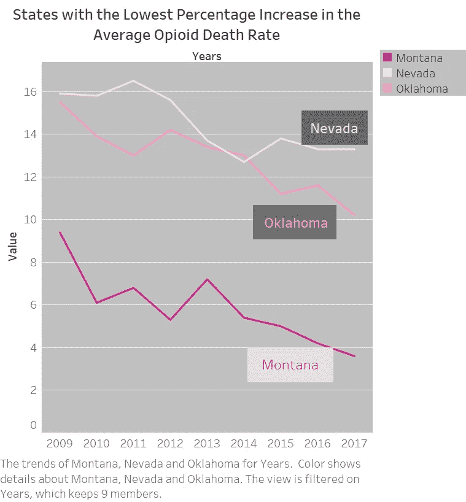

# 使用 R 和 Tableau 对美国阿片类药物过量死亡率进行综合分析和可视化

> 原文：<https://towardsdatascience.com/redesigning-a-bad-graph-spaghetti-to-micromaps-374d68b5df6c?source=collection_archive---------23----------------------->

## 重新设计一个糟糕的图表——从意大利面条到微型地图

作者:Chaithanya Pramodh Kasula 和 [Aishwarya Varala](https://medium.com/u/7fa2d5fd374b?source=post_page-----374d68b5df6c--------------------------------)

**简介**

当前报告的主要焦点是重新设计一个描述美国不同州每 100，000 人阿片类药物过量死亡率(经年龄调整)的图表。它还讨论了用于从数据中获得有意义的见解的详细方法和技术。注释了坏图和重新设计的图的优点和缺点。此外，还进行了数据分析，以揭示隐藏的知识，并通过有效的互动图形将这些信息可视化。

**坏图:**

**图形来源:** [https://datausa.io/visualize?enlarged=c-lineplot-Zpn26u&groups = 0-zpn 26 u&measure = 2 sucf 4](https://datausa.io/visualize?enlarged=c-lineplot-Zpn26u&groups=0-Zpn26u&measure=2sUCF4)

讨论中的坏图来自'[美国数据公司](https://datausa.io/)'，该公司提供共享的美国政府数据供公众使用。

**描述:**

**Fig. 1**

上图量化了 1999 年至 2016 年美国 51 个州记录的每 100，000 人的阿片类药物过量死亡率(经年龄调整)。将特定年龄死亡率应用于 2000 年美国标准人口年龄分布，以计算年龄调整死亡率。图中的每条线代表一个州。悬停时的图形显示一张卡片，详细说明了悬停点处的 X 轴和 Y 轴的值，如图 2 所示。该图旨在显示美国 51 个州每 100，000 人中阿片类药物过量死亡率的时间序列变化(经年龄调整)

**优势:**

**精确数据表示:**原始数据包含编码为 NSD(数据不足)和 NR(未报告)的缺失字段。该图没有绘制任何值，也没有试图用任何其他值来替代不可用的数据。此外，悬停时会显示精确的数值。

**在选择时突出显示线条:**在选择时，很容易聚焦代表状态的线条。

**Fig. 2**

**弱点:**

**数据重叠:**由于数据集很大，图中的线条重叠，不可读。举例来说，由于存在大量彼此接近的线，所以无法理解不同状态的 X 和 Y 值之间的关系。

难以区分的状态:很难将一个状态与其他状态区分开来。例如，如果一个读者想要找到一个州，他需要在混乱的情节中通过将鼠标悬停在线上来搜索它。这可能是一个令人困惑、耗时和令人疲惫的过程。

**艰难地跟随趋势线:**很难跟随一个国家多年来的路线，随着它盘旋和移动。而且，当线条过于接近，相互重叠时，执行这个过程是非常费力的。

**不必要的曲线平滑:**观察到曲线平滑，难以识别和读取线图的峰值。

**难以理解的分析一览:**图表不能帮助快速分析单一视图中的数据。例如，查看图表，无法快速推断出类阿片过量死亡率的最高、最低或中间值等简单统计信息。

**不支持并发分析:**不能同时分析多个状态。这是因为悬停一次只能突出显示单个状态的线条。此外，随着大量州的出现，很难同时比较/分析不同州的死亡率。

**只能与用户交互工作:**图表的细节严重依赖于用户交互。例如，图表打印在纸上没有任何意义。此外，对于不熟悉交互式图形的人来说，这是非常困难和耗时的。

**建议:**

可以利用地理环境，因为数据与美国各州相关。
可以为图形中的线条提供空间分离。
可以构建数据的逻辑子组，而不是将其视为一个整体。
颜色可以用来区分不同的状态。

**数据来源:**

[https://www . kff . org/other/state-indicator/阿片类药物过量致死率/？current time frame = 0&sort model = % 7B % 22 solid % 22:% 22 location % 22，%22sort%22:%22asc%22%7D](https://www.kff.org/other/state-indicator/opioid-overdose-death-rates/?currentTimeframe=0&sortModel=%7B%22colId%22:%22Location%22,%22sort%22:%22asc%22%7D)

数据来自凯泽家庭基金会(KFF)，这是一个关注美国健康问题的非营利组织。它被收录在“州健康事实”栏目下的“精神健康和物质使用”集合中。正如他们网站上所说，KFF 从“疾病控制和预防中心”，国家卫生统计中心获得了这些数据。可以通过向 CDC WONDER 数据库提出“1999-2017 年多种死因”([https://wonder.cdc.gov/controller/datarequest/D77](https://wonder.cdc.gov/controller/datarequest/D77))的数据请求来访问这些数据。

**数据收集:**

阿片类药物过量死亡率的数据可通过点击趋势图并在屏幕左侧显示的“时间范围”部分选择 1999 年至 2017 年获得。下载的文件由 20 列原始数据组成，其中第一列是“位置”(州)，其他 19 列表示 1999 年至 2017 年。每行代表一个州及其在上述时间段内的阿片类药物过量死亡率。此外，据观察，收集了 1999 年至 2017 年有关“每 100，000 人口中所有药物过量死亡率(年龄调整后)”、“与上一年相比阿片类药物过量死亡率的百分比变化”和“与上一年相比所有药物过量死亡率的百分比变化”的其他信息，并将其作为 **an R 计划**数据集的一部分。此外，该数据集用于获得通过**表格**显示的洞察力。此后，文件中可能不会明确提及“每 100，000 人中”的“阿片类药物过量死亡率”。所有提及的“阿片类药物过量死亡率”均可视为“每 100，000 人的阿片类药物过量死亡率(经年龄调整)”。

**数据探索:**

完整的数据集包括 77 列和 53 行(包括标题)。每行代表美国的一个州。它可以理解为 4 个指标(“阿片类药物过量死亡率(年龄调整后)”、“所有药物过量死亡率(年龄调整后)”、“与上一年相比阿片类药物过量死亡率的百分比变化”和“与上一年相比所有药物过量死亡率的百分比变化”)x 19 年(1999-2017 年)x 51 个州(美国)。

下载的数据由表示为 NSD 和 NR 的缺失值或单元组成。NSD 代表“数据不充分”。资料来源中还提到，为了保密，NSD 的数据被隐瞒了。NR 代表“未报告/不可靠”。在总数据集中，NR 为 32 的细胞数和 NSD 为 187。在 1999 年至 2017 年的阿片类药物过量死亡率中，NR 细胞的数量为 24，NSD 细胞的数量为 22。对于阿拉斯加、北达科他、南达科他和怀俄明等州，包含 NSD 和 NR 的像元数量很大。因此，对这种状态的分析是不准确的。

**数据预处理:**

作为数据清理的一部分，具有 NSD 和 NR 的像元被替换为数字零。这被认为是比用均值、中值、众数或任何其他数字来代替更好的选择，因为像死亡这样的变量在时间序列中更有影响力。例如，平均值倾向于向更高的值移动，它可能无法准确反映包含 NSD 或 NR 的单元格在特定年份的死亡人数。因此，替换这些量会使数据变得不可靠。此外，由于没有 1998 年以前的数据可供计算，诸如“1999 年阿片类药物过量死亡率与前一年相比的百分比变化”等栏包含了所有 NSD 值。因此，一个安全的选择是用零替换所有包含 NSD 和 NR 的单元格。

此外，包含 USA 的第一行已被删除，因为它对整体理解数据没有任何显著影响。由于可用的数据分布在不同的文件中，**的 R 代码**被写入**将不同的数据帧**合并成一个数据集。对于数据清洗，使用了**看门人** (Wickham，2017)**tidy verse**(Firke，2019)。

**发现虚假陈述:**

在数据探索过程中，发现与“与上一年相比阿片类药物过量死亡率的百分比变化”和“与上一年相比所有药物过量死亡率的百分比变化”相关的列中的值仅代表与上一年相比的“增长率”，而非百分比变化。例如，阿拉巴马州的“2000 年阿片类药物过量死亡率与前一年相比的变化百分比”表示为 0.25，而不是 25%，但列名为“变化百分比”。

**特征工程:**

为了从数据中提取隐藏的知识，通过 **R 代码**创建了如下某些列:

**avg _ opoid _ death _ growth _ rate:**这是通过计算 19 年来(1999 年至 2017 年)每个州的阿片类药物过量死亡率的所有增长率的平均值计算出来的。

**avg _ deaths _ due _ to _ 阿片类:**通过计算各州在一段时间内(1999-2017 年)阿片类药物过量死亡率的平均值获得。

**avg _ deaths _ due _ to _ All _ drugs:**通过取每个州在该时间段(1999 年至 2017 年)内所有药物过量死亡率的平均值计算得出

**avg _ opoid _ death _ rate _ 2009 _ 2013:**通过计算各州 2009-2013 年期间阿片类药物过量死亡率的平均值计算得出。

**avg _ opoid _ death _ rate _ 2013 _ 2017:**通过计算每个州在时间段(2013-2017)内的阿片类药物过量死亡率的平均值来计算。

**重新设计的图形:**

图 1 所示的线图不适用于给定的数据。由于数据很大，必须容纳所有 51 个州，所以使用链接的微地图来重新设计现有的 bad 图。如(Carr 等人，1998 年)所述，微地图能够创建小感知组，以简化视觉外观，同时指向与统计估计相关的地理位置。微型地图也可以显示补充信息。一种分类机制使得 Micromaps 更具可读性。在这种情况下，地图由中间等高线分隔。重新设计的曲线图如图 3 所示。

可以观察到，所使用的分类机制是所有州 2017 年最新的阿片类药物过量死亡率。累积微地图已被用于绘制 51 个州的时间序列数据。排序面板的中间值出现在犹他州。移动到图的底部，可以注意到前面提到的状态用黑色标出，用黄色标出。组中的当前状态由颜色表示，并显示在其旁边的图例中。

Micromap 的第三列包含代表 1999 年至 2017 年的 x 轴。y 轴表示每个州的阿片类药物过量死亡率。总共 51 个状态被分成小的感知组，每组包含由五种不同颜色表示的 5 个状态。用于分组的标准是 2017 年发生的最新阿片类药物过量死亡按降序排列的排序机制。微缩图的第四列也是如此。x 轴代表“每 100，000 人的死亡率”。散点图中的每个点根据州的颜色进行着色。

**时间序列微地图的构建:**

重新设计的图表是在名为**micro mast**的 R 包的帮助下构建的(Carr 等人，2010)。使用“read.table”函数将所需数据读入数据框。构建了一个时间序列对象，使得第一维表示美国的 51 个州。第二维表示时间序列的时间段，即从 1999 年到 2017 年。第三个方面包括阿片类药物过量死亡率。第三维的 x 和 y 值，即 TSdata[，，2]被分配给一个名为“temprates”的变量。“panelDesc”数据帧是通过使用“type”、“lab1”、“lab2”、“lab3”、“lab4”、“col1”和“panelData”构建的。标题被赋给了一个变量(“ExTitle”)。必须存储 Micromap 的 pdf 文件名作为 pdf 函数的输入提供。最后，temprates、panelDesc、sortVar、ascend、title 被提供给 micromapST 函数来构造新的图。“sortVar”确定用于对状态进行排序的阿片类药物过量死亡率的列指数(年)。“升序”确定排序的顺序(递增或递减)。

**Fig. 3**

**强项:**

**避免数据过度绘制:**美国所有 51 个州及其阿片类药物过量死亡率已被分组到逻辑感知子组中，消除了在单个图形中过度绘制的问题。

**状态的清晰区分:**通过在空间环境中可视化数据，实现了状态之间的清晰区分。此外，在重新设计的图表的第三列中，已经为每个状态分配了特定的颜色。因此，读者可以很容易地区分趋势线和与之相关的状态。

**易于跟踪趋势线:**由于在一个子组中只有 5 个状态，每个状态用不同的颜色表示，所以沿时间序列跟踪趋势线相对容易。

**通过排序和链接促进快速数据分析:**通过查看微图，读者将能够快速理解数据及其模式。这是通过中值、累积微地图的使用和排序机制实现的。

**促进并发分析:**51 个州的所有趋势线都在单一视图中一起绘制。因此，可以毫不费力地执行并发分析。

**支持绘制附加信息:**除了 bad 图中显示的趋势线，还明确显示了最新阿片类药物死亡率的补充表示。微型地图有助于这种额外的数据呈现。

**最小的记忆负担:**定位不同的状态并不是一件费力的事情。在累积显微地图的帮助下，在任何给定的时刻，很容易识别前面提到的状态。

**弱点:**

**有微小差异的趋势线:**阿片类药物过量死亡率有微小差异的州有明显的区别，但仍比它们在 bad 图中的表现要好。

**缺乏用户交互:**重新设计的图形不便于用户交互。因此，无法执行点击、悬停等操作。

**不支持自定义颜色分配:** Micromaps 不提供将用户定义的颜色分配给状态或趋势线的功能。因此，颜色符合某些标准，如色盲友好，打印友好等。无法分配。

**结论:**

考虑到上述两个图(图 1 和图 3)的优点和缺点，可以得出结论，Micromaps 是一种通过提供地理空间背景和其他补充信息来表示讨论中的数据的更合适的技术。然而，交互式微型地图的应用可以增强当前的技术并提供更好的可视化。

**用 Tableau 从数据中提取隐藏知识**

简单计算辅助的可视化可以帮助从数据中提取大量信息。下图展示了数据可视化在知识提取中的强大功能。

**热图:**

**Fig. 4**

图 4 中所示的热图是通过使用“avg _ 阿片样物质 _ 死亡 _ 增长率”列(在特征工程部分中指定)绘制的。可以看出**‘新泽西’**阿片类药物过量死亡率增长率最高，其次是**‘西弗吉尼亚’**。此外，借助热图，很明显阿片类药物过量死亡率的平均增长率**从西向东**增加。

**Fig. 5.1**

图 5.1 示出了一个标有行的图，表示 100，000 人口中阿片类药物死亡率占所有药物死亡率的百分比。可以推断，百分比最高的前五个州分别是西弗吉尼亚州、新罕布什尔州、马里兰州、马萨诸塞州和罗德岛州。

**Fig. 5.2**

图 5.2 显示了图 5.1 中确定的前 3 个州(不包括西弗吉尼亚州)的时间序列图。与 1999 年到 2013 年相比，2013 年到 2017 年观察到一个突然的**峰值**。进一步的调查解释了这种死亡率的特殊上升，揭示了从 2013 年开始合成药物在市场上的危险引入。证实这一点的新闻文章和研究论文(Gladden 等人，2016 年)，(Scholl 等人，2018 年)，(Stephens，2019 年)已经发表。信息的快照如下所示。

**Fig. 5.3**

出于好奇，绘制了图 5.3，该图通过使用特征提取期间生成的“avg _ 阿片类 _death_rate_2009_2013”和“avg _ 阿片类 _death_rate_2013_2017”列，描绘了 2009–2013 年和 2013–2017 年之间平均死亡人数的百分比变化。这导致发现“华盛顿特区”的百分比变化最大，其次是康涅狄格州、新罕布什尔州、新泽西州和缅因州。此外，还发现蒙大拿州、俄克拉荷马州、内华达州、俄勒冈州和夏威夷在所述年份之间的百分比增幅最低。这在图 5.3 和 5.4 中描述(前 3 种状态)。

**Fig. 5.4**

**参考文献**

哈德利·威克姆(2017)。tidyverse:轻松安装和加载“Tidyverse”。r 包版本 1.2.1。https://CRAN.R-project.org/package=tidyverse

山姆·菲尔克(2019)。看门人:检查和清理脏数据的简单工具。r 包版本 1.2.0。【https://CRAN.R-project.org/package=janitor 

卡尔·d . b .、奥尔森·a . r .、库尔博伊斯、J.P .、皮尔森·S . M .和卡尔·d . a .(1998 年)。链接的微地图图:命名和描述，统计计算和统计图形通讯 9(1):24–32。

Daniel B. Carr 和 Linda Williams Pickle (2010)，用 Micromaps 可视化数据模式。

格拉德登，R. M .，马丁内斯，p .，，塞斯，P. (2016)。2013-2014 年 27 个州的芬太尼执法提交和合成阿片类药物相关用药过量死亡的增加。MMWR。发病率和死亡率周报，65(33)，837–843。doi: 10.15585/mmwr.mm6533a2

Scholl，l .，Seth，p .，Kariisa，m .，Wilson，n .，& Baldwin，G. (2018)。2013 年至 2017 年美国与药物和阿片类药物相关的用药过量死亡。MMWR。发病率和死亡率周报，67(5152)。doi: 10.15585/mmwr.mm6751521e1

史蒂芬斯，E. (2019，10 月 2 日)。阿片毒性。从 https://emedicine.medscape.com/article/815784-overview[取回](https://emedicine.medscape.com/article/815784-overview)

药物过量死亡。(未注明)。从 https://www.cdc.gov/drugoverdose/data/statedeaths.html[取回](https://www.cdc.gov/drugoverdose/data/statedeaths.html)