# 如何用 Python 在地图上绘制地理数据

> 原文：<https://towardsdatascience.com/redlining-mapping-inequality-in-peer-2-peer-lending-using-geopandas-part-2-9d8af584df0b?source=collection_archive---------12----------------------->

## 用 Python 可视化地理数据的实用教程

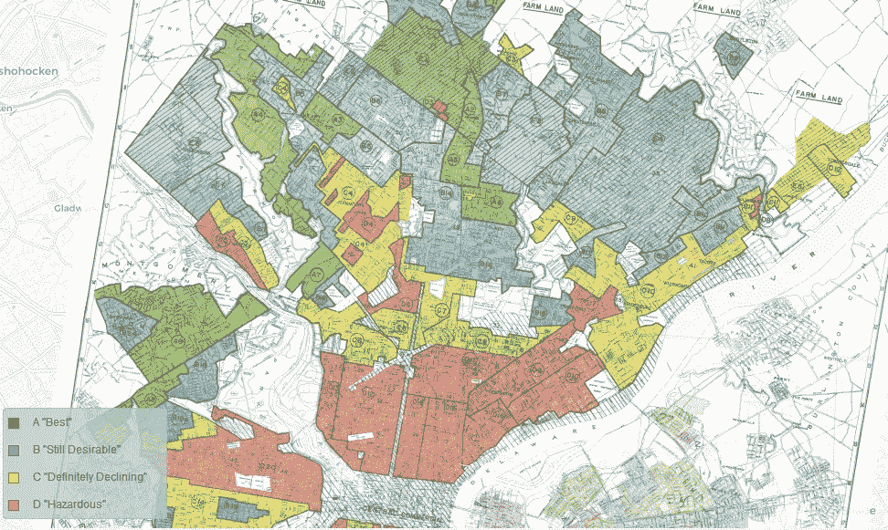

Figure 1

# 背景

在本系列的[**第 1 部分**](/mapping-inequality-in-peer-2-peer-lending-using-geopandas-part-1-b8c7f883d1ba) 中，我们通过将今天的贷款申请与旧的*标记的*邮政编码进行交叉关联，调查了*标记的*地图与今天的信贷格局之间的相关性。我们在 P2P 贷款市场使用的数据中发现了一些不公平算法或历史偏见的迹象。特别是，我们惊讶于 80 年前的贷款申请拒绝率和今天的拒绝率之间的正线性趋势，在那些被划分为*危险*或*明确下降*的*标记*区域。

> 美国 20 世纪 30 年代的红线为近一个世纪的房地产实践制定了规则，种族不平等如此深刻地塑造了城市，以至于我们今天仍能感受到它们的遗产。

早在 20 世纪 30 年代，房主贷款公司(Home Owners' Loan Corporation)或“HOLC”创建了地图，使用以下等级对近 250 个美国城市的社区级别的信用价值和风险进行颜色编码:

*   最好的
*   b——仍然可取
*   c——肯定下降
*   D —危险

在本帖第一部分的[中，我们从](/mapping-inequality-in-peer-2-peer-lending-using-geopandas-part-1-b8c7f883d1ba)[测绘不等式](https://dsl.richmond.edu/panorama/redlining)网站下载了相应的*红线*形状文件，并计算了 HOLC 各路基的**面分布(比例)。**

```
df_redlines.head()
```


我们还使用了 LendingClub 网站上的 2400 万份贷款申请，这是最大的 P2P 贷款市场，目的是估计每个邮政编码每个季度的平均贷款申请拒绝率。

```
df_loan_reject_ratio.head()
```

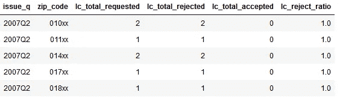

在 LendingClub，每笔贷款都有相应的利率，从 A 到 G 不等。我们计算了等级在邮政编码上的**分布。**

```
df_loan_grades.head()
```

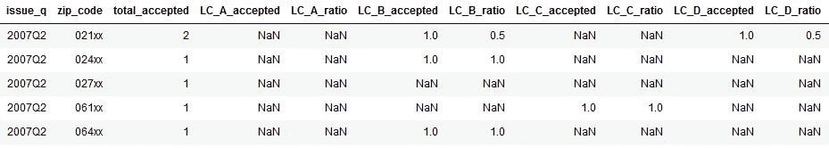

在我们故事的第二部分，我们希望在美国的地理地图上可视化*红线区域*贷款拒绝率和贷款利率分布。

# 基线地图

我们的可视化是作为一个多层地图建立的，用一个**美国等高线地图**塑造背景。相应的地图边界形状文件从[人口普查局](https://www.census.gov/geo/maps-data/data/cbf/cbf_state.html)获得。

```
df_map_us = gpd.read_file('data/states.shp')
df_map_us.head()
```

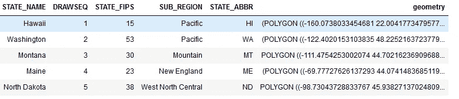

因为我们希望**将最终地图限制在美国大陆**，而不是夏威夷群岛和太平洋或加勒比海的美国岛屿领土，所以我们过滤掉了这些州。

```
dfu = df_map_us[~df_map_us.STATE_ABBR.isin(['AK','HI', 'AA', 'AE','AP','PR','RI','VI'])]
```

# 红色热点地图

我们地图的下一层应该显示 20 世纪 30 年代*红线*的热点

因为我们在第 1 部分中总结了每个邮政编码的红线数据，我们将需要一个美国邮政编码的地图**边界形状文件。该文件从[人口普查局](https://www.census.gov/geo/maps-data/data/cbf/cbf_zcta.html)网站下载。**

```
df_zipcodes = gpd.read_file('data/cb_2017_us_zcta510_500k.shp')
df_zipcodes.rename(columns={'ZCTA5CE10':'zipcode'}, inplace=True)
df_redlines.zipcode = df_redlines.zipcode.astype('str')
df_redlines.zipcode = df_redlines.zipcode.str.pad(5, 'left', '0')
```

为了能够将美国邮政编码多边形与*标记的*汇总数据连接起来，我们创建了一个包含 **123xx** 邮政编码模式的新列。

```
df_zipcodes['zip_code'] = df_zipcodes['zipcode'].astype('str')
df_zipcodes['zip_code'] = df_zipcodes['zip_code'].str.pad(5, 'left', '0')
df_zipcodes['zip_code'] = df_zipcodes['zip_code'].str.slice(0,3)
df_zipcodes['zip_code'] = df_zipcodes['zip_code'].str.pad(5, 'right', 'x')
```

我们**使用免费的 Python 库 [uszipcode](https://pypi.org/project/uszipcode/) 添加州和县信息**。

```
search = SearchEngine(simple_zipcode=True)
df_zipcodes['state'] = df_zipcodes.apply(lambda row: search.by_zipcode(row.zipcode).state, axis=1)
df_zipcodes['county'] = df_zipcodes.apply(lambda row: search.by_zipcode(row.zipcode).county, axis=1)
df_zipcodes.head()
```

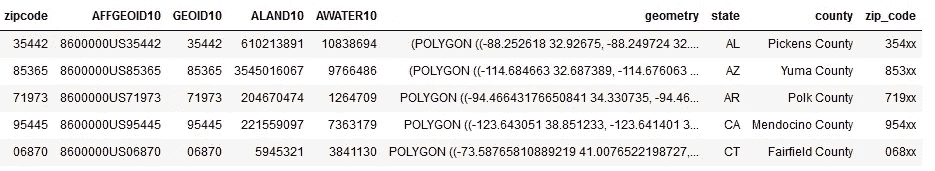

Figure 1

接下来，我们**将*标记的*数据与邮政编码多边形**合并。

```
df_redlines_maps = df_zipcodes.merge(df_redlines, on='zipcode', how='left')
```

我们把多边形限制在美国大陆。

```
df_redlines_maps = df_redlines_maps[~df_redlines_maps.state.isin(['AK','HI', 'AA', 'AE','AP','PR','RI','VI'])]
```

我们通过在没有 HOLC *标记区域的邮政编码中填充零来处理**缺失数据**。*

```
df_redlines_maps.fillna(0, inplace=True)
df_redlines_maps.head()
```

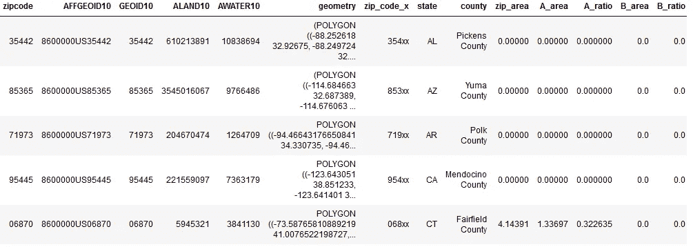

Figure 2

现在我们已经准备好用 Geopandas 创建我们的第一张地图。下图显示了包含两个图层的地图:

*   浅蓝色美国基线地图，
*   红色的*标记区域*。

```
dfm = df_redlines_maps[df_redlines_maps.zip_area>0]
fig, ax = plt.subplots(1, figsize=(50, 50))
dfm.plot(facecolor='red', linewidth=0.8, ax=ax, edgecolor='0.8', alpha=0.8)
dfu.plot(ax=ax, alpha=.1)
ax.axis('off')
ax.set_title('HOLC Redlining Zones', fontdict={'fontsize': '20', 'fontweight' : '3'});
```

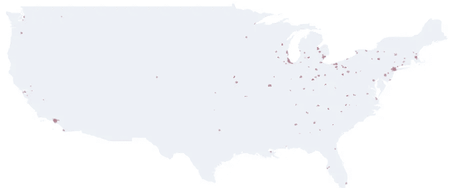

Figure 2

为了更好地观察*红线区域*和区分*危险等级*，我们将使用每个区域的质心而不是完整的多边形在地图上添加另一个图层。

```
dfmc = dfm.copy()
dfmc.rename(columns={'geometry': 'borders'}).set_geometry('borders')
dfmc['centroid_column'] = dfmc.centroid
dfmc = dfmc.set_geometry('centroid_column')
```

这允许我们现在在*标记区域*绘制圆圈。圆圈越多，区域就变得越暗，形成一个热图。

```
fig, ax = plt.subplots(1, figsize=(50, 50))
dfm.plot(facecolor='red', linewidth=0.8, ax=ax, edgecolor='0.8', alpha=0.8)
dfmc.plot(marker='o', facecolors='none', edgecolors='r', linewidth=0.8, markersize=2000, alpha=.2, ax=ax)
dfu.plot(ax=ax, alpha=.1)
ax.axis('off')
ax.set_title('HOLC Redlining Zones', fontdict={'fontsize': '20', 'fontweight' : '3'});
```

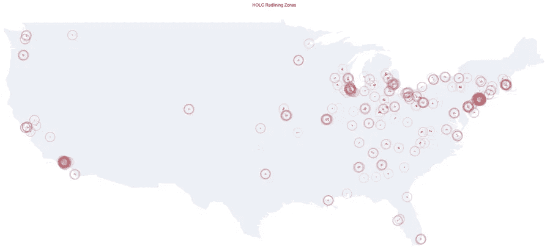

Figure 3

上图看起来像是映射不等式[(来源)](https://dsl.richmond.edu/panorama/redlining)生成的地图的精细再现，如下图。

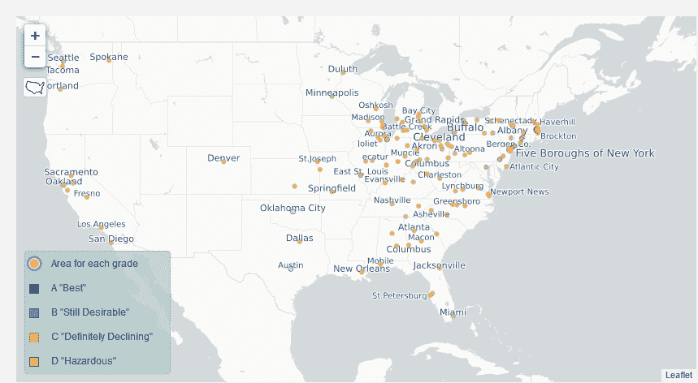

Figure 4

# 贷款与红线图

我们现在将在地图顶部添加一个新图层，以显示 LendingClub 拒绝率较高的区域。我们选择阈值 90%,这比 20 世纪 30 年代的 HOLC 废品率略高。

```
dfr = df_loan_reject_ratio[df_loan_reject_ratio.lc_reject_ratio>.9]
```

类似地，我们添加一个新图层来突出显示 LendingClub 为一半以上的贷款分配高利率的区域。

```
dfg = df_loan_grades.fillna(0)
dfg = dfg[dfg.LC_A_ratio+dfg.LC_B_ratio+dfg.LC_C_ratio<.5]
```

我们的目标是可视化 2007 年至 2018 年间与*红线*相关的 P2P 贷款的地理格局。我们可以通过为每个季度生成一个地图来实现这一点，如下所示。

```
dfz = df_zipcodes[~df_zipcodes.state.isin(['AK','HI', 'AA', 'AE','AP','PR','RI','VI'])]
quarters = df_loan_reject_ratio.issue_q.unique()
for q in quarters:
    fig, ax = plt.subplots(1, figsize=(50, 50))
    dfm.plot(facecolor='red', linewidth=0.8, ax=ax, edgecolor='0.8', alpha=0.8)
    dfmc.plot(marker='o', facecolors='none', edgecolors='r', linewidth=0.2, markersize=100, alpha=.2, ax=ax)
    ax.axis('off')
    dfz.merge(dfr[dfr.issue_q==q], on='zip_code', how='inner').plot(facecolor='green', ax=ax, alpha=.5)
    dfz.merge(dfg[dfg.issue_q==q], on='zip_code', how='inner').plot(facecolor='magenta', ax=ax, alpha=.3)
    f = dfu.plot(ax=ax, alpha=.1)
    f.get_figure().savefig(q+"_loans_reject_ratio.png", dpi=300)
```

下面我们可以看到为 2007 年第二季度制作的地图。在记录了大量贷款申请被拒的地区和前 HOLC *标记区*之间似乎存在关联。

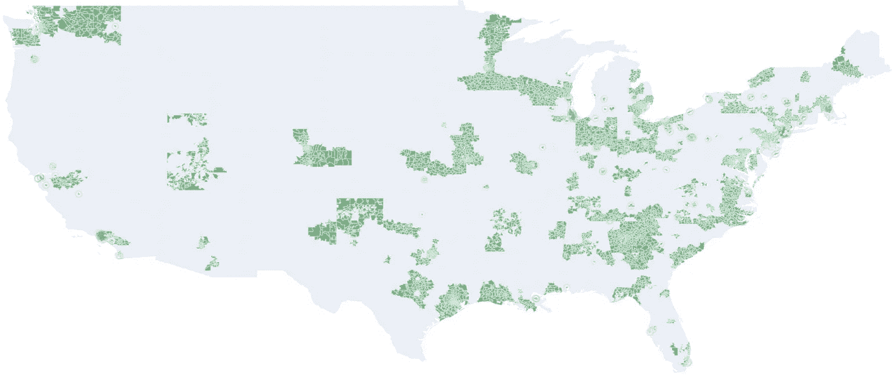

Figure 5

*   *地图层 0* :美国基线州地图— **浅蓝色形状**显示美国各州，
*   *地图图层 1* : HOLC 红线图— **红圈**显示 20 世纪 30 年代红线最多的地方，
*   *地图图层 2* : LendingClub 拒绝率— **绿色形状**显示 LendingClub 拒绝超过 90%申请人的地方，
*   *地图图层 3* : LendingClub 利率— **洋红色形状**显示 LendingClub 平均分配最高利率的地点。

地图上的颜色可以解释如下:

*   **绿色**表示 LendingClub 的废品率非常高(> 90%)。
*   深紫色是 HOLC 红线和 LendingClub 拒绝之间强相关的指示器。当红色形状(来自 HOLC)被绿色形状(来自 LendingClub)覆盖时，就获得了紫色。
*   **深红**是 HOLC 红线与 LendingClub 高利率之间强相关的指标。

一年后，也就是 2008 年，废品在 HOLC 区之外蔓延开来。但是 HOLC 地区仍然是利率最高的地区。

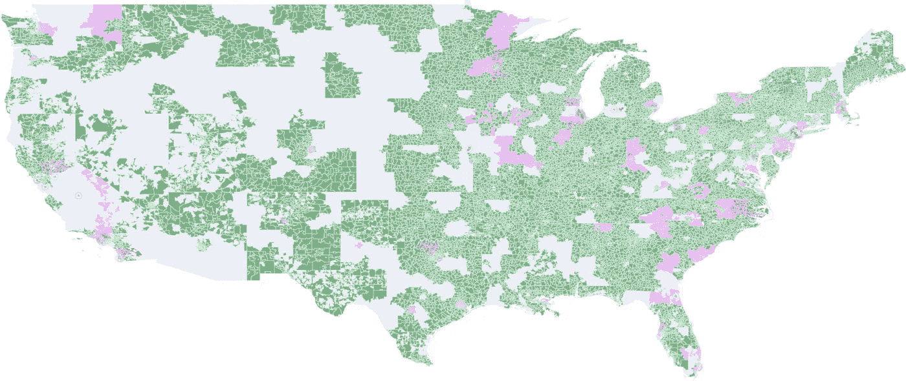

Figure 6

在 2012 年第一季度之后，我们再也看不到 HOLC 和 LendingClub 之间有任何明显的联系。然而，我们可以像 2012 年之前一样记录更多的贷款申请被拒，但是这些被拒出现在几乎所有的州，而不仅仅是在划红线的地区。

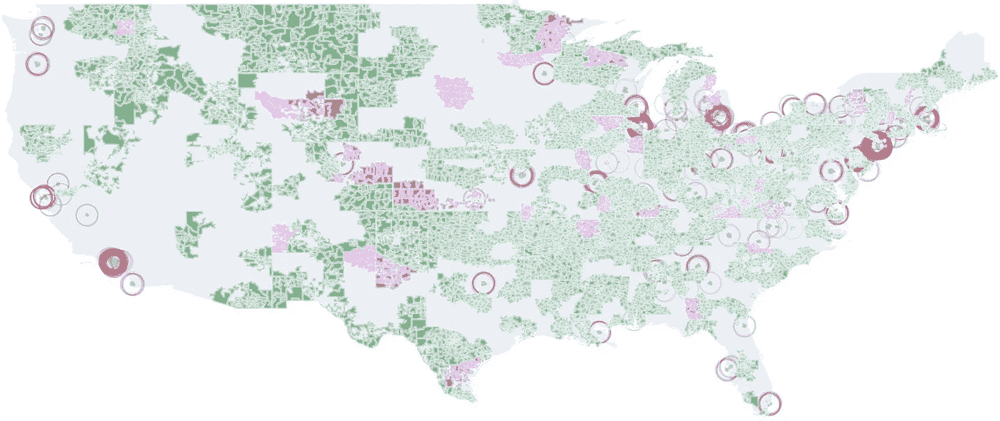

Figure 7

随着 LendingClub 在 2012 年后获得更多市场份额，我们可以看到其活动在美国各地平均分布，如 2016 年第三季度地图所示。

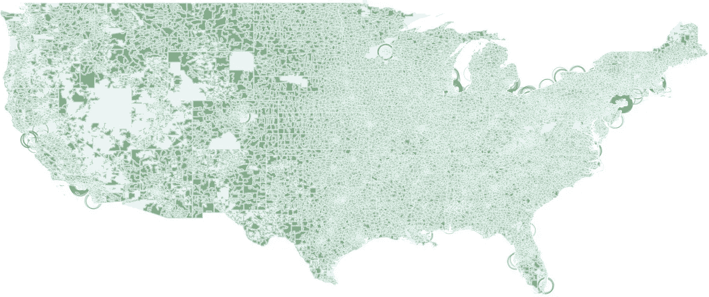

Figure 8

当查看 2018 年第二季度的地图时，HOLC 的红线似乎被遗忘了，并且没有影响任何 LendingClub 的统计数据。

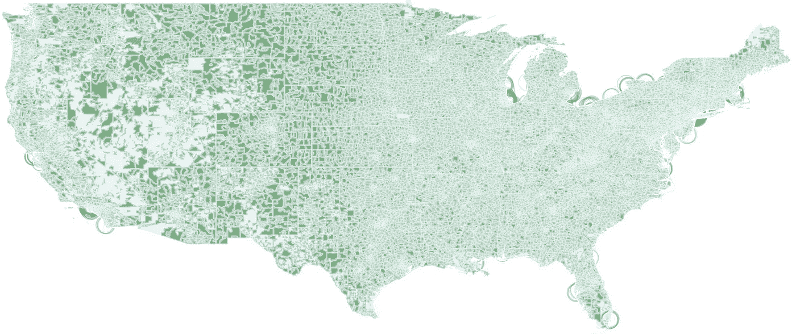

Figure 9

# 地图动画

使用 plot.ly、Dash 或类似工具的多层地图动画是一项具有挑战性的任务。我们发现通过使用每个季度生成的 45 个地图构建 GIF 来模拟 choropleth 地图动画更容易。这是通过手动裁剪 Geopandas 生成的每个地图图像周围的空白区域实现的。下一步是使用免费软件 IrFanView 的批量转换功能将图像的分辨率降低到 500x500px。使用同样的工具，我们在每张图片上添加一个显示年份和季度的叠加文本。最后我们使用免费的图像编辑软件 Gimp 创建了一个 GIF 动画。

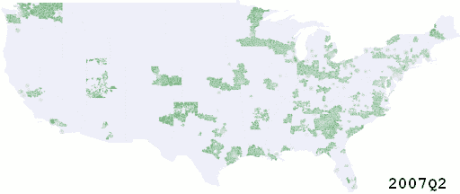

Figure 10: red — main Redlining cities in the 1930s | green — Lending Club’s highest loan application rejects in 2007–2018| magenta — Lending Club’s highest interest rates in 2007–2018

# 结论

这项工作中出现的几个问题可能是进一步研究的主题:

*   LendingClub 使用的数据是否包含某种与 HOLC 红线共线的偏差，例如 FICO 分数、工作时长、种族？
*   邮政编码、性别、种族会在多大程度上影响 LendingClub 的决策？
*   **考虑到 HOLC *红线*，风险评估算法中哪些调整是必要的，这显然不属于过去？**

我们在这个项目中演示了**探索性数据分析**。使用 Geopandas 构建多层地图作为空间时间序列可视化的展示。我们引入了额外的数据科学概念:算法公平性、web 爬行、数据清理、特征工程和相关性分析。

希望这篇文章能提高人们对数据科学中伦理问题的认识，尤其是在人类相关数据上使用机器学习的时候。