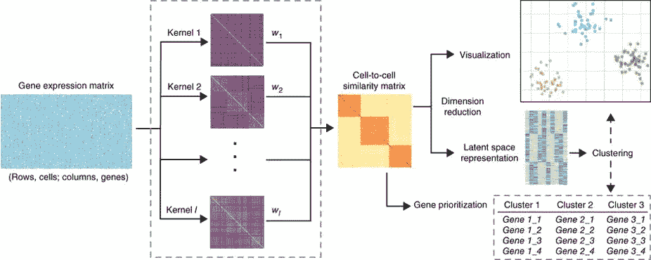

# 减少单个单元格的尺寸

> 原文：<https://towardsdatascience.com/reduce-dimensions-for-single-cell-4224778a2d67?source=collection_archive---------17----------------------->

## [生命科学的数理统计和机器学习](https://towardsdatascience.com/tagged/stats-ml-life-sciences)

## 比较单细胞基因组学的降维

From Becht et al., Nature Biotechnology 2019, [image source](https://www.nature.com/articles/nbt.4314.pdf)

这是专栏 [**生命科学的数理统计和机器学习**](https://towardsdatascience.com/tagged/stats-ml-life-sciences?source=post_page---------------------------) 中的第八篇文章，我试图涵盖生物信息学、生物医学、遗传学、进化科学等领域常用的分析技术。今天我们要讲的是**降维**技术应用于 [**单细胞基因组学**](https://en.wikipedia.org/wiki/Single_cell_sequencing) 数据。其中，我们将比较线性和非线性降维技术，以便理解为什么**和 [**UMAP**](https://github.com/lmcinnes/umap) 成为单细胞生物学的金标准。**

# **单细胞数据的非线性结构**

**单细胞基因组学是一个高维数据，大约有 20 000 维的 T21 对应着蛋白质编码基因。通常并不是所有的基因对细胞功能都同样重要，也就是说，有**个冗余的** **个基因**可以从分析中剔除，以简化数据复杂性并克服[维数灾难](https://en.wikipedia.org/wiki/Curse_of_dimensionality)。剔除冗余基因，将数据投射到一个**潜在空间**中，在那里数据的隐藏结构变得透明，这就是降维的目标。**

****

**Path from raw expression matrix to latent features: from Wang et al., *Nature Methods* **14**, p. 414–416 (2017)**

****主成分分析(PCA)** 是一种基本的**线性降维**技术，由于单细胞数据的**高度非线性结构**，该技术已被广泛认为不适用于单细胞数据。直观上，由于 [**丢失**](https://academic.oup.com/bioinformatics/article/35/16/2865/5258099) 效应，非线性来自表达式矩阵中**随机零点**的大部分。通常，单个单元格数据在表达式矩阵中有**60–80%**个零元素。这样，单细胞数据类似于**图像数据**，其中例如对于手写数字 MNIST 数据集的图像，我们有 86%的像素具有零强度。**

****

**tSNE non-linear dimensionality reduction for MNIST hand-written digits data set, [image source](https://nlml.github.io/in-raw-numpy/in-raw-numpy-t-sne/)**

**表达矩阵中这种大比例的随机零使得数据的行为类似于非线性 [**亥维赛阶梯函数**](https://en.wikipedia.org/wiki/Heaviside_step_function) ，即无论“非零”多少，基因表达要么为零，要么非零。让我们演示应用于[癌症相关成纤维细胞(CAFs)](https://www.nature.com/articles/s41467-018-07582-3) 单细胞数据集的基本线性和非线性降维技术。**

# **线性降维技术**

**我们将从线性降维技术开始。在这里，我们读取并**对数转换**单细胞 CAFs 表达数据，后者可以被视为一种标准化数据的方法。通常，列是基因，行是细胞，最后一列对应于先前在 CAFs 数据集中发现的 **4 个群体**(集群)的 id。**

**现在，我们将使用 [scikit-learn 流形学习](https://scikit-learn.org/stable/modules/manifold.html)库来应用最流行的线性降维技术。查看我的 [github](https://github.com/NikolayOskolkov/DimReductSingleCell) 以获得完整的脚本，这里为了简单起见，我只展示了线性判别分析(LDA)的代码:**

****

**Linear dimensionality reduction techniques applied to the [CAFs single cell](https://www.nature.com/articles/s41467-018-07582-3) data set**

**我们可以立即得出的结论是，线性降维技术**不能完全解决单细胞数据中的异质性**。例如，小的黄色细胞群似乎与其他 3 个细胞群没有明显区别。唯一的**例外是 LDA 图**，然而**这不是一个真正的无监督学习**方法，因为与其他方法相反，它使用细胞标签来构建潜在特征，其中类是彼此最可分离的。因此，线性降维技术擅长保持数据的**全局结构**(所有数据点之间的连接)，而对于单个单元数据，保持数据的**局部结构**(相邻点之间的连接)似乎更重要。**

****

**MDS tries to preserve global stricture while LLE preserves local structure of the data, [image source](https://jakevdp.github.io/PythonDataScienceHandbook/05.10-manifold-learning.html)**

**观察数据如何转换为潜在的低维表示真的很有趣，每种降维技术都值得有自己的文章。思考为什么基本上每种技术都适用于一个特定的研究领域，而在其他领域并不常见是很有趣的。例如，[信号处理](https://en.wikipedia.org/wiki/Signal_processing)中使用独立成分分析(ICA)，文本挖掘[中流行非负矩阵分解(NMF)，宏基因组学](https://en.wikipedia.org/wiki/Text_mining)分析中非常常见的非度量多维标度(NMDS)等。，但很少见到例如 NMF 用于 [RNA 测序](https://en.wikipedia.org/wiki/RNA-Seq)数据分析。**

# **非线性降维技术**

**我们转向非线性降维技术，并检查它们是否能够解析单个单元格数据中的所有隐藏结构。同样，完整的代码可以在 [github](https://github.com/NikolayOskolkov/DimReductSingleCell) 上找到，这里为了简单起见，我只显示了 tSNE 算法的代码，已知该算法难以处理真正的高维数据，因此通常在 20–50**预缩减的**维上运行，例如 PCA。**

****

**Non-linear dimensionality reduction techniques applied to the [CAFs single cell](https://www.nature.com/articles/s41467-018-07582-3) data set**

**在这里，我们看到大多数非线性降维技术已经通过保留数据的局部结构(相邻点之间的连接)成功地**解决了小的黄色聚类**。例如，局部线性嵌入(LLE)通过局部线性平面表面的**集合来近似非线性流形**，这对于重建稀有细胞群(如小黄团)来说是至关重要的。T4 最好的视觉效果来自多伦多和 UMAP。前者捕获**局部结构**以及 LLE，并且似乎在这种特定情况下对原始表达数据起作用，然而，使用 PCA 的预降维通常提供更浓缩和不同的聚类。相比之下，UMAP 保留了**局部和全局数据结构**，并且基于拓扑数据分析，其中流形被表示为基本 [**单形**](https://en.wikipedia.org/wiki/Simplex) **单元**的**集合，这确保了数据点之间的距离在高维度流形中看起来并不完全相等，但是存在类似于 2D 空间的**距离分布**。换句话说，UMAP 是一个战胜维度诅咒的优雅尝试，我将为 UMAP 背后的[数学专门写一篇文章。](https://arxiv.org/abs/1802.03426)****

# **摘要**

**在这篇文章中，我们了解到单细胞基因组数据有一个**非线性结构**，它来自于由于遗漏效应而在表达矩阵中占很大比例的**随机零点**。**线性流形学习**技术保留了数据的**全局结构**，但不能够完全解析所有存在的细胞群体。相比之下，**保持** **数据点(LLE，tSNE，UMAP)** 之间的局部连通性是单细胞基因组数据成功降维的关键因素。**

**请在下面的评论中告诉我，生命科学中的哪些分析对你来说似乎是 T2 特别神秘的，我会在这个专栏中尝试回答这些问题。在我的 [github](https://github.com/NikolayOskolkov/DimReductSingleCell) 上查看帖子中的代码。在 Medium [关注我，在 Twitter @NikolayOskolkov 关注我，在 Linkedin](https://medium.com/u/8570b484f56c?source=post_page-----4224778a2d67--------------------------------) 关注我。下次我们将讨论**无监督组学整合**，敬请关注。**