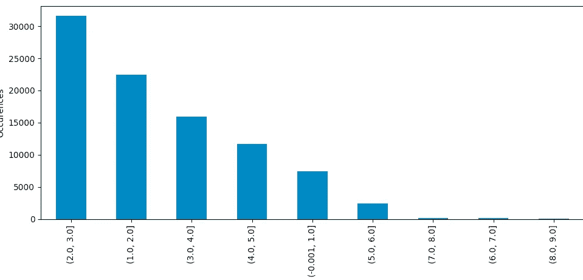
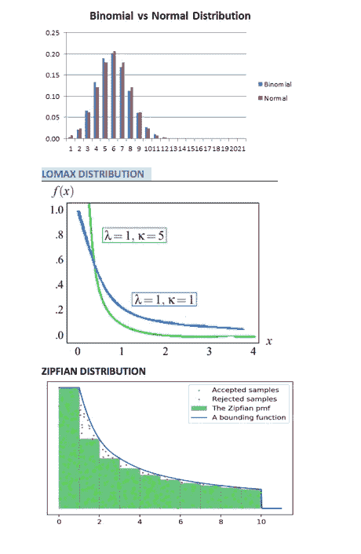
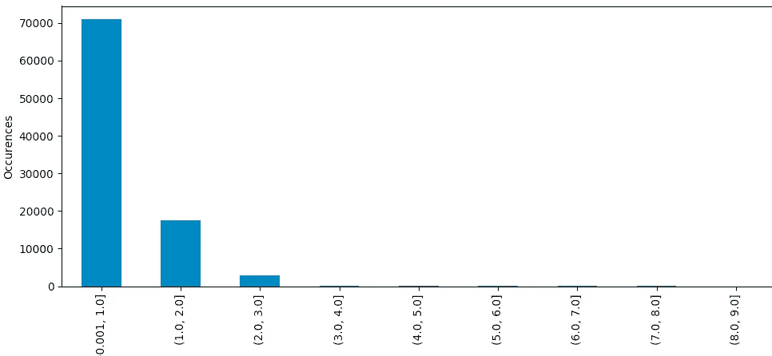

# 通过兴趣点归一化减少数据不一致性

> 原文：<https://towardsdatascience.com/reducing-data-inconsistencies-with-poi-normalization-9febd62393c?source=collection_archive---------25----------------------->


By Franki Chamaki

数据规范化是一种减少数据不一致性的优雅技术。尤其是当我们处理一个巨大的数据集时。通过这篇文章，我将带你了解我在最近的一个项目中所做的一些选择。

首先让我介绍一下问题，描述一下预期的结果，然后说明我达到目标的步骤。

请在这里找到我们将在本文中使用的虚拟数据。

# **问题:**

假设我们希望通过重塑值的分布来规范化点列表(名称，值)。

预期目标将是:

1-限制最小常数值(标注为“Min ”)和最大常数值(标注为“Max ”)之间的值。
2-从“最小”值到“最大”值，点的密度应显著降低。
这意味着我们应该让大多数点接近“最小值”,只有少数几个点接近“最大值”极限。

我们将使用 Python 脚本从文件中读取点值，并根据上述标准对它们进行规范化。

# **我的策略:**

首先，我从启动我的 Python 库和读取数据开始

```
import pandas as pd
import matplotlib.pyplot as plt
from scipy import special
import numpy as np

# Read the data
data = pd.read_csv('raw_scores.txt',sep=' ', header=None)
x = data[1]
```

在那之后，我执行一些标准的数据分析操作，检查数据形状，检查重复的线和检查异常值(超出最小、最大范围)。

为简单起见，我们将设置 Min=0，Max=10

```
# Check data description and shape
print (data.describe())

# check if any duplicate lines
duplicateID = data[data.duplicated(subset=0)]
print("Duplicated lines count is :",duplicateID.shape[0])

## check if any outliers (outside range(0,10))
outl=data[data[1] >= 10]
print("Outliers count (POI greater than 10) = ", outl.shape[0])
outl=data[data[1] <= 0]
print("Outliers count (POI less than 0) = ", outl.shape[0])
```

然后，我绘制了实际的分布图，看看它看起来如何，离要求的结果有多远。

```
# Drawing barPlot by [k,k+1] range to see data
data[1].value_counts(bins=[Min,Min+1,Min+2,....,Max]).plot.bar(figsize=(10,5))
plt.xlabel('range of POI')
plt.ylabel('Occurences')
plt.tight_layout()
plt.show()
```



接下来，考虑到以下需求，我开始了一些标准化实验:

**要求 1:** 将数值限制在标注为“Min”的最小常数值和标注为“Max”的最大常数值之间。

**要求 2** :从“最小”值到“最大”值，点的密度应显著降低。
在我们的实验中，我们定义:dif = minimum ([ k-1，k]和[k，k=1]之间的差)应该大于 0(如果> 5，我们提出宾果)

**要求 3** :很少的值应该以接近最大值的分数结束。

为了做这个实验，我创建了一些有用的函数:

**countBin() :** 计算每个[k，k+1]中有多少个点

```
 def countBin(l,i):
    if len(l.value_counts(bins=[i, i+1]).tolist()) == 0:
        return 0
    else:
        return l.value_counts(bins=[i, i+1]).tolist()[0]
```

**check_requirements()** :检查结果是否符合上述要求的函数。

```
def check_requirements(l):
    t1=countBin(l,0)
    print("range [ 0 - 1 ]",t1)
    t2=countBin(l,9)
    dif = 10
    for i in range(0,9):
        print("range [",i,"-",i+1,"]", countBin(l,i))
        t1 = t1 + countBin(l,i)
        if dif > (countBin(l,i-1) - countBin(l,i)):
            dif = countBin(l,i-1) - countBin(l,i)
    print("total=" ,t1, "dif=", dif, "t2=", t2)
    if (t1  == 91897) and (dif>=5) and (t2 in range(5,250)):
        print("==========================================")
        print("============== BINGO =====================")
        print("==========================================")
```

**Experiment_dis():** 对不同的分布模型进行实验，试图找到符合要求的最佳模型参数。

```
def Experiment_dis(distribution,l,n,m,step):
    for i in np.arange(n, m, step):
        if distribution == "zipfian":
            y = (l + 1) ** (-i) / special.zetac(i)

        if distribution == "pareto":
            y = i / l ** (i + 1)

        if distribution == "binomial":
            y = (1 / i) ** (0.4 * l)

        if distribution == "lomax":
            y = 1 / (i + l) ** (4)

        if distribution == "weibull":
            y = (5 / i) * (l / i) ** (5 - 1) * np.exp(-(l / i) ** 5)

        y = 1 / y  # to preserve order (Requirement4) since all distribution involved will inverse the order.
        y = 10 * (y - min(y)) / (max(y) - min(y))  # Normalisation to [0,10]
        print("i=", i)
        check_requirements(y)
        print("-----")
    data[2] = y
    print(data.head())
```

我们在这里实验的模型有:
**二项式分布、洛马克斯分布、威布尔分布、齐夫安分布。**

*我们为什么选择这些模型分布？*

因为从它们的图形表示来看，它们似乎非常符合要求，请参见下文:



所以我们进行实验:

```
Experiment_dis("zipfian",x,1,5,0.1)
#best score obtained is dif=10 t2=7 for i=2.6

Experiment_dis("pareto",x,1,5,0.1)
#best score obtained is dif=9 t2=7 for i=1.2

Experiment_dis("binomial",x,1,5,0.1)
#best score obtained is dif=10 t2=6 for i=1.8

Experiment_dis("lomax",x,1,10,0.1)
#best score obtained is dif=9 t2=7 for i=7.7

Experiment_dis("weibull",x,1,2,0.1)
# Did not give good result, hence not adapted
```

我们选择形状参数为**2.6**的 Zipfian，因为它代表了需求方面的最佳得分。
**Experiment_dis("zipfian "，x，2.5，2.6，0.1)**

以下是我们的 POI 标准化后的样子:

```
 ## Drawing Plot to see new distribution after normalisation using zipfian
data[2].value_counts(bins=[0,1,2,3,4,5,6,7,8,9]).plot.bar(figsize=(10,5))
plt.xlabel('range of POI')
plt.ylabel('Occurences')
plt.tight_layout()
plt.show()

## Saving the output into CSV
data.to_csv(r'submission1.csv')
```



我也在一个公开的[要点](https://gist.github.com/abdel1979/47b239fae381737ea2a210ec3ada18c5)中分享了代码。

**本文简单介绍了标准化**如何组织我们的数据，并在不丢失信息的情况下使其更准确地符合现实。一般来说，规范化是许多机器学习算法的要求。如果您不确定哪种类型的标准化适合您的数据，请参阅这些资源的更多详细信息[功能缩放](https://en.wikipedia.org/wiki/Feature_scaling)。

一如既往，我希望你学到了一些新东西:)

萨拉姆。