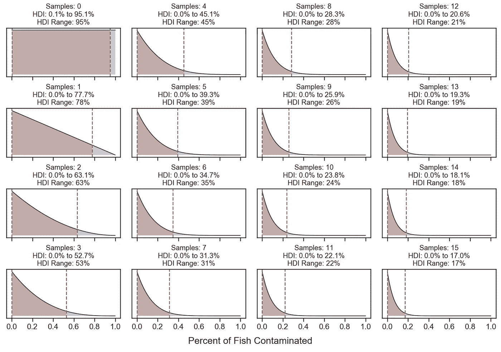
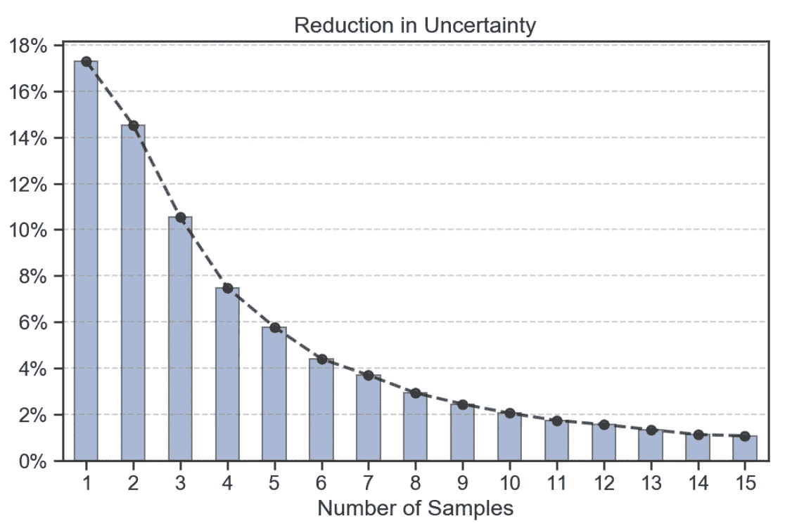
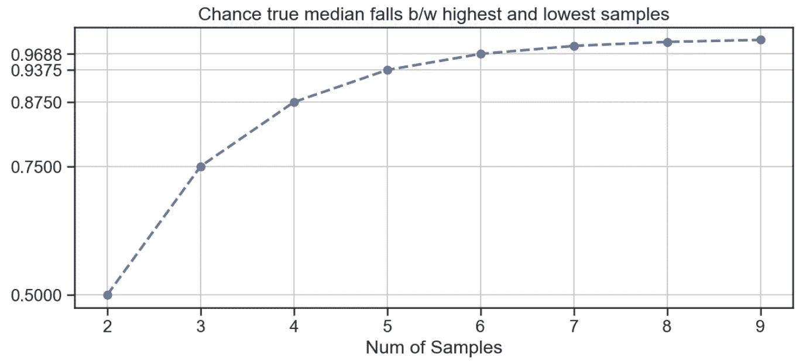

# 减少不确定性:知道的越少，学到的越多

> 原文：<https://towardsdatascience.com/reducing-uncertainty-the-less-you-know-the-more-you-gain-86d311556169?source=collection_archive---------34----------------------->

## 你不需要大数据在你的分析中变得“重要”

在一个数据变得如此普遍的时代，我们已经太习惯于解决我们认为拥有“足够数据”的问题，而忽视我们认为缺乏数据的问题。更糟糕的是，*大数据*的嗡嗡声已经改变了我们的预期，让小数据变得无用、无信息、非常无聊。但这就是为什么我们有数据科学家，对不对？

其实数据科学家这个头衔有点多余；另一类科学家到底是什么？不是每个科学家都是*数据*科学家吗？根据 sciencecouncil.org 的说法，科学家是这样的人:

> 系统地收集和使用研究和证据，提出假设并进行检验，以获得和分享理解和知识。

本质上，**科学更多的是关于*收集*数据，而不是*拥有*数据**。相反，我们应该将自己视为商业或可能的决策科学家:观察和 ***收集数据*** 以便为我们的决策提供信息。

我将用 3 个例子来说明收集数据的行为是如何值得的，尤其是在数据很少或没有数据的情况下。

# #1 估计受污染鱼类的百分比

假设有谣言说附近的一个湖爆发了某种水传播疾病，这种疾病可能会感染鱼。你绝对不知道鱼的哪一部分(如果有的话)被感染了。如果你想 100% *确定百分之多少的鱼被感染，你需要对每条鱼进行取样(这是一项不合理且昂贵的任务)。相反，你决定随机抽取几条鱼的样本，观察它们是否被污染？当然，我们知道样本越多，我们的估计就越准确。尽管如此，随着我们采集越来越多的鱼样本，我们估计的确定性的净增加是增加还是减少？换句话说，**我们从第一条鱼中获得的确定性的增加等于、小于还是大于我们从第 1000 条鱼中获得的确定性的增加？**在继续之前，让我们先确定一些事情:*

> [**最高密度区间**](http://www.indiana.edu/~kruschke/BEST/BEST.pdf) **(HDI):** 该度量表示分布中最可信的一组点。例如，95% HDI 区域意味着 HDI 内部的每个值都比 HDI 外部的任何值具有更高的概率密度。
> 
> **不确定性:**在我们的例子中，不确定性将被定义为 95% HDI 的范围。例如，如果我们给定分布的 95% HDI 是[.04 到. 66]，那么我们的不确定性将是. 62 (.66-.04)。范围越小，我们越有把握。
> 
> **贝塔分布:**贝塔分布是一个纯粹的连续分布，我们将用它来表示我们的鱼被污染的概率。

现在是时候对鱼进行随机取样，检测是否被污染了。我们可以在每个样本后更新贝塔分布，从而量化新的不确定性。请注意，在对任何鱼进行采样之前，我们的分布在 0 和 1 之间是均匀的，在 0 和 1 之间的任何值都是同样可能的。为了这个例子的目的，让我们假设我们采样了 15 条鱼，没有一条被感染。下面的图表显示了每个样本后我们更新的分布。

The order of charts is top-down starting from left; Uncertainty shown in red region

注意我们的不确定性(红色区域)在每个样本后是如何减少的。没有任何鱼样本(左上)，我们的 HDI 范围是 95%。到我们对第 15 条鱼取样时，我们的 HDI 下降到了 17%(减少了 80%以上)。假设 15 条鱼样本中没有一条被感染，那么真实的污染率有 95%的可能在 0%到 17%之间。

然而，最令人印象深刻的是不确定性的最大减少实际上来自第一个样本。在我们的第一个样本之后，我们的人类发展指数范围下降了 17%，从 95%下降到 78%。

Reduction in Uncertainty after 15 samples

左边的图表反映了每个后续样本后我们的 HDI 中的 ***减少*** 。注意不确定性的减少。对第 10 条鱼取样只减少了我们 2%的不确定性。

最后，**我们的第一个样本比第十个样本减少了 8.5 倍的不确定性！**

# #2 根据未知分布估计中值

假设我们只从未知大小的未知分布(参数或非参数)中抽取 3 个值。

> 未知分布的真实中值落在最高和最低采样值之间的几率有多大？

我们可以通过计算相反的问题来解析地解决这个问题——真实中值**落在我们的最高*或最低*值之间的概率。根据定义，一个随机样本有 50%的几率低于中值，因此所有 3 个样本都低于中值的几率为 0 . 5。然而，我们也可以让所有 3 个样本*以相等的几率高于中位数*。因此，1 减去组合概率将计算出真实平均值落在两者之间的概率。**

****

**下面反映了前 9 个样品的结果。**

****

**请注意，只有 2 个样本时，其概率是 50–50。抽取第三个样本将使我们的机会增加 0.25%到 75%！到我们的第 5 个样本，我们的机会已经提高到 93.75%！**

**只需 5 个样本，我们就可以了解未知分布的很多信息！**

# **瓮中的 3 个球**

**假设有一个骨灰盒，里面有一万个红蓝球。你不知道一个球有百分之多少是蓝色或红色的(它可以在 0 到 100%之间变化)。你猜对骨灰盒中主要颜色的几率是 1–1(50%的几率)。**

> **假设你从骨灰盒中取出 1 个且只有 1 个球。你现在猜对大多数颜色的几率有多大？**

**假设你总是猜你采样的颜色，猜对大多数颜色的几率从 50%上升到 75%,只要采样一个球就增加 25%!**

# **结论**

1.  **在许多情况下，当你对某件事知之甚少时，数据的价值，也就是信息的价值，是最大的。**
2.  **有机会证明在做决定之前收集更多数据的价值，特别是当我们知道的很少的时候。实际上，你可以使用贝叶斯统计框架将价值货币化。这些概念与信息分析的[值密切相关，可用于计算收集更多数据以减少不确定性的 ROI。](https://link.springer.com/article/10.1007/s40273-014-0219-x)**