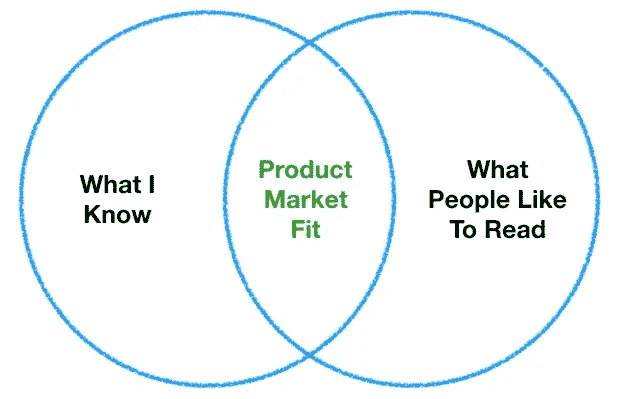
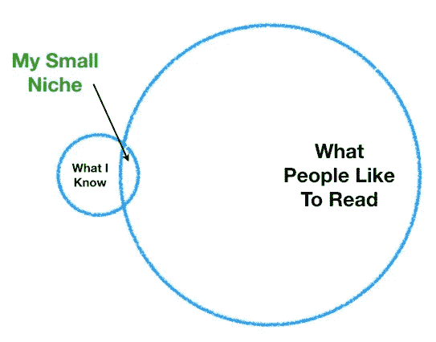
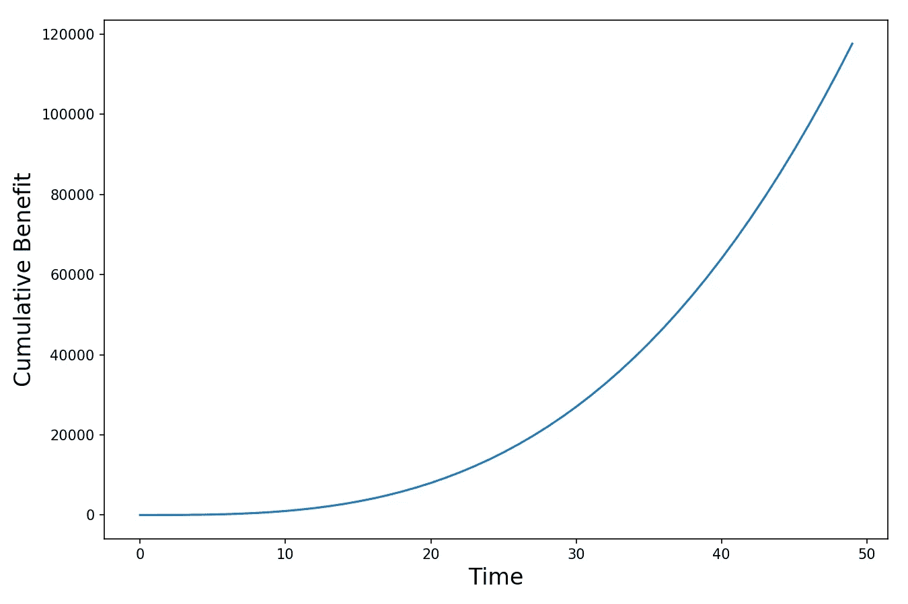

# 反思 4 个月的数据科学博客

> 原文：<https://towardsdatascience.com/reflecting-on-4-months-of-data-science-blogging-82eb90d3c477?source=collection_archive---------20----------------------->

Photo by [Designecologist](https://www.pexels.com/@designecologist?utm_content=attributionCopyText&utm_medium=referral&utm_source=pexels) from [Pexels](https://www.pexels.com/photo/photo-of-fireworks-display-2526105/?utm_content=attributionCopyText&utm_medium=referral&utm_source=pexels)

## 回顾过去的 4 个月，并为未来的 4 个月设定一些目标…加上我终于达到了 1K 粉丝！谢谢大家！

我在今年(2019)五月中旬左右开始认真写博客。[我正在参加一个数据科学训练营](/how-i-feel-about-data-science-and-the-metis-bootcamp-experience-398b171289d0)，想要一个论坛来展示我的工作。我的导师建议我在 Medium 或 GitHub 上写博客。感谢星星，我选择了中等(我永远无法让我的 GitHub 博客工作)。

完全披露——这篇博客有点沾沾自喜。当我最终达到 1000 名追随者的里程碑时，我告诉自己我会写一篇“回顾我来的地方”的帖子，我终于在几天前达到了这个里程碑(感谢所有人的支持和阅读我的材料)。

我将谈一谈我是如何走到这一步的，但老实说，我没有太多的智慧可以分享。我的博客能够获得关注的原因之一是运气。如果我从头开始，我不确定我是否能够复制所发生的事情(你会在下面看到为什么我会有这种感觉)。

# 一些统计数据

以下是我博客的一些数据:

*   **1018 名粉丝**(1000 是我的长期目标，所以请原谅我的吹嘘)。
*   [**25 篇文章发表**](https://medium.com/@tonester524) (自五月中旬起，不包括此篇)
*   我目前的收入大约是每周 160 美元。还没有租金，但也不是花生。

我当然为能走到这一步而自豪。当我开始写关于数据科学的博客时，[我希望将我的写作与职业联系结合起来，最终](/got-data-science-jobs-552e39d48da2) [帮助我](/got-data-science-jobs-552e39d48da2) [找到一份工作](/got-data-science-jobs-552e39d48da2)，就是这样。我当时并不知道写作会成为我的一项新爱好和额外的收入来源——我现在把我的博客视为我自己的一个小公司，我打算在可预见的未来继续完善和努力。

我在上面提到了运气。让我告诉你我的意思。

# 瓶中闪电

在我写这篇文章的时候，我的博客有 225，346 次的浏览量。**这些观点中，82058 个(占总数的 36%)来自一个帖子，** [**了解随机森林。**](/understanding-random-forest-58381e0602d2) 它成功的主要原因是，当你谷歌“随机森林”(就在维基百科下面找)时，它是顶级搜索结果之一[——顺便说一下，我不知道谷歌为什么把它排在这么高的位置。](https://www.google.com/search?q=random+forest&rlz=1C1CHBF_enUS860US860&oq=ra&aqs=chrome.0.69i59j69i57j35i39j0l2j69i60.1630j0j8&sourceid=chrome&ie=UTF-8)

有趣的是，我从未打算单独发表那篇文章。它原本是为了补充另一篇文章([我的新兵训练营项目，在那里我使用机器学习来选择 Lending Club 贷款进行投资](/turning-lending-clubs-worst-loans-into-investment-gold-475ec97f58ee))。随机森林算法在我的结果中占有显著地位，所以我写了一份关于它如何工作的描述。然而，我不是一个简洁的作家，因此描述结束时真的很长。考虑到没有人愿意阅读一篇关于我的数据科学项目的 25 分钟的博客文章，我决定将关于 random forest 的部分作为自己的文章发表。幸运的我，看看结果的不同:

*   [**了解随机森林**](/understanding-random-forest-58381e0602d2)——**82056**浏览量和 **432** 粉丝。
*   [**把 Lending Club 最差的贷款变成投资金**](/turning-lending-clubs-worst-loans-into-investment-gold-475ec97f58ee)—**1136**观点和 **39** 粉丝。

即使现在 3 个月过去了，它仍然是我浏览次数最多的博客，我几乎没有发表它。如果我没有发表它，我就不会有今天。

# 在波动中坚持

从那以后，我试图重现那道闪电，但收效甚微。我取得了一些合理的成功(我应该说是一些火花)，但没有闪电。**定期发布好内容真的很辛苦。我非常钦佩我的媒体同行们，他们每天都出版高质量和受欢迎的内容。**

通过努力工作，让我们诚实一些运气，这些人磨练了他们的写作风格和主题专业知识，以这样一种方式，它与媒体读者感兴趣的事情有很大的重叠。借用创业界的术语，这些超级作家享受着巨大的产品市场契合度(见下面的文氏图):

The Type of Writer We All Aspire to Be (The In My Dreams Venn Diagram)

然而，对于我们这些普通人来说，现实更有可能是我们并不像我们认为的那样知道很多。普通读者对我们有见解的主题不感兴趣:

The Type of Writer I Actually Am (Realistic Venn Diagram)

当你花了几天时间制作和研究的作品失败了，这绝对令人沮丧。例如，我真的为这篇关于如何更有效地提高人们的技能并帮助他们转行的文章感到骄傲。然而，这是迄今为止我最少阅读的故事之一。

但没关系——有些波动是意料之中的，就像上面现实的文氏图一样，人们不会总是对我认为值得注意的事情感兴趣。**对我来说，关键是写作，直到我找到自己的定位，然后继续磨练那个专业领域**，如果我的定位更小、更窄也没关系。

此外，除了观点和阅读之外，我还写了许多其他原因:

*   **为了学习** —我的很多数据科学帖子都是为了让我更好地理解一门技术学科。试图教某人某样东西是如何工作的，尤其是在像 Medium 这样公开的论坛上，迫使我再三检查我认为我对这个主题的了解。此外，用简单的英语解释主题迫使我完全理解基本原理，这样我就可以想出清晰和相关的例子。
*   好奇心——这个世界上有如此多有趣的数据被收集，也有如此多有趣的问题需要解决。我可能无法像在真正的研究项目中那样深入研究，但这个博客将继续作为我定量探索的日记。
*   结识志同道合的人——这是博客的一个方面，我肯定需要更加努力。我喜欢媒体上几乎没有巨魔或火焰(根据我个人的经验)，但我也不介意更经常地与我的读者交流。在不久的将来，我希望与读者和其他作家建立真正的、持久的联系。
*   **副业收入** —我不会撒谎。我的写作能得到报酬，这当然很好，也很令人惊讶。与其他平台相比，我还喜欢 Medium 上的努力和收入之间有更多的相关性。

最后也是最重要的一点，我写作是为了遵守纪律。我坚信**良好的行为会增加**——这意味着随着时间的推移，良好决策的累积收益会呈指数增长:

What Positive Compounding Looks Like

我计划继续每周至少发布一篇文章，风雨无阻。就像耐心地培育和维护一个花园最终会带来一个又一个的丰收一样，我希望在一两年后回头看时会说，“哇，看看我的博客取得了多大的进步，我从每周坚持写博客中学到了多少。”

最后，因为我经历了训练营和职业转变，我对教育即服务行业(训练营、MOOCs、职业发展平台等)产生了兴趣。).对于转行者来说，找工作可能是相当残酷无情的(我个人经历过这种情况，也在我的密友身上看到过)。我觉得肯定有更好的方法——不幸的是，我目前在这方面没有任何改变游戏规则的见解，但它肯定会是我未来关注的领域。

# 结束语

我为这篇文章的漫无边际道歉。我真的很兴奋能够为你们所有人写作，并感谢你们的支持。

如果有任何数据科学、教育或金融作家想要合作或只是聊天/头脑风暴，请在 Medium 或通过 Twitter 在[给我留言。干杯，我期待着你的来信！](https://twitter.com/tonester524)

***更多数据科教相关岗位由我:***

[*数据科学家是做什么的？*](/what-do-data-scientists-do-13526f678129)

[*数据科学家面临自动化的风险吗*](/is-the-data-science-profession-at-risk-of-automation-ae162b5f052f)

[*数据科学家挣多少钱？*](/how-much-do-data-scientists-make-cbd7ec2b458)

[*数据科学家赚多少钱第二部*](/how-much-do-data-scientists-make-part-2-cb959a0d05f)

[*软件工程师挣多少钱？*](/how-much-do-software-engineers-make-60565f50f579)

[*技能提升的更好方法*](/a-better-way-to-skill-up-b2e5ee87dd0a)