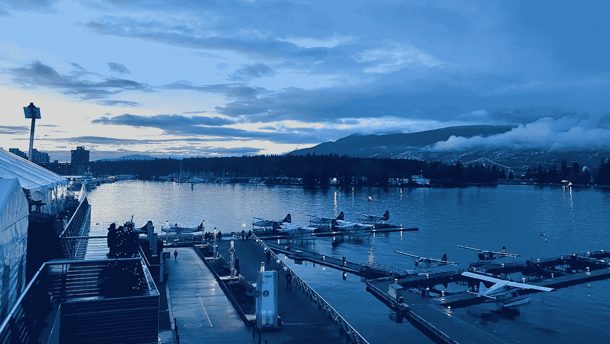
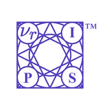
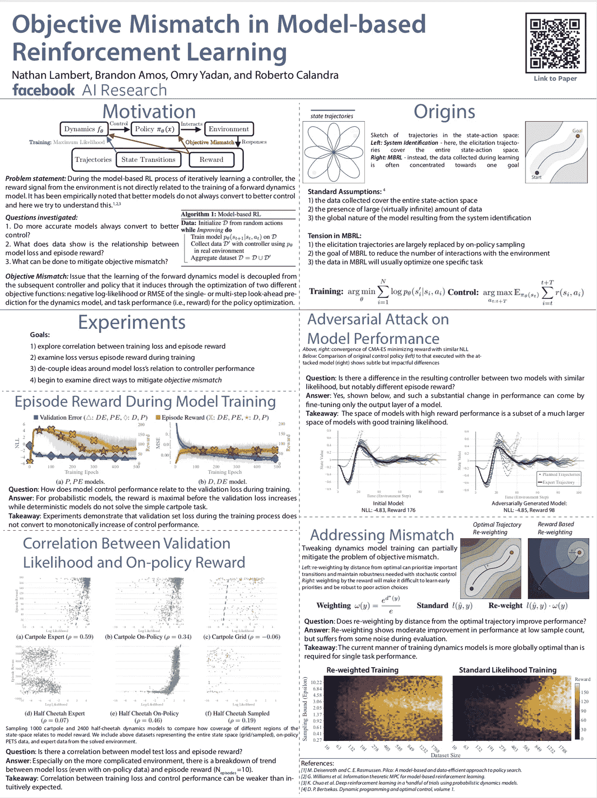
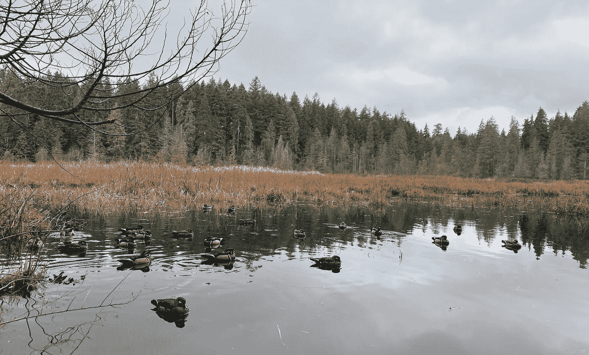
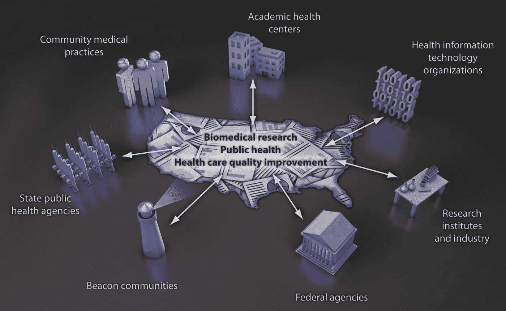

# 关于 NeurIPs 2019 的思考

> 原文：<https://towardsdatascience.com/reflections-on-neurips-2019-6317f102ee09?source=collection_archive---------14----------------------->

## 机器学习何去何从？

我最喜欢的主题，个人想法，和新的研究领域。研究人员是否展现了与大型科技公司不同的一面？

Vancouver as a conference venue left me blown away. Has been perfect for me, let’s hope others agree.

我完全理解为什么这些天人们都涌向神经信息处理会议。当然，[在 12 分钟内销售一空是个问题](https://www.forbes.com/sites/samshead/2018/09/05/ai-researchers-left-disappointed-as-nips-sells-out-in-under-12-minutes/#4be6caea20e9)，但这里的展示展示了机器学习影响的巨大前景。我袖手旁观机器学习是我们可以用来超越许多全球问题的创新工具之一(我认为认为我们可以超越气候变化的想法有点天真)。

NeurIPs Society. Let’s hope they keep providing great events!

会议的亮点都在充满活力的[推特社区](https://twitter.com/hashtag/NeurIPS2019?src=hashtag_click)上被追踪，呼吁最好的结果，并询问可疑时刻的问题。还有一个关于机器学习在技术和人文意义上的走向的实质性讨论。考虑到机器学习往往会在主流媒体上引起负面报道，这一事件真正传递给了一个试图为社会尽最大努力并检查他人的社区(*如果更多的这种情况能够应用于同行评审系统，让许多人在这里)*。

# 主题:研究人员真的同意海报呼吁更多的结果的可解释性

这里的研究人员强烈要求问责。我在[深度强化学习研讨会](https://sites.google.com/view/deep-rl-workshop-neurips-2019/home)上展示了一张关于“[基于模型的强化学习](http://people.eecs.berkeley.edu/~nol/paper_mbrl_mismatch.pdf)中的目标不匹配”的海报，人们非常容易接受这样的观点，即我们对强化学习如何工作的一些潜在假设可能是有缺陷的。

Here’s my poster. Always happy to answer research questions, but don’t want to dive too far in on this post!

我还碰巧在谷歌的一位研究员旁边展示了我的海报，这位研究员正在推动 RL 算法中更多的可靠性指标。这意味着:当性能论文声称跨环境和随机种子的新“最先进”时，它们提出的一致性如何。这种现实的鲁棒性可能是让这些算法在实际应用中更有用的关键(例如机器人，我将一直把它作为 RL 的一个伟大的可解释平台)。

我们两张海报之间的重点评论来自 [Oriol Vinyals](https://ai.google/research/people/OriolVinyals/) (该领域非常著名的研究员)，关于**如果我们将当前的 RL 基线与解决任务的人类进行比较会发生什么？**我们猜测人类会更快、更可靠地解决合理的任务——所以作为一个行业，我们还有大量的工作要做！

 [## 谷歌-研究/rl-可靠性-指标

### RL 可靠性度量标准库提供了一组度量标准来衡量强化学习的可靠性

github.com](https://github.com/google-research/rl-reliability-metrics) 

此外，有很多研究人员质疑人们为什么会谈论敏感话题的例子。对抗我们领域危险趋势的地面力量是大公司注意到这一点的唯一方式。

Had the pleasure of exploring the skyline on a jog. Thanks to some great friends that eagerly entertained me wanting to chat on the phone while jogging. Peep the paddle boarder.

# 疯狂的新想法:用于健康应用的 RL

强化学习已经被证明是学习如何在结构化环境中行动的有效工具，那么我们如何利用它来改善健康呢？我和我的新朋友[斯蒂芬妮·陈](https://www.linkedin.com/in/scychan/)(来自神经科学领域的谷歌人工智能常驻人员)想出了将 RL 应用于实验室小鼠的想法，以检查不同的饮食、药物和活动模式。许多医学实验室使用老鼠作为人体实验的先驱，所以这是合乎逻辑的起点。我在考虑给伯克利的生物学学生发几封电子邮件，他们可能会疯狂到让我尝试一下。我加入是因为它将融合我对 RL 的专业兴趣和我对长寿和健康的个人热情。有什么想法吗？

当 RL 找到优化小鼠生物标记子集的最佳方法时，这个问题基本上就形成了。环境会有一系列的行为组合(饮食、活动和药物)，回报要么是寿命(稀疏回报)，要么是生物标记(更难分析的持续回报)。这能有多难？

A hideaway in Stanley Park — Beaver Lake is a drop into nature from city center, and the mayhem of a busy conference.

# 新领域:医疗保健联合学习

联合学习正在设计云中的系统，这些系统可以在中央服务器上合并私有数据(例如患者数据)，以改善学习指标和结果(例如医学图像检测)。该领域的研究正应用于一个与网络安全和医疗系统密切相关的领域，这两个领域有时已经很难合作。

Friedman, Charles P., Adam K. Wong, and David Blumenthal. “Achieving a nationwide learning health system.” *Science translational medicine* 2.57 (2010): 57cm29–57cm29.

也就是说，联合学习成为标准将是巨大的。截至目前，由于隐私协议，大多数医院共享的数据少得惊人。谁不想让自己的扫描匿名地与计算机的全国数据库进行比较呢？**它为医疗系统的人性化方面增加了安全、定量的分析。**

我还要补充一点，创建一个通用的结构，让我们的数据能够 1)被用来帮助一个更大的系统，同时 2)不被我们的身份所束缚，这才是数据使用的正确方向。大多数公司一直在买卖我们的数据，因此能够在使用数据的同时维护隐私是一个巨大的胜利。

这是 Nvidia 今年早些时候关于联合学习的总结。

 [## 什么是联合学习？NVIDIA 博客

### 在任何领域，成为医学专家的关键是经验。知道如何解释症状，这…

blogs.nvidia.com](https://blogs.nvidia.com/blog/2019/10/13/what-is-federated-learning/) 

联合学习在我看来是学习社区中一个非常有前途的方向。学习正在改变世界，因为它能够在数据集中建立联系，而联合学习是一个结构化的系统，可以将学习应用于大型社会规模的问题，这些问题以前由于缺乏基础设施而无法解决。

Views from the morning email desk. NeurIPs kept me appreciating the little things.

咖啡和自然。我非常喜欢在这里短暂的停留，我会回来的。

NuerIPs 2020？希望如此。

更多？订阅我关于机器人、人工智能和社会的时事通讯！

 [## 自动化大众化

### 一个关于机器人和人工智能的博客，让它们对每个人都有益，以及即将到来的自动化浪潮…

robotic.substack.com](https://robotic.substack.com/)