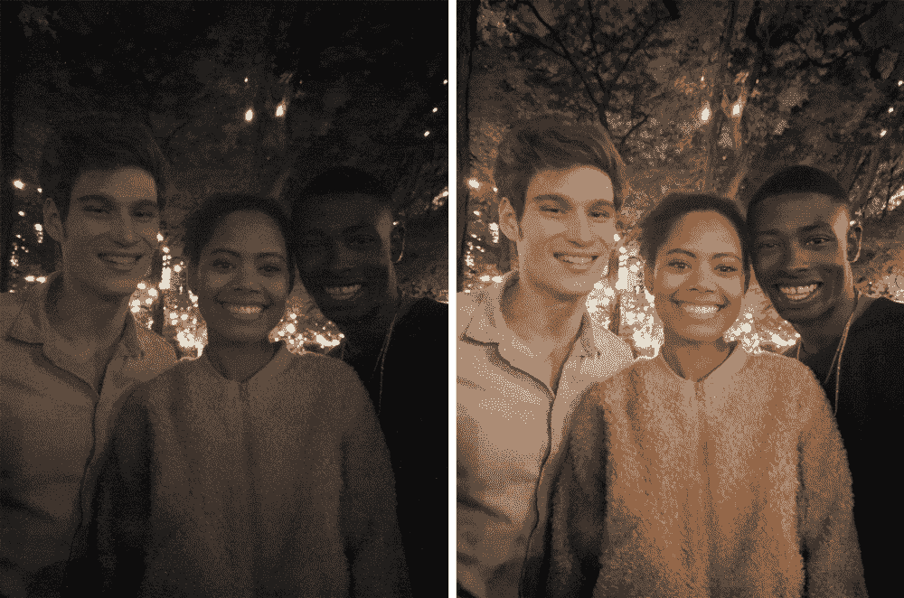
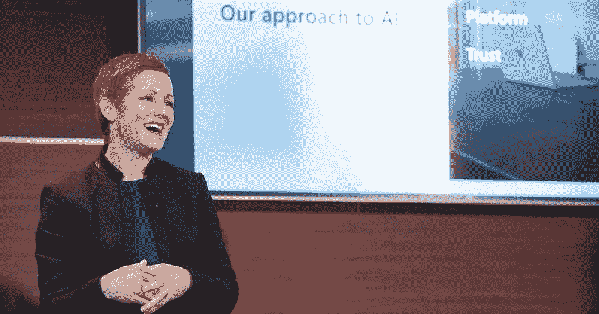
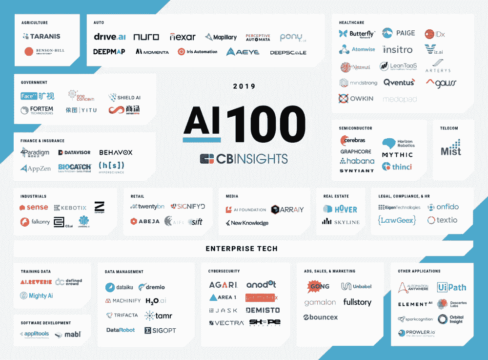
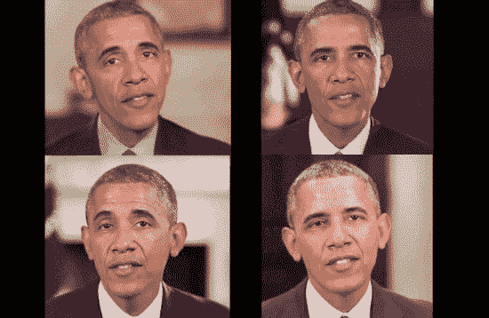
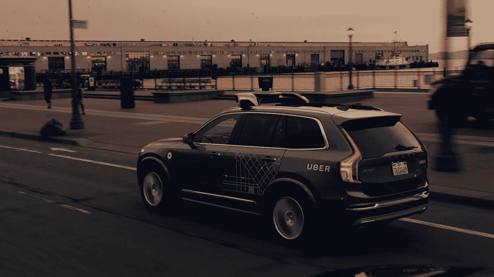
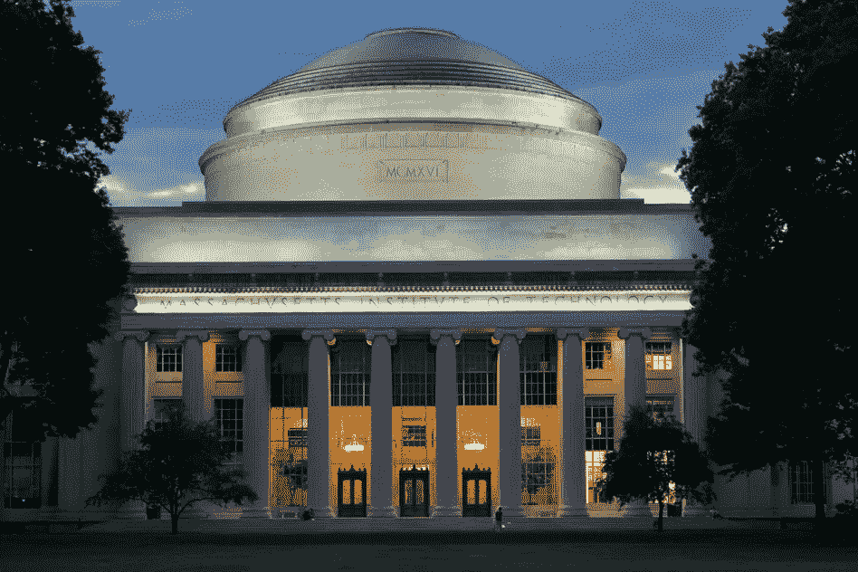

# 对人工智能现状的思考:2018

> 原文：<https://towardsdatascience.com/reflections-on-the-state-of-ai-2018-46504e25263d?source=collection_archive---------17----------------------->

## 人工智能领域关键发展的概述，重点关注关键参与者、应用、机遇和挑战

*本帖由* [*亚历克斯·斯特恩*](https://medium.com/@alex.stern) *&* [*尤金·西多林*](https://medium.com/@e.s.sidorin) *合著。*

每天，讨论各种“与人工智能有关”的事情的多个新闻项目堆积在我们的邮箱中，每周都有几十篇(如果不是数百篇的话)文章、观点和综述在标题中包含“人工智能”一词。然而，并非所有声称与人工智能相关的东西实际上都是有意义的或相关的，相反，它们往往与该领域毫无关系。

为了使机器学习、神经网络和人工智能的其他领域的知识民主化，我们决定通过创建一系列专注的文章来展开我们的努力，这些文章将涵盖该领域的最新进展，看看关键人物，并提供一些对最有前途的技术的见解，以及该行业今天面临的机遇和困境。

在第一篇文章中，我们按照主要贡献者、应用和挑战对 2018 年的主要发展进行了简要概述。

今天，随着数百家公司深入人工智能领域，甚至更多的公司正在努力找出与该领域相关的战略，可能有点难以确定哪些特定公司最有可能在未来引领潮流。然而，如果我们看一下列出关键参与者的众多名单中的任何一个(例如，见这里的[和这里的](https://www.techworld.com/picture-gallery/data/tech-giants-investing-in-artificial-intelligence-3629737/)和[和](https://www.datamation.com/applications/top-25-artificial-intelligence-companies.html)，5 家公司——谷歌、脸书、亚马逊、微软&IBM——不可避免地出现在所有名单上(其他几乎同样经常被提及的公司是苹果、腾讯&百度)。在本文中，我们将重点关注谷歌&微软，因为在 2018 年，这两家公司在人工智能领域的新闻中出现得最多；尽管如此，其余的科技巨头并没有少产，我们计划在下一篇关注技术最新进展的文章中更详细地介绍其中一些。

# 谷歌

*Google Pixel: Night Sight capabilities demo from* [*Google blog*](https://www.blog.google/products/pixel/see-light-night-sight/)

对于谷歌在人工智能领域的努力来说，这是富有成效的一年，该公司推出的新产品数量以及对现有服务的一些关键改进都证明了这一点。

数量最多的公告来自谷歌 I/O，该公司在 5 月举行的年度开发者大会。除此之外，谷歌为 Gmail 推出了 Smart Compose，对谷歌地图进行了一些令人印象深刻的更新，或许最重要的是，[宣布了其新的人工智能虚拟助手](https://ai.googleblog.com/2018/05/duplex-ai-system-for-natural-conversation.html)，称为谷歌双工(参见 2018 年谷歌 I/O 上介绍的所有新产品和功能的良好总结[这里](https://www.analyticsvidhya.com/blog/2018/05/top-6-ai-announcements-at-google-io-2018/))。

用公司自己的话说:

> *【谷歌双工是】一种通过电话进行自然对话以完成“现实世界”任务的新技术。该技术旨在完成特定的任务，例如安排某些类型的约会。对于这样的任务，该系统使对话体验尽可能自然，允许人们正常说话，就像他们对另一个人说话一样，而不必适应机器。”*

Duplex 给一家发廊打电话的录音令人印象深刻，甚至导致一些人质疑 Google Duplex 是否通过了图灵测试(提示:没有；至少，做出判断的人必须意识到她可能在和一台机器说话)。它还引发了一场激烈的讨论，即以这种方式使用技术，而不让接收端的人们意识到他们不是在与一个真实的人互动，而是在与一个机器人交谈，这是否合适。虽然可能很难明确回答这些问题，但我们可能很快就会看到更多这样的讨论，因为谷歌[在 12 月](https://www.theverge.com/2018/12/5/18123785/google-duplex-how-to-use-reservations)开始在一些智能手机上推出 Duplex。

谷歌的另一个有趣的更新是智能手机 Pixel 系列的最新更新(Pixel 3 & 3 XL)，它带有一些通过使用人工智能实现的[真正令人印象深刻的新相机功能](https://www.wired.com/story/google-pixel-3-camera-features/)(我们将在本文后面专门讨论计算摄影进步的部分再次触及)。

最后，Alphabet Inc .全资拥有的 DeepMind Technologies 通过其 AlphaZero 程序的最新版本成功实现了一个重要的里程碑。

在 [2015](https://en.wikipedia.org/wiki/AlphaGo_versus_Fan_Hui) & [2016](https://en.wikipedia.org/wiki/AlphaGo_versus_Lee_Sedol) 的围棋比赛中，我们已经看到了 AlphaGo 和 AlphaGo Zero 令人印象深刻的成就，当时它在与两位最强的围棋冠军比赛时轻松赢得了大多数比赛；然而，在 2018 年，DeepMind 的团队成功实现了更有趣的事情——最新的 AlphaZero 引擎展示了它在国际象棋、shogi 和 Go 中所有现有最强引擎中的明显优势。

AlphaZero 特别有趣的是，它在无需研究人类所玩游戏的任何日志的情况下，成功实现了这一壮举；相反，该程序自学了如何玩所有三个游戏，只提供了基本的规则。事实证明，通过摆脱从以前玩过的游戏中学习的限制，AlphaZero 采用了“一种突破性的、高度动态的和“非传统的”游戏风格”，这种风格与以往任何时候都不同。反过来，这使得引擎对社区更有用，社区可以通过观察机器开发的策略来学习新的策略。鉴于 AlphaZero 能够成功地从零开始学习并解决完美的信息问题，这也为这项技术在未来的现实应用创造了前景。

DeepMind 也在努力创建可以处理不完美信息问题的系统，正如它最近通过[展示的 AlphaStar](https://deepmind.com/blog/alphastar-mastering-real-time-strategy-game-starcraft-ii/) 在《星际争霸 2》中击败了一些职业玩家(而在过去，由于游戏的复杂性，人工智能一直难以成功地玩《星际争霸》)。

# 微软

*Julia White, Corporate Vice President, Microsoft Azure Marketing, speaks at the* [*Conversations on AI event*](https://blogs.microsoft.com/ai/ai-in-business-2018-news/) *in San Francisco. Photo by John Brecher for Microsoft*

与谷歌类似，微软在 2018 年推出了新的人工智能相关产品和服务，并改进了一些底层技术。这项工作的一个重要部分是以社区为中心的，专注于为开发者提供更好的工具和功能，以在微软的云平台上构建人工智能解决方案。

有趣的是，微软名为“ [Build](https://blogs.microsoft.com/ai/build-2018-news-roundup/?utm_source=aib-rel-fpga&utm_campaign=75061) 的重要开发者大会也将在 5 月举行，就像谷歌的一样。2018 年，对微软来说是一个拥挤的事件，该公司发布了大量新公告，特别是宣布[项目脑波整合到 Azure 机器学习](https://blogs.microsoft.com/ai/build-2018-project-brainwave/?utm_source=pre-amp&utm_campaign=75592)。

脑波项目(最初被称为[弹射器](https://www.microsoft.com/en-us/research/project/project-catapult/))是 Bing 在 2010 年开始的数年研究的结果。脑波是 2017 年 8 月在顶级半导体会议之一的 [Hot Chips](https://www.hotchips.org/about/) 上[向社区宣布](https://www.microsoft.com/en-us/research/blog/microsoft-unveils-project-brainwave/)的。简而言之，脑电波是一个 FPGA 芯片上的硬件平台，旨在加速实时人工智能计算，这是搜索引擎等服务的一个关键领域(这也解释了为什么这个项目从 Bing 中发展出来)。现在，随着脑波融入 Azure 的机器学习，微软声称 Azure 是 AI 最高效的云平台。

在去年 9 月在奥兰多举行的另一场大型会议 [Ignite](https://news.microsoft.com/ignite-envision2018/) 上，微软[发布了面向企业的 Cortana 技能工具包](https://blogs.microsoft.com/ai/cortana-for-enterprise/)，这代表了一次在办公空间测试基于人工智能的助手的令人兴奋的尝试——想象一下你可以对机器人进行编程，使其能够为办公室安排清洁服务，或者在你简短的语音命令的指导下自动向服务台提交票证。

几天后，微软还[宣布](https://blogs.microsoft.com/ai/swiftkey-translator-android-app/)将实时翻译功能集成到 SwiftKey 中，这是微软在 2016 年收购的一款安卓键盘应用。最后，在 9 月底，继谷歌 Duplex 之后，微软发布了其[语音服务](https://azure.microsoft.com/en-us/services/cognitive-services/speech-services/)工具，引入了改进的[文本到语音合成](https://azure.microsoft.com/en-us/blog/microsoft-s-new-neural-text-to-speech-service-helps-machines-speak-like-people/)功能。

11 月晚些时候，又有一系列有趣的[公告](https://blogs.microsoft.com/ai/ai-in-business-2018-news/)，比如[认知服务容器](https://azure.microsoft.com/en-us/blog/bringing-ai-to-the-edge/)。认知服务允许开发人员在他们的应用程序中利用人工智能，而不需要他们成为数据科学专家，或者拥有广泛的人工智能相关知识。反过来，容器的故事集中在边缘计算的案例上——这个概念不需要将数据发送到云来执行计算，而是在本地处理，从而减少延迟，在许多情况下优化成本。有了容器中的认知服务，微软的客户现在可以构建在边缘位置运行人工智能的应用程序。

# 投资

*Top 100 startups in AI, from* [*CB Insights*](https://www.cbinsights.com/research/artificial-intelligence-top-startups/)

人工智能领域的投资最近一直在蓬勃发展，尽管 Crunchbase 合理地[呼吁](https://news.crunchbase.com/news/the-ai-market-is-growing-but-how-quickly-is-tough-to-pin-down/)，但很难估计有多少。CB Insights 已经建立了一个很好的人工智能空间的信息图表，并在这篇[文章](https://www.cbinsights.com/research/artificial-intelligence-top-startups/)中按类别对顶级初创公司进行了分类。我们在这里看到两个主要的收获——首先，2018 年人工智能行业最大的几轮融资是由中国公司筹集的，如商汤科技和 Face++等(分别为 16 亿美元和 6 亿美元)。第二，在目前 11 家估值超过 200 亿美元的独角兽中，5 家公司来自中国，贡献了总估值的 50%，商汤科技以惊人的 45 亿美元估值领先。这强调了一个关键点:与其他国家相比，中国似乎正以更快的速度前进。此外，随着足迹越来越大，中国现在正成为人工智能领域的强国。(要了解更多细节，请查看[这篇概述了当今世界各国正在推行的各种国家人工智能战略的摘要](https://medium.com/politics-ai/an-overview-of-national-ai-strategies-2a70ec6edfd))。

# 道德、法规和教育

## 深刻的假货争议

AI-generated fake clips of President Obama’s speeches, from [The Verge](https://www.theverge.com/2017/7/12/15957844/ai-fake-video-audio-speech-obama)

2017 年 12 月，Motherboard [发表了一个故事](https://motherboard.vice.com/en_us/article/gydydm/gal-gadot-fake-ai-porn)，讲述了一个名为“deepfakes”的 Reddit 用户发布了一些硬核色情视频，这些视频将名人的脸映射到色情明星的身体上。虽然不完美，但这些视频相当可信，尤其是考虑到这些视频是由一个人制作的。尽管 Reddit 很快禁止了这些视频，但关于这项技术的合法性和潜在滥用的讨论从那时起就一直在升温。

通过交换演员的面部来制作假视频的技术已经存在了一段时间，但创作的容易程度和质量在 2018 年肯定达到了一个新的水平(见另一个例子，一个懂技术的用户可以实现什么[这里](https://www.kdnuggets.com/2018/03/exploring-deepfakes.html))。制作虚假的色情视频虽然令人不安，但可能仍然相对无害，但正如我们最近看到的那样，同样的技术可以用来制造假新闻或制作虚假的宣传材料(或让巴拉克·奥巴马总统[说他永远不会说的话，至少不会在公共场合说](https://www.theverge.com/tldr/2018/4/17/17247334/ai-fake-news-video-barack-obama-jordan-peele-buzzfeed))，这可能会对我们的社会产生严重的影响。对此能做些什么吗？这还有待观察，但事实是，深度赝品会一直存在，而且很可能只会变得更难与真品区分开来。

## 人工智能偏见

Photo from Microsoft’s blog post “[Facial recognition: It’s time for action](https://blogs.microsoft.com/on-the-issues/2018/12/06/facial-recognition-its-time-for-action/)”

在过去几年中，监督和非监督学习方法都产生了一些令人兴奋的结果(DeepMind 的 AlphaZero 就是通过非监督学习实现的一个例子)。尽管如此，大量现实世界的应用程序需要基于标记数据的训练模型(顺便提一下，这是[经常阻碍进一步发展的关键问题之一](https://techcrunch.com/2017/07/21/why-the-future-of-deep-learning-depends-on-finding-good-data/))。

然而，拥有一个由大量标记数据组成的数据集来训练模型并不等同于拥有一个*好的数据集*。你看，依赖监督学习的神经网络只和它们最初被训练的数据一样好，所以如果底层数据集有任何缺陷(例如以牺牲其他特征为代价专注于一个特征)，神经网络有可能会拾取这些偏差并进一步放大它们。这在理论上听起来可能不太糟糕，但只有当我们考虑到现实世界应用中可能由此产生的问题时——正如我们在 2018 年看到的那样，这些问题可能会非常深远。

例如，在麻省理工学院媒体实验室的研究员 Joy Buolamwini 所做的研究中，她证明了微软、IBM 和旷视科技的领先人脸识别系统只错分了 1%的白人男性的性别，却错分了高达 35%的深色皮肤女性。原因？这些模型是在一个有偏见的数据集上训练的，该数据集包含更大比例的白人男性照片，因此在正确识别他们的性别方面越来越好。考虑到人脸识别技术[现在越来越多地被执法部门使用](https://www.perpetuallineup.org/)，以及非裔美国人被挑选出来的可能性最大，因为他们在面部照片数据库中的比例失调，这种表现上的差异可能会产生非常重大的负面影响。

2018 年公开的同一问题的另一个著名例子是与[亚马逊内部人工智能招聘工具](https://www.reuters.com/article/us-amazon-com-jobs-automation-insight/amazon-scraps-secret-ai-recruiting-tool-that-showed-bias-against-women-idUSKCN1MK08G)相关的案件。亚马逊打算利用机器学习能力来实现更高效的招聘流程，并有可能完全自动化一些步骤。不幸的是，事实证明，上述工具是根据以前申请过该公司的人的简历进行培训的，其中大多数是男性。因此，该模型获得了这些偏见，并反过来训练自己降低女性候选人的等级，优先考虑“男性语言”等内容，以促进男性的申请。亚马逊最终放弃了这个工具，但还有很多其他公司试图利用人工智能来帮助招聘过程，他们的模型可能有类似的缺陷。

今天，越来越多的人([和公司](https://www.wired.com/story/microsoft-wants-stop-ai-facial-recognition-bottom/))呼吁当局制定监管框架来管理人脸识别的使用。它会很快发生吗？这仍有待观察，但至少某种程度的监管可能即将到来。

## 优步的自动驾驶汽车在亚利桑那州撞死行人

Uber Volvo XC90 autonomous vehicle, image from [MIT Technology Review article](https://www.technologyreview.com/s/610574/what-ubers-fatal-accident-could-mean-for-the-autonomous-car-industry/)

不幸的是，在复杂、不确定的环境中运行时，即使是最伟大的技术也难免会偶尔出错。因此，2018 年 3 月 18 日，最终注定要发生的事情发生了，当时[一辆属于优步的自动驾驶汽车在亚利桑那州坦佩市](https://www.nytimes.com/2018/03/19/technology/uber-driverless-fatality.html)撞死了一名行人。这起事故迫使该公司暂停其无人驾驶汽车的所有测试，并重新检查其流程和技术；这也引发了关于自动驾驶汽车背后的技术现状的热烈讨论，以及如果自动驾驶汽车要在短期内获得公众的广泛接受，需要解决的道德和监管挑战。

九个月后，优步被允许[在匹兹堡](https://futurism.com/uber-autonomous-vehicles-pittsburgh)恢复其自动驾驶汽车测试，随后于 12 月在[旧金山和多伦多进行测试，尽管在这些情况下，优步的自动驾驶汽车仍然被限制在“手动模式”(这意味着该公司将专注于将汽车软件暴露在新环境中，而不是进行主动测试)。为了再次赢得当局的好感，优步不得不同意对允许其自动驾驶汽车行驶的道路类型和条件进行额外限制。此外，优步不得不转向为司机提供更严格培训的系统(这是一个关键环节，因为对三月份发生的致命事故的调查表明，司机心不在焉，因此没有像他应该的那样注意路况)，现在被称为“任务专家”。最后，该公司推出了第三方司机监控系统，并对其技术进行了额外的改进。](https://sf.curbed.com/2018/12/20/18150718/uber-self-driving-cars-return-san-francisco-manual)

尽管如此，当谈到自动驾驶汽车时，我们似乎不太可能看到关于公共安全和必要监管的讨论结束；相反，优步的不幸事故只是助长了正在进行的辩论。我们会看到 2019 年将带给我们什么；然而，我们可以确定的一件事是，未来 2-3 年可能会被证明是塑造无人驾驶汽车主题公众舆论的关键。

对于那些对自动驾驶汽车的历史和现状感到好奇的人，我们建议查看《连线》杂志的这篇关于自动驾驶汽车的深度指南。

## 麻省理工学院投资 10 亿美元新建人工智能学院

Photo: MIT Dome, by [Christopher Harting](http://reap.mit.edu/get-involved/attachment/mit-dome-christopher-harting/)

2018 年 10 月 15 日，[麻省理工学院宣布成立一所新学院](http://news.mit.edu/2018/mit-reshapes-itself-stephen-schwarzman-college-of-computing-1015)，以黑石联合创始人兼首席执行官斯蒂芬·a·施瓦茨曼计算学院命名，他捐赠了 3.5 亿美元的基础捐款。新学院将专注于应对人工智能崛起带来的全球机遇和挑战。

麻省理工学院已经在该领域享有很高的声誉(更不用说它在人工智能领域的努力可以追溯到 20 世纪 50 年代末该领域的最初阶段)。然而，很难高估这一最新发展的重要性——例如，施瓦茨曼的礼物将允许创建额外的 50 个致力于人工智能研究的教师职位，有效地将麻省理工学院专注于计算和人工智能的研究人员数量增加一倍。

对跨学科合作的强调，以及对相关政策和道德的研究，以确保负责任地实施人工智能，在这里也值得一提——虽然我们已经看到了过去几年中建立的许多专注于这些主题的智库和研究倡议，但很高兴看到麻省理工学院的承诺，因为在这个问题上还有很多工作要做。

# 人工智能应用:计算摄影

*Image generated by Prisma app, from* [*Business Insider*](https://www.businessinsider.com/prisma-labs-app-profile-interview-with-ceo-alexey-moiseenkov-2016-8)

[从最广泛的意义上来说，计算摄影](https://www.pcmag.com/article/362806/computational-photography-is-ready-for-its-close-up)是人工智能在过去几年里带来了或许是最引人注目的进步的领域，至少从消费者的角度来看是如此。尽管如此，尽管过去几年在这一领域取得了很多进展(例如谷歌照片在 2015 年学会了如何自动标记和分类照片，或者 iPhone 7 在 2016 年获得了自动模糊人像模式下拍摄的照片背景的功能)，但在 2018 年，我们已经看到了许多令人印象深刻的技术壮举，它们正在成为大规模产品。

像谷歌像素的夜视模式，或者 iPhone XS 和 XS Max 上的 T2 智能 HDR 功能，仅仅是通过使用机器智能而成为可能的一些例子。也许更有趣的是，这些新功能现在已经清楚地展示了人工智能的能力，使改进超越了摄像机的物理限制，从而使整个领域走上了一条新的令人兴奋的道路。因此，今天的计算摄影已经向那些熟悉人工智能领域其他进展的人和远离该领域的用户证明了它的价值。

计算摄影应用的另一个方面是当神经网络被用于使用算法完全重新制作图像，以调整输出，使其看起来像著名艺术家的作品，如梵高或莫奈(例如，参见 [Prisma](https://prisma-ai.com/) 应用)。类似的概念也用于机器视觉和福利的各个领域，例如无人驾驶汽车。

我们将在 Evolution One 的下一篇名为**“机器智能的关键近期发展”**的文章中涵盖更多具体技术，如大规模 GANs 和视频到视频合成，这些技术最近取得了重大进展，这是对当今一些最热门的人工智能领域的深入探讨，如自然语言处理和计算机视觉。

## 额外阅读:

*   [IBM over type 沃森健康的 AI 承诺了吗？](https://www.computerworld.com/article/3321138/healthcare-it/did-ibm-put-too-much-stock-in-watson-health-too-soon.html)
*   [人工智能热潮正在全世界兴起，并且正在迅速加速](https://www.theverge.com/2018/12/12/18136929/artificial-intelligence-ai-index-report-2018-machine-learning-global-progress-research)

## 一些不错的 AI 相关总结:

*   [2018 年 AI & ML 技术概述&2019 年趋势](https://www.kdnuggets.com/2018/12/predictions-machine-learning-ai-2019.html)
*   [2018 年回顾:10 次 AI 失败](https://medium.com/syncedreview/2018-in-review-10-ai-failures-c18faadf5983)
*   [机器学习&AI 2018 年主要发展和 2019 年主要趋势](https://www.kdnuggets.com/2018/12/predictions-machine-learning-ai-2019.html)

*最初发表于*[*evolution one . ai*](https://evolutionone.ai/)*。*