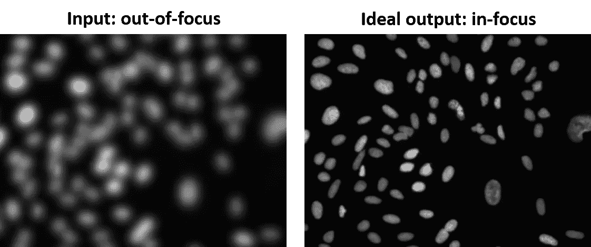

# 重新聚焦:使失焦的显微图像重新聚焦

> 原文：<https://towardsdatascience.com/refocus-making-out-of-focus-microscopy-images-in-focus-again-90e1fe98ead4?source=collection_archive---------18----------------------->

Image source: [https://www.thebisforboss.com/blog/2017/10/16/the-power-of-refocusing-resetting](https://www.thebisforboss.com/blog/2017/10/16/the-power-of-refocusing-resetting)

显微图像广泛用于诊断各种疾病，例如感染和癌症。此外，它们促进了基础生物医学研究，这些研究不断产生对人类疾病原因的新见解。因此，显微图像对改善我们的健康非常重要。然而，获得高质量的聚焦显微镜图像是显微镜领域最大的挑战之一。例如，某些组织(如肺和肠)是不均匀的，会导致图像失焦。在这篇文章中，我们将通过使用深度学习来重新聚焦失焦的显微镜图像来解决这个问题。换句话说，我们将使用深度学习将失焦的显微镜图像变成对焦的图像(见下图)。

Left: out of focus. Right: in focus (Image source: [https://data.broadinstitute.org/bbbc/BBBC006/](https://data.broadinstitute.org/bbbc/BBBC006/))

# 数据

我们将使用[Broad bio image Benchmark Collection 006(bbbc 006)](https://data.broadinstitute.org/bbbc/BBBC006/)图像集，该图像集是从一个 384 孔微孔板中获取的，该微孔板包含细胞核被 Hoechst 染色剂标记的人类细胞。为 768 个视场(384 个孔，每个孔 2 个视场)中的每一个拍摄 32 个图像的 z 叠置体(最佳焦平面处 z = 16，焦平面上方 15 个图像，下方 16 个图像)。

# 方法

总体策略是建立一个卷积神经网络，将离焦图像作为输入，生成聚焦图像作为输出。我们将把我们的神经网络建立在 **U-net** 架构上。此外，我们将使用**特征损失**(最初由 Johnson 等人称为[感知损失)作为损失函数，以量化神经网络的输出与其在 z = 16 处的相应最佳焦平面图像或目标之间的差异。](https://arxiv.org/pdf/1603.08155.pdf)

## 优信网

[U-net](https://arxiv.org/abs/1505.04597) 最初是 Ronneberge 等人针对生物医学图像分割问题开发的。U-net 本质上由三个组件组成:减小图像尺寸的下采样路径、增大图像尺寸的后续上采样路径、以及将激活从下采样路径的所选部分转移到上采样路径中的相应部分的交叉连接。交叉连接用来自下采样路径的信息补充上采样路径，并且是使 U-net 表现如此好的主要发明。我们将使用在 ImageNet 上预训练的 [ResNet](https://en.wikipedia.org/wiki/Residual_neural_network) -34 作为下采样路径，它利用了被称为[迁移学习](https://en.wikipedia.org/wiki/Transfer_learning)的技术。

U-net-based architecture (adapted from [https://arxiv.org/pdf/1505.04597.pdf](https://arxiv.org/pdf/1505.04597.pdf))

## 特征损失

特征损失有助于重建图像中的精细细节，非常适合于[风格转移](https://en.wikipedia.org/wiki/Neural_Style_Transfer)和[超分辨率成像](https://en.wikipedia.org/wiki/Super-resolution_imaging)应用。如下图所示，特征损失的基本思想是将输出和目标放入同一个 ImageNet 模型中(在我们的例子中是 [VGG](https://arxiv.org/pdf/1409.1556.pdf) -16)，然后在选定的中间层而不是最终层比较它们的激活。

Feature Loss (adapted from [https://arxiv.org/pdf/1603.08155.pdf](https://arxiv.org/pdf/1603.08155.pdf))

# 使用 fastai 实现

我们的基于 U-net 的神经网络的实现只是使用如下所示的 [fastai](https://github.com/fastai/fastai) 库的一行代码。我们只需要提供数据、下采样架构(ResNet-34)、损失函数(特征损失)和一些附加参数。

U-net-based model in fastai

我们将使用杰瑞米·霍华德的特征损失的实现，如下所示:

Feature loss implementation by Jeremy Howard

# 培训和测试

我们将使用 z = 16 作为基本事实(y ),用在 z = 1(最差)、5(中间)和 10(接近焦点)的焦平面上方的失焦图像来训练我们的神经网络。我们将留出这些图像的一小部分作为验证集，并使用它们来指导和评估训练过程。训练后，我们将进一步评估模型在 z = 32 的焦平面下方的失焦图像上的性能。虽然两者都没有对焦，但焦平面上方或下方的图像看起来不同，因为它们到镜头的距离不同。因此，我们的策略将允许我们测试训练模型的可推广性。

# 结果

我们首先评估我们的模型在不同失焦水平的验证集上的性能。如下所示，该模型在区分模糊细胞方面做得很好，如果我们像预期的那样使用较少模糊的图像，性能会得到提高。

Model performance on the validation sets

接下来，我们在 z = 32 的测试集上检查了模型的性能。如下所示，模型生成的图像非常类似于 z = 16 时的最佳焦平面图像。因此，我们用焦平面上方的图像训练的模型在焦平面下方的图像上也表现良好。

Model performance on the test set at z = 32

# 总结和未来方向

总之，我们成功地建立了一个神经网络，可以重新聚焦模糊的失焦显微图像。这项工作提高了显微图像的质量，并将促进人类疾病的研究。由于计算能力有限，我只能处理非常小的图像(128*128)。理想情况下，神经网络应该能够处理整个幻灯片图像，可能是通过将它们分成小块。此外，神经网络应该能够处理具有不同染色的不同种类的显微图像。最后，我们可以将神经网络集成到采集平台中，以实时重新聚焦失焦图像，并消除采集后固定的需要。

# 感谢

我要感谢拉荷亚免疫学研究所(LJI)影像中心的 Paola Marcovecchio、Sara McArdle 和 Zbigniew Mikulski 博士的有益讨论。