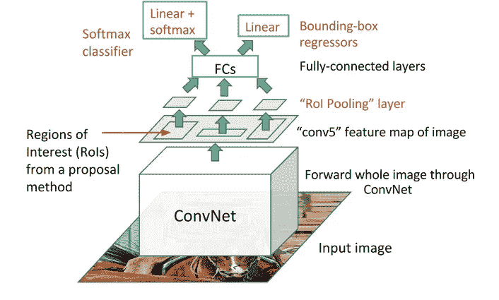

# 利息集中区域

> 原文：<https://towardsdatascience.com/region-of-interest-pooling-f7c637f409af?source=collection_archive---------2----------------------->

## 使物体检测更快更可行的技术。

从图像分类到目标检测的主要障碍是对网络的固定大小输入要求，因为存在完全连接的层。在对象检测中，每个提议将具有不同的形状。因此，需要将所有建议转换为完全连接的层所需的固定形状。投资回报池就是这样做的。

感兴趣区域(ROI)池用于将单一特征图用于 RPN 一次生成的所有提案。ROI pooling 解决了目标检测网络对图像大小要求固定的问题。



The entire image feeds a CNN model to detect RoI on the feature maps. Each region is separated using a RoI pooling layer and it feeds fully-connected layers. This vector is used by a softmax classifier to detect the object and by a linear regressor to modify the coordinates of the bounding box. Source: [J. Xu’s Blog](/deep-learning-for-object-detection-a-comprehensive-review-73930816d8d9)

ROI 合并通过对输入进行最大化合并，从非均匀输入中产生固定大小的特征图。输出通道的数量等于该层的输入通道的数量。ROI 池层接受两个输入:

*   从卷积神经网络经过多次卷积和汇集层后获得的特征图。
*   n '来自区域提案网络的提案或感兴趣的区域。每个建议有五个值，第一个值表示索引，其余四个值是建议坐标。一般代表提案的左上角和右下角。

ROI pooling 从输入中提取每个 ROI，并提取对应于该 ROI 的输入特征图的一部分，并将该特征图部分转换为固定维度的图。每个 ROI 的 ROI 池的输出固定维度既不取决于输入特征图，也不取决于建议大小，它仅取决于层参数。

```
**Layer Parameters: pooled_width, pooled_height, spatial scale.**
```

Pooled_width 和 pooled_height 是超参数，可以根据手头的问题来决定。这些指示对应于建议的特征地图应划分成的格网数量。这将是该层的输出尺寸。让我们假设 W，H 是建议的宽度和高度，P_w，P_h 是宽度和高度的总和。然后，ROI 将被分成 P_w*P_h 个块，每个块的维数为(W/P_w，H/P_h)。

```
**bin_size_h = roi_height/pooled_height;
bin_size_w = roi_width/pooled_width;**
```

空间比例是用于根据特征地图尺寸调整提议大小的比例参数。假设在我们的网络中，图像大小为 1056x640，由于许多卷积和池化操作，特征图大小缩小到 66x40，由 ROI 池使用。现在，建议是基于输入图像大小生成的，因此我们需要将建议重新调整为要素地图大小。在这种情况下，我们可以将提案的所有维度除以 16 (1056/66=16 或 640/40=16)。因此，在我们的示例中，空间比例为 1/16。

```
**int roi_start_w = round(bottom_rois[1] * spatial_scale_);    
int roi_start_h = round(bottom_rois[2] * spatial_scale_);    
int roi_end_w = round(bottom_rois[3] * spatial_scale_);    
int roi_end_h = round(bottom_rois[4] * spatial_scale_);**
```

现在我们对每个参数都有了清楚的了解，让我们看看 ROI pooling 是如何工作的。对于输入建议中的每个建议，我们取相应的特征地图部分，并将该部分分成由层参数定义的 W*H 块。之后，取每个块的最大元素并复制到输出中。因此，对于每个 ROI 提议，输出大小为 P_w*P_h，对于所有 N 个提议，输出大小为 N*P_w*P_h，这是一个固定维度的特征图，与输入提议的各种大小无关。

```
**Scaled_Proposals = Proposals * spatial_scale
for every ROI in Scaled_Proposals:
    fmap_subset = feature_map[ROI] (Feature_map for that ROI)
    Divide fmap_subset into P_wxP_h blocks (ex: 6*6 blocks)
    Take the maximum element of each block and copy to output block**
```

下图说明了投资回报池层的向前传递。


credits: [https://deepsense.ai/region-of-interest-pooling-explained/](https://deepsense.ai/region-of-interest-pooling-explained/)

ROI 汇集的主要优势在于，我们可以对所有提案使用相同的特征图，这使我们能够将整个图像传递给 CNN，而不是单独传递所有提案。

希望这有所帮助！谢谢大家！

**参考文献:**

*   吉斯克，罗斯。"快速 r-cnn "IEEE 计算机视觉国际会议论文集。2015.
*   《精确物体检测和语义分割的丰富特征层次》IEEE 计算机视觉和模式识别会议录。2014.

[订阅 FOCUS](https://master-ml.ck.page/0b50556bfa)——我的每周简讯，获取人工智能的最新更新和最新进展，以及来自机器学习媒体的精选故事。