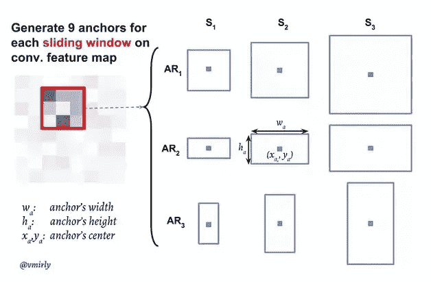
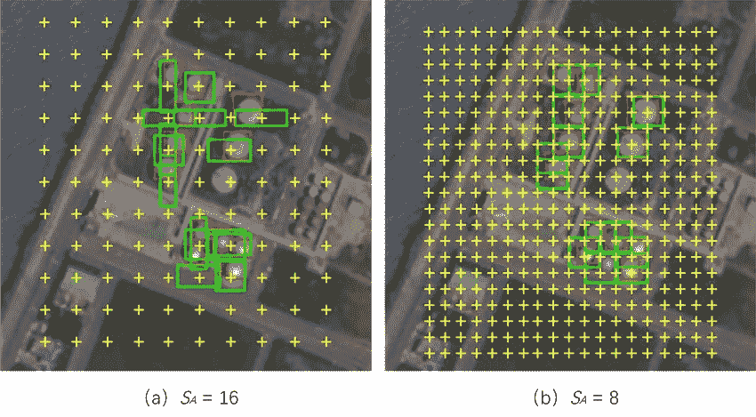
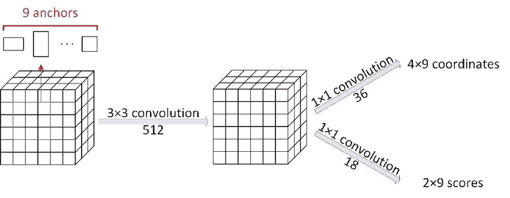

# 区域提案网络—详细视图

> 原文：<https://towardsdatascience.com/region-proposal-network-a-detailed-view-1305c7875853?source=collection_archive---------1----------------------->

## 什么是主播？RPN 如何从特征地图中学习生成盒子？它如何覆盖所有形状的盒子？

如果您知道用于对象检测的 R-CNN 家族，您可能听说过术语“RPN”，这是一个区域提议网络。如果你不知道 R-CNN 系列探测器，我建议你在深入研究 RPN 之前先浏览一下这篇文章。

我们都有一个模糊的想法，区域建议网络是用来产生建议的对象检测在更快的 rcnn。我们还听说，它通过从基础网络(VGG16、ResNet 等)获得的特征图进行学习来做到这一点。,).许多人都有这种模糊的想法，但很少有人彻底了解它是如何工作的。我以前有很多疑惑。RPN 如何从特征地图中学习生成盒子？它是如何用不同空间层次的特征图生成图像层次的盒子的？什么是主播？它如何覆盖所有形状的盒子？我的物件不会有遗失的盒子吗？它的召回率有多少？我的盒子很小怎么办？这是我曾经有过的一些疑问。浏览论文和许多博客已经澄清了一些疑问，然后我想通过代码实现来获得一个更清晰的想法，这很有帮助！让我们开始吧。

**目标检测方法:**我们生成候选框(可能有我们要检测的目标)并将这些框分类为像猫/狗/人等目标之一..那就是分类。同时，这些框形状调整学习正确地适合实际对象。这就是包围盒回归。

现在，第一步，即候选框的生成，是由 RPN 完成的。在早期版本的对象检测器中，这种提议生成是通过传统的计算机视觉技术离线进行的。一种这样的方法是[选择性搜索](https://www.learnopencv.com/selective-search-for-object-detection-cpp-python/)。这些方法的缺点是计算成本和离线计算。

RPN 在很短的时间内就解决了这个问题，而且它可以合并到任何对象检测网络中，这使得它对于端到端的训练非常有用。就像我们的 CNN 如何从特征图中学习分类一样，它也从特征图中学习建议。让我记下 RPN 中的步骤:

*   生成锚定框。
*   对每个锚定框进行分类，无论它是前景还是背景。
*   了解锚定框的形状偏移，以使它们适合对象。

**锚点:**骨干网生成的特征图中的每一个点都是锚点。我们需要为每个锚点生成锚点框。我们使用两个参数生成候选框——比例和纵横比。方框需要在图像尺寸，而特征图根据主干缩小。例如，在 vgg16 的情况下，到主干的末端，图像被缩小 16 倍。那么我们如何在图像维度上生成盒子呢？我们使用这个 16 作为在图像级生成锚定框的步距。(例如:如果锚点比例为[8，16，32]，比率为[0.5，1，2]，跨距为 16，那么我们使用这些比例和比率的组合为每个锚点生成 9 个锚点框，然后在图像上跨距为 16，以获取下一个锚点框。)

Anchor boxes generation ([Source](https://www.researchgate.net/publication/325385109_Yield_Estimation_using_faster_R-CNN))

These correspond to anchor points at image level. 16 and 8 are strides used depending on backbone. ([Source](https://www.mdpi.com/2072-4292/11/3/286))

现在我们已经生成了锚盒，但是这些是不同于实际感兴趣对象的虚拟盒。此外，可能有许多盒子里面没有任何对象。因此，我们需要了解给定的框是前景还是背景，同时我们需要了解前景框的偏移，以调整适应对象。这两个任务是通过从主干网获得的特征图上的两个卷积层来实现的。这些层是 rpn_cls_score 和 rpn_bbox_pred，架构如下所示。

For 9 anchors at every anchor point, 2 scores (fg and bg) and 4 offsets for coordinates. (Image by Author)

我们学习 x，y，w，h 值的偏移量，其中(x，y)是盒子的中心，w 和 h 是宽度和高度。我们知道这些补偿是回归。为了学习这些分数和偏移量，我们需要有目标。这些目标是通过将锚盒与地面真实盒进行比较而生成的。这个过程就是锚定目标生成。在锚目标生成中，我们使用锚框计算 GT 框的 IOU 以检查它是否是 fg/bg，然后计算坐标中的差作为回归器要学习的目标。然后这些目标被用作交叉熵损失和平滑 l1 损失的输入。

一旦使用卷积层学习了这些 fg/bg 分数和偏移，就根据置信度分数来考虑 fg 和 bg 框的一些部分。将偏移应用于这些框，以获得要进一步处理的实际 ROI。这种使用偏移的锚盒的后处理被称为建议生成。这些最终提案通过 ROI 池层和 fc 层向前传播。可以参考我之前的帖子了解一下 [ROI pooling](/region-of-interest-pooling-f7c637f409af) 和 [NMS(非最大压制)](/non-maximum-suppression-nms-93ce178e177c)。

这就是这篇文章的全部内容，希望你能很好地理解盒子是如何从 RPN 生成的。可以参考这个[代码](https://github.com/rbgirshick/py-faster-rcnn)库来理解代码。让我们稍后在另一篇文章中见面吧。

## 参考

*   https://www.mdpi.com/2072-4292/11/3/286
*   [https://www . research gate . net/publication/325385109 _ Yield _ Estimation _ using _ faster _ R-CNN](https://www.researchgate.net/publication/325385109_Yield_Estimation_using_faster_R-CNN)
*   [https://arxiv.org/abs/1506.01497](https://arxiv.org/abs/1506.01497)