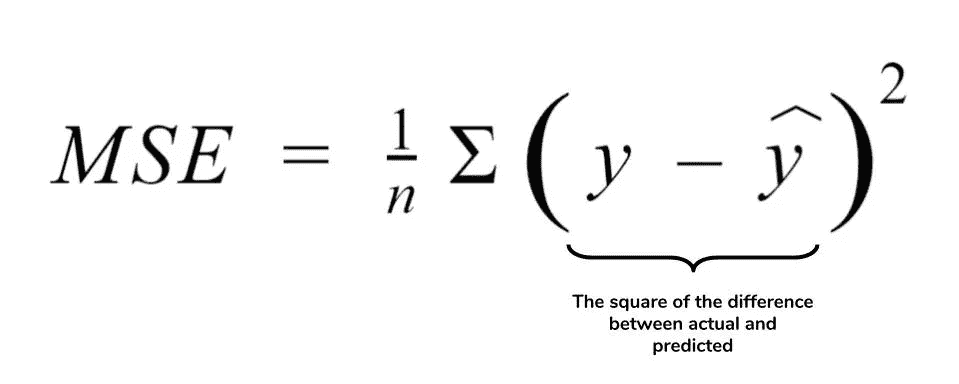
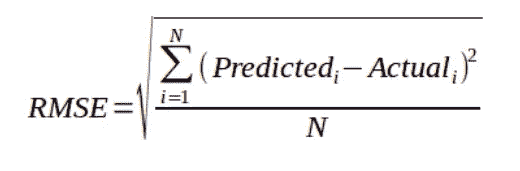
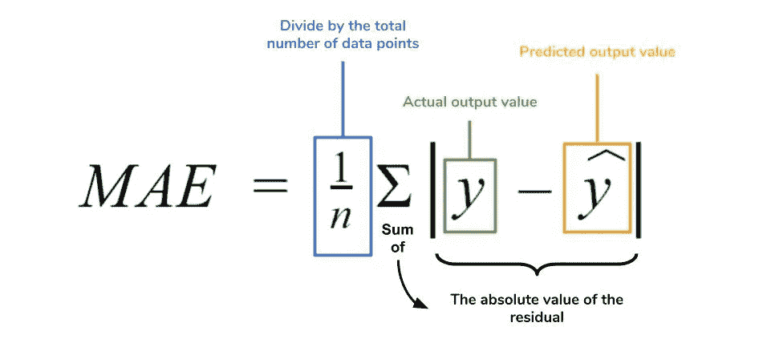
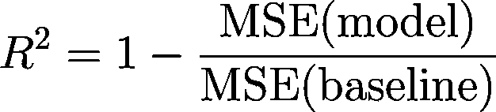
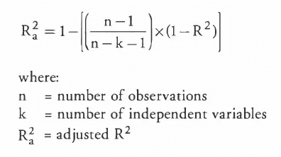
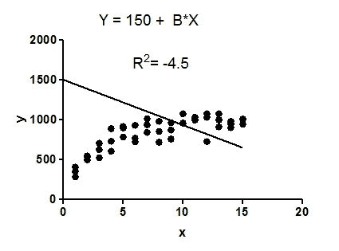
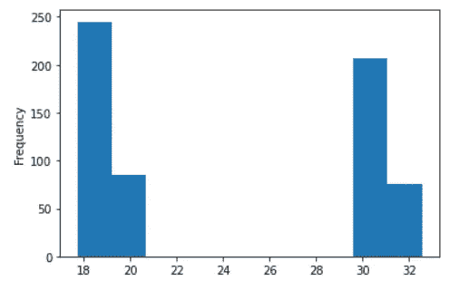

# 回归:回归度量的解释和可能出错的地方

> 原文：<https://towardsdatascience.com/regression-an-explanation-of-regression-metrics-and-what-can-go-wrong-a39a9793d914?source=collection_archive---------3----------------------->

## 对 R 为什么为负感到困惑？阅读以下内容，了解更多信息。

([source](https://unsplash.com/photos/MoDcnVRN5JU))

机器学习正在不断发展，据说会影响所有领域，并给人类的运作方式带来根本性的变化。一些进步已经开始对社会产生影响，如欺诈检测系统、在线贷款审批系统、无人驾驶汽车、肿瘤检测等。机器学习算法已经成为我们日常生活的一部分，从早上的新闻推荐到晚上网飞的优化电影推荐，我们使用的一切都直接或间接受到或即将受到机器学习的影响。

机器学习基本上有两种类型，即监督学习和非监督学习。监督学习可以简单地理解为在老师的帮助下学习。这意味着我们有数据点以及每个数据点的标签。另一方面，无监督学习可以被认为是没有老师的学习。在这种情况下，我们只得到没有任何标签的原始数据，算法应该找到数据中的模式，并相应地对其进行分组。机器学习的大部分进展是在有监督的学习世界中实现的，而无监督的世界仍然是神秘的，没有被完全探索。

监督机器学习可以执行两个任务，即分类和回归。在非常高级的术语中，分类是将标签分配给属于不同类别的数据样本的任务，例如，对于训练，区分猫和狗的神经网络是一个分类问题，其中猫和狗是两个类别。

另一方面，回归是通过从各种独立特征中学习来预测连续值的任务。例如，基于像卧室数量、位置等特征来预测房子的价格。

基本分类或回归管道的工作方式如下:

1.  我们从模型的一些初始配置开始，并基于一些输入来预测输出。
2.  然后将预测值与目标值进行比较，并测量我们的模型性能。
3.  然后，迭代地调整模型的各种参数，以便达到性能度量的最佳值。

对于不同的任务，恒定性能标准是不同的，并且努力达到标准的最佳值。在分类任务的情况下，性能标准可能是准确的，这意味着关于我们的模型看到的总案例，有多少案例被我们的模型正确分类。其他性能度量包括灵敏度(召回率)、特异性、精确度、f1 分数、AUC、均方误差、平均绝对误差、R、调整 R 等，并且根据任务和用于该任务的数据来使用。

在本文中，我们将讨论回归任务中使用的度量标准，以及 R 变为负值的原因。

回归任务是在其他相关独立变量的帮助下，预测某一特定时间点的结果变量的状态。与分类任务不同，回归任务输出给定范围内的连续值。

用于评估预测结果的各种指标包括:

1.  均方误差
2.  均方根误差(RMSE)。
3.  平均绝对误差。
4.  r 或决定系数。
5.  调整后 R

**均方误差:** MSE 或均方误差是回归任务最首选的指标之一。它只是目标值和回归模型预测值之间的平方差的平均值。当它计算差异的平方时，它惩罚了一个很小的错误，这个错误会导致高估模型的糟糕程度。它比其他指标更受青睐，因为它是可微分的，因此可以更好地优化。

**Figure 1**. Mean Squared Error Formula

**均方根误差:** RMSE 是回归任务中使用最广泛的指标，是目标值和模型预测值之间的平均平方差的平方根。在某些情况下，这种方法更为可取，因为在求平均值之前，首先对误差进行平方，这对于较大的误差来说是一种很高的惩罚。这意味着当不希望出现大误差时，RMSE 是有用的。

**Figure 2**. The formula of Root Mean Squared Error

**平均绝对误差:** MAE 是目标值与模型预测值的绝对差值。MAE 对异常值更稳健，并且不会像 mse 那样极端地惩罚误差。MAE 是一个线性分数，这意味着所有个体差异的权重相等。它不适合您希望更多关注异常值的应用程序。

**Figure 3**. The Formula of Mean Absolute Error

**R 误差:**决定系数或 R 是用于评估回归模型性能的另一个度量。该指标帮助我们将当前模型与恒定基线进行比较，并告诉我们我们的模型有多好。通过取数据的平均值并在平均值处画一条线来选择恒定基线。R 是一个无标度分数，这意味着值太大或太小都没有关系，R 将始终小于或等于 1。

**Figure 4.** The Formula for R²

**调整后的 R :** 调整后的 R 描绘了与 R 相同的含义，但却是它的改进。r 遇到的问题是，即使模型没有改进，分数也会随着术语的增加而提高，这可能会误导研究者。调整后的 R 总是低于 R，因为它对增加的预测因子进行了调整，并且只有在有真正的改善时才显示出改善

**Figure 5.** The Formula of Adjusted R²

# **R 为什么是负数？**

在给你简单概述了各种回归度量之后，让我们最后来谈谈为什么 R 是负的。

人们有一种误解，认为 R 值的范围是从 0 到 1，但实际上，它的范围是从-∞到 1。由于这种误解，他们有时会害怕为什么 R 是负的，这在他们看来是不可能的。

R 为负的主要原因如下:

1.  R 为负的一个主要原因是所选择的模型没有遵循数据的趋势，导致 R 为负。这导致所选模型(分子)的 mse 大于恒定基线(分母)的 mse，从而导致负 R。

Figure 6.

2.也许数据中存在大量异常值，导致模型的 mse 大于基线的 mse，从而导致 R 为负(即分子大于分母)。

3.有时，在编写回归算法时，研究人员可能会忘记将截距添加到回归变量中，这也将导致 R 为负。这是因为，在没有截距的情况下，回归在跟踪因变量方面可能比样本均值(基线)更差(即分子可能大于分母)。然而，大多数标准的机器学习库，如 scikit-learn，默认情况下都包含截距，但如果您使用 stats-model 库，则必须手动添加截距。

**个人经历:**

最近，我在研究一个回归问题，我的模型是根据一个数据训练的，这个数据的因变量范围在 17-35 之间，但是这个范围在中间是不相交的。为了澄清，数据的值从 17-22，然后是一个断点，然后又从 29-33。如果我绘制数据，它会是下图所示的样子。

该模型在验证集上的 r2 _ 得分为 0.95。在模型被训练之后，我被要求在 17–22 和 29–33 之间的数据子集上测试模型的性能。该模型在每个子集上的表现都有一个负的 r2_score，我非常困惑，不知道自己哪里出错了。我在组合数据集上检查了模型的性能，它类似于验证集的性能，但是当我将测试数据分成子集并进行测试时，看到了负的 r2_score。然后在思考了很久，手工实现 r2_score 函数，并在计算的每个阶段打印输出之后，我才意识到问题的所在。

因此，让我们考虑一下 17–22 的情况，并找出 r2_score 为负的原因。如上所述，r2_score 表明了与均值估计量相比的模型的性能，即，采用因变量的均值并对所有条目进行预测的模型。在正常情况下，均值估计是一个糟糕的模型，是失败的。但是当我们把数据分成更小的子集时，均值估计实际上是一个很好的估计。例如，如果我们认为因变量的平均值是 17–22 子集的 19。现在，如果我们考虑我们的模型是根据整个范围的数据训练的，而不仅仅是 17-22，那么平均误差为 1，如果我们考虑 17-33 的整个范围，这是非常好的，但是如果我们将数据分成 17-22 的子集，平均误差为 1 可能比均值估计值更差，从而导致负 r2_score。当数据是 19–33 子集的一个子集时，也会观察到类似的情况。

# 结论:

在这篇文章中，我们发现了回归分析中使用的各种指标，并试图回答这个问题*为什么 R 是负的？*

我希望你喜欢这篇文章，并且学到了新的东西。如果您有任何疑问或想讨论，请随时通过 [Linkedin](https://www.linkedin.com/in/divyanshu-mishra-ai/) 、 [Twitter](https://twitter.com/Perceptron97) 或下面的回复部分联系我。

# 激励人心的名言:

## "尽可能以最散漫、最不敬和最原始的方式努力学习你最感兴趣的东西."理查德·费曼

# 延伸阅读:

1.  [机器学习中的性能指标](https://bit.ly/2WWHC2E)