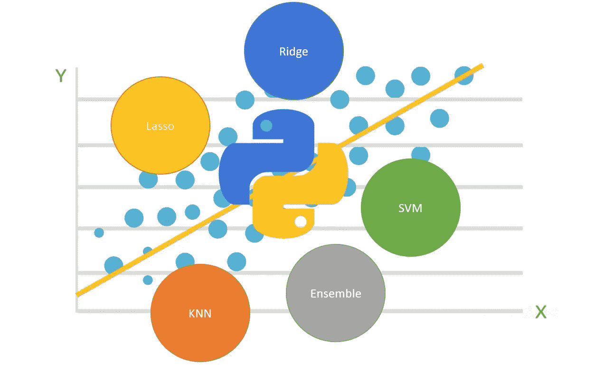
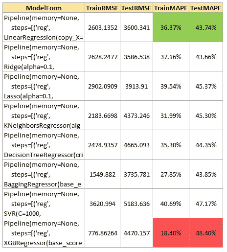

# 分析构建模块:预测

> 原文：<https://towardsdatascience.com/regression-block-a-modularized-approach-to-test-multiple-regression-algorithms-with-b446ac5160e?source=collection_archive---------14----------------------->

> 一款模块化笔记本电脑，可在控制面板中使用最少的编码来调整和比较 11 种预测算法

本文总结并解释了我的回归模块的关键模块(我正在开发的用于执行常见分析任务的简单模块化笔记本之一)。该笔记本旨在帮助对回归模型和 Python 编程有一定了解的用户更快地进行实验。GitHub 到笔记本的链接在文章底部！



## 介绍

在从事我最喜欢的一个项目时，我意识到有时测试不同的模型形式以确定最合适的模型更好，这种模型根据手头的问题提供了准确性、复杂性和执行效率的良好平衡。RapidMiner 等一些软件提供此功能。然而，出于这个目的使用软件产品会导致在调整模型和探索一些复杂性方面的黑盒方法。因此，我决定创建一个简单的 python 脚本，它具有足够的模块化和参数化，能够测试和调整许多广泛使用的预测算法，只需对代码进行最小的更改。
本笔记本摘要如下:

## 目标:

在 Python 中以最少的人工干预测试、调整和比较各种回归模型。
本模块包含的车型有:

*线性回归
*岭回归
*拉索回归
* K 近邻
*贝叶斯岭
*决策树回归
*随机森林
*装袋(默认使用决策树)
*梯度提升
* XGBoost
*支持向量机

## 用户熟练程度:

用户应该对每种算法的工作原理有一个直观的了解，并且很好地理解改变一个特定的超参数会如何影响结果。需要对 python 有基本的了解，以便能够有效地利用代码，并根据需求进一步定制代码。

## 关键可修改输入:

以下是关键输入(行内注释中为每个输入提供了更多详细信息)。这些部分在代码中以注释'**突出显示，在此处进行修改**':

*用于回归分析的输入数据集:在本例中，我使用了来自 pandas 默认数据集的“糖尿病”数据集
*测试数据比例:在 0 到 1 之间，默认为 0.3(或 30%)
*归一化:0 —无归一化，1 —最小-最大缩放， 2 — Z-score scaling
*要测试的模型对象列表
*网格搜索的折叠数(超参数调整)
*确定最佳模型的评分标准(例如均方误差)—代码注释中提供了更多详细信息
* Flag 用于查看模型拟合期间终端上的详细程度:0 —无输出，1 —所有详细信息，2 —进度条
*超参数库:代码中的全局字典，为要调整的每个模型表单提供一组超参数

## 一般执行步骤:

获取这些输入后，对考虑中的每个模型形式的**执行以下操作:**

*正向特征选择
*标准化
*网格搜索超参数调整
*最佳模型的度量计算

## 输出:

创建 pandas 数据框架“结果”,为您测试的每个模型提供以下指标

*具有最佳超参数的模型细节
*训练和测试均方根误差
*训练和测试平均绝对百分比误差

该表有助于在各种模型形式之间进行比较，而训练和测试度量可以是发现过度拟合的良好指标。

## 重要提示:

该模块不以任何方式处理特征工程，仅基于输入数据执行特征选择。为了改善任何模型的结果，执行有效的特征工程是非常重要的。用户可能会观察到一种模型形式比另一种给出更好的结果，但是任何模型的整体性能都可以随着预测变量的改进而显著提高。

## 剧本:

## 各种任务的模块

第一个函数根据用户在控制面板中指定的条件，为标准化和网格搜索创建管道。

```
def create_pipeline(norm, model):
    if norm == 1:
        scale = StandardScaler()
        pipe = Pipeline([('norm', scale), ('reg', model)])
    elif norm == 2:
        scale = MinMaxScaler()
        pipe = Pipeline([('norm', scale), ('reg', model)])
    else:
        pipe = Pipeline([('reg', model)])
    return pipe
```

第二个函数执行正向特征选择，并返回最佳特征的索引。

```
def select_features(model, X_train, Y_train, selection,
                    score_criteria, see_details, norm=0):
    pipe = create_pipeline(norm, model)
    sfs = SequentialFeatureSelector(pipe,
                                    forward=selection,
                                    k_features='best',
                                    scoring=score_criteria,
                                    verbose=see_details)
    sfs = sfs.fit(X_train, Y_train)
    return list(sfs.k_feature_idx_)
```

此函数对提供的参数网格执行网格搜索，并返回最佳模型对象。

```
def run_model(model, param_grid, X_train, Y_train,
              X, Y, score_criteria, folds,
              see_details, norm=0):
    pipe = create_pipeline(norm, model)
    model_grid = GridSearchCV(pipe,
                              param_grid,
                              cv=folds,
                              scoring=score_criteria,
                              verbose=see_details)
    model_grid.fit(X_train, Y_train)return model_grid.best_estimator_
```

最后一个函数计算最佳超参数组合的所有相关指标，并返回这些指标的 pandas 系列。

```
def get_model_eval(model, X_train, Y_train, X_test, Y_test):
    return pd.Series([model, mean_squared_error(Y_train, model.predict(X_train)),
                      mean_squared_error(Y_test, model.predict(X_test)),
                      (abs(model.predict(X_train) - Y_train) / Y_train).mean(),
                      (abs(model.predict(X_test) - Y_test) / Y_test).mean()])
```

## 全局超参数字典(**在此修改**)

这是该模块中所有模型的各种模型参数的全局字典。基于糖尿病数据集的典型范围的代码中已经填充了一些缺省值集。该词典包含每个模型的一些关键超参数，但并不详尽。鼓励用户访问 scikit-learn 文档以获得所有参数的列表，并根据他们的要求添加到下面的字典中。

```
PARAM_DICT = {
              LinearRegression: {'reg__copy_X': [True, False],
                                 'reg__fit_intercept': [True, False],
                                 'reg__n_jobs': [10, 20]},
              Ridge: {'reg__alpha': [0.1, 1, 100],
                      'reg__copy_X': [True, False],
                      'reg__fit_intercept': [True, False],
                      'reg__tol': [0.1, 1],
                      'reg__solver': ['auto', 'svd', 'cholesky', 'lsqr',
                                      'sparse_cg', 'sag', 'saga']},
              Lasso: {'reg__alpha': [0.1, 1, 100],
                      'reg__copy_X': [True, False],
                      'reg__fit_intercept': [True, False],
                      'reg__tol': [0.1, 1]},KNeighborsRegressor: {'reg__n_neighbors': [5, 30, 100]},
              BayesianRidge: {'reg__alpha_1': [10**-6, 10**-3],
                              'reg__alpha_2': [10**-6, 10**-3],
                              'reg__copy_X': [True, False],
                              'reg__fit_intercept': [True, False],
                              'reg__lambda_1': [10**-6, 10**-3],
                              'reg__lambda_2': [10**-6, 10**-3],
                              'reg__n_iter': [300, 500, 1000],
                              'reg__tol': [0.001, 0.01, 0.1]},DecisionTreeRegressor: {'reg__max_depth': [5, 10, 20],
                                      'reg__max_features': [0.3, 0.7, 1.0],
                                      'reg__max_leaf_nodes': [10, 50, 100],
                                      'reg__splitter': ['best', 'random']},BaggingRegressor: {
                                 'reg__bootstrap': [True, False],
                                 'reg__bootstrap_features': [True, False],
                                 'reg__max_features': [0.3, 0.7, 1.0],
                                 'reg__max_samples': [0.3, 0.7, 1.0],
                                 'reg__n_estimators': [10, 50, 100]},
              RandomForestRegressor: {'reg__bootstrap': [True, False],
                                      'reg__max_depth': [5, 10, 20],
                                      'reg__max_features': [0.3, 0.7, 1.0],
                                      'reg__max_leaf_nodes': [10, 50, 100],
                                      'reg__min_impurity_decrease': [0, 0.1, 0.2],
                                      'reg__n_estimators': [10, 50, 100]},SVR: {'reg__C': [10**-3, 1, 1000],
                    'reg__kernel': ['linear', 'poly', 'rbf'],
                    'reg__shrinking': [True, False]},GradientBoostingRegressor: {'reg__learning_rate': [0.1, 0.2, 0.5],
                                          'reg__loss': ['ls', 'lad', 'huber', 'quantile'],
                                          'reg__max_depth': [10, 20, 50],
                                          'reg__max_features': [0.5, 0.8, 1.0],
                                          'reg__max_leaf_nodes': [10, 50, 100],
                                          'reg__min_impurity_decrease': [0, 0.1, 0.2],
                                          'reg__min_samples_leaf': [5, 10, 20],
                                          'reg__min_samples_split': [5, 10, 20],
                                          'reg__n_estimators': [10, 50, 100]},
              XGBRegressor: {'reg__booster': ['gbtree', 'gblinear', 'dart'],
                             'reg__learning_rate': [0.2, 0.5, 0.8],
                             'reg__max_depth': [5, 10, 20],
                             'reg__n_estimators': [10, 50, 100],
                             'reg__reg_alpha': [0.1, 1, 10],
                             'reg__reg_lambda': [0.1, 1, 10],
                             'reg__subsample': [0.3, 0.5, 0.8]},}
```

## 按键输入的用户控制面板(在此进行修改)

可以在此处更改模块的输入。这是这个脚本的控制面板，介绍中提到的所有变量都可以在这里修改，以测试各种场景。请参考评论了解变量。

```
# --------------------------------------------------------------------------
# USER CONTROL PANEL, CHANGE THE VARIABLES, MODEL FORMS ETC. HERE# Read data here, define X (features) and Y (Target variable)
data = datasets.load_diabetes()
X = pd.DataFrame(data['data'])
X.columns = data['feature_names']
Y = data['target']# Specify size of test data (%)
size = 0.3# Set random seed for sampling consistency
random.seed(100)# Set type of normalization you want to perform
# 0 - No Normalization, 1 - Min-max scaling, 2 - Zscore scaling
norm = 0# Mention all model forms you want to run - Model Objects
to_run = [LinearRegression,
          Ridge,
          Lasso,
          KNeighborsRegressor,
          DecisionTreeRegressor,
          BaggingRegressor,
          SVR,
          XGBRegressor]# Specify number of crossvalidation folds
folds = 5# Specify model selection criteria
# Possible values are:
# ‘explained_variance’
# ‘neg_mean_absolute_error’
# ‘neg_mean_squared_error’
# ‘neg_mean_squared_log_error’
# ‘neg_median_absolute_error’
# ‘r2’
score_criteria = 'neg_mean_absolute_error'# Specify details of terminal output you'd like to see
# 0 - No output, 1 - All details, 2 - Progress bar
# Outputs might vary based on individual functions
see_details = 1# --------------------------------------------------------------------------
```

## 模型执行

该部分迭代地为用户指定的每个模型找到最佳的超参数集，计算度量并填充结果表，用于进一步的分析/实验。

```
# Model execution part, resuts will be stored in the dataframe 'results'
# Best model can be selected based on these criteriaresults = pd.DataFrame(columns=['ModelForm', 'TrainRMSE', 'TestRMSE',
                                'TrainMAPE', 'TestMAPE'])X_train, X_test, Y_train, Y_test = train_test_split(X, Y, test_size=size)for model in to_run:
    with warnings.catch_warnings():
        warnings.simplefilter('ignore')
        best_feat = select_features(model(), X_train, Y_train, True,
                                    score_criteria, see_details, norm)
        model = run_model(model(), PARAM_DICT[model],
                          X_train.iloc[:, best_feat],
                          Y_train,
                          X.iloc[:, best_feat], Y,
                          score_criteria, folds, see_details, norm)
        stats = get_model_eval(model, X_train.iloc[:, best_feat], Y_train,
                               X_test.iloc[:, best_feat], Y_test)
        stats.index = results.columns
        results = results.append(stats, ignore_index=True)print(results)
```

## 结论



Results data frame

从结果表中可以看出，在该场景中测试的所有模型形式中，最基本的线性回归模型提供了最佳且一致的性能。这也强调了特征工程的重要性，因为我们期望集合模型总体上表现出更好的性能。另一方面，基于训练和测试指标，XGB 回归器显示出过度拟合的迹象。所有其他型号都提供类似的性能。这表明还需要测试不同范围的超参数。我希望这个模块能够加快实验速度，并提供一个机会，根据您的需求在它的基础上进行进一步的定制！

点击此处查看完整的笔记本:

[](https://github.com/himanshu0394/AnalyticsBuildingBlocks/blob/master/Prediction%20Block.ipynb) [## himan Shu 0394/分析构建模块

### 在 GitHub 上创建一个帐户，为 himan Shu 0394/AnalyticsBuildingBlocks 开发做贡献。

github.com](https://github.com/himanshu0394/AnalyticsBuildingBlocks/blob/master/Prediction%20Block.ipynb) 

请随时提供任何建议和反馈！