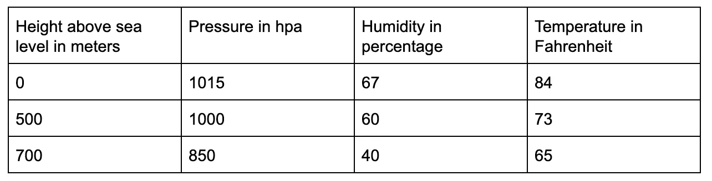
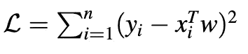
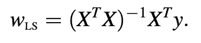

# 回归——用简单的术语解释！！

> 原文：<https://towardsdatascience.com/regression-explained-in-simple-terms-dccbcad96f61?source=collection_archive---------3----------------------->

在这篇文章中，我希望用尽可能简单的术语来阐述回归，这样你就不会把它当成一个统计概念，而是一个更相关的经验。

回归——听起来很奇怪，但可以认为是任何两个事物之间的“关系”。例如，想象你呆在地面上，温度是华氏 70 度。你开始爬山，当你爬的时候，你意识到你感觉更冷，温度在下降。当你到达海拔 500 米的山顶时，你测量的温度是华氏 60 度。我们可以得出结论，海拔高度影响温度。因此，高度和温度之间是有关系的。这在统计学上被称为“回归”。温度取决于高度，因此是“因变量”，而高度是“自变量”。可能有各种因素影响温度，如湿度、压力，甚至空气污染水平等。所有这些因素都与温度有关，可以用数学方法写成一个方程。

## 回归的形式定义

任何方程，即因变量和一组权重的函数，称为回归函数。

y ~ f(x；w)其中“y”是因变量(在上述示例中为温度)，“x”是自变量(湿度、压力等)，“w”是方程的权重(x 项的系数)。

例如，等式可以是

y = 0.5 x1 + 2.15 x2 + 0.76 x3

其中 0.5、2.15 和 0.76 是等式的权重。这些权重将通过研究因变量和自变量之间的关系来学习。

## 回归方程怎么确定？

现在的问题是要弄清楚如何学习方程的权重。我们为什么要这么做？是的，我们这样做是为了预测未来。一旦我们知道了因变量和自变量之间的关系，我们就可以预先预测因变量。为了学习回归方程，我们需要从现场收集一些真实数据。我们人类从真实世界的经历中学习。类似地，回归函数只能通过初始真实数据(称为“训练”数据)来学习。

在所考虑的例子中，我们需要记录不同高度的温度、气压水平、湿度以及所有我们知道的影响因变量的因素。下面是一个数据集示例。

Example data for regression

和上表一样，我们需要收集尽可能多的真实数据。让我将“温度”表示为“y”，其余的特征(高度、压力、湿度)表示为“x”。我们将误差函数定义为(y-x*w)的和。即每个数据点的误差平方和。我们需要找出使上述函数最小化的“w”向量(逻辑上，不引起错误)。什么时候函数是数学上的最小值？这是方程斜率为 0 的地方。因此，我们可以通过将下面函数的斜率等于 0 来找到“w”向量，并求解“w”。

The objective function equation

“w” vector upon solving the equation

这篇文章并不打算在数学上做太多，然而，权重向量是由上面的等式得到的。使用我们收集的所有数据，我们通过上面的等式得到“w”向量。

我希望这篇文章对你有帮助。如果您有任何疑问，请在下面留下。