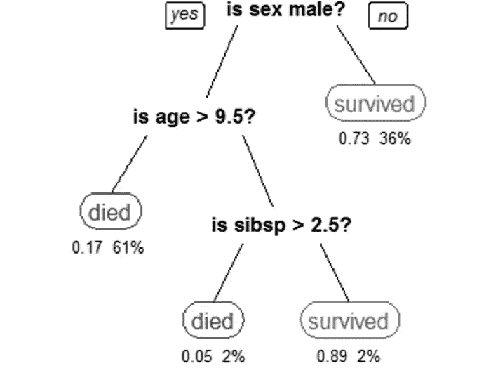
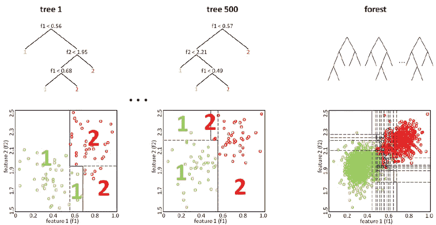
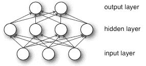

# 回归还是分类？线性还是逻辑？

> 原文：<https://towardsdatascience.com/regression-or-classification-linear-or-logistic-f093e8757b9c?source=collection_archive---------5----------------------->

[link](https://www.explainxkcd.com/wiki/index.php/2048:_Curve-Fitting)

## 理解不同之处和各自的不同模型

## 回归与分类

为了决定是使用回归模型还是分类模型，您应该问自己的第一个问题是:

> 你的目标变量是一个数量，一个二元范畴的概率，还是一个标签？

如果是前一种选择，那么你应该使用一个**回归**模型。这意味着，如果您试图预测身高、收入、价格或分数等数量，您应该使用将输出连续数字的模型。或者，如果目标是观察值成为二进制标签的概率(例如是好的而不是坏的概率)，那么你也应该选择一个回归模型，只是你用的模型会略有不同。这些模型通过均方误差(MSE 或变异)和均方根误差(RMSE 或标准偏差)进行评估，以量化模型中的误差量。

如果是后一种选择，您希望使用一个**分类**模型。这种方法对于预测观察的标签(例如差、一般、好)。棘手的部分是有时意识到目标*是否是*一个标签。例如，如果目标是一个顺序变量，比如从 1 到 5 的离散排名，那么这些就是标签，但它们仍然具有数学意义。这意味着数据的平均值和变化仍然是有洞察力的，但是为了预测，你最好使用分类。这些模型是通过 F 分数或模型的准确性而不是变异和标准差来评估的。该分数给出了对有多少观察结果被正确标记的理解，并且可以用混淆矩阵来可视化，该混淆矩阵将观察结果分成真阳性/阴性和假阴性/阳性。

[Confusion Matrix](http://rasbt.github.io/mlxtend/user_guide/evaluate/confusion_matrix/)

在开始运行模型和形成预测之前，理解目标变量的特征是很重要的。如果您在应该使用分类的时候使用回归，您将得到连续的预测而不是离散的标注，从而导致较低(如果不是零)的 F 值，因为大多数(如果不是全部)预测将不是您想要预测的 1 或 0。如果你使用的是给你概率的逻辑模型，一个解决方法是创建一个截止点。例如，也许你决定大于 0.9 的都是 1，小于 0 的都是 0。这样做，你仍然可以找到一个 F 值，并看到混淆矩阵。然而，这个额外的步骤通常可以通过使用适当的模型来避免。

一旦确定了使用哪种方法，下一步就是选择用于生成预测的模型。

[Regression vs Classification visual](https://www.pinterest.com/pin/672232681855858622/?lp=true)

## 回归模型

在回归模型中，最流行的两个是线性和逻辑模型。

一个基本的**线性**模型遵循著名的公式 y=mx+b，但通常格式略有不同:

y=β₀+β₁x₁+…+βᵢxᵢ

其中，β₀是 y 轴截距，即所有解释变量都设置为零时的 y 值。β₁到βᵢ是变量 x₁到 xᵢ的系数，假设所有其他变量保持不变，变量 y 增加或减少一个单位。例如，如果等式是 y=1+2x₁+3x₂，那么如果 x₁从 0 增加到 1，而 x₂保持在 0，y 将从 1 增加到 3。

一个**逻辑**模型遵循一个稍微改变的等式:

y= 1 / (1+e^-(β₀+β₁x₁+…+βᵢxᵢ))

这将它限制为 0 到 1 之间的值。因此，它主要用于二进制目标变量，其中可能的值为 0 或 1，或者目标是二进制变量的概率。如前所述，该方程可以防止概率低于 0 或高于 1 的预测不合逻辑。

[Linear vs Logistic visual](https://www.sciencedirect.com/topics/medicine-and-dentistry/logistic-regression-analysis)

您可以改变这两种标准模型，以便更好地适应您的数据。做到这一点的主要方法是包括惩罚。对于线性和逻辑模型，创建的方程将包括你输入的每一个变量的*，这是一个使你的模型过度拟合的简单方法。过度拟合模型会降低模型在训练样本之外生成预测的有用性。为了避免这种情况，您可以执行一个特征选择过程来挑选出重要的特征，或者您可以在您的模型中包含惩罚。*

[Underfitting and Overfitting visual](https://medium.com/greyatom/what-is-underfitting-and-overfitting-in-machine-learning-and-how-to-deal-with-it-6803a989c76)

添加 L2 惩罚将进行**岭**回归，这将缩小不重要变量的系数以限制它们的重要性，但仍将包括所有输入的变量。如果您希望包含每个变量，而不管它有多重要，这是很有用的，但是在大多数情况下，您希望模型尽可能简单。相反，添加 L1 惩罚将进行**套索**回归(最小绝对收缩和选择算子)，这将做与岭相同的事情，但如果不重要，将收缩系数到零，有效地移除它们。LASSO 的缺点是，如果你的变量(k)比观测值(n)多，它最多只会包含 n 个变量。此外，套索斗争与相关变量，并会随机选择其中一个保留。要克服这些障碍，您可以使用**弹性网**回归，它结合了两种损失，可以更好地处理高维数据和多重共线性。这通常会给出一个与 LASSO 同样准确或更准确的模型，但这取决于选择作为弹性网超参数之一的 L1 比率。

最后，目标变量可能不是解释变量的严格线性函数。这里，我们有两个主要选项:高阶回归或随机森林回归。

比方说，在进行初始数据探索时，您发现在预测收入时，年龄与收入的关系更多的是二次关系，而不是线性关系。在这种情况下，您希望在一次线性方程中包含一个二阶变量。然后它将看起来像 y=β₀+β₁x+β₂x，你将再次运行该模型。您仍然可以在高阶模型上运行线性回归。一个常见的误解是，线性回归方法只能创建线性函数。线性回归中的“线性”是指系数之间的关系，而不是变量本身，因此，如果高阶或交互作用有助于更好地解释这种关系，则在模型中包括高阶或交互作用是有利的。然而，如果你包括一个高阶变量或交互作用，你必须在你的最终方程中保留低阶变量和主要效应变量，无论它们是否显著。你不能拥有 y=β₀+β₂x 或 y=β₀+β₁x₁*x₂.

我们也可以使用一个**随机森林回归器**，它在下面被可视化了，但是稍后将会解释它的替代物，随机森林分类器，这是更常用的。回归器的使用类似于逻辑模型，其输出是二进制标签的概率。简而言之，随机森林回归器创建了数百个决策树，所有决策树都预测一个结果，最终输出要么是最常见的预测，要么是平均值。

[Random Forest Classifier for Titanic Survival](https://www.researchgate.net/figure/Decision-tree-on-Titanic-survival-data-Source-https-en_fig2_317307818)

现在你可能会想，难道这些模型都不能用于概率目标吗？如果训练集的 y 值为 0 到 1，模型将只预测从 0 到 1 的 y 值，对吗？嗯，是也不是。模型最有可能总是预测 0 到 1 之间的值，但如果模型是线性的，则超过 0 或 1 的值在概率的情况下是不合逻辑的。你可以在你的模型构建中付出 110%的努力，但是一个观察不可能有某个类别 110%的可能性。此外，线性模型意味着接受诊断的概率分别为 0.10 和 0.15 的人与接受诊断的概率分别为 0.95 和 1.0 的人之间存在相同的差异。显然，如果一个人 100%患有疾病，那么很可能还有其他原因没有在线性模型中得到解释，因为对于低于 0.50 的概率来说，这是一个无关紧要的特征。

## 分类模型

如果您的分析的目标是创建一个模型来预测一个观察的标签，那么您想要使用一个分类模型。最简单的模型还是一个**逻辑**模型。然而，通过创建目标虚拟变量并在每个变量上运行单独的逻辑模型，可以在非二进制目标变量上训练逻辑模型。您还可以将 L1 和 L2 惩罚添加到此逻辑模型中，以便进行**套索**和**山脊**逻辑模型。

然而，更有用的是**随机森林分类器**，它像随机森林回归器一样，可以包括可能只在特定点有意义的特征。重申一下，这种方法采用了决策树的概念，创建了一个*随机森林*，随机选择要包含的变量，然后基于森林输出预测。在用于运行该模型的代码中，您可以指定许多超参数，例如生成的树的数量、每片叶子的最小观察数量、最大分裂、树的最大深度等。所有这些超参数都有助于创建更精确的模型，但随机森林仍然可能会过拟合。如果你的树太大了，它们很可能太具体而不能应用于测试集。

[Random Forest Classifier visual](https://www.researchgate.net/figure/The-Random-Forest-classifier-is-an-ensemble-of-decision-trees-where-the-single-trees-are_fig1_228540194)

最后，可以创建一个**神经网络**来预测一个观察的标签。这是最复杂的方法，但相对于前面的方法有一定的优势。主要是，它有机会进行无监督学习。这意味着，该算法可以根据它检测到的相似性对组进行聚类，而无需事先标记训练数据。尽管创建起来很复杂，但它们可以更准确地预测标签，这对于高风险预测(如疾病诊断或欺诈检测)非常重要。本质上，该算法接受一组输入，在其中找到模式和趋势，并输出预测(监督)或聚类组(非监督)。随着更多的迭代和更大的训练集，神经网络可以变得非常准确，但要小心，通过在网络中创建太多的层，使其过度适应您的训练集。

[Neural Network visual](https://skymind.ai/images/wiki/mlp.png)

## 摘要

在选择用于预测的模型时，要考虑的最重要的事情是目标变量的特征。是连续的还是离散的？是数量还是标签？是一个范畴的概率吗？与所有解释变量线性相关吗？我希望所有这些变量都包含在它的预测中吗？这些问题的答案可以引导你为你的预测选择最好的模型。

## 资源

[回归信息](https://www.analyticsvidhya.com/blog/2015/08/comprehensive-guide-regression/)

[分类信息](https://medium.com/@Mandysidana/machine-learning-types-of-classification-9497bd4f2e14)

[输入数据 1](https://www.theanalysisfactor.com/when-listwise-deletion-works/)

[输入数据 2](https://www.theanalysisfactor.com/seven-ways-to-make-up-data-common-methods-to-imputing-missing-data/)

[最小观察值](https://www.sciencedirect.com/science/article/pii/S0895435615000141)

[关于神经网络的信息](https://skymind.ai/wiki/neural-network)