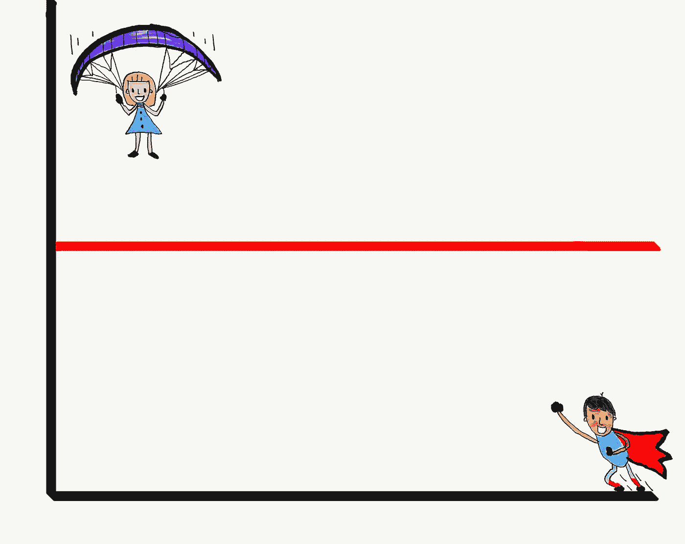
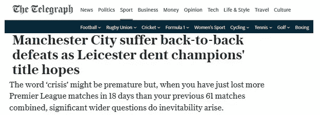
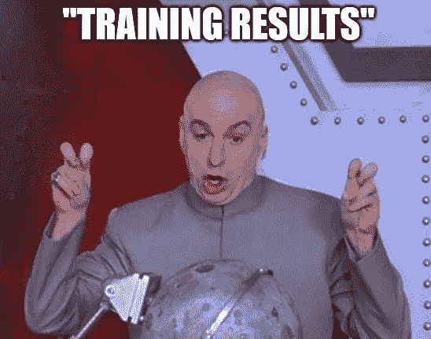

# 回归均值——苦涩的事实

> 原文：<https://towardsdatascience.com/regression-to-the-mean-the-bitter-truth-e6dcfcfac999?source=collection_archive---------22----------------------->

My attempt to illustrate regression to the mean

想象一下这个场景:你是一家连锁百货商店的商业分析师。所有的商店在规模和商品选择上都是相似的，但是由于位置、竞争和随机因素，它们的销售额是不同的。您将获得 2018 年的结果，并被要求预测 2019 年的销售额。你被指示接受经济学家的总体预测，即销售额将总体增长 10%。你将如何完成下列数据？

商店— 2018 年销售额— 2019 年销售额

1—100 万美元—
2—1000 万美元—
3—200 万美元—
4—1500 万美元—
5—2000 万美元—2200 万美元

如果你的分析是基于每个商店的销售额增加 10%,你很可能是错的，但是…为什么？继续读下去。

上面的例子改编自马克斯·巴泽曼的《管理决策中的判断》一文，出现在丹尼尔·卡内曼的《思考快慢》一书第 17 章的最后一页。在这一章中，卡尼曼清楚地解释了什么是回归均值。

## **回归到均值是什么？**

回归均值，简单来说就是极值分数回归均值分数的自然趋势。
在上面的例子中，预测每家商店的销售额为 10%是一个判断错误，因为您的预测需要是回归的(即，将 10%以上的销售额加到低绩效的分店，将更少的销售额加到(甚至减去)高绩效的分店)。这是因为由于所有商店的规模和商品选择都相似，但它们的销售额因位置、竞争和**随机因素**而有所不同，那些在 2018 年表现非常好的商店很可能在 2019 年的销售额增长低于其他商店，而那些表现非常差的商店很可能在 2019 年的销售额增长高于其他商店。

## 理解回归均值

引用卡尼曼的例子，想象一群患有抑郁症的儿童已经接受了八周的能量饮料治疗。一旦他们完成治疗，临床结果显示他们的抑郁状态有显著改善。

看了上面的案例，我们大多数人都倾向于在脑子里做出(*无意识地*)下面这个等式:
**能量饮料→抑郁的孩子=改善**

现在想象同样的例子，但是这次不是能量饮料，那些抑郁的孩子被治疗了八周，每天倒立 20 分钟。我敢肯定这一次(*自觉*你没有在你的头上做如下等式:
**20 '倒立→抑郁的孩子=改善**

痛苦的事实是，抑郁的孩子是一个极端的群体，就像商店里极端的销售数字一样，他们会自然地倾向于回归到他们的平均情绪状态。无论他们是喝酒还是倒立，这种情况都很有可能发生。

这些回归效应无处不在。尤其是在体育运动中，非常普遍。例如在足球比赛中，当那些倾向于赢得大部分比赛的球队经历三场连胜时，媒体开始声称他们正面临一场重大危机。然而，在几场比赛后，他们很可能会回到他们的平均连胜纪录。

The sports headline by the daily newspaper The Telegraph on 26 December 2018

## 为什么我们没有意识到回归均值以及这样做的巨大风险

我们经常在识别均值回归时遇到困难，因为我们的思维强烈倾向于因果解释。我们人类渴望相信我们检测到的一切背后都有因果关系(*或想要检测到* t)，比如:
**能量饮料→抑郁儿童=改善**

令人痛苦的事实是，我们太愿意相信这些影响大部分是随机的结果。如果没有，问问自己是否会买一份标题如下的体育报纸:

> 尽管该队遭遇了三场连胜，但他们很可能会回到平均胜率，因为他们经历了不幸的比赛，这是一个随机的问题。

我们中的大多数人不会买上面的标题，因为我们不想阅读，也不相信我们团队失败的后果=纯粹的随机性。相反，我们会找到一个因果解释，比如教练不合适，球员在如此多的胜利后变得懒惰。

此外，这些影响的后果超出了个人意识范围，**就组织而言**，例如，如果一家公司决定实施一项培训计划，通过花费大量的工资来培训其员工，目的是提高其*不寻常的*年的客户满意度，并且实际结果显示客户满意度有了显著的提高，经理们可能倾向于相信:
**培训计划→员工绩效=客户满意度提高**

痛苦的事实是，如果在培训计划中不包括对照组(即接受培训的员工和未接受培训的员工)，对良好结果的因果解释可能是一个严重的缺陷，是回归均值的一个似是而非的结果。

## 如何更加意识到回归均值

这里有一些提示，以防读完这篇文章后你问自己，我如何才能更好地意识到我每天发现的关于回归均值的效应的随机性？

1.  相关性不是因果关系
    尽管两个变量可能存在某种关系，但这并不意味着一个是另一个的原因。
    例如…
    能量饮料 **→** 感觉沮丧=感觉更好
    培训主动性 **→** 参加培训的员工= KPI 的提高
    幸运袜 **→** 考试=通过
2.  **原始得分越极端，你越应该期待回归**
    极差销售 **→** 较好改善*预期*
    一般销售 **→** 正常改善*预期*
3.  接受随机性听起来很容易，但并不容易，试着意识到生活充满了随机性、运气和偶然性。学会处理。

## 参考

卡尼曼博士，思考快与慢。麦克米伦(2011)。